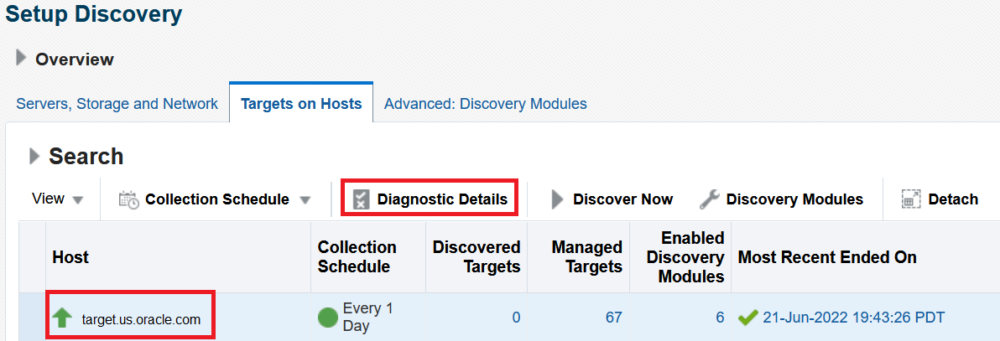
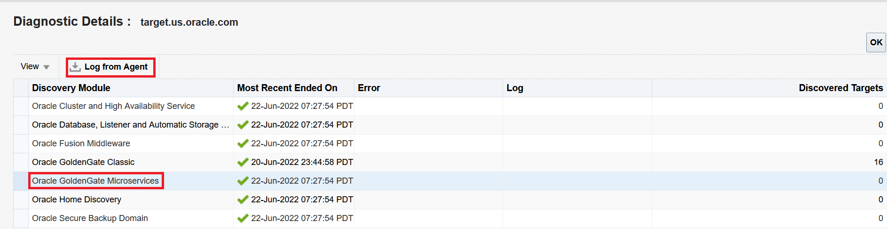

# How do I download Diagnostic Logs in Oracle GoldenGate Enterprise Manager Plug-in?
Duration: 2 minutes

### Prerequisites
This sprint assumes you have:
  * Downloaded and Deployed the EM CLI Client
  * Discovered Oracle GoldenGate classic or MA instances

See **Learn More**.

## Download Diagnostic Logs

1. In the Oracle GoldenGate Enterprise Manager Plug-in UI, click **Setup**, select **Add Target** and then click **Configure Auto Discovery** to display the **Setup Discovery** page.
2. On the **Targets on Host** tab, select the Target Name under **Host** and click **Diagnostic Details**:
    

3. In the **Diagnostic Details** page, click either **Oracle GoldenGate Microservices** and then click **Log from Agent** to retrieve the diagnostic log from the Agent for the most recently discovered target.

    
4. After the diagnostic logs have been successfully retrieved, click **Close** in the **Confirmation** screen.

## Learn More

* [Downloading and Deploying EM CLI ](https://docs.oracle.com/en/enterprise-manager/cloud-control/enterprise-manager-cloud-control/13.4/emcli/downloading-and-deploying-em-cli.html#GUID-5DD77C55-387D-43C3-9DC2-2245569A6AFF)
* [Discovering an Oracle GoldenGate Enterprise Manager Plug-in Microservices Instance using EM CLI](https://docs.oracle.com/en/middleware/goldengate/emplugin/13.5.1/empug/discovering-oracle-goldengate-targets-ma-instance-emcli.html#GUID-57AA8120-69C2-4818-9021-91E5F8BFFB7C)
* [New Route to Discovery in Oracle GoldenGate Enterprise Manager Plug-in](https://blogs.oracle.com/dataintegration/post/new-route-to-discovery-in-oracle-goldengate-enterprise-manager-plug-in-134200)
* [Oracle GoldenGate Enterprise Manager Plug-in Documentation](https://docs.oracle.com/en/middleware/goldengate/emplugin/index.html)
