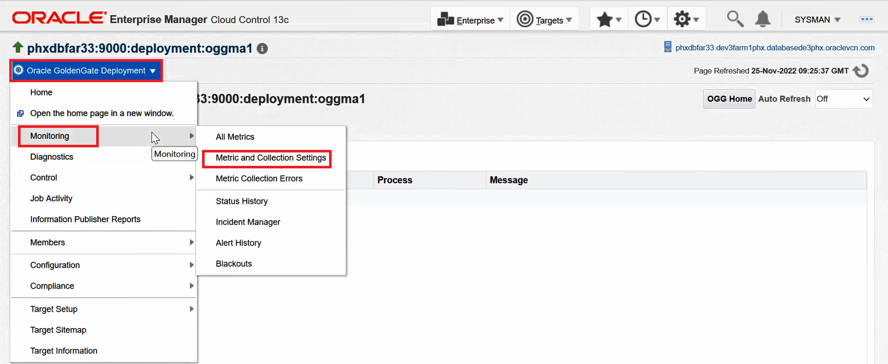
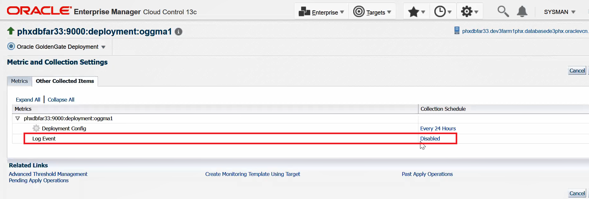

# How do I enable Log Events and alerts in Oracle GoldenGate Enterprise Manager Plug-in?

Duration: 5 minutes

## Enable Log Events and alerts

1. Ensure that you have discovered Oracle GoldenGate targets in the Oracle GoldenGate Enterprise Manager Plug-in.

2. Click **Targets**, select **All Targets** to display the **OGG Home** page with all the discovered targets.

3. Select and click a Deployment target to display the **Deployment Details** page.

     

 4.  Click the **Event** tab. A message is displayed in the **Events** tab that no event has been enabled yet.

    
        
5. Enable the metric. Click the **Oracle GoldenGate Deployment** drop-down list, select **Monitoring** and click **Metric and Collection Settings** to display the **Metric and Collections Settings** page:

    
    
6. Click **Other Collected Items**. Notice that the Log Event is **Disabled**, and click **Disabled**.

    
    
7. In the **Edit Collection Settings: Log Events** page, click **Enable**:

    
    
8. Set a Collection Frequency in the **Repeat Every** box.

    
    
7. Click **Continue** in the Warning page.

8. Click *OK** to complete. 

    

    The Log Event metric has been enabled:

    
    
 9. Verify whether or not the Log Event has been generated by performing a task on the target. By doing this, Log Events are generated. Click **Targets**, select **Golden Gate** to display the **OGG Home** page.

 10. Expand **Administration Service**, select any **Extract** process, stop, and start the process.   

    

11. Click the **Deployment** target on the **OGG Home** page and click the **Events** tab on the **Deployment Details** page. Log Event messages are displayed. You can also sort them by **Message**, **Timestamp**, **Code**, **Severity**, and **Process** fields.
    
    
    

## Learn More

* [Discovering an Oracle GoldenGate Enterprise Manager Plug-in Microservices Instance](https://docs.oracle.com/en/middleware/goldengate/emplugin/13.5.2/empug/discovering-oracle-goldengate-targets-ma-instance.html#GUID-A52B6240-189C-4DAB-A017-6358BBB9813B)
* [Discovering an Oracle GoldenGate Enterprise Manager Plug-in Classic Instance](https://docs.oracle.com/en/middleware/goldengate/emplugin/13.5.2/empug/discovering-oracle-goldengate-targets-classic-instance.html#GUID-DD1E8937-3ADE-40FA-9DE2-B01E5CC20D31)
* [New Route to Discovery in Oracle GoldenGate Enterprise Manager Plug-in](https://blogs.oracle.com/dataintegration/post/new-route-to-discovery-in-oracle-goldengate-enterprise-manager-plug-in-134200)
* [Oracle GoldenGate Enterprise Manager Plug-in Documentation](https://docs.oracle.com/en/middleware/goldengate/emplugin/index.html)
