# How do I enable Log Events in the Oracle GoldenGate Enterprise Manager Plug-in?

Duration: 3 minutes

## Enable Log Events 

There are several Errors, Warnings, and Information messages that Oracle GoldenGate can log. A few messages are highly important and cannot be ignored. If you want to monitor the messages, then you need to enable Log Events in the Oracle Enterprise Manager Plug-in UI. You need to set an alert for those Log Events and you will be notified when such messages are triggered.

Log Events are supported for Oracle GoldenGate Microservices, classic, GoldenGate OCI, and GoldenGate Cloud instances.

To enable log events:

1. Ensure that you have discovered Oracle GoldenGate targets in the Oracle GoldenGate Enterprise Manager Plug-in.

2. Click **Targets** and select **All Targets** to display the **OGG Home** page with all the discovered targets.

3. Select and click a Deployment target to display the **Deployment Details** page.

     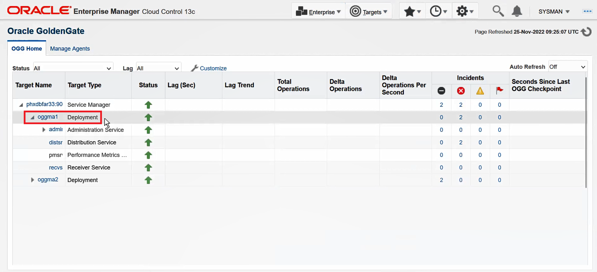

 4.  Click the **Event** tab. A message is displayed in the **Events** tab that no log event metric collection has been enabled yet.

    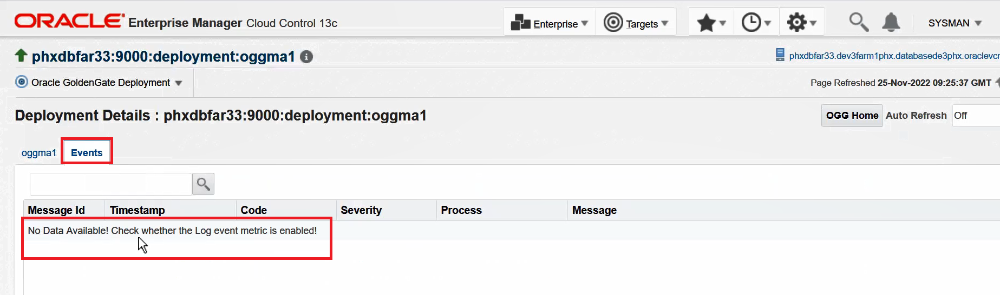
        
5. Enable the Log Event metric. Click the **Oracle GoldenGate Deployment** drop-down list, select **Monitoring** and click **Metric and Collection Settings** to display the **Metric and Collections Settings** page:

    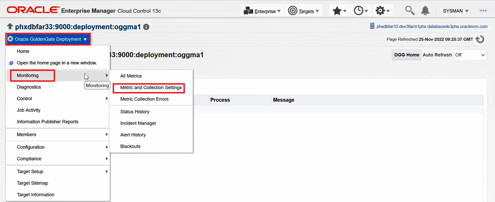
    
6. Click **Other Collected Items**. Notice that the Log Event is in a disabled state, and click **Disabled**.

    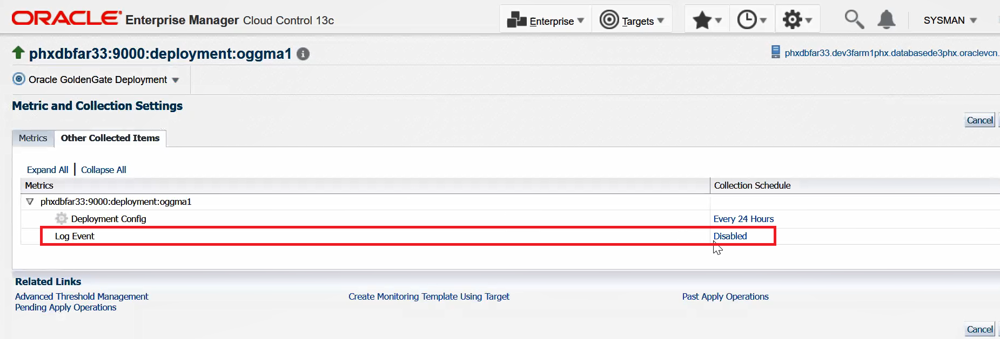
    
7. In the **Edit Collection Settings: Log Events** page, click **Enable**:

    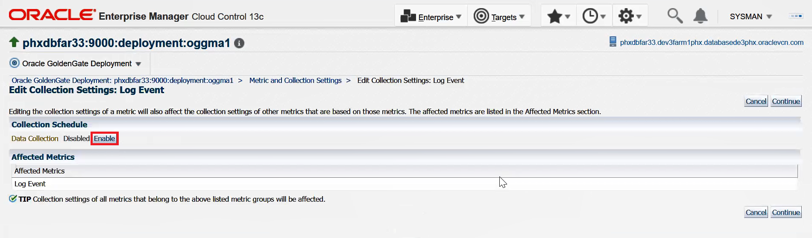
    
8. Set a Collection Frequency in the **Repeat Every** box.

    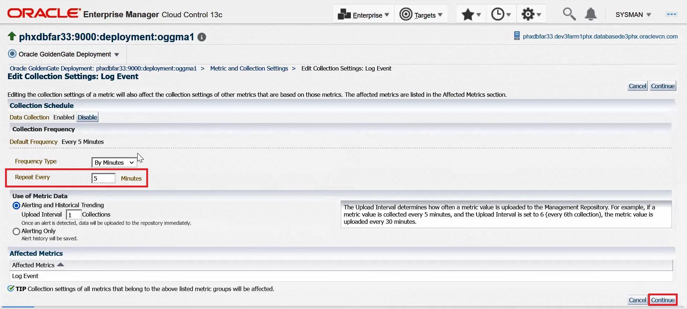
    
9. Click **Continue** in the Warning page.

10. Click **OK** to complete. 

    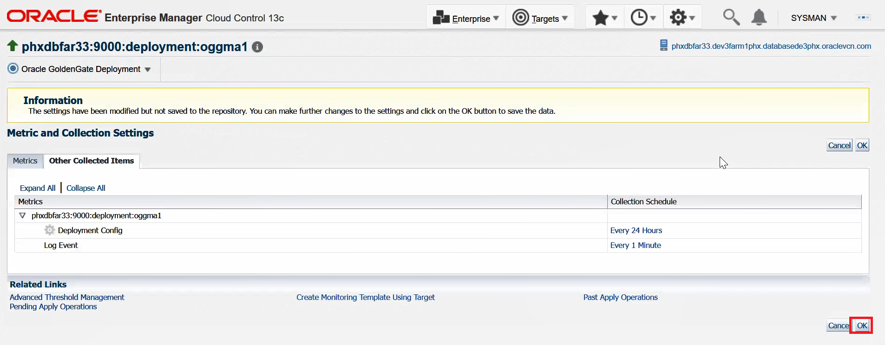

    The Log Event metric has been enabled.

    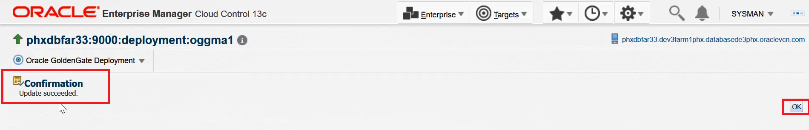
    
 11. Verify whether or not the Log Event has been generated by performing a task on the target. By doing this, Log Events are generated. Click **Targets**, select **Golden Gate** to display the **OGG Home** page.

 12. Expand **Administration Service**, select any **Extract** process, stop, and start the process.   

    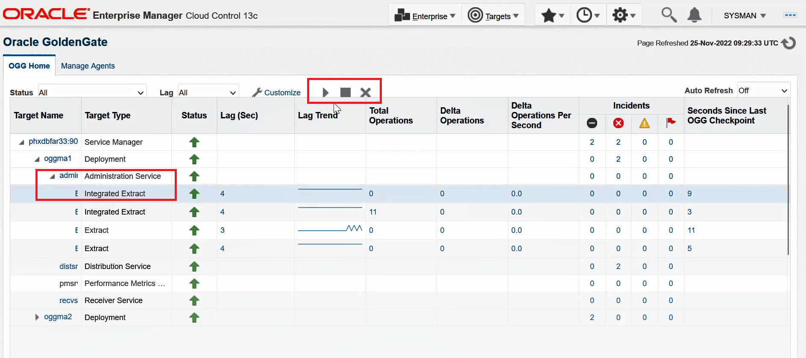

13. Click the **Deployment** target on the **OGG Home** page and click the **Events** tab on the **Deployment Details** page. Log Event messages are displayed. You can also sort them by **Message**, **Timestamp**, **Code**, **Severity**, and **Process** fields.
    
    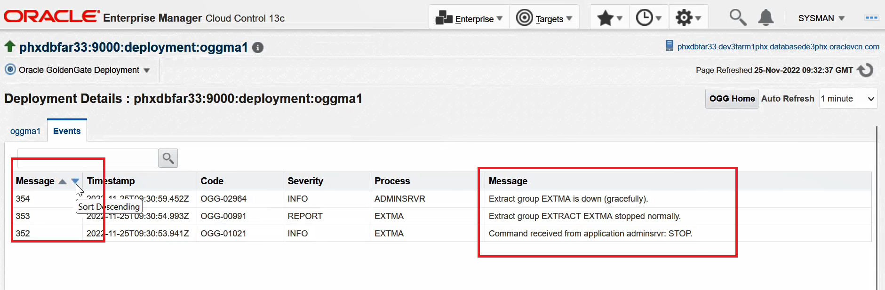

    By default, the latest Log Event Message is displayed. The search option is also enabled.

    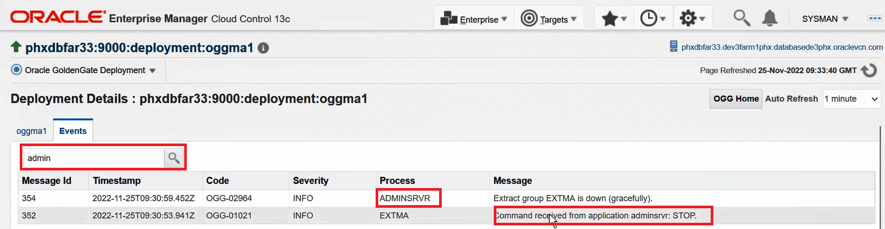   

14.  Click **Export** to export the Log Event messages to a text format:

     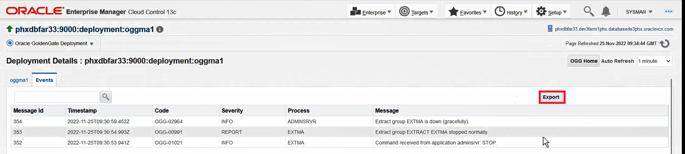   
    
    You can download and view the exported text file that contains the Log Event messages.

    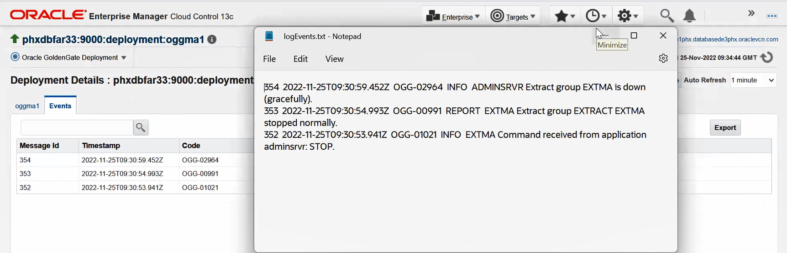

## Learn More

* [Discovering an Oracle GoldenGate Enterprise Manager Plug-in Microservices Instance](https://docs.oracle.com/en/middleware/goldengate/emplugin/13.5.2/empug/discovering-oracle-goldengate-targets-ma-instance.html#GUID-A52B6240-189C-4DAB-A017-6358BBB9813B)
* [Discovering an Oracle GoldenGate Enterprise Manager Plug-in Classic Instance](https://docs.oracle.com/en/middleware/goldengate/emplugin/13.5.2/empug/discovering-oracle-goldengate-targets-classic-instance.html#GUID-DD1E8937-3ADE-40FA-9DE2-B01E5CC20D31)
* [Enabling/Disabling Metrics](https://docs.oracle.com/en/middleware/goldengate/emplugin/13.5.2/empug/metric-data.html#GUID-0DA847D6-33E7-4747-A17C-82BF0D1B4D1F)
* [Setting Alerts for Events](https://docs.oracle.com/en/middleware/goldengate/emplugin/13.5.2/empug/incidents-and-alerts.html#GUID-88A8C47C-A127-4579-9849-33C5DF751DFC)
* [New Route to Discovery in Oracle GoldenGate Enterprise Manager Plug-in](https://blogs.oracle.com/dataintegration/post/new-route-to-discovery-in-oracle-goldengate-enterprise-manager-plug-in-134200)
* [Oracle GoldenGate Enterprise Manager Plug-in Documentation](https://docs.oracle.com/en/middleware/goldengate/emplugin/index.html)
