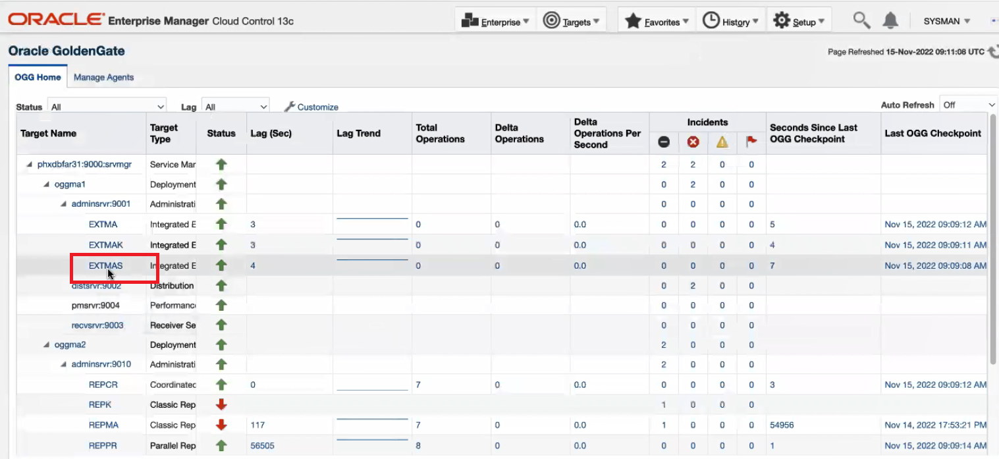

# How do I add and remove Oracle GoldenGate targets in GoldenGate Enterprise Manager Plug-in?
Duration: 3 minutes

## Add Oracle GoldenGate Targets (Discover Oracle GoldenGate Targets)

1. Ensure that the plug-in has already been imported to the Enterprise Manager Cloud Control and deployed to the management agent.

2.Follow the steps in this video on how to discover (add) Oracle GoldenGate Classic and Microservices instances in the UI: [Discover Oracle GoldenGate Classic and Microservices instances](youtube:KAfmbzGDe9E).

See **Learn More**.

You have successfully added a target.

## Remove Oracle GoldenGate targets

1. Ensure that you have discovered Oracle GoldenGate targets in the Oracle GoldenGate Enterprise Manager Plug-in.

2. Click **Targets** and select **All Targets**.
3. Lookup for the target.

  

4. Right click the target, click **Target Setup**.

    

5. Click **OK** in the **Confirmation** dialog box.

  The selected target is successfully removed.

**Alternate methods of removing a target - Method 2**

1. Click **Targets**, select **All Targets**, select and click the target on the **OGG Home** tab.

    

2. On the target details page (here Oracle GoldenGate Extract page), expand **Oracle GoldenGate Extract**, click **Target Setup**, and then click **Remove Target**.

    

3. Click **OK** in the **Confirmation** dialog box.

  The target is successfully removed.

**Alternate methods of removing a target - Method 3**

1. Click **Setup**, select **Add Target**, and then click **Configure Auto Discovery**.

  

2. In the **Setup Discovery** page, click **Managed Targets**.

    

3. Select the target you want to remove and click **Remove**.

    

4. Click **Yes** to confirm.

  The target is successfully removed.

Go to the **OGG Home** page to verify that the targets have been removed.

## Learn More

* [Discovering an Oracle GoldenGate Enterprise Manager Plug-in Microservices Instance](https://docs.oracle.com/en/middleware/goldengate/emplugin/13.5.2/empug/discovering-oracle-goldengate-targets-ma-instance.html#GUID-A52B6240-189C-4DAB-A017-6358BBB9813B)
* [Discovering an Oracle GoldenGate Enterprise Manager Plug-in Classic Instance](https://docs.oracle.com/en/middleware/goldengate/emplugin/13.5.2/empug/discovering-oracle-goldengate-targets-classic-instance.html#GUID-DD1E8937-3ADE-40FA-9DE2-B01E5CC20D31)
* [New Route to Discovery in Oracle GoldenGate Enterprise Manager Plug-in](https://blogs.oracle.com/dataintegration/post/new-route-to-discovery-in-oracle-goldengate-enterprise-manager-plug-in-134200)
* [Oracle GoldenGate Enterprise Manager Plug-in Documentation](https://docs.oracle.com/en/middleware/goldengate/emplugin/index.html)
