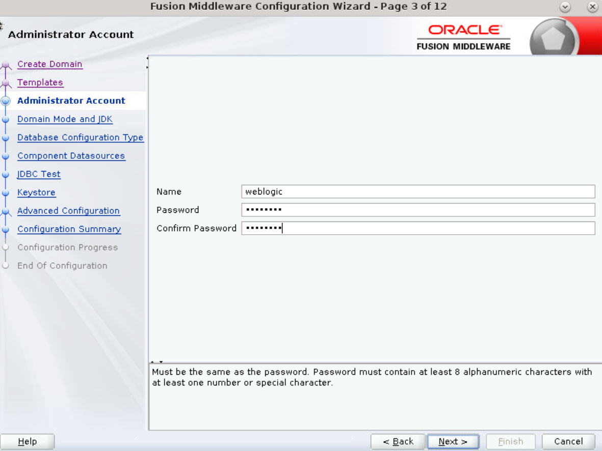

# How do I Create the Oracle GoldenGate Veridata Server Domain?

Duration: 2 minutes

## Create the Domain

The Configuration Wizard can either create a new domain or extend an existing domain. This example shows how to create a new domain.
1. Open a terminal session. Invoke the Configuration wizard by entering `/home/opc/VDT/oracle_common/common/bin/config.sh`.

    **Note**: The Create a new domain option is selected by default.
    
    
2. Click **Browse** to select the **Domain Location**.
3. Click **Next** to display the **Templates** screen.
    
4. Select **Veridata Standard Server Domain**. This causes the **Oracle JRF** to be selected automatically. If the Oracle JRF is not selected, then you have not installed the Infrastructure correctly.
5. Click **Next** to continue.
6. Enter the same password twice. Complexity rules require a number or special character in the password. The sample VM uses `weblogic1`. Note the difference between the lowercase L in the middle and the numeral one at the end.
    
7. Click **Next** to continue.
8. If you plan to use localhost/127.0.0.1 as the host name/address, then you must select **Development**. In Production, use the real host name and address instead of using localhost.
    
9. Click **Next** to continue.
10. Enter the Host Name, Port, Schema Owner, and Schema Password in the **Database Configuration Type** screen.
      
11. Click **Get RCU Configuration** to continue.
12. Verify the **Connection Result Log** and then click **OK**.
13. Click **Next** to continue to the **JDBC Component Schema Test** screen.
      
14. Click **Next** to continue to the **JDBC Test** screen.
      The Test Select Connection happens automatically. Look at the **Connection Result Log**.
      
15. Ensure that all the Status check boxes are selected, indicating a successful result log.
16. Click **Next** to display the **Keystore** screen.
      
17. Enter a **Password** for the **Alias**.
18. Click **Next** to display the **Advanced Configuration** screen, but do not select any of the **Advanced Options**.
      
      **Note**: Here you can choose to configure clusters of servers, if you need high availability using multiple hosts.
19. Click **Next** to display the **Configuration Summary** screen. In this screen, you can identify where the Oracle GoldenGate Veridata server application is deployed. If you have used clusters, then you need to deploy the application to the cluster, not to any one server.
      
20. Click **Create** to display the **Configuration Progress** screen. When the progress bar reaches 100%, it should say "Domain Created Successfully!"
21. Click **Finish** to continue.
      Note the URLs to use from a web browser to reach the WebLogic Administration Console: an http URL which is insecure, and an https URL which uses SSL for increased security.
      

## Learn More

* [Oracle GoldenGate Veridata documentation](https://docs.oracle.com/en/middleware/goldengate/veridata/12.2.1.4/index.html)
* [Veridata Basic Workshop-Oracle LiveLabs: Get Started with Oracle GoldenGate Veridata workshop](https://apexapps.oracle.com/pls/apex/dbpm/r/livelabs/view-workshop?wid=833)
* [Oracle LiveLabs: Master Oracle GoldenGate Veridata Advanced Features workshop](https://apexapps.oracle.com/pls/apex/dbpm/r/livelabs/view-workshop?wid=913)
