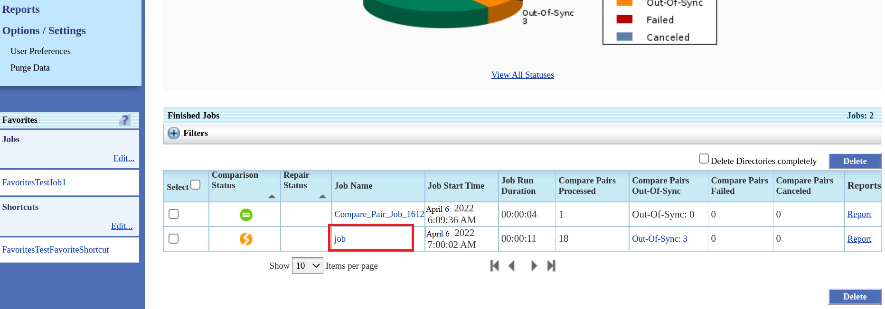
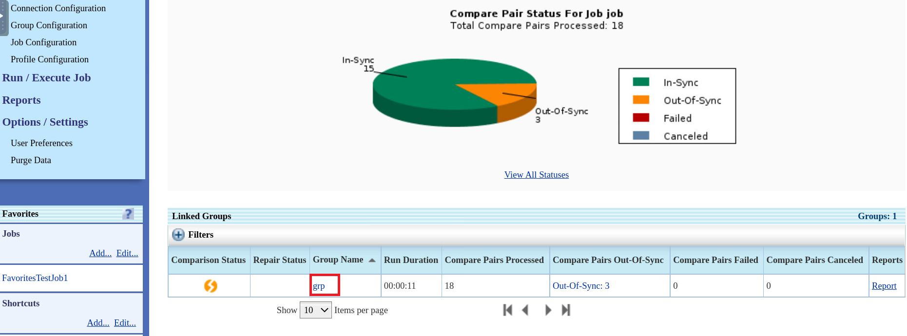
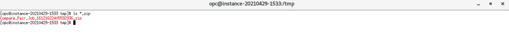
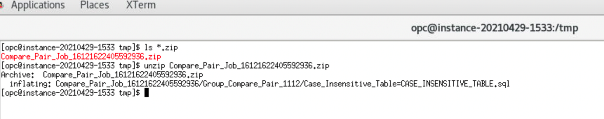

# How do I download SQL in GoldenGate Veridata?
Duration: 2 minutes

### Prerequisites
This sprint assumes you have:
  * Installed and configured Oracle GoldenGate Veridata.
  * Created a group.
  * Configured compare pairs.
  * Created a job.
  * Run the job.

See **Learn More**.

## Download Repair SQL

1. In the Oracle GoldenGate Veridata UI, from the left navigation pane, click **Finished Jobs** to view the page containing the details of all the finished jobs.
2. From the table under **Finished Jobs**, click the **Job Name**:

  

3. Click the **Group Name**:

  

4. Click the **Out Of Sync** link for the Compare Pair name **Case\_Insensitive\_Table=CASE\_INSENSITIVE\_TABLE**:

  

5. Click **Download Repair SQL**.

  

  The SQL file gets downloaded.

  

6. Open a terminal to view the SQL file. Navigate to the file location:

    

7. Extract the zip file to view the SQL file.

    

### Video Preview
Watch our short video that explains the Download Repair SQL functionality in Oracle GoldenGate Veridata: 

## Learn More

* [Downloading SQL Statements for Out-of-Sync Records](https://docs.oracle.com/en/middleware/goldengate/veridata/12.2.1.4/gvdug/working-jobs.html#GUID-0AA3E8E2-BAD3-41D2-83CD-E8986C69A3ABl)
* [Oracle GoldenGate Veridata documentation](https://docs.oracle.com/en/middleware/goldengate/veridata/12.2.1.4/index.html)
* [Veridata Basic Workshop-Oracle LiveLabs: Get Started with Oracle GoldenGate Veridata workshop](https://apexapps.oracle.com/pls/apex/dbpm/r/livelabs/view-workshop?wid=833)
* [Oracle LiveLabs: Master Oracle GoldenGate Veridata Advanced Features workshop](https://apexapps.oracle.com/pls/apex/dbpm/r/livelabs/view-workshop?wid=913)
* [Download Repair SQL Files in Oracle GoldenGate Veridata blog](https://blogs.oracle.com/dataintegration/post/repair-out-of-sync-jobs-and-download-repair-sql-files)
