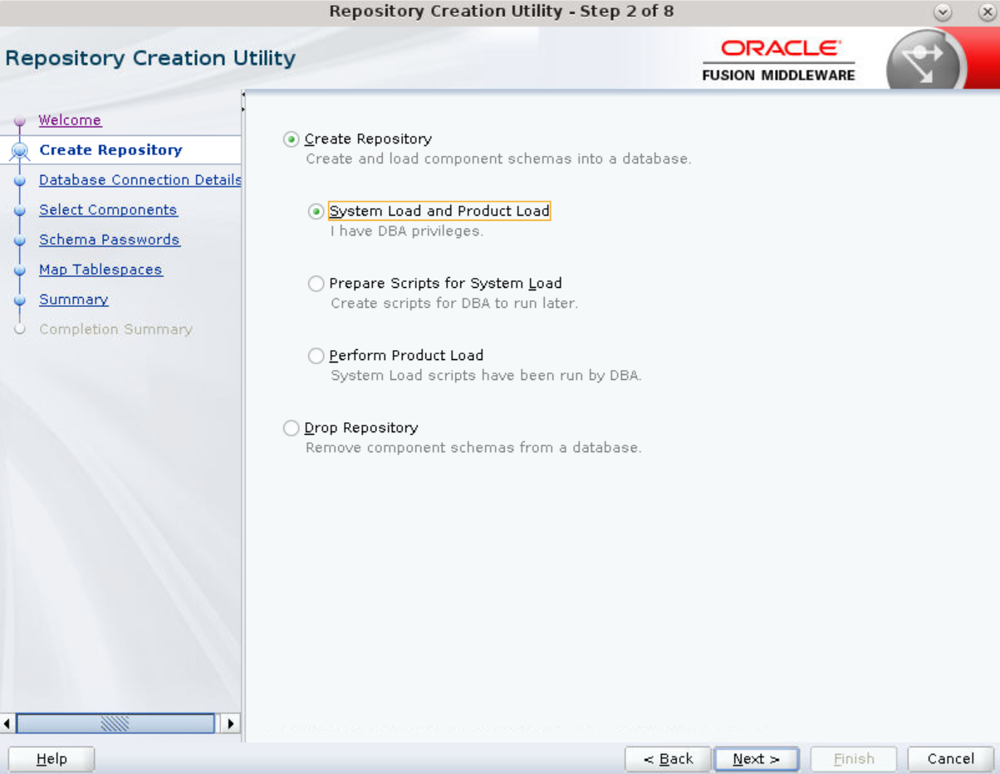
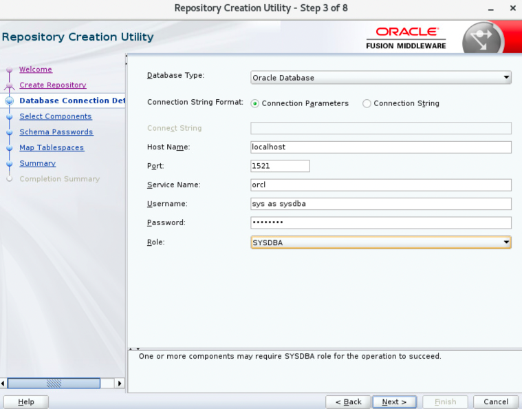
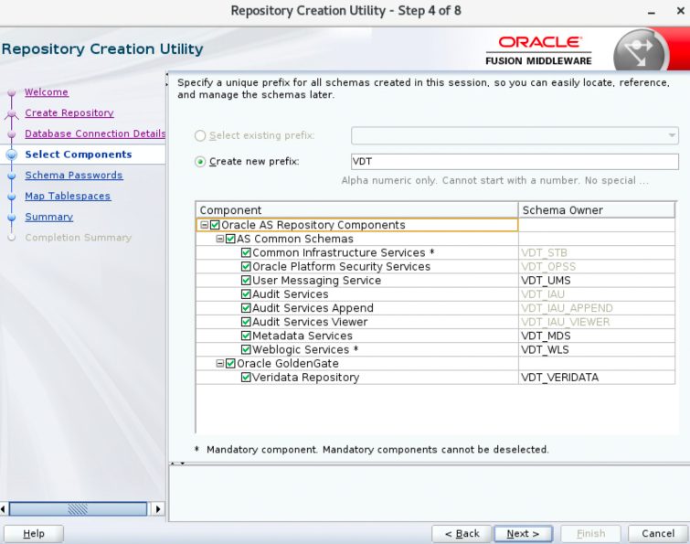
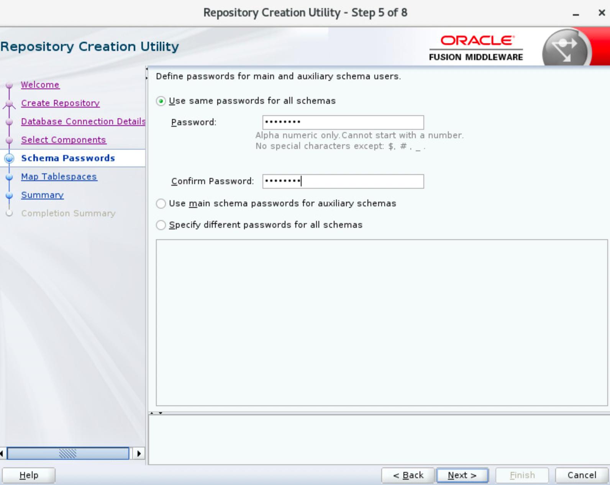
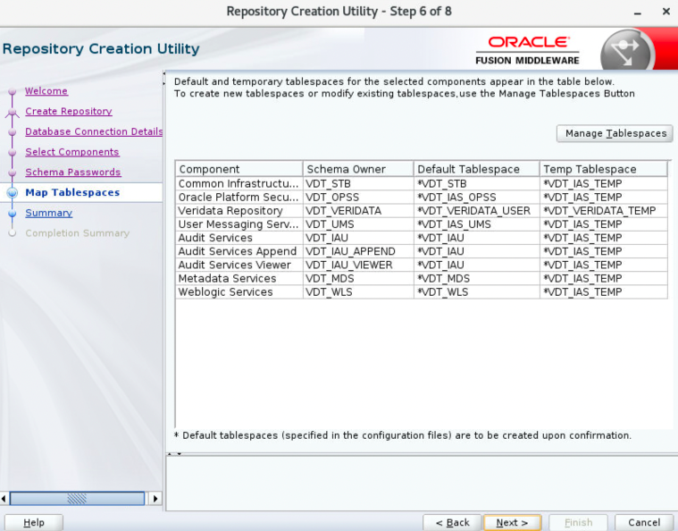
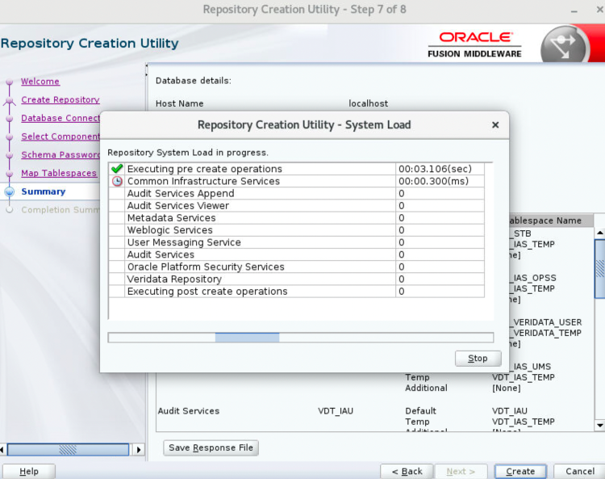
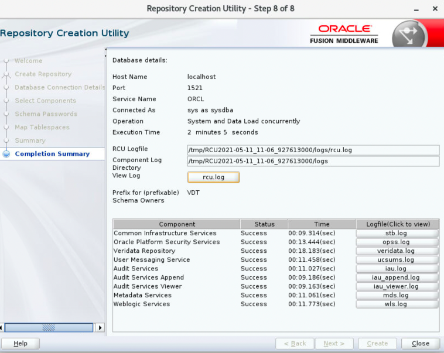

# How do I configure a Repository Creation Utility (RCU)?

Duration: 2 minutes

## Configure RCU

The Repository Creation Utility (RCU) presumes that you have already installed a compatible database to house the repository. This example assumes that it is an Oracle 19c Database.

To configure the RCU:
1. Open a terminal session. Start the RCU with this command: `/home/opc/VDT/oracle_common/bin/rcu`.
2. Click **Next** in the **Welcome** screen to display the **Create Repository** screen.
3. In the **Create Repository** screen, the default is **Create Repository** with **System Load** and **Product Load**. Click **Next** to continue.
    
4. Enter the appropriate information to log in to your database with full privileges in the **Database Connection Details** screen.
    
5. Click **OK** to dismiss **Checking Prerequisites**. Click **Next** to continue.
6. If this is the first time you have run RCU, then the only option is to create a new prefix. If you have run RCU in the past, then it will increment the previous prefix by one, to form a new prefix. For example, DEV2 or DEV3. You can override the suggestion. Select **Oracle GoldenGate, Veridata Repository**.
    
7. Click **OK** to close **Checking Prerequisites**.
8. Click **Next** to continue.
9. Enter the same password twice. Many of the sample VM databases use `oracle` as the default password for all schemas.
    
10. Click **Next** to continue to the **Map Tablespaces** screen.
    
11. Accept the default tablespace allocations.
12. Click **OK** in the **Repository Creation Utility - Confirmation** dialog box.
13. Click **Next** to display **Summary** screen.
      
14. Click **Create** to display the **Completion Summary** screen.
      
15. Click **Close** to continue.

## Learn More

* [Oracle GoldenGate Veridata documentation](https://docs.oracle.com/en/middleware/goldengate/veridata/12.2.1.4/index.html)
* [Veridata Basic Workshop-Oracle LiveLabs: Get Started with Oracle GoldenGate Veridata workshop](https://livelabs.oracle.com/pls/apex/dbpm/r/livelabs/view-workshop?wid=833)
* [Oracle LiveLabs: Master Oracle GoldenGate Veridata Advanced Features workshop](https://livelabs.oracle.com/pls/apex/dbpm/r/livelabs/view-workshop?wid=913)
