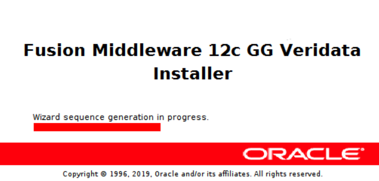
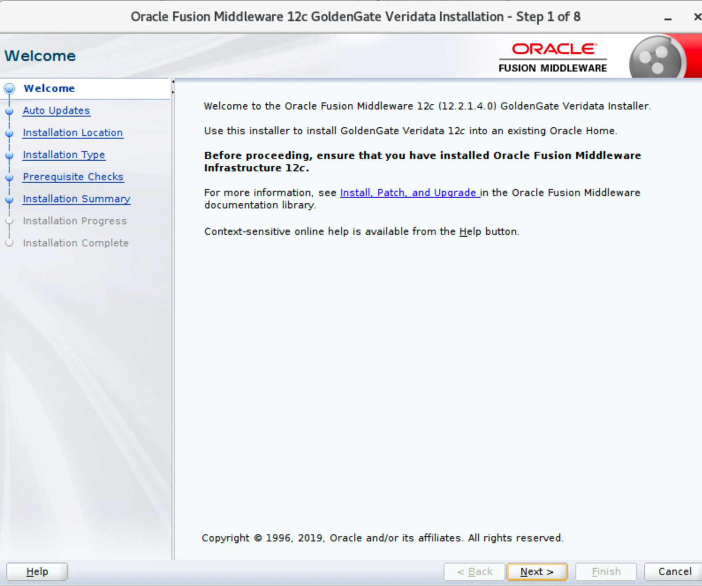
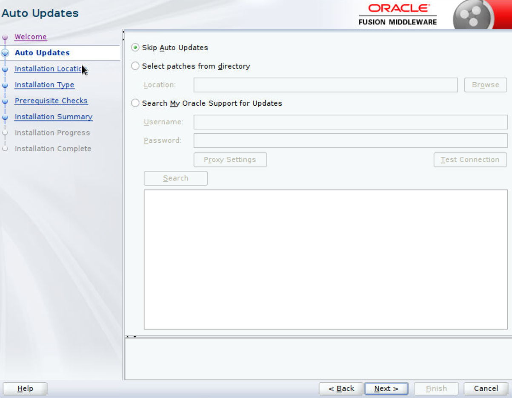
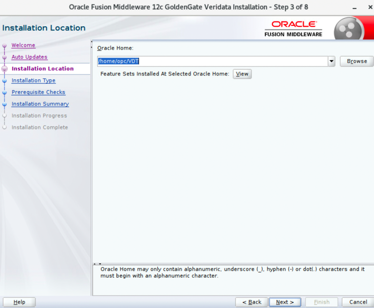
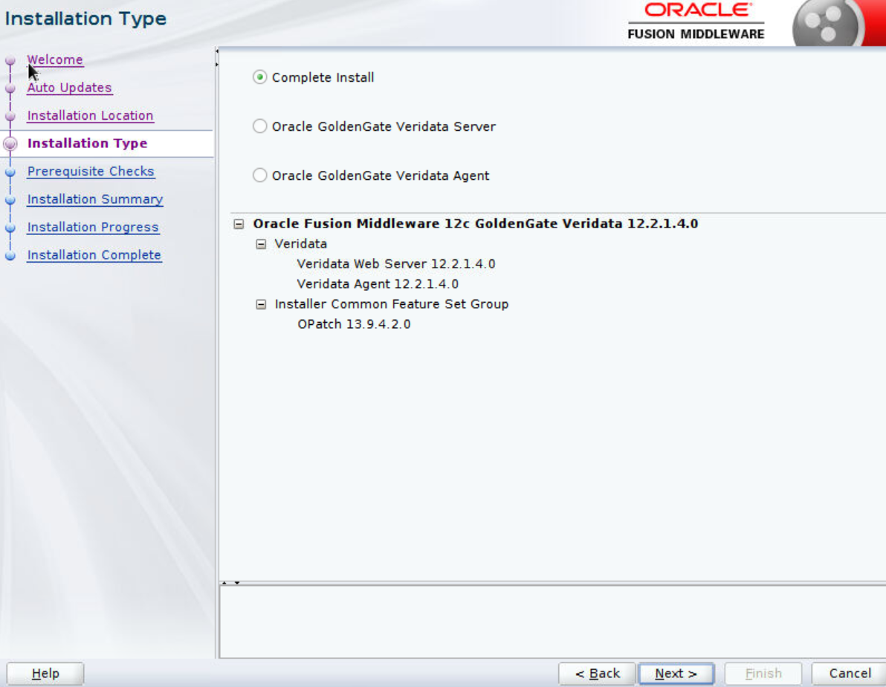

# How do I How do I deploy the Oracle GoldenGate Veridata Agents?

Duration: 2 minutes
For each database instance, you need its corresponding Oracle GoldenGate Veridata Agent installed.
This Agent can be installed and deployed either on the same database host or on a remote host system. The Agent installation requires only the `fmw_12.2.1.4.0_ogg.jar` file. The Agent must be deployed on to a non Oracle Home location.

**Assumptions**:
* You have already installed and configured the Agent's source and target databases.
* The software distribution files have been downloaded and unzipped.
* The Java home is set to Java 1.8.

To deploy agents:
1. Open the terminal session and run the installer with the following command: `java -jar fmw_12.2.1.4.0_ogg.jar` to display the splash screen.
    
    The splash screen disappears when the progress bar reaches 100% to display the **Welcome** screen.
2. After you have read the instructions on the **Welcome** screen, click **Next** to continue to the **Auto Updates** screen.
    
3. Click **Next** to continue to the **Auto Updates** section. Leave the default option **Skip Auto Updates** selected and click **Next**.
    
4. Enter the same Oracle Home directory that you entered in **Step 1 > 3**.
    
5. Click **Next** to continue and display the **Installation Type** screen.
    

6. Select the Oracle GoldenGate Veridata options that you want to install, or select **Complete Install** to get them all.
In case you have done a **Complete Install**, then you can ignore steps 1 to 5.

7. Open the terminal session and run the following script to deploy the Oracle GoldenGate Veridata Agent:
    <pre>###########################################################
    Veridata agents. Can run from anywhere, give destination as argument.
    /home/opc/VDT/veridata/agent/agent_config.sh /home/opc/agent1
    ## Should return, "Successfully deployed the agent. </pre>

8. These are the changes made to the `agent.properties` file: `cd /home/opc/agent1`

    **Note**: The database-specific files are under the `sample_properties` directory and you need to select the respective file and copy that as `agent.properties`.
    Example for Oracle database:

    <pre>cp sample_properties/agent.properties.oracle agent.properties
    gedit agent.properties
    server.port=7850
    database.url=jdbc:oracle:thin:@//localhost:1521:orcl
    server.jdbcDriver=ojdbc8.jar</pre>

9. To start the Oracle GoldenGate Veridata agent, enter:

    <pre>/home/opc/VDT/agent1/agent.sh start</pre>

## Learn More

* [Oracle GoldenGate Veridata documentation](https://docs.oracle.com/en/middleware/goldengate/veridata/12.2.1.4/index.html)
* [Veridata Basic Workshop-Oracle LiveLabs: Get Started with Oracle GoldenGate Veridata workshop](https://apexapps.oracle.com/pls/apex/dbpm/r/livelabs/view-workshop?wid=833)
* [Oracle LiveLabs: Master Oracle GoldenGate Veridata Advanced Features workshop](https://apexapps.oracle.com/pls/apex/dbpm/r/livelabs/view-workshop?wid=913)
