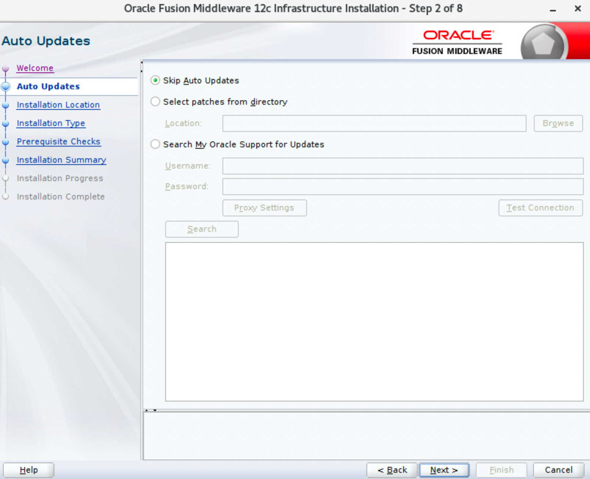
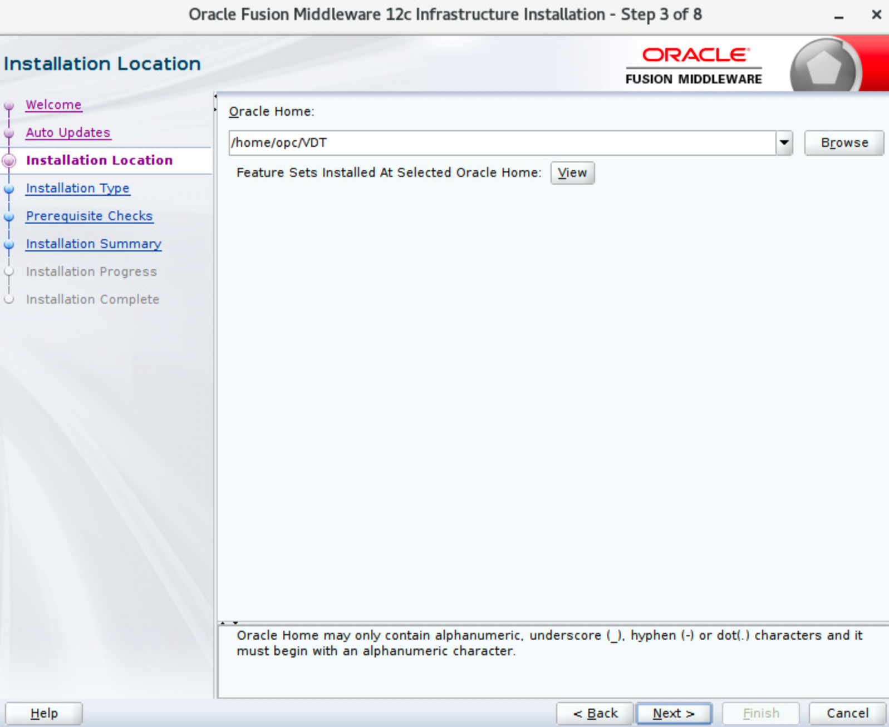
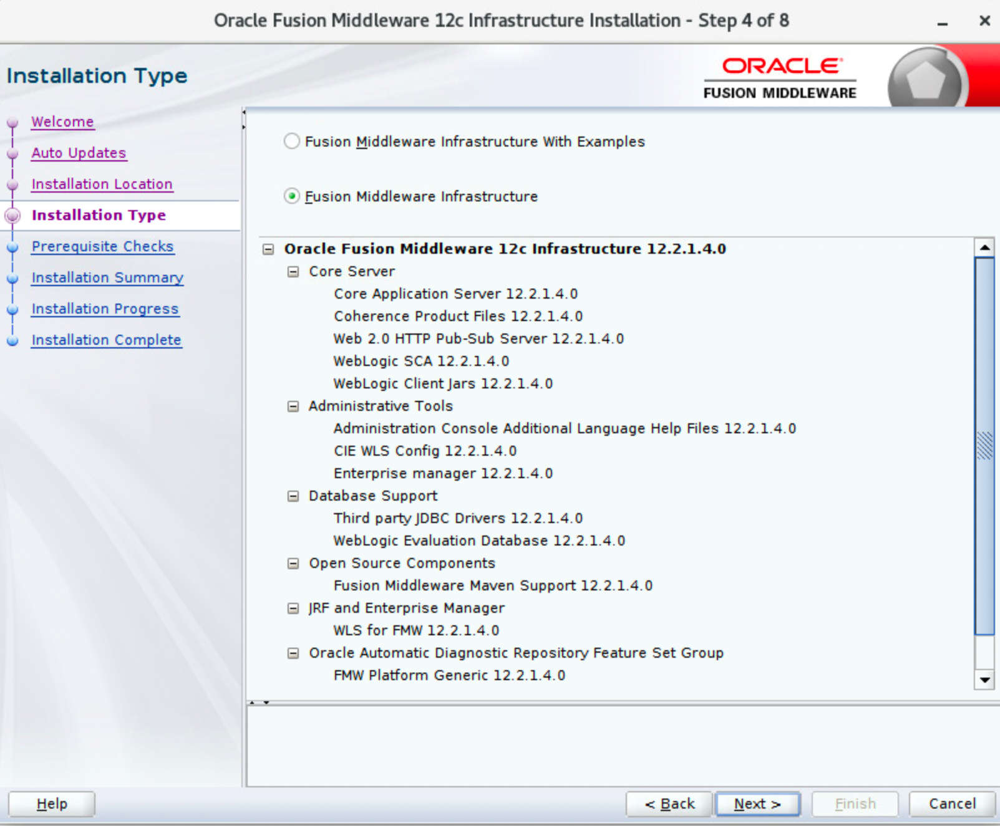
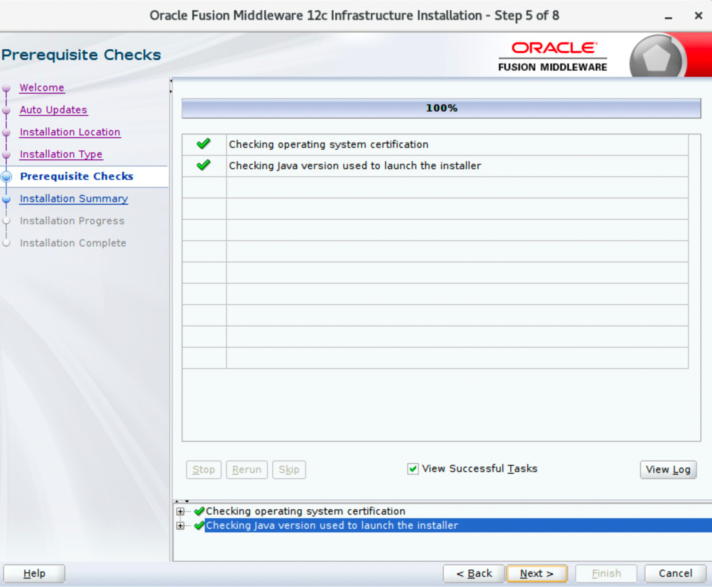
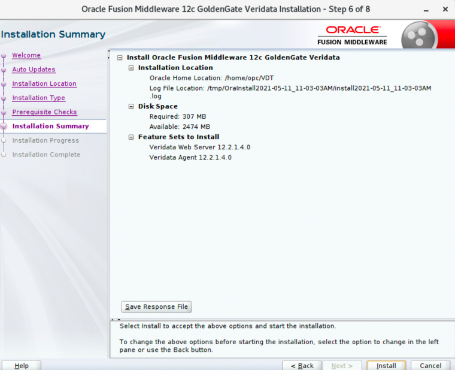
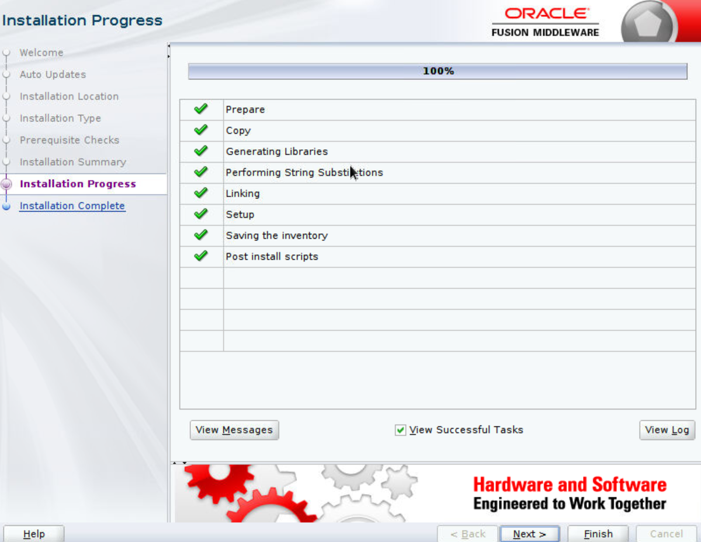
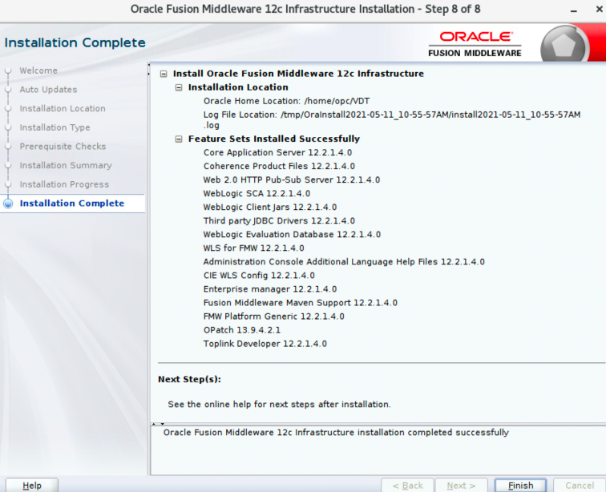

# How do I install the Fusion Middleware infrastructure?

Duration: 2 minutes

## Install the Fusion Middleware Infrastructure

1. Open a terminal session. Run the following command: `java -jar fmw_12.2.1.4.0_infrastructure_generic.jar`.
    
2. Click **Next** to continue to the **Auto Updates** section. Leave the default option **Skip Auto Updates** selected and click **Next**.
    
3. Enter a location for Oracle Home to store the binary files.
    
4. Click **Next** to continue.
5. Select either installation type (Fusion Middleware infrastructure With Examples or Fusion Middleware Infrastructure). Towards the end of this step, the Oracle WebLogic Server gets installed.
    
6. Wait for the progress bar to reach 100%. The Java version required is 1.8 or higher. Click **Next** to continue to the **Prerequisites Checks** screen.
    
7. Click **Next** to continue to the **Installation Summary** screen.
    
8. On the **Installation Summary** screen, click **Next** to display the **Installation Progress** panel.
    
9. Click **Install** to continue and wait for the progress bar to reach 100%. You can optionally view the logs.
10. Click **Next** to display the **Installation Complete** section.
    
11. Click **Finish**.

## Learn More

* [Oracle GoldenGate Veridata documentation](https://docs.oracle.com/en/middleware/goldengate/veridata/12.2.1.4/index.html)
* [Veridata Basic Workshop-Oracle LiveLabs: Get Started with Oracle GoldenGate Veridata workshop](https://apexapps.oracle.com/pls/apex/dbpm/r/livelabs/view-workshop?wid=833)
* [Oracle LiveLabs: Master Oracle GoldenGate Veridata Advanced Features workshop](https://apexapps.oracle.com/pls/apex/dbpm/r/livelabs/view-workshop?wid=913)
