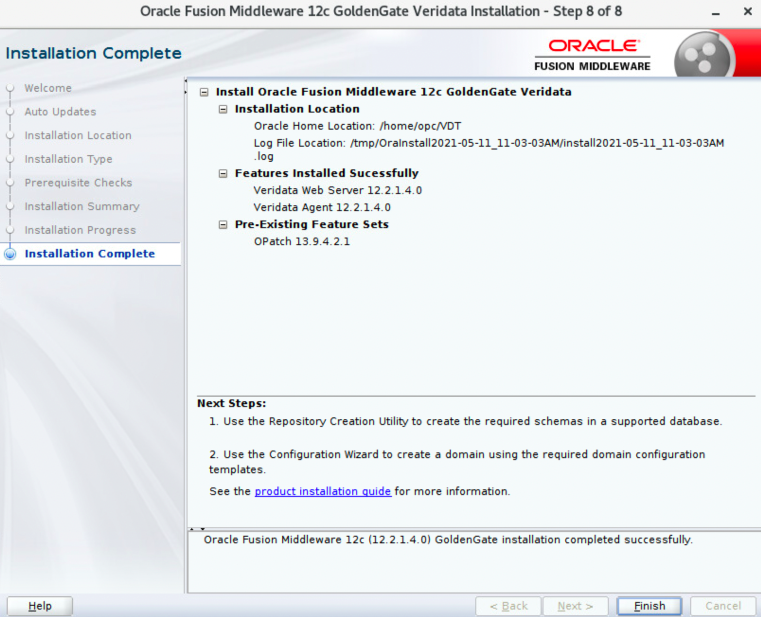

# How do I install Oracle GoldenGate Veridata?

Duration: 2 minutes

## Install Oracle GoldenGate veridata

To install and configure Oracle GoldenGate Veridata:

  1. Open the terminal session and run the installer with the following command: `java -jar fmw_12.2.1.4.0_ogg.jar` to display the splash screen.
      
      The splash screen disappears when the progress bar reaches 100% to display the **Welcome** screen.
  2. After you have read the instructions on the **Welcome** screen, click **Next** to continue to the **Auto Updates** screen.
      
  3. Click **Next** to continue to the **Auto Updates** section. Leave the default option **Skip Auto Updates** selected and click **Next**.
      
  4. Enter the same Oracle Home directory that you entered in **Step 1 > 3**.
      
  5. Click **Next** to continue and display the **Installation Type** screen.
      
  6. Select the Oracle GoldenGate Veridata options that you want to install, or select **Complete Install** to get them all.
  7. Click **Next** to continue to the **Prerequisites Check** screen.
      

  8. After the progress bar has reached 100%, click **Next** to display the **Installation Summary** screen.
      
  9. Click **Install** to continue and display the **Installation Progress** screen and wait for the progress bar to reach 100%. You can also view the logs.
      
  10. Click **Next** to continue to the **Installation Complete** screen. Note that the **Next Steps** that are required to run the Repository Creation Utility (RCU) and then run the Configuration Wizard, are mentioned in the **Installation Complete** screen.
      

## Learn More

* [Oracle GoldenGate Veridata documentation](https://docs.oracle.com/en/middleware/goldengate/veridata/12.2.1.4/index.html)
* [Veridata Basic Workshop-Oracle LiveLabs: Get Started with Oracle GoldenGate Veridata workshop](https://livelabs.oracle.com/pls/apex/dbpm/r/livelabs/view-workshop?wid=833)
* [Oracle LiveLabs: Master Oracle GoldenGate Veridata Advanced Features workshop](https://livelabs.oracle.com/pls/apex/dbpm/r/livelabs/view-workshop?wid=913)
