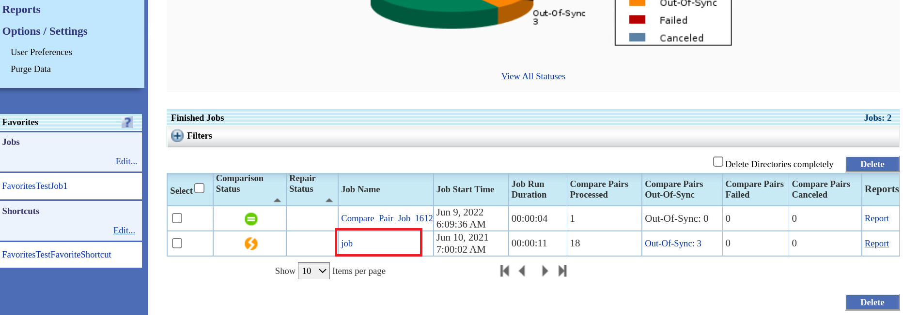
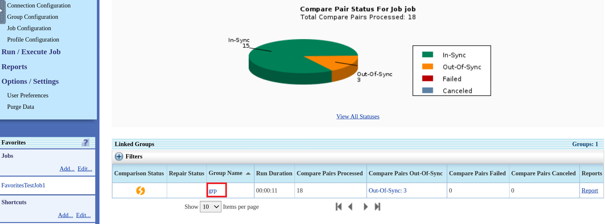
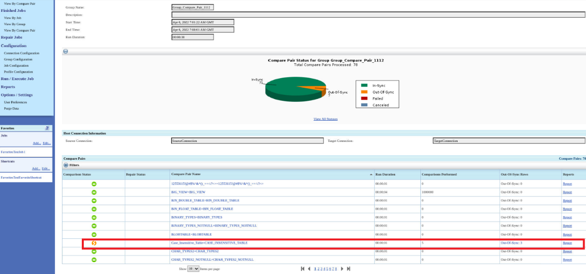
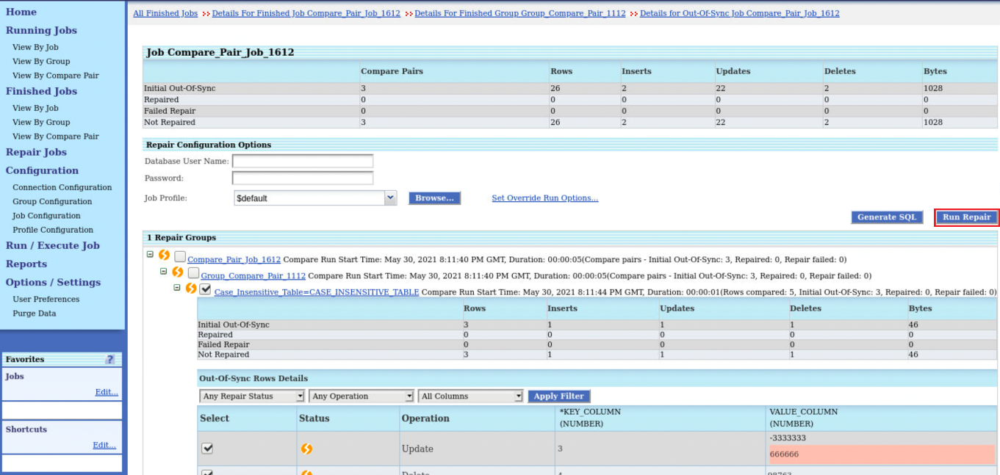
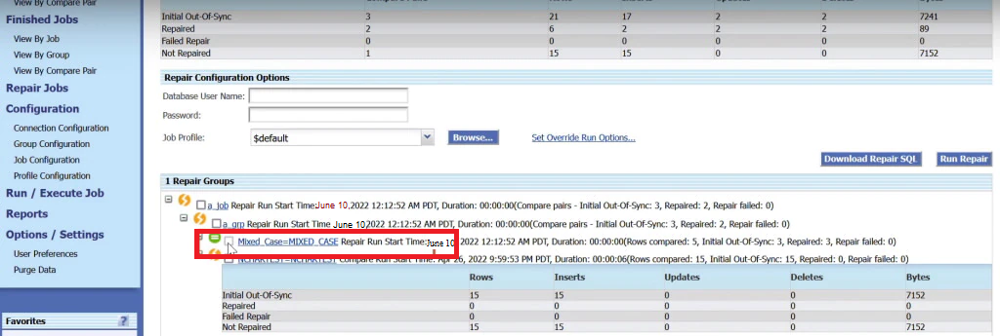

# How do I repair SQL in GoldenGate Veridata?
Duration: 2 minutes

### Prerequisites

This sprint assumes you have:
  * Installed and configured Oracle GoldenGate Veridata.
  * Created a group.
  * Configured compare pairs.
  * Created a job.
  * Run the job.

See **Learn More**.

## Repair SQL

1. From the left navigation pane, click **Finished Jobs** to view the page containing the details of all the finished jobs.
2. From the table under **Finished Jobs**, click the **Job Name**:

  

3. Click the **Group Name**:

  

4. Click the **Out Of Sync** link for the Compare Pair name **Case\_Insensitive\_Table=CASE\_INSENSITIVE\_TABLE**:

  

5. Click **Run Repair**.

  

  The out-of-sync records for the selected job are repaired.

  

### Video Preview
Watch our short video that explains the Download Repair SQL functionality in Oracle GoldenGate Veridata: 

## Learn More

* [Repairing Out-of-Sync Jobs](https://docs.oracle.com/en/middleware/goldengate/veridata/12.2.1.4/gvdug/working-jobs.html#GUID-B46185DF-4B7E-4647-8BE2-F7176E1FFDFF)
* [Oracle GoldenGate Veridata documentation](https://docs.oracle.com/en/middleware/goldengate/veridata/12.2.1.4/index.html)
* [Veridata Basic Workshop-Oracle LiveLabs: Get Started with Oracle GoldenGate Veridata workshop](https://livelabs.oracle.com/pls/apex/dbpm/r/livelabs/view-workshop?wid=833)
* [Oracle LiveLabs: Master Oracle GoldenGate Veridata Advanced Features workshop](https://livelabs.oracle.com/pls/apex/dbpm/r/livelabs/view-workshop?wid=913)
* [Download Repair SQL Files in Oracle GoldenGate Veridata blog](https://blogs.oracle.com/dataintegration/post/repair-out-of-sync-jobs-and-download-repair-sql-files)
