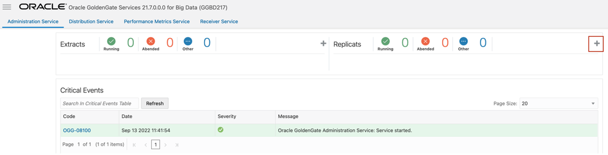
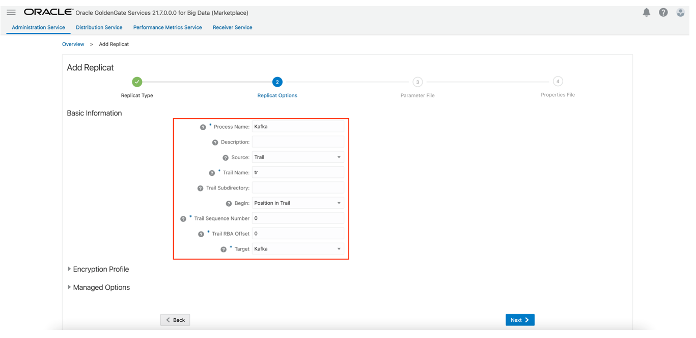
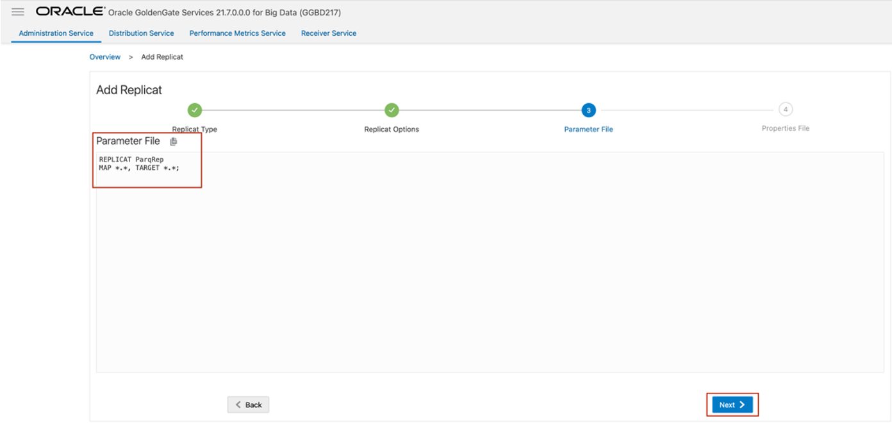
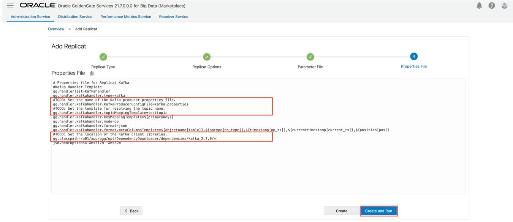
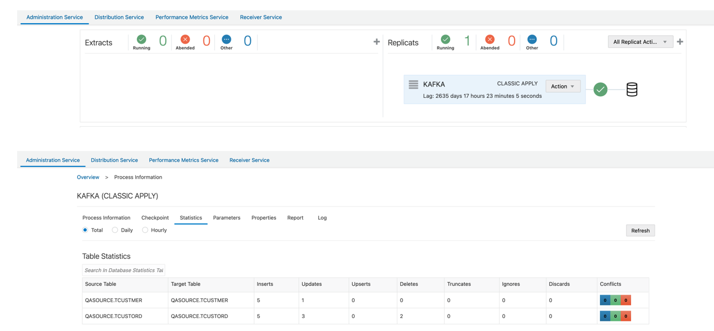

# How do I ingest messages into Kafka in real-time with Oracle GoldenGate for Big Data?
Duration: 5 minutes

It is assumed tha you’ve [installed GoldenGate for Big Data](https://docs.oracle.com/en/middleware/goldengate/big-data/21.1/gadbd/installing-oracle-goldengate-microservices-big-data.html#GUID-3145D2E1-C257-4C5D-A472-0EFAB31B6237) in your environment or from Oracle Cloud Infrastructure Market Place, and you've configured an [Extract](https://docs.oracle.com/en/middleware/goldengate/core/21.3/coredoc/extract-add-extract.html), which is up and running and trails are being sent to Oracle GoldenGate for Big Data Deployment. 

**Video Preview**

Get familiar with Oracle GoldenGate Microservices by watching this video: [Introduction to Oracle GoldenGate Microservices](youtube:aekcNiAYC7k)

## Install Dependency Files 

Oracle GoldenGate for Big Data uses client libraries in the replication process. You need to download these libraries by using the [Dependency Downloader utility](https://doc.oracle.com/en/middleware/goldengate/big-data/21.1/gadbd/dependency-downloader.html#GUID-6252EAFA-D76A-4A83-BB16-41BCCCC46194) available in Oracle GoldenGate for Big Data before setting up the replication process. Dependency downloader is a set of shell scripts that downloads dependency jar files from Maven and other repositories. 


To install the required dependency files:
1. Go to installation location of Dependency Downloader: ```GG_HOME/opt/DependencyDownloader/```. 
2. Execute [```kafka.sh```](https://docs.oracle.com/en/middleware/goldengate/big-data/21.1/gadbd/kafka-handler-client-dependencies.html) with the required versions. 

    

The following directory is created in ```GG_HOME/opt/DependencyDownloader/dependencies```: ```/u01/app/ogg/opt/DependencyDownloader/dependencies/kafka_2.7.0```
   
## Create Kafka Producer Properties File 

Oracle GoldenGate for Big Data must access a Kafka producer configuration file to publish messages to Kafka. The Kafka producer configuration file contains Kafka proprietary properties.

To create a Kafka producer configuration file:

1. In the Oracle GoldenGate for Big Data, go to ```GGBD_Deployment_Home/etc/conf/ogg```.
2. Create a Kafka producer config file for OCI Streaming. Sample configuration file:
 ```  
    <copy>
    bootstrap.servers=localhost:9092
    acks = 1
    compression.type = gzip
    reconnect.backoff.ms = 1000
    
    value.serializer = org.apache.kafka.common.serialization.ByteArraySerializer
    key.serializer = org.apache.kafka.common.serialization.ByteArraySerializer
 </copy>
    ```   

## Create a Replicat in Oracle GoldenGate for Big Data
To create a replicat in Oracle GoldenGate for Big Data:

1. In the Oracle GoldenGate for Big Data UI, in the **Administration Service** tab, click the **+** sign to add a replicat. 
    
    

2. Select the Replicat Type and click **Next**.

There are two different Replicat types here: Classic and Coordinated. Classic Replicat is a single threaded process whereas Coordinated Replicat is a multithreaded one that applies transactions in parallel. 
For KafKa, Oracle recommends Classic replicat as sending messages in multiple threats may result in data consistency problems. 


3. Enter the basic information, and click **Next**:

    * **Process Name**: Name of the Replicat
    * **Trail Name**: Name of the required trail file
    * **Target**: Kafka 

    
    
4. Enter Parameter File details and click **Next**. In the Parameter File, you can either specify source to target mapping or leave it as is with a wildcard selection. 

    

5. Oracle GoldenGate for Big Data populates the properties file automatically. Update the following fields: 
    * ```gg.handler.kafkahandler.kafkaProducerConfigFile```=name of the Kafka producer file created in the task **Create Kafka Producer Properties File**
    * ```gg.handler.kafkahandler.topicMappingTemplate```=name of the target topic gg.classpath=path to dependency files downloaded in the task **Install Dependency Files**.

6. Click **Create and Run**.

    
    
7. If replicat starts successfully, then the replicat is in running state. You can go to action/details/statistics to see the replication statistics: 
    

## Learn More
* If target Kafka topic does not exist, then it will be auto created by Oracle GoldenGate for Big Data. See [Template Keywords](https://docs.oracle.com/en/middleware/goldengate/big-data/21.1/gadbd/template-keywords.html#GUID-742BA6BE-D446-4E21-8E38-7105AC9F5E5E) to dynamically assign S3 bucket names.
* For improving the performance of the Kafka replication, refer the blog: [How to Improve Kafka Handler Performance in Oracle GoldenGate for Big Data](https://blogs.oracle.com/dataintegration/post/how-to-improve-kafka-handler-performance-in-oracle-goldengate-for-big-data)
* Oracle GoldenGate for Big Data supports SSL and kerberos authentication into Kafka. See [Schema Propagation](https://docs.oracle.com/en/middleware/goldengate/big-data/21.1/gadbd/using-kafka-handler.html#GUID-D6DE6F83-049C-4E97-8535-736F22741D51). 
* For Kafka connection issues, see [Oracle Support](https://support.oracle.com/knowledge/Middleware/2644967_1.html). 
* [Installing Oracle GoldenGate MA for Big Data Using the UI](https://docs.oracle.com/en/middleware/goldengate/big-data/21.1/gadbd/installing-oracle-goldengate-microservices-big-data.html#GUID-3145D2E1-C257-4C5D-A472-0EFAB31B6237)
* [Add Extracts in *Oracle GoldenGate Microservices Documentation*](https://docs.oracle.com/en/middleware/goldengate/core/21.3/coredoc/extract-add-extract.html)
