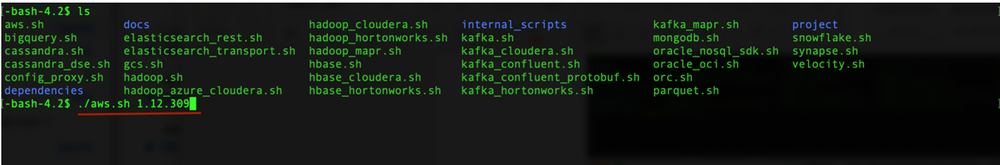
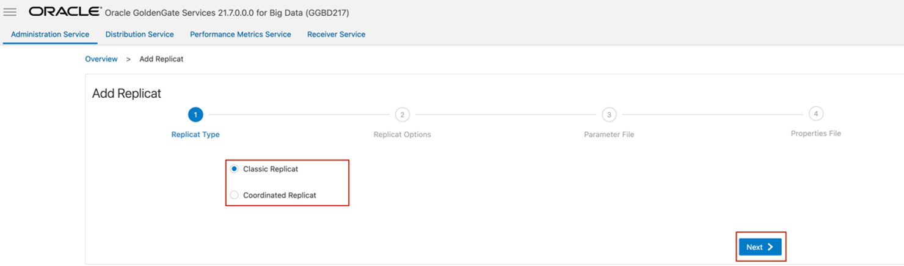
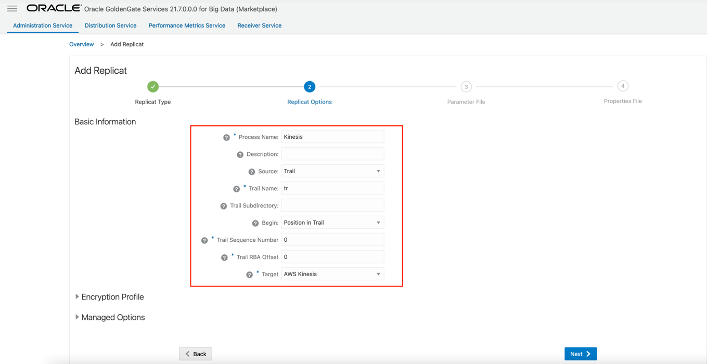
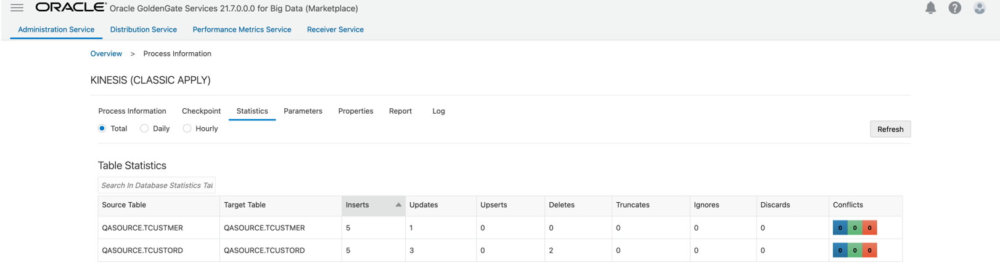

# How do I ingest Parquet files into  AWS Kinesis in real-time with Oracle GoldenGate for Big Data?
Duration: 5 minutes

It is assumed tha you’ve [installed GoldenGate for Big Data](https://docs.oracle.com/en/middleware/goldengate/big-data/21.1/gadbd/installing-oracle-goldengate-microservices-big-data.html#GUID-3145D2E1-C257-4C5D-A472-0EFAB31B6237) in your environment or from Oracle Cloud Infrastructure Market Place, and you've configured an [Extract](https://docs.oracle.com/en/middleware/goldengate/core/21.3/coredoc/extract-add-extract.html), which is up and running and trails are being sent to Oracle GoldenGate for Big Data Deployment. 

**Video Preview**

Get familiar with Oracle GoldenGate Microservices by watching this video: [Introduction to Oracle GoldenGate Microservices](youtube:aekcNiAYC7k)

## Install Dependency Files 

Oracle GoldenGate for Big Data uses client libraries in the replication process. You need to download these libraries by using the [Dependency Downloader utility](https://doc.oracle.com/en/middleware/goldengate/big-data/21.1/gadbd/dependency-downloader.html#GUID-6252EAFA-D76A-4A83-BB16-41BCCCC46194) available in Oracle GoldenGate for Big Data before setting up the replication process. Dependency downloader is a set of shell scripts that downloads dependency jar files from Maven and other repositories. 

Oracle GoldenGate for Big Data uses AWS Kinesis Java SDK to push data to Amazon Kinesis.
**Note**: Oracle GoldenGate for Big Data does not ship with the AWS Kinesis Java SDK. 

To install the required dependency files:

1. Go to installation location of Dependency Downloader: ```GG_HOME/opt/DependencyDownloader/```. 
2. Execute ```aws.sh``` with the required versions. 

    

The following directory is created in ```GG_HOME/opt/DependencyDownloader/dependencies```.  For example: ```/u01/app/ogg/opt/DependencyDownloader/dependencies/aws_sdk_1.12.30```
   
## Create a Replicat in Oracle GoldenGate for Big Data
To create a replicat in Oracle GoldenGate for Big Data:

1. In the Oracle GoldenGate for Big Data UI, in the **Administration Service** tab, click the **+** sign to add a replicat. 
    
    

2. Select the **Classic Replicat** Replicat Type and click **Next**.



3. Enter the basic information, and click **Next**:

    * **Process Name**: Name of the Replicat
    * **Trail Name**: Name of the required trail file
    * **Target**: Do not fill this field. 

    
    
4. Enter Parameter File details and click **Next**. In the Parameter File, you can either specify source to target mapping or leave it as is with a wildcard selection. 

    

5. Copy and paste the following property list into the properties file, update as needed, and click **Create and Run**.

    ```  
    <copy>
        # Properties file for Replicat Kinesis
        #Kinesis Streams Handler Template
        gg.handlerlist=kinesis
        gg.handler.kinesis.type=kinesis_streams
        gg.handler.kinesis.mode=op
        gg.handler.kinesis.format=json
        #TODO: Set the region name for the connection.
        gg.handler.kinesis.region=<name_of_aws_region>
        #TODO: Set the template to resolve the Kinesis stream name.
        gg.handler.kinesis.streamMappingTemplate=<kinesis_stream_name>
        #TODO: Set the template to resolve the message key
        gg.handler.kinesis.partitionMappingTemplate=${primaryKeys}
        #TODO: Set the access key and secret key credentials.  If unset it will fall back to the AWS default credentials provider chain.
        gg.handler.kinesis.accessKeyId=<access_ley>
        gg.handler.kinesis.secretKey=<secret>
        #TODO: Set the path to the AWS SDK. (refer to step 1 of this document)
        gg.classpath=/u01/app/ogg/opt/DependencyDownloader/dependencies/aws_sdk_1.12.30/*
        jvm.bootoptions=-Xmx512m -Xms32m  

    </copy>
    ```   
6. If replicat starts successfully, then the replicat is in running state. You can go to action/details/statistics to see the replication statistics: 
    

    

7. Go to the AWS console and check the bucket. 

    
    
**Note**: AWS Kinesis Event Handler can be configured for proxy server. For more information, see [Configuring the Proxy Server for Kinesis Streams Handler](https://docs.oracle.com/en/middleware/goldengate/big-data/21.1/gadbd/using-kinesis-handler.html#GUID-53289E28-F09A-4D51-83AE-B1A65963538E). 


## Learn More

* [Installing Oracle GoldenGate MA for Big Data Using the UI](https://docs.oracle.com/en/middleware/goldengate/big-data/21.1/gadbd/installing-oracle-goldengate-microservices-big-data.html#GUID-3145D2E1-C257-4C5D-A472-0EFAB31B6237)
* [Add Extracts in *Oracle GoldenGate Microservices Documentation*](https://docs.oracle.com/en/middleware/goldengate/core/21.3/coredoc/extract-add-extract.html)
* [AWS Kinesis performance considerations](https://docs.oracle.com/en/middleware/goldengate/big-data/21.1/gadbd/using-kinesis-handler.html#GUID-152F3692-ECBD-43F0-BD70-8B5E5448AA1A)
* [Kinesis Streams Input Limits](https://docs.oracle.com/en/middleware/goldengate/big-data/21.1/gadbd/using-kinesis-handler.html#GUID-3C114CC8-FC53-4935-8FE9-CD662EC0EDA4)
