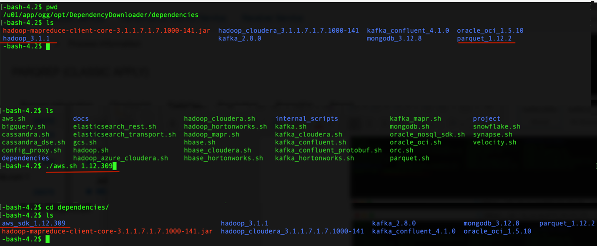

# How do I ingest Parquet files into AWS s3 buckets in real-time with Oracle GoldenGate for Big Data?
Duration: 5 minutes

It is assumed tha you’ve [installed GoldenGate for Big Data](https://docs.oracle.com/en/middleware/goldengate/big-data/21.1/gadbd/installing-oracle-goldengate-microservices-big-data.html#GUID-3145D2E1-C257-4C5D-A472-0EFAB31B6237) in your environment or from Oracle Cloud Infrastructure Market Place, and you've configured an [Extract](https://docs.oracle.com/en/middleware/goldengate/core/21.3/coredoc/extract-add-extract.html), which is up and running and trails are being sent to Oracle GoldenGate for Big Data Deployment. 

**Video Preview**

Get familiar with Oracle GoldenGate Microservices by watching this video: [Introduction to Oracle GoldenGate Microservices](youtube:aekcNiAYC7k)

## Install Dependency Files 

Oracle GoldenGate for Big Data uses client libraries in the replication process. You need to download these libraries by using the [Dependency Downloader utility](https://doc.oracle.com/en/middleware/goldengate/big-data/21.1/gadbd/dependency-downloader.html#GUID-6252EAFA-D76A-4A83-BB16-41BCCCC46194) available in Oracle GoldenGate for Big Data before setting up the replication process. Dependency downloader is a set of shell scripts that downloads dependency jar files from Maven and other repositories. 

Oracle GoldenGate for Big Data uses a 3-step process to ingest parquet into S3 buckets:
* Generating local files from trail files (these local files are not accessible in OCI GoldenGate)
* Converting local files to Parquet format
* Loading files into AWS S3 buckets

For generating local parquet files with Oracle GoldenGate for Big Data, replicat uses [File Writer Handler](https://docs.oracle.com/en/middleware/goldengate/big-data/21.1/gadbd/using-file-writer-handler.html#GUID-437D8DCD-62A2-416F-BAA3-E1826280DF51) and [Parquet Event Handler](https://docs.oracle.com/en/middleware/goldengate/big-data/21.1/gadbd/using-parquet-event-handler.html#GUID-5BE451BB-196E-4A9D-9F70-C0432851A322). To load the parquet files into AWS S3, Oracle GoldenGate for Big Data uses [S3 Event Handler](https://docs.oracle.com/en/middleware/goldengate/big-data/21.1/gadbd/using-s3-event-handler.html#GUID-9CEECD8E-9FBE-4E6C-B676-250406ECC811) in conjunction with File Writer and Parquet Event Handler.

Oracle GoldenGate for Big Data uses 3 different set of client libraries to create parquet files and loading into AWS S3. 

To install the required dependency files:
1. Go to installation location of Dependency Downloader: ```GG_HOME/opt/DependencyDownloader/```. 
2. Execute [```parquet.sh```](https://docs.oracle.com/en/middleware/goldengate/big-data/21.1/gadbd/using-parquet-event-handler.html#GUID-5BE451BB-196E-4A9D-9F70-C0432851A322), [```hadoop.sh```] (https://docs.oracle.com/en/middleware/goldengate/big-data/21.1/gadbd/Chunk1831335885.html#GUID-8F494242-8365-4569-9FAC-D2921DCFBC91), and ```aws.sh``` with the required versions. 

    

The following directories are created in ```GG_HOME/opt/DependencyDownloader/dependencies```:

   * ```/u01/app/ogg/opt/DependencyDownloader/dependencies/aws_sdk_1.12.309```
   * ```/u01/app/ogg/opt/DependencyDownloader/dependencies/hadoop_3.3.0```
   * ```/u01/app/ogg/opt/DependencyDownloader/dependencies/parquet_1.12.3```

    

## Create a Replicat in Oracle GoldenGate for Big Data
To create a replicat in Oracle GoldenGate for Big Data:

1. In the Oracle GoldenGate for Big Data UI, in the **Administration Service** tab, click the + sign to add a replicat. 
    
    

2. Select the Replicat Type and click **Next**.

There are two different Replicat types here: Classic and Coordinated. Classic Replicat is a single threaded process whereas Coordinated Replicat is a multithreaded one that applies transactions in parallel. 


3. Enter the basic information, and click **Next**:

    * **Process Name**: Name of the Replicat
    * **Trail Name**: Name of the required trail file
    * **Target**: Do not fill this field. 

    
    
4. Enter Parameter File details and click **Next**. In the Parameter File, you can either specify source to target mapping or leave it as is with a wildcard selection. If you select Coordinated Replicat as the Replicat Type, then provide the following additional parameter: ```TARGETDB LIBFILE libggjava.so SET property=<ggbd-deployment_home>/etc/conf/ogg/your_replicat_name.properties```

    

5. Copy and paste the following property list into the properties file, update as needed, and click **Create and Run**.

    ```  
    <copy>
        #The File Writer Handler – no need to change
    gg.handlerlist=filewriter
    gg.handler.filewriter.type=filewriter
    gg.handler.filewriter.mode=op
    gg.handler.filewriter.pathMappingTemplate=./dirout
    gg.handler.filewriter.stateFileDirectory=./dirsta
    gg.handler.filewriter.fileRollInterval=7m
    gg.handler.filewriter.inactivityRollInterval=30s
    gg.handler.filewriter.fileWriteActiveSuffix=.tmp
    gg.handler.filewriter.finalizeAction=delete

    ### Avro OCF – no need to change
    gg.handler.filewriter.format=avro_row_ocf
    gg.handler.filewriter.fileNameMappingTemplate=${groupName}_${fullyQualifiedTableName}_${currentTimestamp}.avro
    gg.handler.filewriter.format.pkUpdateHandling=delete-insert
    gg.handler.filewriter.format.metaColumnsTemplate=${optype},${position}
    gg.handler.filewriter.format.iso8601Format=false
    gg.handler.filewriter.partitionByTable=true
    gg.handler.filewriter.rollOnShutdown=true

    #The Parquet Event Handler – no need to change
    gg.handler.filewriter.eventHandler=parquet
    gg.eventhandler.parquet.type=parquet
    gg.eventhandler.parquet.pathMappingTemplate=./dirparquet
    gg.eventhandler.parquet.fileNameMappingTemplate=${groupName}_${fullyQualifiedTableName}_${currentTimestamp}.parquet
    gg.eventhandler.parquet.writeToHDFS=false
    gg.eventhandler.parquet.finalizeAction=delete

    #TODO Select S3 Event Handler – no need to change
    gg.eventhandler.parquet.eventHandler=s3

    #TODO Set S3 Event Handler- please update as needed
    gg.eventhandler.s3.type=s3
    gg.eventhandler.s3.region=your-aws-region
    gg.eventhandler.s3.bucketMappingTemplate=target s3 bucketname
    gg.eventhandler.s3.pathMappingTemplate=ogg/data/${fullyQualifiedTableName}
    gg.eventhandler.s3.accessKeyId=XXXXXXXXX
    gg.eventhandler.s3.secretKey=XXXXXXXX

    #TODO Set the classpath to the Parquet client libries and the Hadoop client with the path you noted in step1
    gg.classpath=
    jvm.bootoptions=-Xmx512m -Xms32m

    </copy>
    ```   
6. If replicat starts successfully, then the replicat is in running state. You can go to action/details/statistics to see the replication statistics: 
    

7. Go to the AWS S3 console and check the bucket. 

    
    
**Notes**:

* If target S3 bucket does not exist, then it will be auto created by Oracle GoldenGate for Big Data. Use [Template Keywords](https://docs.oracle.com/en/middleware/goldengate/big-data/21.1/gadbd/template-keywords.html#GUID-742BA6BE-D446-4E21-8E38-7105AC9F5E5E) to dynamically assign S3 bucket names.
* [S3 Event Handler](https://docs.oracle.com/en/middleware/goldengate/big-data/21.1/gadbd/using-s3-event-handler.html#GUID-9CEECD8E-9FBE-4E6C-B676-250406ECC811) can be configured for the Proxy server. For more information, see Using the S3 Event Handler.
* You can use different properties to control the behaviour of file writing. You can set file sizes, inactivity periods, and more. For more information, see the [GoldenGate for Big Data File Writer Handler Behaviour](https://blogs.oracle.com/dataintegration/post/goldengate-for-big-data-file-writer-handler-behaviour).
* For Kafka connection issues, see [Oracle Support](https://support.oracle.com/knowledge/Middleware/2644967_1.html). 


## Learn More

* [Installing Oracle GoldenGate MA for Big Data Using the UI](https://docs.oracle.com/en/middleware/goldengate/big-data/21.1/gadbd/installing-oracle-goldengate-microservices-big-data.html#GUID-3145D2E1-C257-4C5D-A472-0EFAB31B6237)
* [Add Extracts in *Oracle GoldenGate Microservices Documentation*](https://docs.oracle.com/en/middleware/goldengate/core/21.3/coredoc/extract-add-extract.html)
