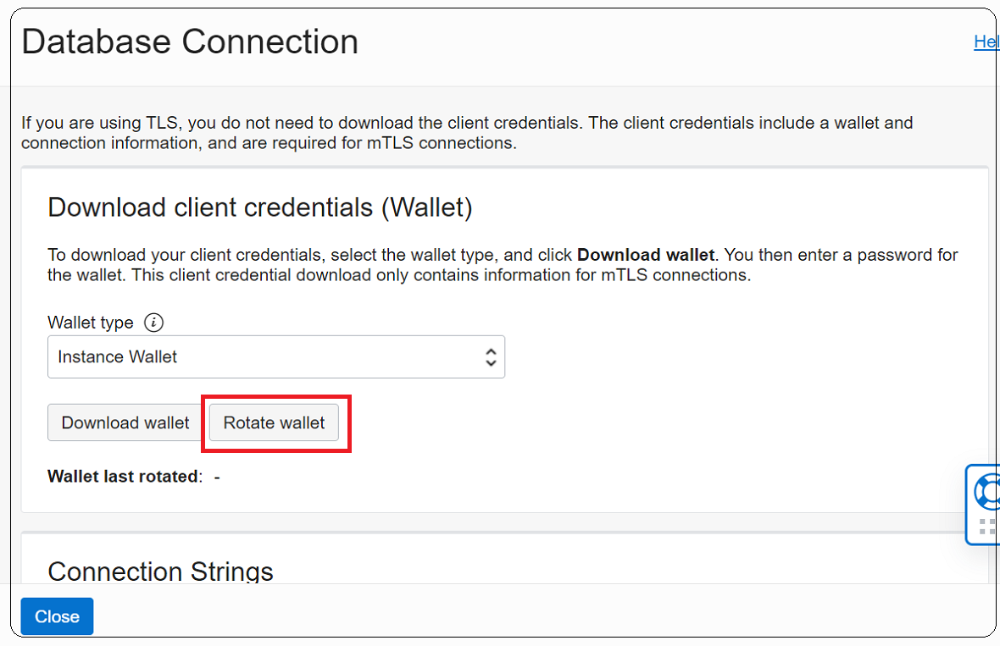

# How can I rotate a wallet in ADB?
Duration: 5 minutes

Wallet rotation lets you invalidate existing client certification keys for a database instance or for all Autonomous Database instances in a region.

You may want to rotate wallets for any of the following reasons:

  * If your organization's policies require regular client certification key rotation.
  * When a client certification key or a set of keys is suspected to be compromised.

## Steps to rotate your wallet
1. Open the navigation menu. Click **Oracle Database**. Under Autonomous Database, click Autonomous Data Warehouse, Autonomous JSON Database, or Autonomous Transaction Processing.
2. Choose your **Compartment**.
3. In the list of Autonomous Databases, click the display name of the database you want to administer. Click **DB Connection**.
4. On the Database Connection page select the Wallet Type:

    * Instance Wallet: Wallet rotation for a single database only; this provides a database-specific wallet rotation.
    * Regional Wallet: Wallet rotation for all Autonomous Databases for a given tenant and region.
5. Click **Rotate Wallet**. In the Rotate Wallet dialog, click **Rotate**.

The Database Connection page shows: **Rotation in Progress**. After the rotation completes, the **Wallet last rotated** field shows the last rotation date and time.

If you want to terminate all connections immediately after the wallet rotation completes, it is recommended that you stop and then start your instance. This provides the highest level of security for your database.

**Note:**

The guideline is you provide a database-specific instance wallet, with Wallet Type set to Instance Wallet when you use Download Wallet, to end users and for application use whenever possible. Regional wallets should only be used for administrative purposes that require potential access to all Autonomous Databases within a region.

## Learn More
