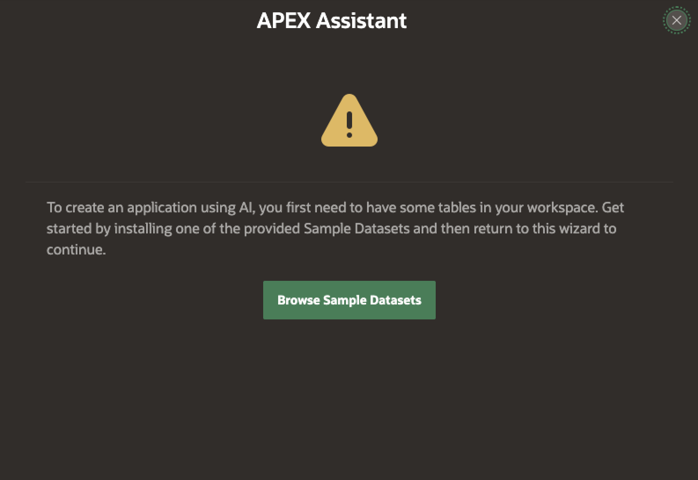
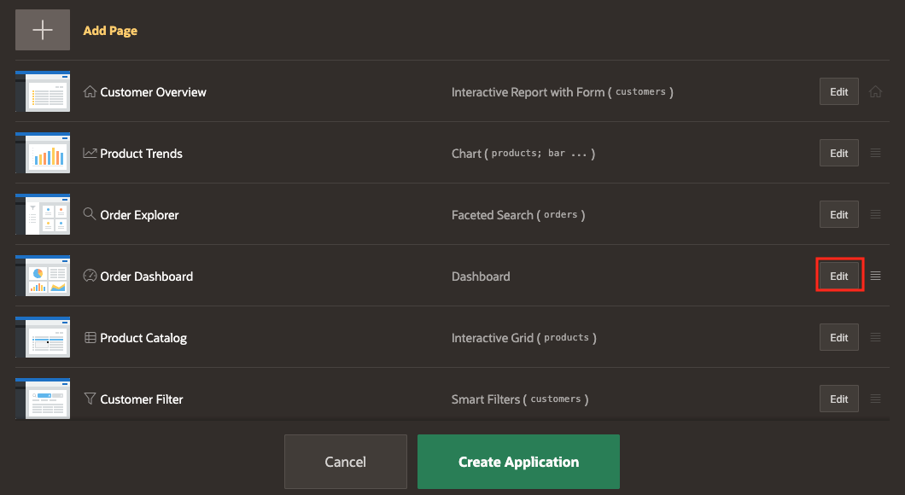
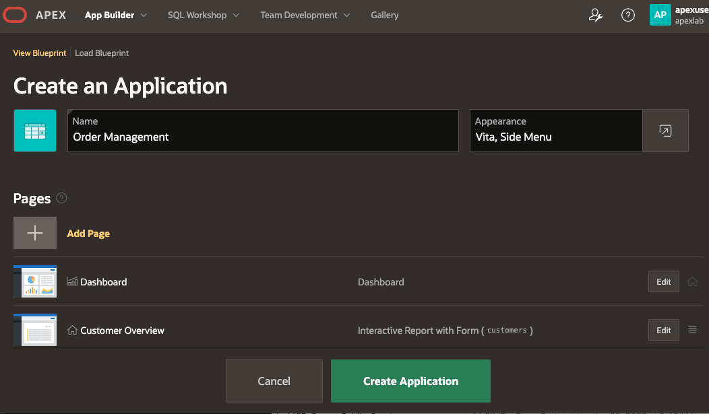
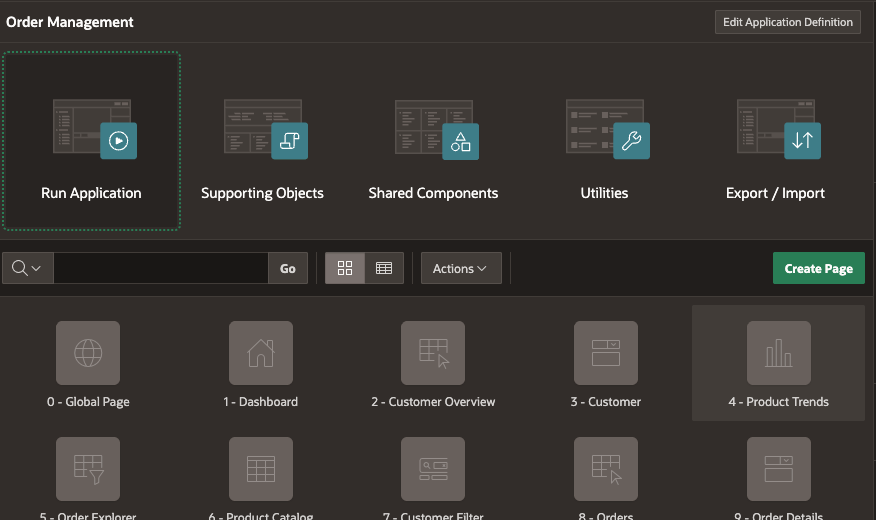
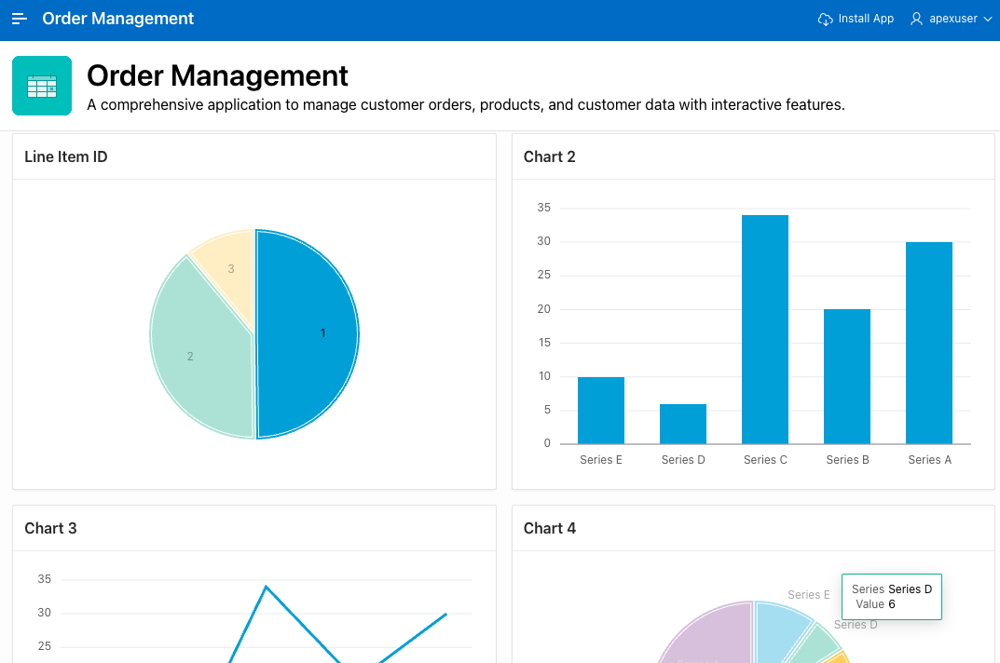

# Build an AI-Powered Application with Oracle APEX

Welcome to this **LiveLabs FastLab** workshop.

LiveLabs FastLab workshops give you clear, step-by-step instructions to help you quickly gain hands-on experience with Oracle technologies. You will go from beginner to confident user in a short time.

Estimated Time: 10 minutes

## FastLab Introduction

This workshop focuses on using the AI-powered assistant in Oracle APEX to generate an application from natural language. You will create an application foundation and iteratively refine it using conversational prompts.

You will turn a plain-English description into a working APEX application while staying within standard APEX patterns and security.

### Prerequisites

- An Oracle Autonomous Database with Oracle APEX enabled

  - Check our [LiveLabs FastLab - Create an Autonomous AI Database. Fast!](https://livelabs.oracle.com/pls/apex/dbpm/r/livelabs/view-workshop?wid=4276)

- An APEX workspace with sample data available  
  (for example, the WKSP_APEXLAB schema with customers, products, and orders data)

- A configured Generative AI service in APEX  
  (OCI Generative AI or OpenAI)

> *Note: If the APEX Assistant is not available, ensure Generative AI is configured for the workspace.*


[JSON](videohub:1_ic97k4pb)


## Task 1: Access Oracle APEX and Enter a Workspace

1. Open the Oracle Autonomous Database console
2. Scroll down and click the **APEX instance** link for your database
3. Click on Launch APEX

    
4. Sign in to an existing APEX workspace or create one if prompted

    

    

5. From the workspace home page, click **App Builder**

    

## Task 2: Start Application Creation with the APEX Assistant

The APEX Assistant uses existing tables and views to infer application structure

1. In App Builder, click **Create**

    

2. In the Create Application page, select **Create APP Using Generative AI**

    

3. Confirm that sample data is available in the workspace, if not select one to use.

    

    

## Task 3: Describe the Application Using Natural Language

Use a short natural-language prompt to describe the application.

1. Enter the following prompt:

   ```
   Create a modern, visually appealing application to manage customer orders.
   Include pages to browse customers, products, and orders.
   Use interactive, charts, and filters to make the app easy to use.
   ```

    

2. Review the proposed application blueprint and click **Create Application**

    

## Task 4: Create and Run the Application

The assistant generates a complete application based on the prompt and available data.

1. On the Create Application page, locate the Dashboard page and click **Edit**

    

2. In the Add Dashboard Page dialog, update the Page Name to Dashboard. Click Set Icon and select an icon of your choice.

    

3. Under **Advanced**, enable **Set as Home Page** and click **Save Changes**

    

4. Update the application name to **Order Management** and click on the app icon to select an Icon and color of your choice.

    

5. Click **Create Application**

    

6. When the application is created, click **Run Application**

    

7. Sign in using your APEX workspace credentials.

    

8. Explore the different pages and play around with the application.

    


## Signature Workshop

Ready to dive deeper? These workshops move you from demo to hands-on practice.

👉 Click here to [Start the Signature Workshop](https://livelabs.oracle.com/ords/r/dbpm/livelabs/run-workshop?p210_wid=4270&p210_wec=&session=112960780569583)

## Learn More

* [Oracle APEX Documentation](https://docs.oracle.com/en/database/oracle/apex/)
* [Coding with the AI-Powered APEX Assistant](https://blogs.oracle.com/apex/coding-with-the-ai-powered-apex-assistant-on-oracle-apex)
* [Oracle LiveLabs](https://livelabs.oracle.com)

## Acknowledgements

* **Author** – Ley Sylvester
* **Last Updated By/Date** – January 2026
