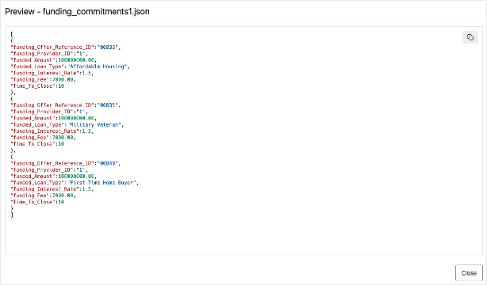

# 🔍 Discover and View your Database and Data Lake Assets from your Data Catalog

## Introduction

To build better loan products, the SeersEquities’ data team must pull insights from everywhere. This includes getting data from internal systems and external sources alike.  
But before they can analyze and transform that data into business value, they must first find it. In this lab, you’ll step into the role of the Data Engineer to help them get this task done.

You’ll use the Oracle Autonomous AI Lakehouse's Catalog Tool to **discover, connect to, and query data** that is stored in the database and in cloud object storage.  
The Autonomous AI Database Catalog allows you have a single view of your enterprise data across your data landscape, so that you can spend less time hunting for data and more time using it to power smarter decisions.

Estimated Time: 15 minutes

[Walkthrough video](videohub:1_vl8obrud:medium)

### Objectives

* **Discover and browse data assets** across Autonomous Database and cloud object storage using the Autonomous AI Databse Catalog Tool

* Set up **secure connections** to access and unify data from multiple sources

* Query and explore data from a unified catalog to support faster, insight-driven decisions

### Prerequisites

- An Oracle Autonomous AI Database

    - Check our [LiveLabs FastLab - Create an Autonomous AI Database. Fast!](https://livelabs.oracle.com/pls/apex/dbpm/r/livelabs/view-workshop?wid=4276)

## Task 1: Access Local Autonomous AI Database Catalog | Database Actions

1. Open the **Navigation Menu** by clicking the hamburger icon in the top-left corner.
    

2. Navigate to Autonomous AI Database Landing Page. Click on **Oracle AI Database**, then select **Autonomous AI Database**.
    

3. **Choose Compartment** where your database resides and **select your database from list** of Autonomous AI Databases displayed
    

4. On database details page select **Database Actions** button and click on **View all database actions**
    

    **This opens the Database Actions Launchpad**, ***where you can access the built-in web-based tools, including Data Studio.***
    

5. Click on **Data Studio**.  

      

6. Click on **Catalog** on left rail for the **Autonomous AI Database Catalog** to be displayed. You should now see a list of objects contained in your local database.  

      

7. You can adjust the objects displayed in the catalog by setting the desired schema scope. Select the **Local Catalog link** to select the Schemas you want to explore entities for.  

      

>***Congratulations !!!*** You’ve successfully accessed the Autonmous AI Database Catalog.  
With this foundation in place, you’re ready to explore data sets, connect to data sources, and start building data products that drive real insights.

## Task 2: Add Connections to Catalog for Object Storage Buckets  

🚀 Next, you’ll connect your catalog to a specific object storage bucket, so you can start exploring what’s inside of it. For this lab, we have staged lab files in a public bucket named **LOANAPP\_LAB\_FILES**.

1. On the left rail of the Database Actions page, select **Data Load**.  

    >For this lab, you can ignore the **No Credential and AI Profile Found** messaage if it is shown.  

      

2. Then select the **Connections** tile.  

      

3. On the connections page, create a connection to the **Object Storage** bucket called **LOANAPP\_LAB\_FILES**.  

    - On the Connections page, click **Create**
    - then choose **New Cloud Store Location**

      

4. On the **Add Cloud Store Location** page displayed:

    - For Name, enter: **LOANAPP\_LAB\_FILES**
    - For Description, enter: **Object Storage Bucket for Demo Lab Files**
    - For Credential, select **Public Bucket** radio button
    - For the Bucket URI, **copy and paste the following** into the field:  

         ```text
          <copy>
          https://objectstorage.us-ashburn-1.oraclecloud.com/p/28PT4JTaRQEBWvgsvP8oPsze-JeDausA3DOou-30P1JvcWmGaXpintYmFmDgLrTP/n/c4u04/b/LoanApp_Lab_Files/o/
          </copy>
          ```

      

  Click the **Create** button to proceed.

      

    ***Congratulations !!!*** You’ve just successfully added your own object storage connection to your Autonmous AI Database Catalog.  
    Now you can easily discover, track, and query data that resides in this location along with the data that resides in your database.  
    This step lays the foundation for building richer data products and speeding up access to the insights that matter.


## Task 3: Search for items discovered by your Catalog  

With your connections in place, it’s time to use the catalog to discover what is in our Object Storage bucket.  
In this exercise, you’ll work with the catalog filters to tailor the discovery dispaly view to show you only what you are interested in, so that you can quickly find the data that matters.

1. On the left rail, select **Catalog** to open the Catalog view page.  

      

2. On the Catalog page, Select the **Connections** quick filter.  

    - This view will show you the available connections in the catalog that are accessible to the connected schema. 
    - Confirm that **LOANAPP\_LAB\_FILES** appears in the list.

    >**Note**: The catalog quick filters are designed to help you quickly narrow down your search results to the data you need.  
    If you don’t choose a filter, the default filter of **Tables and Views** is selected.  
    You can also limit the results shown to the objects owned by to all schemas or just a selected set of schemas.

      

3. Select the **Data Objects** quick filter to view the cloud objects in the catalog visible to the connected schema, ensure that **Cloud Objects** in the filter section is selected so that you can see a list of the objects that are in the object storage bucket.

    

By searching the Catalog with filters and schema selections, you’ve learned how to quickly surface the data that matters. This step helps you cut through clutter and find the right assets faster, so that you can spend less time searching and more time building with your data.

## Task 4: Preview Data in Object Storage files from Catalog  

Now that we can see the files that are in the Object Storage bucket, lets dive deeper and take a peak at the actual data that's in the files right from the catalog.

1. Place you cursor over the link for the file named **funding_commitments1.json** and then Click on the preview icon.  

      

2. This displays the contents of the file being previewed without needing to first load it into the database.  

      

   Click **Close** to return to Data Catalog listings  


## Conclusion

***Congratulations***, you have successfully completed the FastLab on working with the Autonomous AI Lakehouse and its catalog tool! In this lab, you discovered how to connect data sources, browse it contents, and preview the data in the files on object storage directly from the Autonomous AI Database Catalog.  With these skills, you’ve built the foundation that SeersEquities needs to turn raw data into data products.

With these skills, you can now help the team evaluate new data faster, integrate it seamlessly, and drive smarter, real-time decisions that power better loan products and risk strategies. Visit our Signature Workshop to see more complex examples and learn even more skills.

## Signature Workshop

👉 Click here to [Start the Advanced AI Lakehouse Workshop](https://livelabs.oracle.com/ords/r/dbpm/livelabs/view-workshop?wid=3689)

This workshop contains labs that dive deeper into working with Oracle Autonomous AI Lakehouse.

## Learn more
* [Oracle Autonomous AI Lakehouse](https://www.oracle.com/autonomous-database/autonomous-ai-lakehouse/)
* [Use Lakehouse with Autonomous AI Database](https://docs.oracle.com/en/cloud/paas/autonomous-database/serverless/adbsb/autonomous-lakehouse.html)
* [Lakehouse Workload with Autonomous AI Database](https://docs.oracle.com/en/cloud/paas/autonomous-database/serverless/adbsb/appendix-autonomous-database-data-warehouse-workload.html#GUID-604A08F8-8021-43CE-AA95-823045E14BD8)
* [Oracle Autonomous AI Lakehouse - Data Lake Accelerator](https://blogs.oracle.com/datawarehousing/introducing-data-lake-accelerator)
## Acknowledgements

* **Authors** - Eddie Ambler, Linda Foinding, Database Product Management
* **Last Updated By/Date** - Linda Foinding, Database Product Management, January 2026
