# Discover Data Assets with the Autonomous AI Database Data Catalog

Welcome to this **LiveLabs FastLab** workshop.

LiveLabs FastLab workshops give you clear, step-by-step instructions to help you quickly gain hands-on experience with the Oracle AI Database. You will go from beginner to confident user in a short time.

Estimated Time: 15 minutes

## FastLab Introduction

### Prerequisites

- An Oracle Autonomous AI Database

    - Check our [LiveLabs FastLab - Create an Autonomous AI Database. Fast!](https://livelabs.oracle.com/pls/apex/dbpm/r/livelabs/view-workshop?wid=4276)

### Objectives
This workshop focuses on discovering and cataloging data assets in Oracle Autonomous AI Database. You will use the Catalog Tool to connect to cloud object storage and browse data across multiple sources from a single, unified view.

In this 15-minute FastLab, you'll help SeersEquities' data team find and preview loan data stored across databases and object storage. This lays the foundation for building better loan products.

### Prerequisites

- An Oracle Autonomous AI Database

    - Check our [LiveLabs FastLab - Create an Autonomous AI Database. Fast!](https://livelabs.oracle.com/pls/apex/dbpm/r/livelabs/view-workshop?wid=4276)

## Task 1: Access Local Data Catalog | Database Actions

Before SeersEquities can build better loan products, they need visibility into what data exists across their systems. The Catalog Tool provides a unified view of all data assets, including databases and cloud storage, so teams can find the right data without hunting through multiple systems.

1. Open the **Navigation Menu** by clicking the hamburger icon in the top-left corner.
    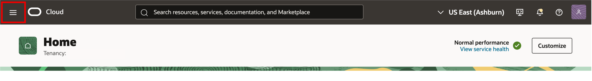

2. Navigate to Autonomous AI Database Landing Page. Click on **Oracle AI Database**, then select **Autonomous AI Database**.
    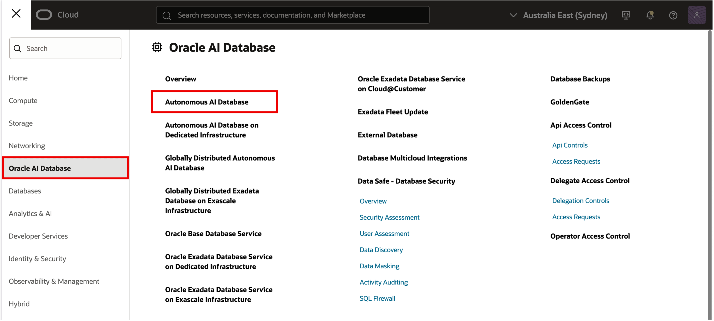

3. **Choose Compartment** where your database resides and **select your database from list** of Autonomous AI Databases displayed
    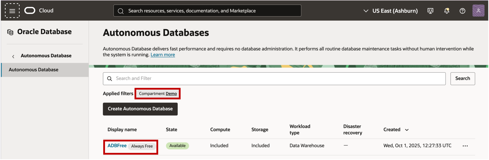

4. On database details page select **Database Actions** button and click on **View all database actions**
    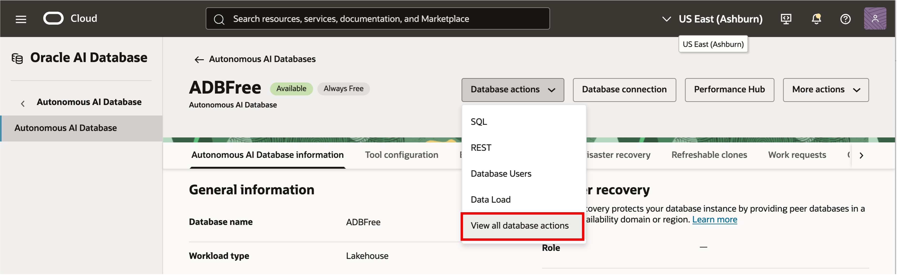

    This opens the Database Actions Launchpad, where you can access the built-in web-based tools, including Data Studio.

    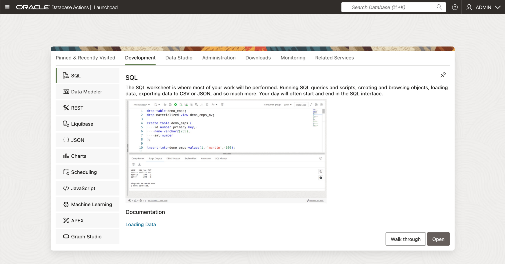

5. Click on **Data Studio**.  

      

6. Click on **Catalog** on left rail for the **ADB Catalog** to be displayed. You should now see a list of objects contained in your local database.  

      

You've now unlocked a unified view of your data, regardless of where it lives. With this foundation in place, you're ready to explore, connect, and start building data products that drive real insights.

## Task 2: Add Connections to Catalog for Object Storage Buckets & Data Shares

SeersEquities stores loan application files in cloud object storage. To access this data from your catalog, you need to create a connection. Once connected, the catalog can discover and display files alongside your database objects, giving you a complete view of available data assets.

1. On the left rail of the Database Actions page, select **Data Load**.  

      

2. Then select the **Connections** tile.  

      

3. On the connections page, create a connection to the **Object Storage** bucket called **LOANAPP\_LAB\_FILES**. On the Connections page, click **Create**, then choose **New Cloud Store Location**.

    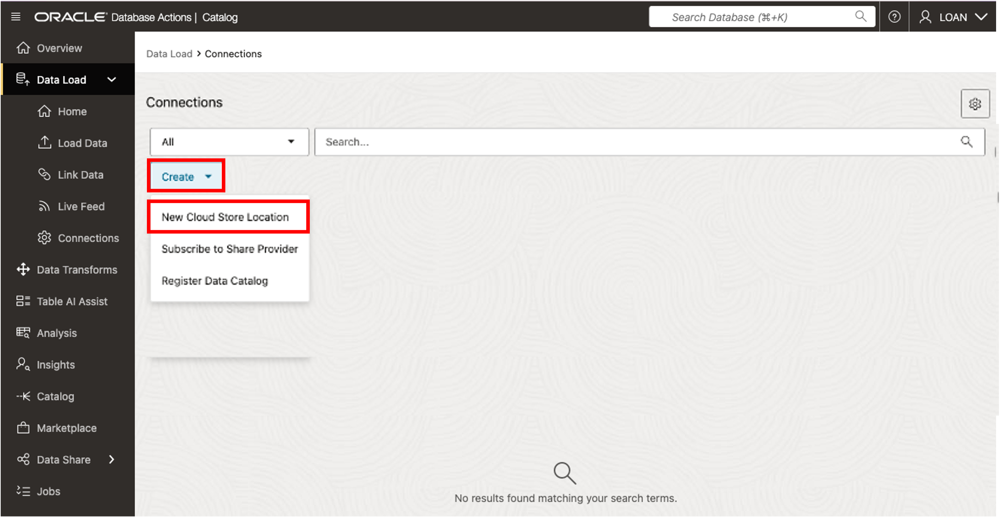  

4. On the **Add Cloud Store Location** page displayed:

    - For Name, enter: **LOANAPP\_LAB\_FILES**
    - For Description, enter: **My Demo Object Storage Bucket**
    - For Credential, select **Public Bucket** radio button
    - Choose the **Select Bucket** radio button
    - From the dropdown list choose the Bucket Named: **LOANAPP\_LAB\_FILES**

    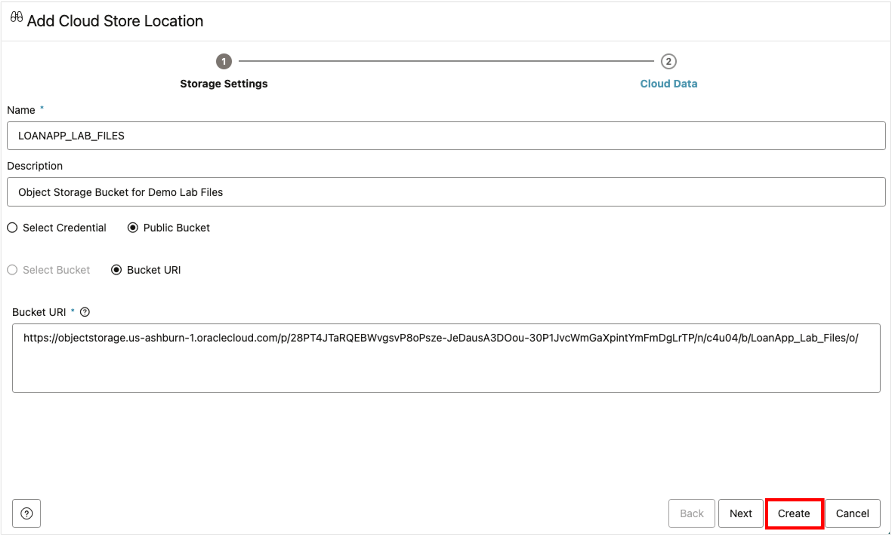  

  Click the **Create** button to proceed.

5. Verify the connection was created successfully.

    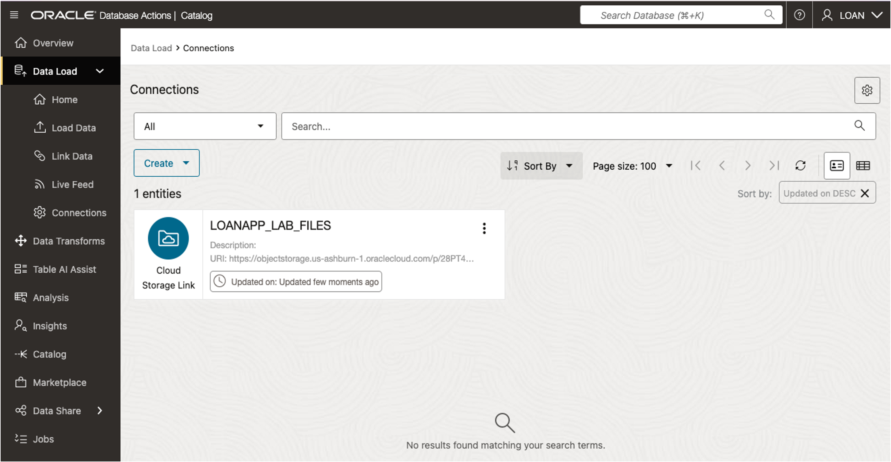

You've added your own object storage connection to the Catalog. You can now easily discover, track, and query external data alongside your database assets. This lays the foundation for building richer data products.  

## Task 3: Search for items discovered by your Catalog  

With your connections in place, it's time to search the catalog. You'll choose which schemas and entity types to display so you can quickly find the data that matters.

1. On the left rail, select **Catalog**.  

    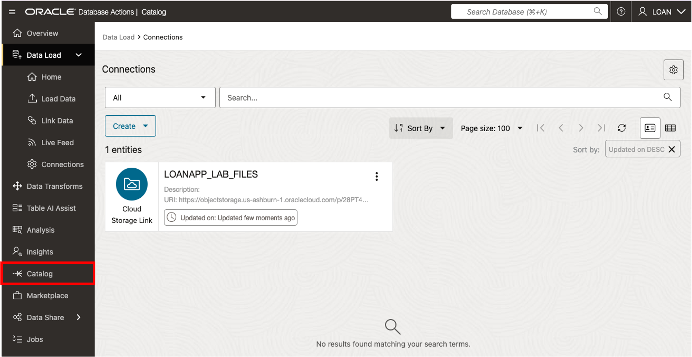  

2. Select the **Connections** quick filter. This shows available connections in the catalog accessible to the connected schema. Confirm that **LOANAPP\_LAB\_FILES** appears in the list.

    >**Note**: On the landing page, the catalog offers quick filters to narrow your search results. If you don’t choose one, it defaults to **Tables and Views**. You can also limit results to all schemas or just a selected one.

    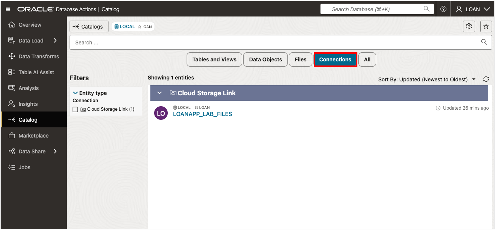  

3. Select the **Data Objects** quick filter to view items in the catalog visible to the connected schema, then, select **Cloud Objects** in the filter section to see a list of objects in our bucket.

    >**Note**: This view shows the database objects and object storage files available to you.

    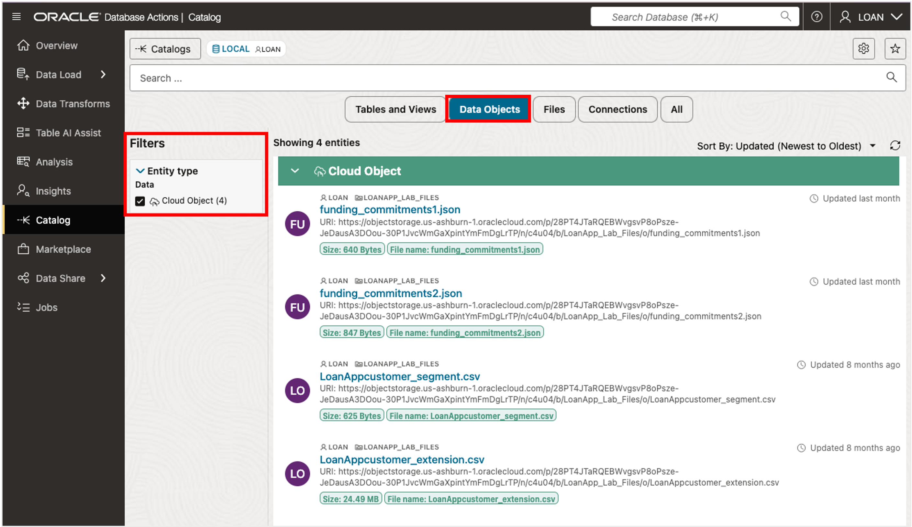

By searching the Catalog with filters and schema selections, you've learned how to quickly surface the data that matters. This step helps you cut through clutter and find the right assets faster, so you can spend less time searching and more time building with data.

## Task 4: Preview Data in Catalog

Before loading data into your pipeline, you need to validate its structure and quality. The preview feature lets you inspect file contents directly from the catalog without loading them first, so you can quickly assess if the data meets your needs.

1. Click the preview icon for the file named **LoanAppCustomer_segment.csv**.  

    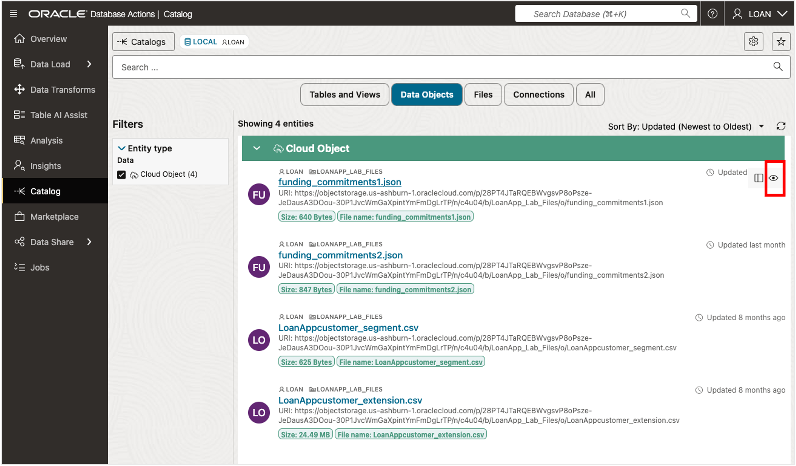  

2. This displays the contents of the file being previewed without needing to first load it into the database.  

      

   Click **Close** to return to Data Catalog listings  

## Summary

Congratulations! You have successfully completed this FastLab on discovering and cataloging data with Autonomous AI Lakehouse. You learned how to connect, browse, and preview data across your database and object storage, all from a single, unified catalog.

You've built the foundation SeersEquities needs to turn scattered data into data products. With these skills, the team can evaluate new data faster, integrate it seamlessly, and drive smarter decisions that power better loan products and risk strategies.

## Signature Workshop

👉 Click here to [Start the Advanced AI Lakehouse Workshop](https://livelabs.oracle.com/ords/r/dbpm/livelabs/view-workshop?wid=3689)

This workshop contains labs that dive deeper into working with Oracle Autonomous AI Lakehouse.

## Learn more
* [Oracle Autonomous AI Lakehouse](https://www.oracle.com/autonomous-database/autonomous-ai-lakehouse/)
* [Use Lakehouse with Autonomous AI Database](https://docs.oracle.com/en/cloud/paas/autonomous-database/serverless/adbsb/autonomous-lakehouse.html)
* [Lakehouse Workload with Autonomous AI Database](https://docs.oracle.com/en/cloud/paas/autonomous-database/serverless/adbsb/appendix-autonomous-database-data-warehouse-workload.html#GUID-604A08F8-8021-43CE-AA95-823045E14BD8)
* [Oracle Autonomous AI Lakehouse - Data Lake Accelerator](https://blogs.oracle.com/datawarehousing/introducing-data-lake-accelerator)
## Acknowledgements

* **Authors** - Eddie Ambler, Linda Foinding, Database Product Management
* **Last Updated By/Date** - Linda Foinding, Database Product Management, January 2026
