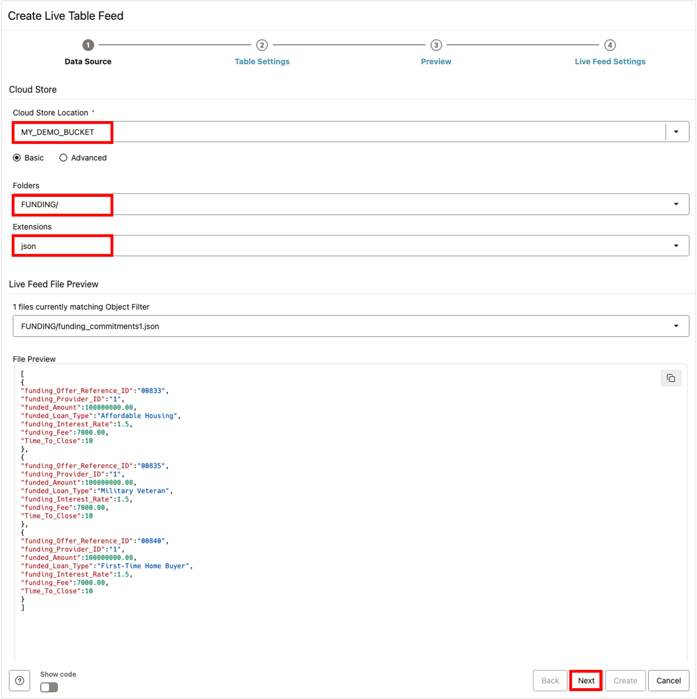
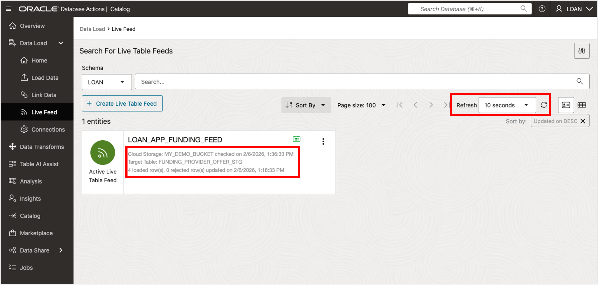

# Build a Live Feed Data Pipeline

Welcome to this **LiveLabs FastLab** workshop.

LiveLabs FastLab workshops give you clear, step-by-step instructions to help you quickly gain hands-on experience with the Oracle AI Database. You will go from beginner to confident user in a short time.

Estimated Time: 15 minutes

## FastLab Introduction

This workshop focuses on building automated data pipelines using Oracle's Live Feed feature. You will create a Live Feed that monitors an object storage bucket and automatically loads new files into your database as they arrive.

SeersEquities partners with multiple funding providers who submit loan commitment data throughout the day. Rather than waiting for batch loads, the risk team needs this data flowing into their systems continuously. In this FastLab, you'll build a Live Feed pipeline that ingests funding data automatically.

### Prerequisites

- An Oracle Autonomous AI Database

    - Check our [LiveLabs FastLab - Create an Autonomous AI Database. Fast!](https://livelabs.oracle.com/pls/apex/dbpm/r/livelabs/view-workshop?wid=4276)

- Completed FastLab 1 (Tasks 1 and 2) which creates the **Cloud Store Location named LOANAPP\_LAB\_FILES**

## Task 1: Prepare to Build a Live Feed Data Pipeline

To build an automated data pipeline, you first need a destination for incoming files. SeersEquities receives loan funding commitments from multiple providers. Each file lands in object storage before being processed. Here, you'll create a private bucket with a structured folder to stage this data.

1. Create a Private Oracle Object Storage Bucket called **MY\_DEMO\_BUCKET** with a directory called **FUNDING** to store your data.
  
  2. Navigate back to the Oracle Cloud Console. 

  3. Open the **Navigation** menu in the Oracle Cloud console and click **Storage**. Under **Object Storage & Archive Storage**, click **Buckets**.
  
  4. On the **Buckets** page, select the compartment where you want to create the bucket from the **Compartment** drop-down list in the **List Scope** section. Make sure you are in the region where you want to create your bucket.
  
  5. Click **Create Bucket**.
  
  6. In the **Create Bucket** panel, specify the following:
      - **Bucket Name:** Enter **MY\_DEMO\_BUCKET**.
      - **Default Storage Tier:** Accept the default **Standard** storage tier. Use this tier for storing frequently accessed data that requires fast and immediate access. For infrequent access, choose the **Archive** storage tier.
      - **Encryption:** Accept the default **Encrypt using Oracle managed keys**.
  
      >**Note:** Bucket names must be unique per tenancy and region.
  
  7. Click **Create** to create the bucket.
  
    
  
  8. The new bucket is displayed on the **Buckets** page. The default bucket type (visibility) is **Private**.
  
    

  
## Task 2: Move Data from Staged Lab Files Bucket to Live Feed Folder

This step simulates incoming loan funding data from SeersEquities' providers. In production, funding commitment files would arrive automatically from external systems. Here, you'll manually copy a sample file to your bucket to prepare for Live Feed configuration.

1. Download the **funding_commitments1.json** file from LOANAPP\_LAB\_FILES.

  2. Upload the **funding_commitments1.json** file to the FUNDING folder under MY\_DEMO\_BUCKET

  3.	Validate files are visible in MY\_DEMO\_BUCKET.

    * Click the **Actions** icon in the **LOANAPP\_LAB\_FILES** panel, then select **Objects** from the context menu.

    

  4.	Expand the **FUNDING** folder icon to confirm that the **funding\_commitments1.json** file from the **LOANAPP\_FUNDING** bucket has been successfully copied here.

    

    * Click **Close** to exit.

You have now successfully staged data in object storage for your Live Feed pipeline.

## Task 3: Build Initial Live Feed Table

Live Feed is Oracle's solution for continuously loading data that arrives in object storage. Instead of manually running load jobs, Live Feed monitors your bucket and automatically loads new files into the database. For SeersEquities, this means funding commitment data flows into their systems in near real-time without manual intervention.

1. From the **Data Load | Oracle Database** tab, navigate to Live Feed.

    * On Left rail expand **Data Load**, then click on **Live Feed**.

    

      >You should now see the Live Feed Page

2.  Click the **Create Live Table Feed** button to enter the Create Live Feed wizard

    

3. Enter details for the Live Table Feed Preview.

     * Select Cloud Store Location: **My\_Demo\_Bucket**
     * Select Radial Box: **Basic**
     * For Folders Select: **FUNDING**
     * For Extensions Select: json

      

     >Note: that you should now see the funding commitments file matching the object filter and a preview of its content.

     * Click the **Next** button to proceed.

4. Configure Live Feed Table Settings as follows:

     * **For Option**: Choose **Merge Into Table** from drop-down list

     * **For Target Table Name**: Enter **FUNDING\_PROVIDER\_OFFER\_STG**

     * Then modify **Mapping** details exactly as shown below:
        * **Update Data Type** to NUMBER for: FUNDING\_PROVIDER\_ID and FUNDING\_OFFER\_REFERENCE\_ID
        * **For Merge Key**: Select FUNDING\_PROVIDER\_ID and FUNDING\_OFFER\_REFERENCE\_ID
        * **Unselect last row**: Inclusion of SYSTIMESTAMP Source

      

     * Click the **Next** button to proceed.

5. Review the information shown on the Preview page.

      

      * Click **Next** to proceed.

6. Enter remaining details for the **Live Table Feed**:

      - Enter live feed name: **LOANAPP\_FUNDING\_FEED**
      - Check the box to **Enable for Scheduling**
      - Select every **2 minutes** for the polling time interval

      

      * Click **Create**

7. When the popup box appears, select **Yes** to run the Live Feed.

      

8. Review Live Feed Table and set page Refresh Interval

      * **You should see 3 rows loaded**
      * **Set page refresh interval to 10 seconds** to see when new data is loaded

      

You have successfully created your Live Feed table. It will now automatically poll for new files every 2 minutes.

## Task 4: Test Live Feed Table Data Population

Now you'll test the automation by adding a second funding file. This simulates real-world operation where new data arrives continuously. When the Live Feed detects the new file, it automatically loads the contents, demonstrating the hands-free data pipeline you've built.

1. Download the **funding_commitments2.json** file from LOANAPP\_LAB\_FILES.

2. Upload the **funding_commitments2.json** file to the FUNDING folder under MY\_DEMO\_BUCKET.

3. Navigate to the **Data Load | Oracle Database** tab.

     * Review the details for the Live Table Feed. **Here we see that 4 new rows were loaded.**

     >**Note**: It may take up to 2 minutes to display the new data, as you configured a 2-minute polling schedule for your Live Feed process.

     

4. Open SQL worksheet and query the staging table called **FUNDING\_PROVIDER\_OFFER\_STG**.

Your Live Feed has automatically detected and loaded the new file. This demonstrates how Oracle automates data ingestion from object storage into your database.

## Summary

Congratulations! You have successfully completed this FastLab on building data pipelines with Autonomous AI Lakehouse. You created a Live Feed that automatically monitors object storage and loads new funding commitment data into your database without manual intervention.

For SeersEquities, this means the risk team can access loan funding data in near real-time as it arrives from providers. Automated pipelines like this ensure faster risk analysis, smarter decisions, and tighter collaboration across the business.

Oracle Autonomous AI Lakehouse makes it easy to build governed, AI-ready data pipelines that unlock the value of your data.

## Signature Workshop

👉 Click here to [Start the Advanced AI Lakehouse Workshop](https://livelabs.oracle.com/ords/r/dbpm/livelabs/view-workshop?wid=3689)

This workshop contains labs that dive deeper into working with Oracle Autonomous AI Lakehouse.

## Learn more
* [Oracle Autonomous AI Lakehouse](https://www.oracle.com/autonomous-database/autonomous-ai-lakehouse/)
* [Use Lakehouse with Autonomous AI Database](https://docs.oracle.com/en/cloud/paas/autonomous-database/serverless/adbsb/autonomous-lakehouse.html)
* [Lakehouse Workload with Autonomous AI Database](https://docs.oracle.com/en/cloud/paas/autonomous-database/serverless/adbsb/appendix-autonomous-database-data-warehouse-workload.html#GUID-604A08F8-8021-43CE-AA95-823045E14BD8)
* [Oracle Autonomous AI Lakehouse - Data Lake Accelerator](https://blogs.oracle.com/datawarehousing/introducing-data-lake-accelerator)
## Acknowledgements

* **Authors** - Eddie Ambler, Linda Foinding, Database Product Management
* **Last Updated By/Date** - Linda Foinding, Database Product Management, January 2026
