# 🏗️ Build a Live Feed Data Pipeline: Load and Transform Data

## Introduction

In this lab, you’ll practice setting up the live feed capabilities, that can be used to load data that is continuously collected into cloud object storage. <br>
When a load job is enabled for live feed, it can be a scheduled job or connected to the OCI event notification and subscription mechanism, so that every time a new object is created in the object store bucket, it triggers the live feed, that can then transform & load the content into the database.  

In this lab we will help our Seer Equities loan officers to keep a fresh supply of loan products by building an automated data pipeline that takes in loan funding commitment files from investors in JSON format and transforms and loads the data into a staging table in the database, where a nightly job will run to convert the new funding into Loan Products that the loan officers can sell.

Estimated Lab Time: 15 minutes

[Walkthrough video](videohub:1_ijcbblxm:medium)

### Objectives

Leverage Autonomous AI Lakehouse Data Studio Tools to Build a Live Feed Data Pipeline
 * Configure Object Storage location for Data Pipeline interaction
 * Create a Live Feed table in Autonomous Database
 * Simulate how new data loaded into object storage triggers Live Feed automation

### Prerequisites

  This lab assumes you have:
  * **Completed Lab 1 --> Task 1 and 2** which creates the catalog connection to the public object storage bucket named **LOANAPP\_LAB\_FILES**

## Task 1: Prepare to Build a Live Feed Data Pipeline: 

  1. Let's start by creating a Private Oracle Object Storage Bucket called **MY\_DEMO\_BUCKET** with a directory called **FUNDING** to store your data.
  
  2. Navigate back to the Oracle Cloud Console at ***cloud.oracle.com***

  3. Open the **Navigation Menu** by clicking the hamburger icon in the top-left corner of the Oracle Cloud console 
  
    - Then click on **Storage** link
    - Then click on **Buckets** link, Under **Object Storage & Archive Storage**

    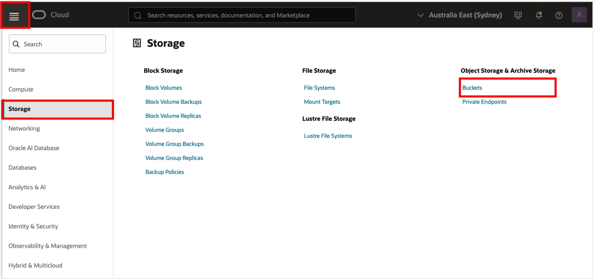
  
  4. On the **Buckets** page, select the compartment where you want to create the bucket and ensure that you are in the region where you want to create your bucket.

    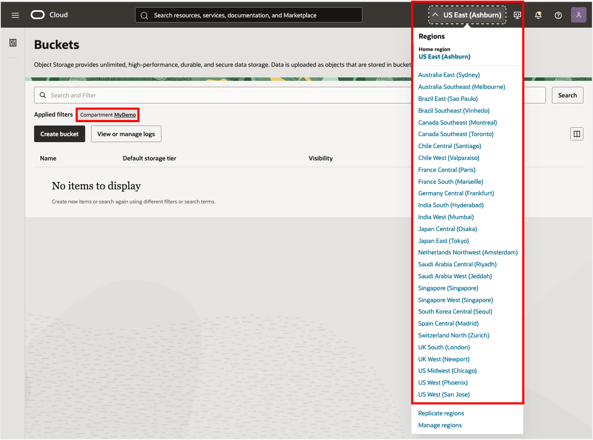
  
  5. Click on **Create Bucket** to proceed.
  
  6. On the **Create Bucket** page, specify the following:
      - For **Bucket Name:** Enter **MY\_DEMO\_BUCKET**.
      - For **Default Storage Tier:** Accept the default value of **Standard**. 
      - For **Encryption:** Accept the default value of **Encrypt using Oracle managed keys**.
  
      >**Note:** Bucket names must be unique per tenancy and region.

      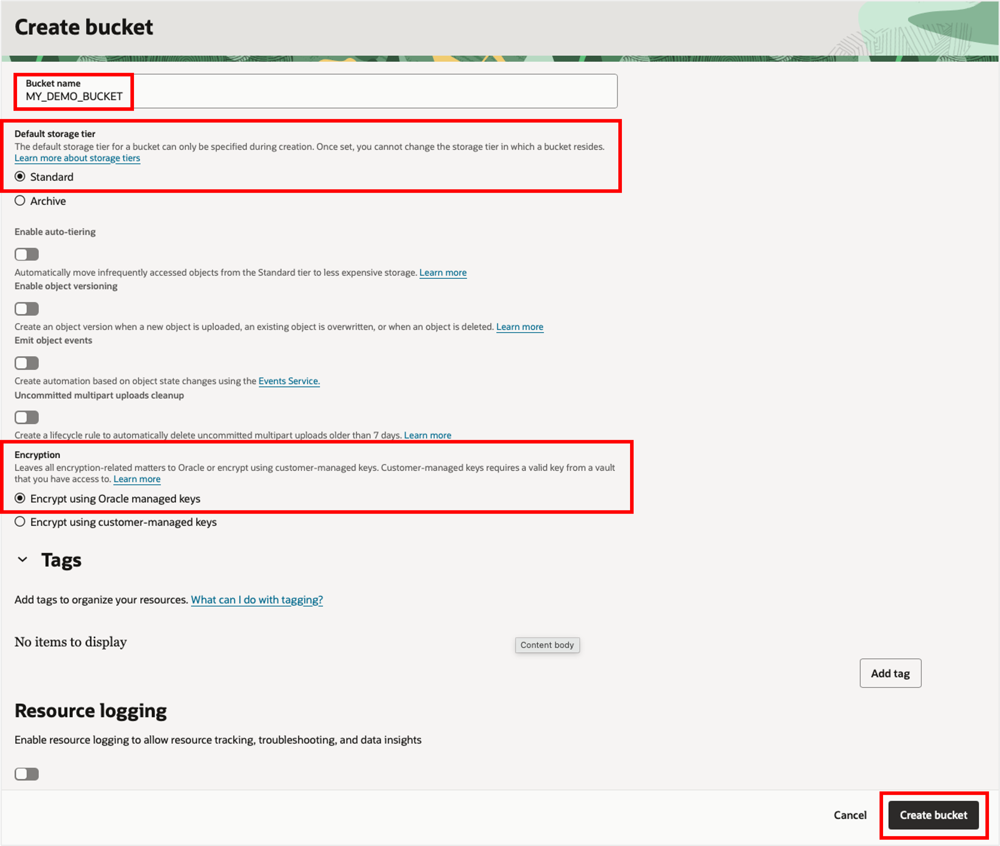
  
      - Click on **Create** button to proceed with creating the object storage bucket.
  
  7. The new bucket will now be displayed on your **Buckets** page. Note that the default bucket visibility type is **Private**.
  
      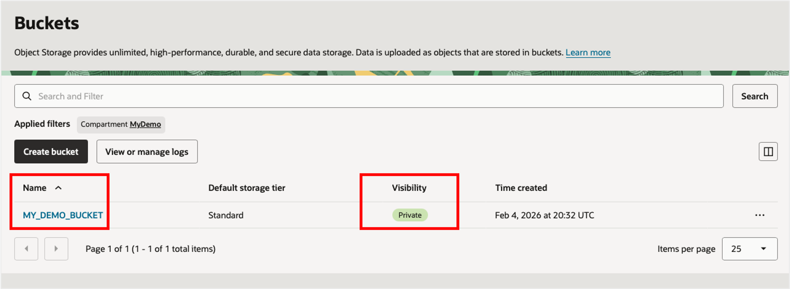

  8. Update the bucket visibility to Public

      -Click on **Actions Icon**  on far right of row with your bucket name
      -Then select **Edit Visibility**

      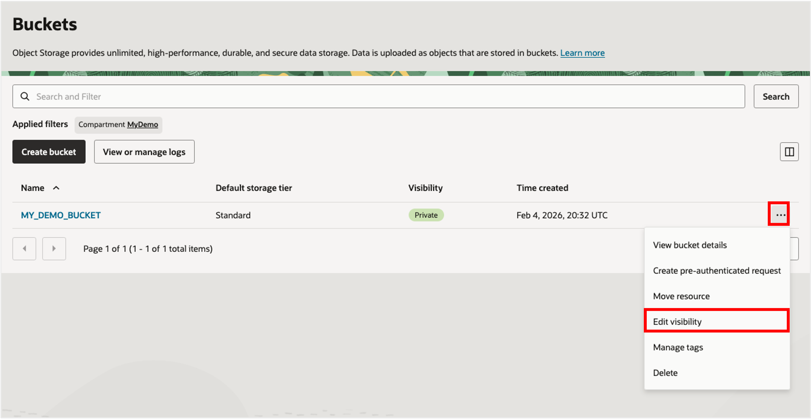

      -Select **Public** Radial Button and Click on **Update** Button

      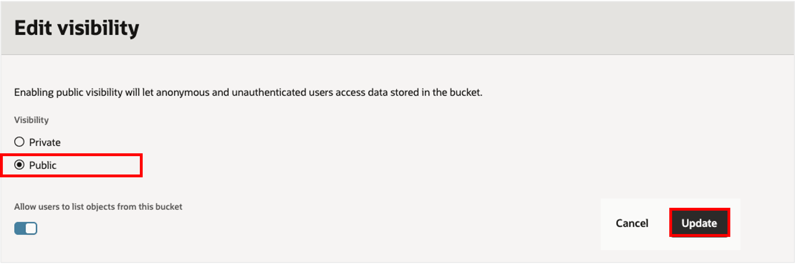

  ***Congratulations !!!*** You have succesfully created your object storage bucket and are now ready to use it for your automated data pipeline.

  ***Leave this tab open*** you will return to it in Task 2 --> Setp 3

  
## Task 2: Move data from staged lab files bucket to Live Feed folder

  1. ***Return to Database Actions Tab*** so that you download the **funding\_commitments1.json** and **funding\_commitments2.json** lab files from the **LOANAPP\_LAB\_FILES** bucket.

    - If you stil have your tab open from Lab 1, then  **proceed to step 2**
    - If you closed the tab, no worries: **Do the following to open Database Actions**

  2. Access the **funding\_commitments1.json** lab file from the **LOANAPP\_LAB\_FILES** bucket

      - Click on link for the **funding_commitments1.json** file

      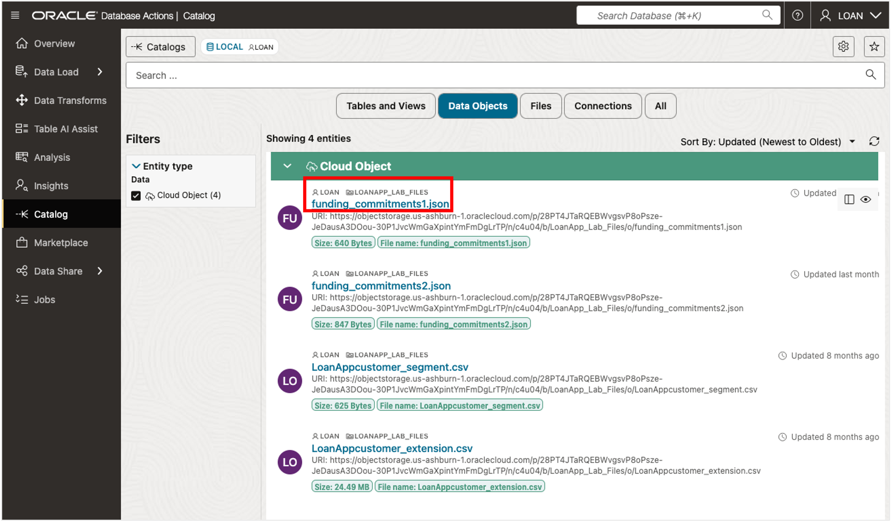

  3. Download the **funding\_commitments1.json** lab  file from the **LOANAPP\_LAB\_FILES** bucket.

    - Select **Download** option under the **Actions** dropdown-list

    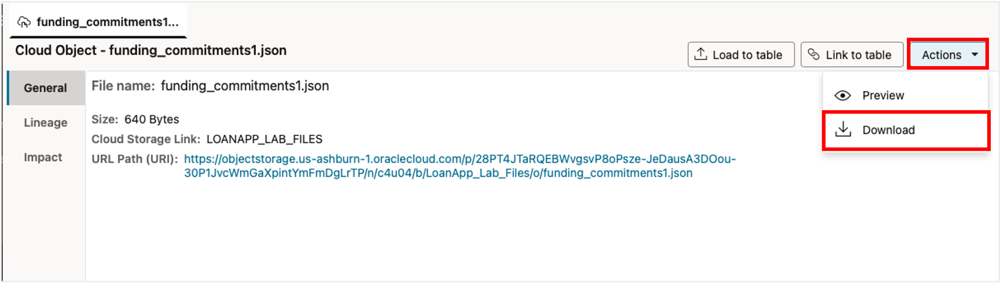

    - **Save the file** to your local computer

      >If your browser does not show you the save button - just copy the content and manually save the data to a file named **funding_commitments1.json**

    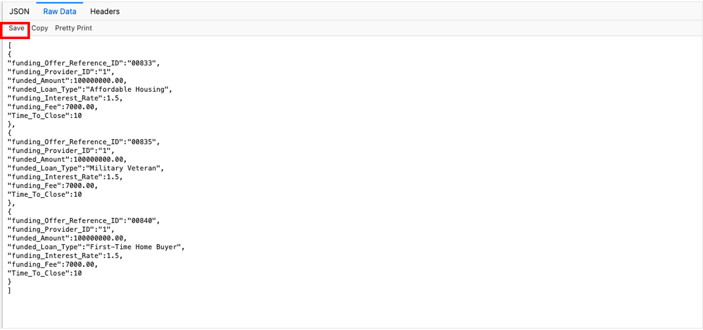
    
    - **Click on Close** button to proceed

  4. Now download and save the **funding\_commitments2.json** lab  file from the **LOANAPP\_LAB\_FILES** bucket.

      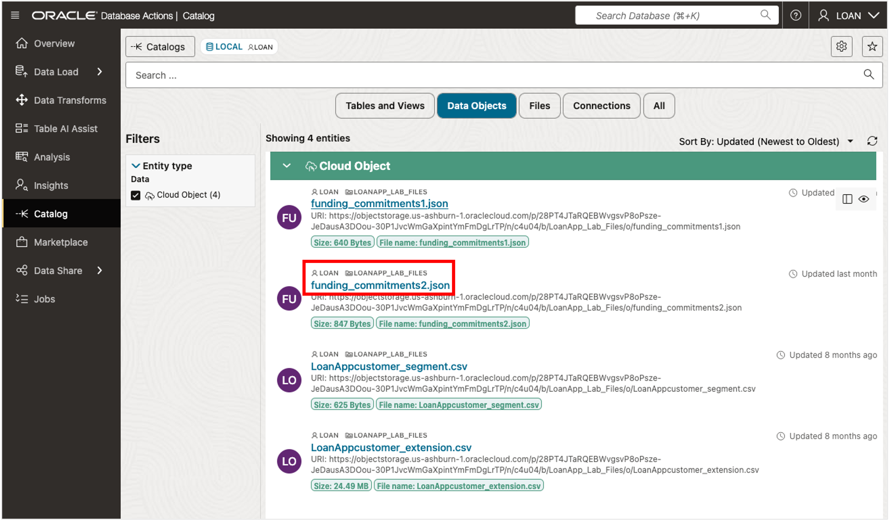

  5. Simulate an Investor submitting loan funding capital by uploading the **funding_commitments1.json** file to the FUNDING folder under MY\_DEMO\_BUCKET. **Note** that this file has 3 rows.

    -***Switch back to Buckets Tab*** from Task 1 and  click on **MY\_DEMO\_BUCKET**

    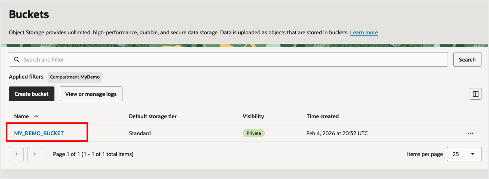

    -Click on **Upload Objects** button

    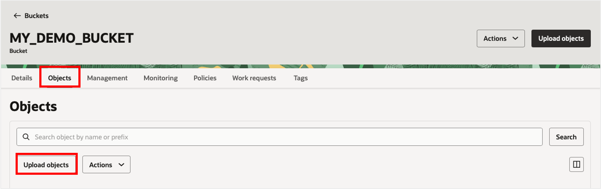

    -Upload **funding_commitments1.json** file into **FUNDING** Folder  
      * For **Object Name Prefix** enter **FUNDING/**. This will create the FUNDING folder in our bucket.  
      * For **Choose Files from your Computer** select the **funding_commitments1.json** file you downloaded.  
      * Select **Next** button to proceed

    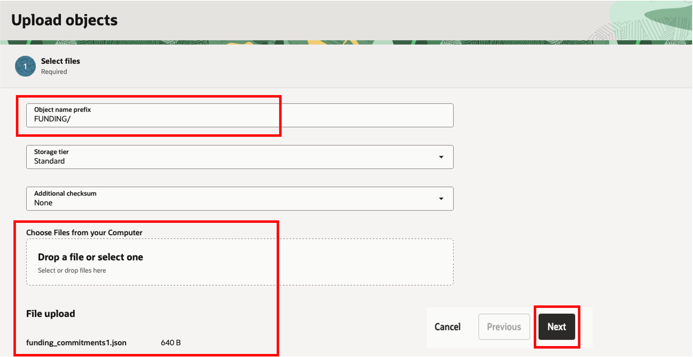

    -Click on **Upload Objects** button

    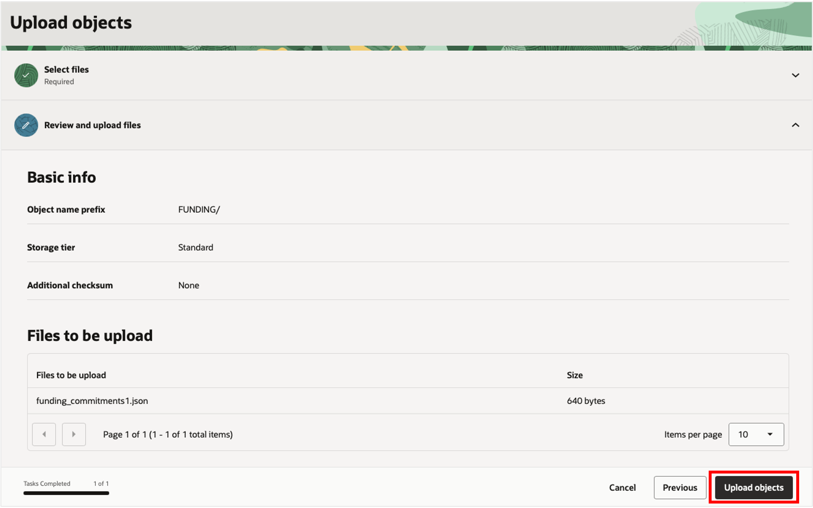

    -Click on **Close** button to return to **Buckets** page

  6.	**On the Buckets page**, validate that the **funding_commitments1.json** file is visible in **MY\_DEMO\_BUCKET**.

    * Click the **Actions** icon on the **FUNDING** row, then select **Open Folder** from the list of options.

    

    * confirm that the **funding\_commitments1.json** file has been successfully copied here.

    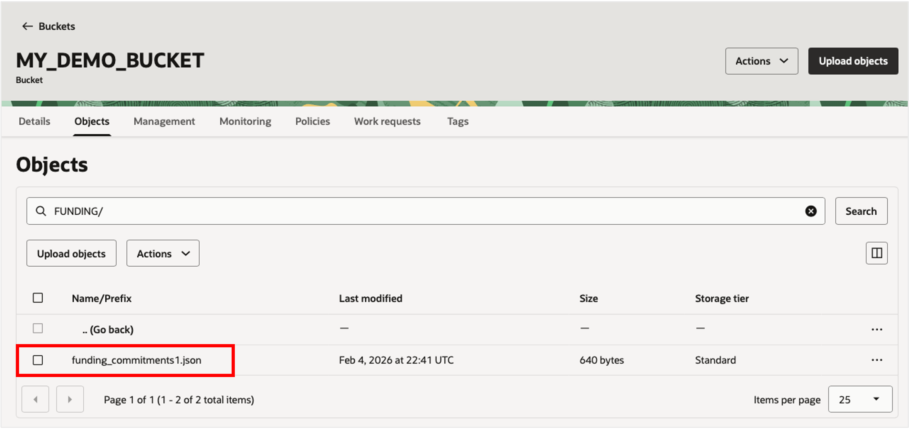


  ***Congratulations!*** You have now successfully loaded data into your cloud object storage bucket that we will use to build our data pipeleine.
  
    >***Note:*** The data movement between object storage buckets could have been done using several methods such as using API calls or PL/SQL.  Visit the Signature LiveLabs to see these methods in action.

## Task 3: Register Cloud Store Location for Data Pipeline Process

1. ***Switch back to the Data Load | Catalog*** tab - and **Navigate to Connections** screen

  -Click on **Data Load** then **Home**

    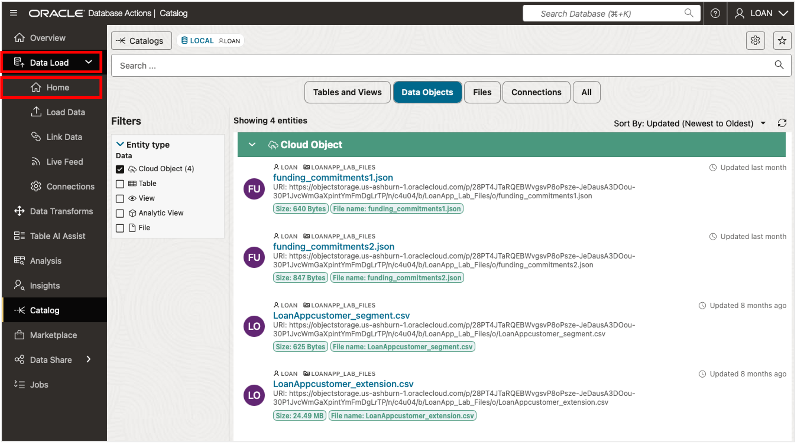

  -Click on the **Connections** Tile

    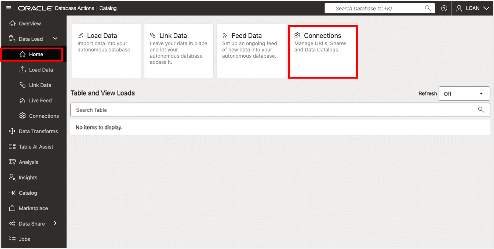

2. Create **MY\_DEMO\_BUCKET** as a **New Cloud Store Location**

    -Click on **Create** and then select **New Cloud Store Location**

    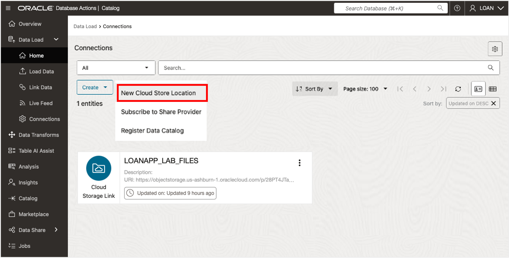

3. Enter Cloud Store Location Details

    -For **Name** Enter: **MY\_DEMO\_BUCKET**  
    -For **Description** Enter: **Object Storage Location for Demo Lab Files**  
    -Select **Public Bucket** Radial Button  
    -For **Bucket URI** Enter: Select **https://objectstorage.<region>://<namespace>/b/MY\_DEMO\_BUCKET/o** 

      >***For the Bucket URI*** Replace the **REGION** and **NAMESPACE** with values from your environment.  
      On the Buckets page, you can click on your Bucket Name to see what NAMESPACE it is in.

    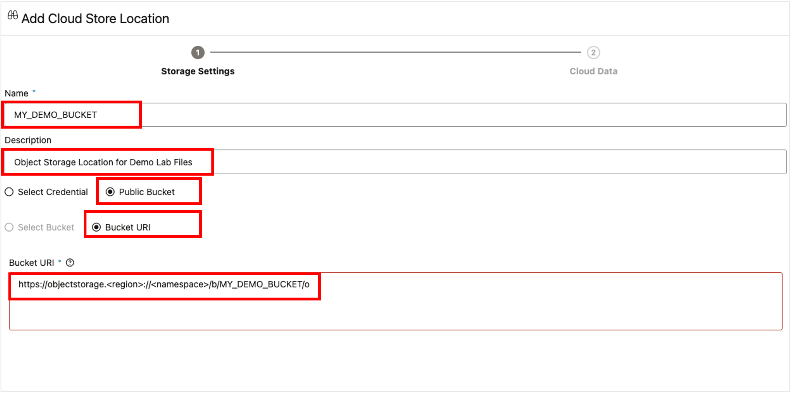

    -Click on **Create** Button to proceed. You should then see **MY\_DEMO\_BUCKET** displayed on Connections screen

    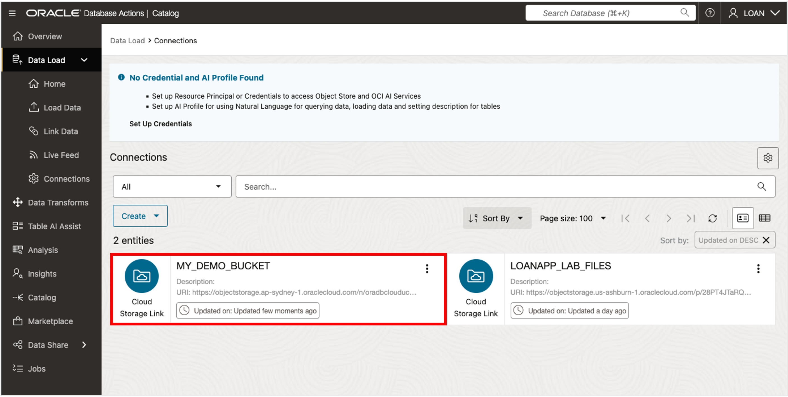

## Task 4: Build Initial Live Feed Table

1. ***Switch back to the Data Load | Catalog*** tab - and **Navigate to Live Feed**.

    * On Left rail expand **Data Load**, then click on **Live Feed**.

    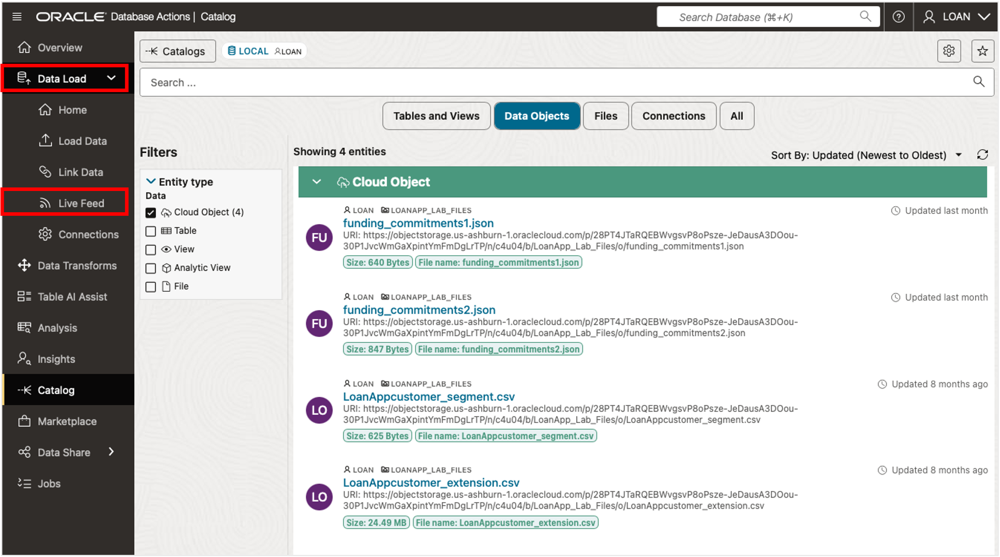

      >You should now see the Live Feed Page

2.  Click the **Create Live Table Feed** button to enter the Create Live Feed wizard

    

3. Enter details for the Live Table Feed Preview.

    * For **Cloud Store Location**: Select **MY\_DEMO\_BUCKET**
    * Select Radial Box: **Basic**
    * For **Folders**: Select: **FUNDING/**
    * For **Extensions** Select: **json**

    

    >**Note:** that you should now see the file preview of the funding commitments file that matches the object filter.

    * Click the **Next** button to proceed.

4. Configure Live Feed Table Settings as follows:

     * **For Option**: Choose **Merge Into Table** from drop-down list

     * **For target Table Name**: Enter the name of the target table of the Live Feed -- **FUNDING\_PROVIDER\_OFFER\_STG**. ***In ALL CAPS*** <br>

     * <u>Then modify **Mapping** details exactly as shown below:</u>
        * **Update Data Type** to NUMBER for: FUNDING\_PROVIDER\_ID and FUNDING\_OFFER\_REFERENCE\_ID <br>
        * **For Merge Key**: Select FUNDING\_PROVIDER\_ID and FUNDING\_OFFER\_REFERENCE\_ID<br>
        * **Unselect last row:** Inclusion of SYSTIMESTAMP Source

      

     * Click the **Next** button to proceed.

5. Review the information shown on the Preview page.

      

      * Click **Next** to proceed.

6. Enter remaining details for the **Live Table Feed**

      a. Enter live feed name **LOANAPP\_FUNDING\_FEED** <br>
      b. Check box to **Enable for Scheduling**. <br>
      c. Select every **2 minutes** for the polling time interval

      

      * Click **Create**

7. When the popup box appears, select **Yes** to run the Live Feed.

      

8. Review Live Feed Table and set page Refresh Interval

      * **You should see 3 rows loaded**
      * **Set page refresh interval to 10 seconds** to see when new data is loaded

      

***Congratulations!*** You have successfully created your Live Feed table.


## Task 5: Test Live Feed Automatic Table Data Population

  >This process will help our friends at Seer Equities to be able to automate receiving loan funding from investors and staging that data for conversion into Loan Products that their Loan Officers can then sell.  
  Now that our datapipeline is built let's simulate another investor submitting loan funding capital by uploading the **funding_commitments2.json** file into the **FUNDING** folder under MY\_DEMO\_BUCKET and ensuring that it is automatically analyzed and staged for processing. **Note:** that this file contains 4 rows.

1. Upload the **funding_commitments2.json** file into the **FUNDING** folder under **MY\_DEMO\_BUCKET**

    -***Switch back to Buckets Tab*** from Task 1 and  click on **MY\_DEMO\_BUCKET**

    

    -Click on **Upload Objects** button

    

    -Upload **funding_commitments2.json** file into **FUNDING** Folder  
      * For **Object Name Prefix:** enter **FUNDING/**. This will place the file in the FUNDING folder in our bucket.  
      * For **Choose Files from your Computer:** select the **funding_commitments2.json** file you downloaded.  
      * Select **Next** button to proceed

    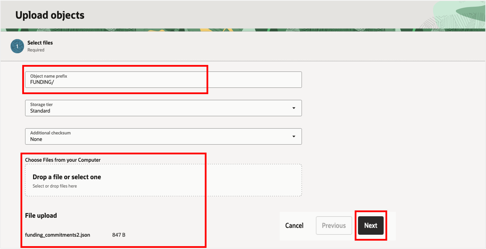

    -Click on **Upload Objects** button

    

    -Click on **Close** button to return to **Buckets** page


2. Validate that the new LiveFeed data was automatically loaded into the staging table

      ***Switch back to Database Actions Live Feed Tab***

     * Review the details for the Live Table Feed.  **Here we see that 4 new rows were loaded.**
     >Remember that it may take up to 2 minutes to display the new data, as we have configured a 2 minute polling schedule for our Live Feed process.  
     ***Set the refresh timer to 10 seconds*** on the Live Feed Page, to automatically display when new data has been processed.

     

3. Let's also validate that the data was loaded into the database by **Opening the SQL worksheet tool** and quering the data pipeline staging table called **FUNDING\_PROVIDER\_OFFER\_STG**.

    -Click on **Database Actions** link in banner

    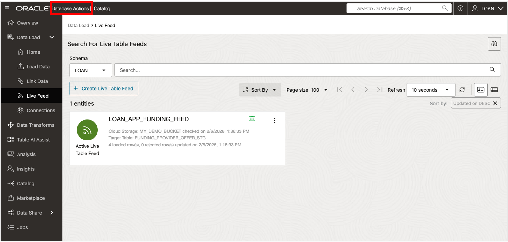
    
    -***Open SQL Worksheet tool*** by selecting **Development** then **SQL** and then the **Open** button

    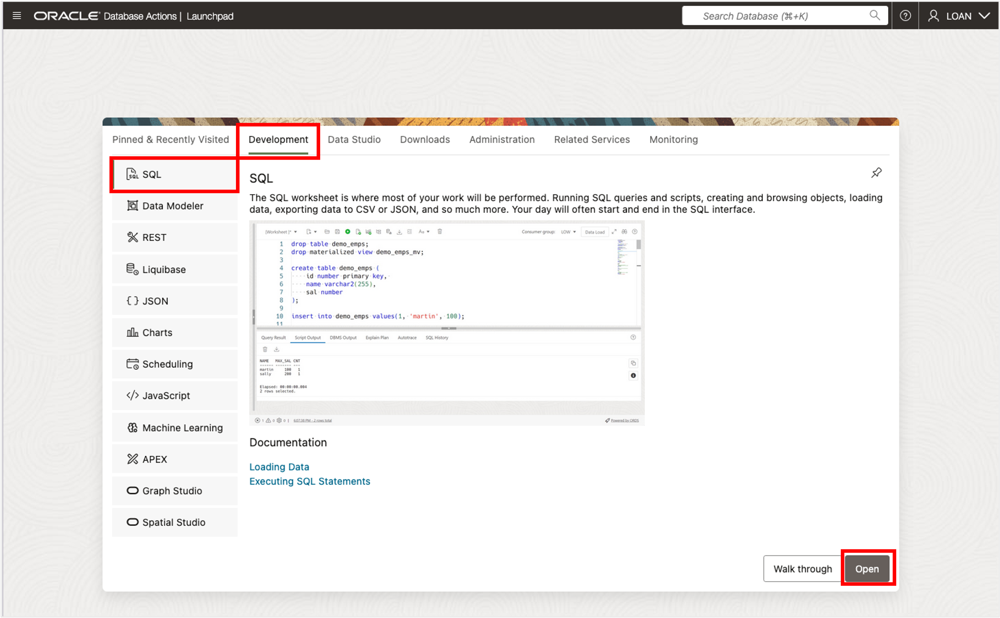

    -Query the Live Feed Staging table by running the follwing in the SQL worksheet window

    ```text
        <copy>
        SELECT * FROM FUNDING_PROVIDER_OFFER_STG;
        </copy>
    ```

    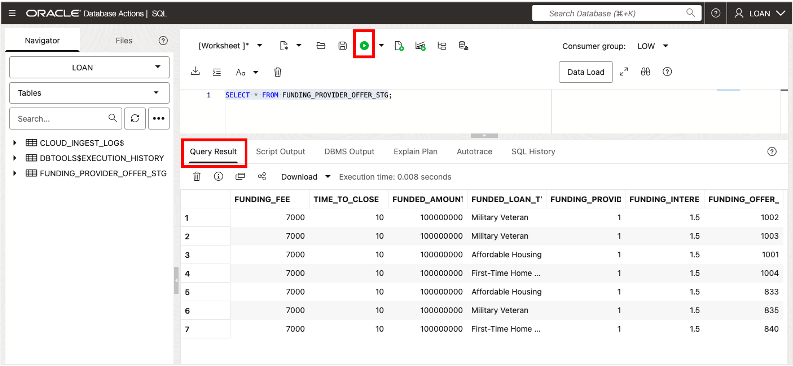

    -***Validate that you see 7 rows in the staging table.*** (3 rows from the 1st file we uploaded and 4 rows from the 2nd file).

***Congratulations!!!*** You have successfully created a Live Feed data pipeline, that can automatically load data from object storage into your database and be integrated into an automated business process.

## Conclusion

  ***Congratulations !!!*** You have successfully completed the FastLab on working with Autonomous AI Lakehouse to build an automated data pipeline!  

  <u>**In this lab you:**</u>  
    -**created an object storage location**  
    -**loaded data into the object storage**  
    -**created an automated live feed data pipeline.**  

  You also used some of the ***Autonomous AI Lakehouse*** **Database Actions** tools, such as:  
    -the **Autonomous AI Database Catalog** to gain visibility to data in object storage  
    -the **Data Load** tool to upload content into object storage  
    -and the **Live Feed** tool to build a scheduled data pipeleine  

  ***Visit our Signature Workshop*** to see more labs that dive deeper into working with the **Oracle Autonomous AI Lakehouse** and the **Database Actions** tools.


## Signature Workshop

👉 Click here to [Start the Advanced AI Lakehouse Workshop](https://livelabs.oracle.com/ords/r/dbpm/livelabs/view-workshop?wid=3689)

This workshop contains labs that dive deeper into working with Oracle Autonomous AI Lakehouse.

## Learn more
* [Oracle Autonomous AI Lakehouse](https://www.oracle.com/autonomous-database/autonomous-ai-lakehouse/)
* [Use Lakehouse with Autonomous AI Database](https://docs.oracle.com/en/cloud/paas/autonomous-database/serverless/adbsb/autonomous-lakehouse.html)
* [Lakehouse Workload with Autonomous AI Database](https://docs.oracle.com/en/cloud/paas/autonomous-database/serverless/adbsb/appendix-autonomous-database-data-warehouse-workload.html#GUID-604A08F8-8021-43CE-AA95-823045E14BD8)
* [Oracle Autonomous AI Lakehouse - Data Lake Accelerator](https://blogs.oracle.com/datawarehousing/introducing-data-lake-accelerator)
## Acknowledgements

* **Authors** - Eddie Ambler, Linda Foinding, Database Product Management
* **Last Updated By/Date** - Eddie Ambler, Database Product Management, January 2026