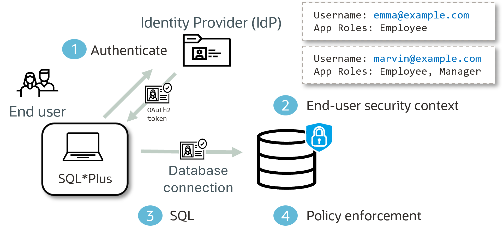

# LiveLabs FastLab: Identity-Aware Database Access with Microsoft Entra ID and Oracle Deep Data Security

## Introduction

This lab extends the [Deep Data Security FastLab](../end-user-data-grants/index.html) to cover enterprise identity integration. Instead of password-based end users, Emma and Marvin authenticate through Microsoft Entra ID — and their database access is controlled automatically by the app roles in their OAuth token.

This lab also introduces a customized **end-user context** (`HR.EMP_CTX`), which allows you to enrich your data grant predicates with information about the user and their session. To filter Marvin's view to his direct reports, the database needs his `employee_id` — not just his username. The end-user context loads that value lazily, on the first query that needs it.

Estimated Time: 25 minutes

### Objectives

In this lab, you will:

- Update the HR schema to use Entra ID email addresses as end-user identities
- Create an end-user context with an `o:onFirstRead` handler function to load manager attributes
- Create data roles mapped to Entra ID app roles using the `MAPPED TO` clause
- Create data grants using both the built-in `ORA_END_USER_CONTEXT.username` and a custom context attribute
- Test as Emma and Marvin connecting via OAuth token and verify the different access results
- Demonstrate that revoking an Entra ID app role immediately changes database access with no database changes

## The Challenge

In the previous lab, you learned that you can create a new Oracle Database user, called an end user, and use Oracle Deep Data Security data grants and data roles to manage their access to columns, rows, and even cells. 

In this lab, their identity comes from Microsoft Entra ID instead of the database. Emma and Marvin authenticate to the database using their Microsoft Entra ID credentials. The Oracle Database reads their identity and their app roles from their OAuth token and automatically activates the matching data roles. No application code, no proxy, no middleware.

As before, the Oracle Database restricts access to only authorized data, regardless of the SQL statement. 

## What You Will See



## Prerequisites

This lab assumes the following are already configured:

- An **Oracle AI Database 26ai** instance (Autonomous or on-premises)
- Microsoft Azure Entra ID configured as the identity provider. 
      - An Azure app registration with app roles defined: `EMPLOYEES` and `MANAGERS`
      - The database objects created in the [Identity-Driven Data Access using Oracle Deep Data Security FastLab](../end-user-data-grants/index.html)
      - The database identity provider must be configured for Microsoft Entra ID. 
      - Your `tnsnames.ora` file, or connection string, must use the `AZURE_INTERACTIVE` token type. 

For details regarding Oracle AI Database and Microsoft Entra ID configuration, please see the chapter titled [Oracle AI Database 26ai OCI IAM and Entra ID Configuration](https://docs.oracle.com/en/database/oracle/oracle-database/26/dbseg/authenticating-and-authorizing-microsoft-entra-id-ms-ei-users-oracle-databases-oracle-exadata-datab.html) in the Oracle AI Database documentation. 

> **Note:** If you don't have Microsoft Entra ID, you can follow the [Identity-Driven Data Access using Oracle Deep Data Security Fastlab](../end-user-data-grants/index.html) instead. It covers the same Deep Data Security concepts using password-based end-user authentication, with no external IdP required.

## Task 1: Drop End Users

The first task is to drop the existing end users you created in the previous lab. These dedicated end users are not necessary when using an IdP. As you will see, the integration between the Oracle AI Database and your Microsoft Entra ID application will provide any users with the proper Microsoft Entra ID app roles to authenticate to the Oracle AI Database.

> **Connection:** Run Tasks 1 through 6 as a DBA user or your Deep Data Security administrator.

1. Drop end users Emma and Marvin

      ```sql
      <copy>
      DROP END USER emma;
      DROP END USER marvin;
      </copy>
      ```

    > **Note:** If you receive `ORA-28037: end user does not exist`, the end users were never created — continue to the next task.

## Task 2: Reconfigure the HR schema

This task will show you how to reconfigure the user_name columns from only their first name (e.g., `EMMA`) to their Microsoft Entra ID authentication identity (e.g. `emma@example.onmicrosoft.com`)


1. Set your Entra ID domain name. `DEFINE` creates a session variable in SQL*Plus — the `&&domain_name` syntax in subsequent queries inserts its value automatically. Replace `example.onmicrosoft.com` with your Entra ID tenant domain.

      ```sql
      <copy>
      DEFINE domain_name = 'example.onmicrosoft.com'
      </copy>
      ```

2. Update the employee data to use the Entra ID email address as the `user_name`. Update the managers lookup table to match.

      ```sql
      <copy>
      UPDATE hr.employees
         SET user_name = user_name || '@&&domain_name'
       WHERE user_name NOT LIKE '%@%';

      UPDATE hr.managers
         SET mgr_user_name = mgr_user_name || '@&&domain_name'
       WHERE mgr_user_name NOT LIKE '%@%';

      COMMIT;
      </copy>
      ```

3. Verify all 7 rows, including the `user_name` column. The `user_name` values are now full Entra ID email addresses — this is what data grant predicates match against.

      ```sql
      <copy>
      SELECT employee_id, first_name, last_name, user_name, ssn, salary, manager_id
        FROM hr.employees
       ORDER BY employee_id;
      </copy>
      ```

      | EMPLOYEE\_ID | FIRST\_NAME | LAST\_NAME | USER\_NAME | SSN | SALARY | MANAGER\_ID |
      |---|---|---|---|---|---|---|
      | 1 | Grace | Young | grace@example.com | 111-11-1111 | 235000 | |
      | 2 | Marvin | Morgan | marvin@example.com | 222-22-2222 | 175000 | 1 |
      | 3 | Emma | Baker | emma@example.com | 333-33-3333 | 120000 | 2 |
      | 4 | Charlie | Davis | charlie@example.com | 444-44-4444 | 95000 | 2 |
      | 5 | Dana | Lee | dana@example.com | 555-55-5555 | 130000 | 2 |
      | 6 | Bob | Smith | bob@example.com | 666-66-6666 | 145000 | 1 |
      | 7 | Fiona | Chen | fiona@example.com | 777-77-7777 | 92000 | 1 |
      {: title="All employees"}

   Right now, anyone with access to this table sees everything — every SSN, every salary, across every department. That is the problem you are about to fix.

    > **Note:** The expected results above show `@example.com` as a placeholder. Your results will show your actual Entra ID tenant domain — for example, `emma@yourtenant.onmicrosoft.com`.

## Task 3: Create the end-user context

Marvin's data grant needs to know his `employee_id` — not just his username — so it can match the `manager_id` column of his direct reports. Oracle Database provides `ORA_END_USER_CONTEXT.username` as a built-in function, but there is no built-in for `employee_id`. 

In the previous lab, you used a subquery to identify Marvin's manager and employee IDs. Now, you are going to learn how to create an **end-user context** — a session-scoped object that can store custom attributes. This allows you to enrich Marvin's, and other user's, session data with information from the OAuth2 token and additional sources. 

You will define an end-user context with an `o:onFirstRead` handler function: when the context attribute is read in a session for the first time, Oracle Database automatically calls the handler function you specified to instantiate the end-user context for the rest of the session.

Emma's data grant predicate uses only `ORA_END_USER_CONTEXT.username` — the built-in. If Emma does not read the new end-user context otherwise, the new end-user context will not be instantiated for Emma's session.

1. First, you will create the end-user context with a JSON schema defining the `ID` attribute and its `o:onFirstRead` handler function.

      ```sql
      <copy>
      CREATE OR REPLACE END USER CONTEXT HR.EMP_CTX USING JSON SCHEMA '{
        "type": "object",
        "properties": {
          "ID": {
            "type": "integer",
            "o:onFirstRead": "HR.ctx_pkg.init_user_context"
          }
        }
      }';
      </copy>
      ```

    > **Note:** `HR.EMP_CTX` is not a database table — you cannot query it with `SELECT * FROM`. It is a virtual, session-scoped object. Read individual attributes with dot notation (`ORA_END_USER_CONTEXT.HR.EMP_CTX.ID`) or retrieve the full namespace as JSON with `SELECT ora_end_user_context.HR FROM DUAL`. You can also query the `SYS.END_USER_CONTEXT` view to read context attribute values.

2. Next, you will create the package that the `o:onFirstRead` handler function calls. When the `ID` attribute is first read in a session, Oracle Database calls `hr.ctx_pkg.init_user_context`, which looks up the current user's `employee_id` from `hr.employees` using `ORA_END_USER_CONTEXT.username` and stores it in the context. For Entra ID sessions, `username` resolves to the user's full email address — the same value stored in `hr.employees.user_name`.

      ```sql
      <copy>
      CREATE OR REPLACE PACKAGE hr.ctx_pkg AS
        PROCEDURE init_user_context;
      END;
      /

      CREATE OR REPLACE PACKAGE BODY hr.ctx_pkg AS
        PROCEDURE init_user_context IS
          sql_stmt VARCHAR2(4000);
        BEGIN
          sql_stmt := '
            UPDATE END_USER_CONTEXT t
            SET t.CONTEXT.ID = (
               SELECT e.employee_id
               FROM hr.employees e
               WHERE e.user_name = ORA_END_USER_CONTEXT.username
             )
            WHERE owner = ''HR''
            AND name = ''EMP_CTX'';
          ';
          EXECUTE IMMEDIATE sql_stmt;
        END;
      END;
      /
      </copy>
      ```

3. And finally, you will grant the HR schema the privilege it needs to update end-user context objects. Then create a database role that holds `EXECUTE` on the context package — this role will be granted to the data roles in the next task, enabling the `o:onFirstRead` handler function to fire.

      ```sql
      <copy>
      GRANT UPDATE ANY END USER CONTEXT TO HR;

      CREATE ROLE IF NOT EXISTS employee_context_admin;
      GRANT EXECUTE ON hr.ctx_pkg TO employee_context_admin;
      </copy>
      ```

   `employee_context_admin` acts as a bridge: when a session activates a data role that has been granted this role, it gains execute access to the context package, allowing the `o:onFirstRead` handler function to fire and load the user's `employee_id`.

## Task 4: Create Entra ID-mapped data roles

Besides the custom end-user context, another key feature of this lab is the `MAPPED TO` clause. When you write `CREATE DATA ROLE HRAPP_MANAGERS MAPPED TO 'azure_role=MANAGERS'`, you are telling Oracle Database: *"When you see an Entra ID token with the MANAGERS app role claim, automatically activate HRAPP_MANAGERS for that session."* No manual grants, no application logic changes — the mapping is declarative and automatic.

1. In the last lab, you created two data roles. You will use the same naming conventions but map them to their Entra ID app role counterparts. When the user has the Entra ID app role, they will automatically have the role in the Oracle AI Database. 

      ```sql
      <copy>
      DROP DATA ROLE hrapp_employees;
      DROP DATA ROLE hrapp_managers;
      CREATE DATA ROLE hrapp_employees MAPPED TO 'azure_role=EMPLOYEES';
      CREATE DATA ROLE hrapp_managers  MAPPED TO 'azure_role=MANAGERS';
      </copy>
      ```

2. Grant the `employee_context_admin` role to both data roles. This connects the context package to the data roles so the `o:onFirstRead` handler function can fire when either role is active.

      ```sql
      <copy>
      GRANT employee_context_admin TO HRAPP_EMPLOYEES;
      GRANT employee_context_admin TO HRAPP_MANAGERS;
      </copy>
      ```

3. Grant access to the end-user context for sessions with either data role active.

      ```sql
      <copy>
      CREATE OR REPLACE DATA GRANT hr.EMPLOYEE_CONTEXT_GRANT
        AS SELECT ON SYS.END_USER_CONTEXT
         WHERE OWNER = 'HR' AND NAME = 'EMP_CTX'
          TO HRAPP_EMPLOYEES, HRAPP_MANAGERS;
      </copy>
      ```

4. Create a database role that grants `CREATE SESSION`, allowing end users to open direct connections.

    > **Note:** In a mid-tier or application server deployment, end users typically connect through a connection pool and `CREATE SESSION` is not required. For this lab, which uses SQL*Plus with direct token-based authentication, this role is necessary.

      ```sql
      <copy>
      CREATE ROLE direct_logon_role;
      GRANT CREATE SESSION TO direct_logon_role;
      GRANT direct_logon_role TO hrapp_employees;
      GRANT direct_logon_role TO hrapp_managers;
      </copy>
      ```

    > **Note:** If you receive `ORA-01921: role name 'DIRECT_LOGON_ROLE' conflicts with another user or role name`, the role exists from the previous lab. Continue to the next step.

5. Verify the data roles and their Entra ID mappings.

      ```sql
      <copy>
      SELECT data_role, mapped_to, enabled_by_default
        FROM dba_data_roles
       WHERE data_role IN ('HRAPP_EMPLOYEES', 'HRAPP_MANAGERS');
      </copy>
      ```

      | DATA\_ROLE | MAPPED\_TO | ENABLED\_BY\_DEFAULT |
      |---|---|---|
      | HRAPP\_EMPLOYEES | azure\_role=EMPLOYEES | true |
      | HRAPP\_MANAGERS | azure\_role=MANAGERS | true |
      {: title="Data roles and Entra ID mappings"}

   When Emma authenticates with a token containing the `EMPLOYEES` claim, Oracle Database automatically activates `HRAPP_EMPLOYEES`. When Marvin authenticates with tokens containing both `EMPLOYEES` and `MANAGERS` claims, both data roles activate. No code required.

## Task 5: Create the Data Grants

For the Oracle Deep Data Security data grants, you will continue to use the same model as the previous lab. However, now you will use your new end-user context (`ORA_END_USER_CONTEXT.HR.EMP_CTX.ID`) instead of the subquery for the `HRAPP_MANAGER_ACCESS` data grant. 

1. Create the data grant for the employee role. An employee sees all of their own data and can only update their phone number.

      ```sql
      <copy>
      CREATE OR REPLACE DATA GRANT hr.HRAPP_EMPLOYEES_ACCESS
        AS SELECT, UPDATE(phone_number)
        ON hr.employees
        WHERE upper(user_name) = upper(ORA_END_USER_CONTEXT.username)
        TO HRAPP_EMPLOYEES;
      </copy>
      ```

    `ORA_END_USER_CONTEXT.username` resolves to the full Entra ID email of the authenticated user. `upper()` on both sides ensures the comparison is case-insensitive — Entra ID email casing is not guaranteed to match the stored `user_name`.

2. Create the data grant for the manager role. A manager sees their direct reports' records (salary, department, phone) but never their SSNs. They can update salary and department for their direct reports.

      ```sql
      <copy>
      CREATE OR REPLACE DATA GRANT hr.HRAPP_MANAGER_ACCESS
        AS SELECT (ALL COLUMNS EXCEPT ssn), UPDATE (salary, department_id)
        ON hr.employees
        WHERE manager_id = ORA_END_USER_CONTEXT.HR.EMP_CTX.ID
        TO HRAPP_MANAGERS;
      </copy>
      ```

    The predicate `WHERE manager_id = ORA_END_USER_CONTEXT.HR.EMP_CTX.ID` references the end-user context created in Task 2. When this predicate is first evaluated, it reads the `ID` attribute, which fires the `o:onFirstRead` handler function and loads the manager's `employee_id` into the context.

3. Verify both data grants are in place.

      ```sql
      <copy>
      SELECT grant_name, privilege, grantee, predicate
        FROM dba_data_grants
       WHERE object_owner = 'HR'
         AND object_name = 'EMPLOYEES'
       ORDER BY grant_name, privilege;
      </copy>
      ```

      | GRANT\_NAME | PRIVILEGE | GRANTEE | PREDICATE |
      |---|---|---|---|
      | HRAPP\_EMPLOYEES\_ACCESS | SELECT | HRAPP\_EMPLOYEES | upper(user\_name) = upper(ORA\_END\_USER\_CONTEXT.username) |
      | HRAPP\_EMPLOYEES\_ACCESS | UPDATE | HRAPP\_EMPLOYEES | upper(user\_name) = upper(ORA\_END\_USER\_CONTEXT.username) |
      | HRAPP\_MANAGER\_ACCESS | SELECT | HRAPP\_MANAGERS | manager\_id = ORA\_END\_USER\_CONTEXT.HR.EMP\_CTX.ID |
      | HRAPP\_MANAGER\_ACCESS | UPDATE | HRAPP\_MANAGERS | manager\_id = ORA\_END\_USER\_CONTEXT.HR.EMP\_CTX.ID |
      {: title="Data grants"}

## Task 6: Test as Emma and Marvin

**The Contrast:** Emma and Marvin run the same query but the results are completely different — enforced by the database. Start with Emma, then connect as Marvin to see the manager view and the end-user context load in action.

> **Before you begin:** Exit your current DBA session by typing `EXIT` and pressing Enter. Tasks 6 and 7 connect as end users — not as the DBA.

### Connect as Emma

1. Connect as Emma using Entra ID authentication. The `AZURE_INTERACTIVE` token type in your `tnsnames.ora` triggers a browser-based login flow — a web browser will open and prompt you to sign in as Emma with her Microsoft Entra ID credentials.

      ```
      <copy>
      sqlplus /@hrdb
      </copy>
      ```

2. Confirm Emma's end-user identity.

      ```sql
      <copy>
      SELECT ORA_END_USER_CONTEXT.username FROM dual;
      </copy>
      ```

      ```
      USERNAME
      --------------------------------------------------------------------------------
      "emma@example.com"
      ```

3. Verify Emma's session identity. `AUTHENTICATED_IDENTITY` shows the Entra ID email Oracle Database resolved from the token. `CURRENT_USER` shows `XS$NULL` — token-authenticated end users are not schema users. `XS$NULL` is a null placeholder used to indicate an active end-user session in Oracle Deep Data Security. It has no privileges and cannot own objects.

      ```sql
      <copy>
      SELECT
        SYS_CONTEXT('USERENV','AUTHENTICATED_IDENTITY') AS AUTHENTICATED_IDENTITY,
        SYS_CONTEXT('USERENV','ENTERPRISE_IDENTITY')    AS ENTERPRISE_IDENTITY,
        SYS_CONTEXT('USERENV','AUTHENTICATION_METHOD')  AS AUTH_METHOD,
        SYS_CONTEXT('USERENV','CURRENT_USER')           AS CURRENT_USER
      FROM DUAL;
      </copy>
      ```

      | AUTHENTICATED\_IDENTITY | ENTERPRISE\_IDENTITY | AUTH\_METHOD | CURRENT\_USER |
      |---|---|---|---|
      | emma@example.com | 00000000-0000-0000-0000-000000000000 | TOKEN\_GLOBAL | XS$NULL |
      {: title="Emma's session identity"}

    `AUTHENTICATED_IDENTITY` shows the Entra ID email. `ENTERPRISE_IDENTITY` shows the Entra ID Object ID (a UUID), not the email — this is the object identifier assigned to the user in your Azure tenant.

4. Verify Emma's active data roles. She has only the `EMPLOYEES` app role in Entra ID, so only `HRAPP_EMPLOYEES` activates.

      ```sql
      <copy>
      SELECT ROLE_NAME FROM V$END_USER_DATA_ROLE;
      </copy>
      ```

      ```
      ROLE_NAME
      ---------------------
      HRAPP_EMPLOYEES
      ```

5. Emma runs a broad query with no WHERE clause.

      ```sql
      <copy>
      SELECT employee_id, first_name, last_name, user_name, ssn, salary, phone_number
        FROM hr.employees
       ORDER BY employee_id;
      </copy>
      ```

      | EMPLOYEE\_ID | FIRST\_NAME | LAST\_NAME | USER\_NAME | SSN | SALARY | PHONE\_NUMBER |
      |---|---|---|---|---|---|---|
      | 3 | Emma | Baker | emma@example.com | 333-33-3333 | 120000 | 555-100-0003 |
      {: title="Emma's query result"}

    Emma sees **1 row** — only herself. The table has 7 employees. Oracle Database added the data grant predicate to her query automatically.

6. **The guardrail holds — even for "weird" queries.** Try requesting Marvin's row by name:

      ```sql
      <copy>
      SELECT employee_id, first_name, last_name, ssn, salary
        FROM hr.employees
       WHERE user_name = 'marvin@&&domain_name';
      </copy>
      ```

      ```
      no rows selected
      ```

    Try counting all employees:

      ```sql
      <copy>
      SELECT COUNT(*) FROM hr.employees;
      </copy>
      ```

      ```
      COUNT(*)
      ----------
      1
      ```

    Every query returns only Emma's data. Oracle Database rewrites every query at execution time to enforce the data grant predicate — regardless of what SQL was issued.

7. Emma updates her phone number. The data grant includes `UPDATE(phone_number)`. The update is rolled back to keep the data clean for Marvin's steps.

      ```sql
      <copy>
      UPDATE hr.employees SET phone_number = '555-555-5555' WHERE first_name = 'Emma';
      ROLLBACK;
      </copy>
      ```

      ```
      1 row updated.
      Rollback complete.
      ```

8. Emma attempts to update her salary. The data grant has no `UPDATE` on `salary`.

      ```sql
      <copy>
      UPDATE hr.employees SET salary = 200000 WHERE first_name = 'Emma';
      </copy>
      ```

      ```
      0 rows updated.
      ```

### Connect as Marvin

8. Connect as Marvin using Entra ID authentication. Marvin has both the `EMPLOYEES` and `MANAGERS` app roles.

    > **Important:** Before connecting, sign out of your Entra ID browser session or open a private/incognito window. `AZURE_INTERACTIVE` reuses an active browser session — if Emma is still signed in, Marvin's `sqlplus /@hrdb` will authenticate as Emma instead.

      ```
      <copy>
      sqlplus /@hrdb
      </copy>
      ```

9. Confirm Marvin's end-user identity.

      ```sql
      <copy>
      SELECT ORA_END_USER_CONTEXT.username FROM dual;
      </copy>
      ```

      ```
      USERNAME
      --------------------------------------------------------------------------------
      "marvin@example.com"
      ```

10. Verify Marvin's active data roles. Both `HRAPP_EMPLOYEES` and `HRAPP_MANAGERS` activate because both claims are present in his token.

      ```sql
      <copy>
      SELECT ROLE_NAME FROM V$END_USER_DATA_ROLE;
      </copy>
      ```

      ```
      ROLE_NAME
      ---------------------
      HRAPP_EMPLOYEES
      HRAPP_MANAGERS
      ```

11. Marvin runs the same query Emma ran.

      ```sql
      <copy>
      SELECT employee_id, first_name, last_name, user_name, ssn, salary, phone_number
        FROM hr.employees
       ORDER BY employee_id;
      </copy>
      ```

      | EMPLOYEE\_ID | FIRST\_NAME | LAST\_NAME | USER\_NAME | SSN | SALARY | PHONE\_NUMBER |
      |---|---|---|---|---|---|---|
      | 2 | Marvin | Morgan | marvin@example.com | 222-22-2222 | 175000 | 555-100-0002 |
      | 3 | Emma | Baker | emma@example.com | | 120000 | 555-100-0003 |
      | 4 | Charlie | Davis | charlie@example.com | | 95000 | 555-100-0004 |
      | 5 | Dana | Lee | dana@example.com | | 130000 | 555-100-0005 |
      {: title="Marvin's query result"}

    Marvin sees **4 rows** — himself and his 3 direct reports. He sees his own SSN (from `HRAPP_EMPLOYEES_ACCESS`) but SSN is hidden for his reports (excluded by `HRAPP_MANAGER_ACCESS`). Bob, Fiona, and Grace are not in his reporting chain and are not visible.

    **Same query. Completely different results — enforced by the database.**

12. Inspect the end-user context. The `o:onFirstRead` handler function fired when the manager data grant predicate first evaluated `ORA_END_USER_CONTEXT.HR.EMP_CTX.ID`, loading Marvin's `employee_id`.

      ```sql
      <copy>
      SELECT ora_end_user_context.HR FROM DUAL;
      </copy>
      ```

      ```json
      {"EMP_CTX":{"ID":2}}
      ```

    `ID: 2` is Marvin's `employee_id`. The predicate `WHERE manager_id = ORA_END_USER_CONTEXT.HR.EMP_CTX.ID` resolved to `WHERE manager_id = 2` — which matches Emma, Charlie, and Dana.

13. Marvin updates a team member's salary. The manager data grant allows `UPDATE(salary)` for direct reports. This is committed to confirm the grant works end-to-end.

      ```sql
      <copy>
      UPDATE hr.employees SET salary = 125000 WHERE first_name = 'Emma';
      COMMIT;
      </copy>
      ```

      ```
      1 row updated.
      ```

14. Marvin attempts to update his own salary. The manager data grant predicate is `WHERE manager_id = 2` — his direct reports. Marvin's own row has `manager_id = 1` (he reports to Grace), so the predicate excludes him. The employee data grant has no `UPDATE` on salary.

      ```sql
      <copy>
      UPDATE hr.employees SET salary = salary * 1.5 WHERE employee_id = 2;
      </copy>
      ```

      ```
      0 rows updated.
      ```

   No error, but no rows changed. The database silently blocks it — the data grant does not include `UPDATE(salary)` for the managers role.

## Task 7: Marvin's role changes in Entra ID

**No database changes required.** When Marvin's app role changes in Entra ID, his next token no longer contains the `MANAGERS` claim. Oracle Database evaluates the token on every new connection — if `HRAPP_MANAGERS` is not in the token, it does not activate. Nothing in the database changes.

1. **In the Azure portal**, remove Marvin from the `MANAGERS` app role.
    - Navigate to **Entra ID → Enterprise Applications → your app → Users and groups**
    - Find Marvin and remove his `MANAGERS` role assignment
    - Leave his `EMPLOYEES` assignment in place

    > **Note:** The change takes effect on Marvin's next authentication. Existing active sessions are not affected.

2. Connect as Marvin with a fresh token.

      ```
      <copy>
      sqlplus /@hrdb
      </copy>
      ```

3. Verify only `HRAPP_EMPLOYEES` is now active.

      ```sql
      <copy>
      SELECT ROLE_NAME FROM V$END_USER_DATA_ROLE;
      </copy>
      ```

      ```
      ROLE_NAME
      ---------------------
      HRAPP_EMPLOYEES
      ```

4. Run the same query from Task 6. Marvin now sees only his own row.

      ```sql
      <copy>
      SELECT employee_id, first_name, last_name, user_name, ssn, salary, phone_number
        FROM hr.employees
       ORDER BY employee_id;
      </copy>
      ```

      | EMPLOYEE\_ID | FIRST\_NAME | LAST\_NAME | USER\_NAME | SSN | SALARY | PHONE\_NUMBER |
      |---|---|---|---|---|---|---|
      | 2 | Marvin | Morgan | marvin@example.com | 222-22-2222 | 175000 | 555-100-0002 |
      {: title="Marvin's result after role change"}

   Marvin still sees his own SSN and salary — `HRAPP_EMPLOYEES_ACCESS` is still active. His direct reports are gone. **Access policy lives in Entra ID. Oracle Database enforces it automatically. Nothing in the database changed.**

## Task 8 (Optional): Clean up

If you want to remove everything created in this lab, run the following as your DBA user.

1. Drop all data grants.

      ```sql
      <copy>
      DROP DATA GRANT hr.EMPLOYEE_CONTEXT_GRANT;
      DROP DATA GRANT hr.HRAPP_EMPLOYEES_ACCESS;
      DROP DATA GRANT hr.HRAPP_MANAGER_ACCESS;
      </copy>
      ```

2. Drop the end-user context, package, roles, and schema.

      ```sql
      <copy>
      DROP END USER CONTEXT HR.EMP_CTX;
      DROP ROLE employee_context_admin;
      DROP ROLE direct_logon_role;
      DROP DATA ROLE HRAPP_EMPLOYEES;
      DROP DATA ROLE HRAPP_MANAGERS;
      DROP USER hr CASCADE;
      </copy>
      ```

    `DROP USER hr CASCADE` removes the HR schema along with the `ctx_pkg` package, the `employees` table, and all dependent objects.

3. Verify everything is removed.

      ```sql
      <copy>
      SELECT data_role, mapped_to FROM dba_data_roles
       WHERE data_role IN ('HRAPP_EMPLOYEES', 'HRAPP_MANAGERS');

      SELECT grant_name FROM dba_data_grants
       WHERE object_owner = 'HR';

      SELECT username FROM dba_users
       WHERE username = 'HR';

      SELECT role FROM dba_roles
       WHERE role IN ('EMPLOYEE_CONTEXT_ADMIN', 'DIRECT_LOGON_ROLE');
      </copy>
      ```

   All queries should return no rows.

## What You Built

Emma and Marvin run the same query through the same AI agent. Oracle Database returns different data to each — enforced by their Entra ID identity, with no application code or proxy in between.

| Component | Purpose |
|---|---|
| **data roles with `MAPPED TO`** | `HRAPP_EMPLOYEES` and `HRAPP_MANAGERS` auto-activate from Entra ID app role claims in the OAuth token |
| **data grant — employees** | `HRAPP_EMPLOYEES_ACCESS` — SELECT all columns, UPDATE phone number, own row only |
| **data grant — managers** | `HRAPP_MANAGER_ACCESS` — SELECT all except SSN, UPDATE salary and department, direct reports only |
| **`ORA_END_USER_CONTEXT.username`** | Built-in function resolving to the authenticated user's Entra ID email — used in the employee predicate |
| **end-user context (`HR.EMP_CTX`)** | Session-scoped context with lazy initialization that resolves `employee_id` for the manager predicate |
| **`DIRECT_LOGON_ROLE`** | Database role granting `CREATE SESSION`, required for direct SQL*Plus connections |
{: title="Lab components"}

The trust chain: **MFA → OAuth token → App role → Oracle `DATA ROLE` → `DATA GRANT` enforcement.**

Access policy lives in Entra ID. Oracle Database enforces it. Nothing in the database changes when a user's role changes.

## Entra ID vs. Password Authentication

The data grants in this lab are identical to the ones in the companion FastLab. The only difference is how the user's identity reaches the database.

| Aspect | Password (prior FastLab) | Entra ID (this lab) |
|---|---|---|
| Authentication | `CREATE END USER marvin IDENTIFIED BY ...` | Entra ID OAuth2 token via `AZURE_INTERACTIVE` |
| Data role activation | `GRANT DATA ROLE ... TO marvin` (explicit) | `MAPPED TO 'azure_role=MANAGERS'` (automatic from token) |
| End user creation | `CREATE END USER` required | Not needed — identity comes from the token |
| Connection string | `sqlplus marvin/Oracle123@pdb1` | `sqlplus /@hrdb` (browser login) |
| Password management | Oracle Database | Entra ID (SSO, MFA) |
| Data grants | Identical | Identical |
{: title="Entra ID vs. password authentication"}

<!--
## Next Steps

This lab used Microsoft Entra ID as the identity provider. The same Deep Data Security concepts — data grants, data roles, and per-user predicates — work with any OAuth2-compatible IdP, including Oracle Cloud IAM.

To explore the foundational concepts without an external identity provider — including password-based end-user authentication and a step-by-step introduction to data roles — see the companion FastLab:

* [Identity-Driven Data Access using Oracle Deep Data Security](../end-user-data-grants/index.html)
 -->
 
## Learn More

* [Oracle AI Database 26ai Documentation](https://docs.oracle.com/en/database/)
* [Oracle Deep Data Security Configuration Guide](https://docs.oracle.com/en/database/oracle/oracle-database/26/ddscg/index.html)

## Acknowledgements
* **Author** - Roger Wigenstam, Oracle Database Security Product Management, March 2026
* **Last Updated By/Date** - Richard C. Evans, Oracle Database Security Product Management, April 2026
