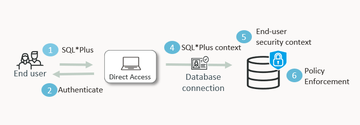

# LiveLabs FastLab: Identity-Driven Data Access using Oracle Deep Data Security

## What You Will Learn

Welcome to this **Oracle Deep Data Security LiveLabs FastLab** workshop.

This FastLab walks you through the key concepts behind Oracle Deep Data Security — why it is critical to securing agentic AI workloads, and how enterprise identity integrates end-to-end with Oracle Database to enforce per-user data access.



In this lab, you will create and use new users, roles, and grants only available in Oracle AI Database 26ai and higher. With these new capabilities, you will learn how you can secure sensitive data in the Oracle Database regardless of the use case. 

This lab covers the very basics of end users, data roles, and data grants. Emma and Marvin are colleagues at the same company — Emma is an employee and Marvin is her manager. They both query the same HR table, and the database makes sure each of them only ever sees the data appropriate for their role. For more labs and content, go to the [Next Steps](#NextSteps) section of this lab. 

Estimated Time: 15 minutes

## The Challenge

When multiple users share access to the same database table, the question is always the same: how do you guarantee each user only sees the data they're authorized to see — regardless of what SQL is executed on their behalf? Traditional approaches rely on application logic, middleware, or query filtering, but none of these controls live at the database. If the application is bypassed, the data is exposed.

Oracle Deep Data Security solves this within the database. The controls are declarative, identity-aware, and enforced before data ever leaves the database — regardless of how the query was constructed or who constructed it.

This matters everywhere users share sensitive data, but it becomes critical in agentic AI applications, copilots, and chatbots — where you have no control over the SQL the agent generates. Deep Data Security gives your security team a verifiable, database-enforced boundary, so AI projects don't stall at the security review.

## How Oracle Deep Data Security Works

### End Users

Oracle Database end users are a new class of identity — distinct from traditional database schema users. They authenticate directly to the database through external IAM or with a password. Unlike schema users, they do not own tables or other objects. Instead, they access data through **data grants** — declarative access policies that define exactly which rows and columns each user can read or modify, based on their identity.

### Data Roles

A data role (`CREATE DATA ROLE`) is a named policy holder. You attach data grants to it, then grant the role to end users. When an end user authenticates, Oracle Database automatically activates any data roles they have been granted — no application code required.

Compared to traditional schema-level or object-level grants that give access to all rows in a table, Deep Data Security data grants control access at the row and column level, dynamically restricting what each user sees based on their identity.

### Data Grants

A data grant (`CREATE DATA GRANT`) defines two things: which columns an end user can SELECT or UPDATE, and which rows — through a predicate (a SQL WHERE condition) evaluated at query time.

The predicate can use `ora_end_user_context.USERNAME`, a built-in function that resolves to the authenticated end user's identity. The same grant works for every employee — no hardcoded names, no per-user logic.

At runtime, Oracle Database rewrites every query to add the data grant condition — the result is automatically limited to the rows and columns the user is authorized to see, regardless of how the query was written.

### The Trust Chain

When an end user authenticates, Oracle Database automatically activates their `DATA ROLE`, which triggers `DATA GRANT` enforcement on every query. The database enforces the boundary — not the application, not the agent.

> **Note:** Oracle Cloud IAM or Microsoft Azure Entra ID can be configured as the identity provider, and end users authenticate via OAuth2 tokens. This lab uses password-based end user authentication to focus on the Deep Data Security concepts without requiring external IdP setup. The Deep Data Security behavior is identical in both cases.

### Prerequisites

This lab is a walk-through of the technology. If you wish to follow along, you should have the following environment configured: 

- An **Oracle AI Database 26ai** instance (Autonomous or on-premises)
- You have access to a DBA account to run the setup tasks. To use a least-privilege approach instead, Task 0 walks you through creating a dedicated administrator.


## Task 0 (Optional): Create a Deep Data Security Administrator

To enforce a least-privilege model, you can create a dedicated `DEEPSEC_ADMIN` user with only the privileges required to complete this lab. Run the following as `SYS`, `ADMIN` on ADB, or DBA-like user with the appropriate privileges. 

```sql
<copy>
CREATE USER deepsec_admin IDENTIFIED BY Oracle123;

-- Standard Oracle privileges
GRANT CREATE SESSION TO deepsec_admin;
GRANT CREATE USER TO deepsec_admin;
GRANT ALTER USER TO deepsec_admin;
GRANT DROP USER TO deepsec_admin;
GRANT CREATE ANY TABLE TO deepsec_admin;
GRANT INSERT ANY TABLE TO deepsec_admin;
GRANT SELECT ANY TABLE TO deepsec_admin;
GRANT CREATE ANY INDEX TO deepsec_admin;
GRANT CREATE ROLE TO deepsec_admin;
GRANT DROP ANY ROLE TO deepsec_admin;
GRANT GRANT ANY ROLE TO deepsec_admin;
GRANT GRANT ANY PRIVILEGE TO deepsec_admin;
GRANT SELECT ANY DICTIONARY TO deepsec_admin;

-- Deep Data Security privileges (26ai)
GRANT CREATE END USER TO deepsec_admin;
GRANT DROP END USER TO deepsec_admin;
GRANT CREATE DATA ROLE TO deepsec_admin;
GRANT DROP DATA ROLE TO deepsec_admin;
GRANT GRANT ANY DATA ROLE TO deepsec_admin;
GRANT CREATE ANY DATA GRANT TO deepsec_admin;
GRANT DROP ANY DATA GRANT TO deepsec_admin;
GRANT ADMINISTER ANY DATA GRANT TO deepsec_admin;
</copy>
```

Connect as `deepsec_admin` to run Tasks 1 through 7.

## Task 1: Create the HR Schema and Employee Data

**The Scenario:** You have an AI tool that will query an HR employees table containing sensitive data — Social Security Numbers, salaries, and employee contact information. You want any user to be able to issue a query, a question, and receive only the data they are supposed to see. 

> **Connection:** Run as a DBA user or your Deep Data Security Administrator.

1. Create a schema-only account for the HR data and grant it tablespace quota.

    `CREATE USER hr NO AUTHENTICATION` creates a schema that owns tables and objects but cannot be used to connect to the database directly. This is the recommended pattern for application schemas — the schema holds data, but nobody logs in as `hr`.

      ```sql
      <copy>
      CREATE USER hr NO AUTHENTICATION default tablespace users;
      ALTER USER hr QUOTA UNLIMITED ON users;
      </copy>
      ```

2. Create the `EMPLOYEES` table and insert sample data. A `MANAGERS` lookup table is also created — it maps each employee to their manager's username, which the manager data grant uses to identify direct reports.

      ```sql
      <copy>
      CREATE TABLE hr.employees (
        employee_id   NUMBER PRIMARY KEY,
        first_name    VARCHAR2(50),
        last_name     VARCHAR2(50),
        job_code      VARCHAR2(10),
        department_id NUMBER,
        ssn           VARCHAR2(20),
        photo         BLOB,
        phone_number  VARCHAR2(30),
        salary        NUMBER(10,2),
        user_name     VARCHAR2(128),
        manager_id    NUMBER);

      -- CEO
      INSERT INTO hr.employees VALUES (1, 'Grace', 'Young', 'CEO', NULL, '111-11-1111', NULL, '555-100-0001', 235000, 'grace', NULL);

      -- Manager
      INSERT INTO hr.employees VALUES (2, 'Marvin', 'Morgan', 'SWE_MGR', 1, '222-22-2222', NULL, '555-100-0002', 175000, 'marvin', 1);

      -- Software engineering team
      INSERT INTO hr.employees VALUES (3, 'Emma', 'Baker', 'SWE2', 1, '333-33-3333', NULL, '555-100-0003', 120000, 'emma', 2);
      INSERT INTO hr.employees VALUES (4, 'Charlie', 'Davis', 'SWE1', 1, '444-44-4444', NULL, '555-100-0004', 95000, 'charlie', 2);
      INSERT INTO hr.employees VALUES (5, 'Dana', 'Lee', 'SWE3', 1, '555-55-5555', NULL, '555-100-0005', 130000, 'dana', 2);

      -- Other departments
      INSERT INTO hr.employees VALUES (6, 'Bob', 'Smith', 'SALES_REP', 2, '666-66-6666', NULL, '555-100-0006', 145000, 'bob', 1);
      INSERT INTO hr.employees VALUES (7, 'Fiona', 'Chen', 'HR_REP', 3, '777-77-7777', NULL, '555-100-0007', 92000, 'fiona', 1);

      -- Build a Manager lookup table

      CREATE TABLE hr.managers (
            manager_id      NUMBER,
            employee_id     NUMBER,
            mgr_user_name   VARCHAR2(128),
            mgr_first_name  VARCHAR2(50),
            mgr_last_name   VARCHAR2(50));
      
      -- Add the managers
      INSERT INTO hr.managers (manager_id, employee_id, mgr_user_name, mgr_first_name, mgr_last_name)
      SELECT
      e.manager_id,
      e.employee_id,
      m.user_name AS mgr_user_name,
      m.first_name AS mgr_first_name,
      m.last_name AS mgr_last_name
      FROM hr.employees e
      JOIN hr.employees m
      ON e.manager_id = m.employee_id
      WHERE e.manager_id IS NOT NULL;

      COMMIT;
      </copy>
      ```

3. Verify you can see all the data, including SSNs and the `user_name` column that data grants will use to identify each employee.

      ```sql
      <copy>
      SELECT employee_id, first_name, last_name, user_name, ssn, salary
        FROM hr.employees
       ORDER BY employee_id;
      </copy>
      ```

      | EMPLOYEE\_ID | FIRST\_NAME | LAST\_NAME | USER\_NAME | SSN | SALARY |
      |---|---|---|---|---|---|
      | 1 | Grace | Young | grace | 111-11-1111 | 235000 |
      | 2 | Marvin | Morgan | marvin | 222-22-2222 | 175000 |
      | 3 | Emma | Baker | emma | 333-33-3333 | 120000 |
      | 4 | Charlie | Davis | charlie | 444-44-4444 | 95000 |
      | 5 | Dana | Lee | dana | 555-55-5555 | 130000 |
      | 6 | Bob | Smith | bob | 666-66-6666 | 145000 |
      | 7 | Fiona | Chen | fiona | 777-77-7777 | 92000 |
      {: title="All employees"}

      Right now, anyone with access to this table sees everything — every SSN, every salary, across every department. Your AI agent would expose all of this for every user it serves. That is the problem you are about to fix.

## Task 2: Create Emma and Marvin

**The Simplest Case:** Before introducing data roles, you will create Emma and Marvin as end users — the new Oracle Database identity type that data grants are built around. This is the foundation of how Deep Data Security works: identity-first access, with no schema ownership required.

> **Connection:** Run as a DBA user or your Deep Data Security Administrator.

1. Create Emma as the new type of database user, an end user. Emma is an employee.

      ```sql
      <copy>
      CREATE END USER emma IDENTIFIED BY Oracle123;
      </copy>
      ```

2. Create Marvin as the new type of database user, an end user. Marvin is an employee and a manager. 

      ```sql
      <copy>
      CREATE END USER marvin IDENTIFIED BY Oracle123;
      </copy>
      ```
## Task 3: Create Database Roles and Data Roles

> **Connection:** Run as a DBA user or your Deep Data Security Administrator.

1. Create a database role that grants `CREATE SESSION`. This role allows your end users (Emma and Marvin) to open a direct connection to the database through utilities like SQL*Plus and SQLcl. 

      ```sql
      <copy>
      CREATE ROLE direct_logon_role;
      GRANT CREATE SESSION TO direct_logon_role;
      </copy>
      ```

2. Next, create the data roles. The data grants will be granted to these data roles.

      ```sql
      <copy>
      CREATE DATA ROLE HRAPP_EMPLOYEES;
      CREATE DATA ROLE HRAPP_MANAGERS;
      </copy>
      ```

3. Now, Emma and Marvin need to have their appropriate data roles. Emma is an employee and Marvin is a manager. 

      ```sql
      <copy>
      GRANT DATA ROLE HRAPP_EMPLOYEES to emma;
      GRANT DATA ROLE HRAPP_EMPLOYEES to marvin;
      GRANT DATA ROLE HRAPP_MANAGERS to marvin;
      </copy>
      ```

4. Finally, grant the `DIRECT_LOGON_ROLE` database role to the `HRAPP_EMPLOYEES` data role. You do not need to grant it to the `HRAPP_MANAGERS` data role because all managers are employees.

      ```sql
      <copy>
      GRANT direct_logon_role TO hrapp_employees;
      </copy>
      ```

5. Verify the data role grants are in place.

      ```sql
      <copy>
      SELECT data_role, role_type, grantee, grantee_type
        FROM dba_data_role_grants;
      </copy>
      ```

      | DATA\_ROLE | ROLE\_TYPE | GRANTEE | GRANTEE\_TYPE |
      |---|---|---|---|
      | HRAPP\_EMPLOYEES | DATA ROLE | MARVIN | END USER |
      | HRAPP\_EMPLOYEES | DATA ROLE | EMMA | END USER |
      | HRAPP\_MANAGERS | DATA ROLE | MARVIN | END USER |
      | DIRECT\_LOGON\_ROLE | DATABASE ROLE | HRAPP\_EMPLOYEES | DATA ROLE |
      {: title="Data role grants"}

      Emma and Marvin both have `HRAPP_EMPLOYEES`. Only Marvin has `HRAPP_MANAGERS`. The last row shows `DIRECT_LOGON_ROLE` — a standard database role — granted to the `HRAPP_EMPLOYEES` data role, which is what allows direct SQL*Plus connections for both users.

## Task 4: Create Data Grants for Employees and Managers

> **Connection:** Run as a DBA user or your Deep Data Security Administrator.

Next, you will ensure that Emma and Marvin can see all of their own data and update only their phone number. Marvin, as a manager, will also see his direct reports — but with limited column access.

1. Create a data grant based on the employee role. 

      ```sql
      <copy>
      CREATE OR REPLACE DATA GRANT hr.HRAPP_EMPLOYEE_ACCESS
        AS SELECT, UPDATE(phone_number)
        ON hr.employees
        WHERE upper(user_name) = upper(ora_end_user_context.USERNAME)
        TO HRAPP_EMPLOYEES;
      </copy>
      ```

    The predicate (`WHERE user_name = ora_end_user_context.USERNAME`) is evaluated at query time. A built-in SQL function (`ora_end_user_context.USERNAME`) resolves the identity of the authenticated end user — no setup, no configuration required. When Emma runs any query on `hr.employees`, Oracle Database silently rewrites it to add this predicate.

2. Create a data grant that identifies the manager of each employee. This data grant should have a limited number of columns a manager can SELECT as well as a limited number of columns they can UPDATE.

      ```sql
      <copy>
      CREATE OR REPLACE DATA GRANT hr.HRAPP_MANAGER_ACCESS
      AS SELECT (ALL COLUMNS EXCEPT ssn), UPDATE (salary, department_id)
      ON hr.employees
      WHERE manager_id IN (SELECT m.manager_id
                             FROM hr.managers m
                            WHERE upper(m.mgr_user_name) = upper(ora_end_user_context.username))
      TO hrapp_managers;
      </copy>
      ```

      > Note: The combination of both data grants will give the manager access to their record, as an employee, and a limited number of columns for their direct reports. 

3. Verify the data grants are in place. The query returns 14 rows — one per column per privilege. The key rows are shown below.

      ```sql
      <copy>
      SELECT column_name, grant_name, privilege, grantee
        FROM dba_data_grants
       WHERE object_owner = 'HR'
         AND object_name = 'EMPLOYEES'
       ORDER BY grant_name, privilege, column_name;
      </copy>
      ```

      | COLUMN\_NAME | GRANT\_NAME | PRIVILEGE | GRANTEE |
      |---|---|---|---|
      | | HRAPP\_EMPLOYEE\_ACCESS | SELECT | HRAPP\_EMPLOYEES |
      | PHONE\_NUMBER | HRAPP\_EMPLOYEE\_ACCESS | UPDATE | HRAPP\_EMPLOYEES |
      | EMPLOYEE\_ID | HRAPP\_MANAGER\_ACCESS | SELECT | HRAPP\_MANAGERS |
      | SALARY | HRAPP\_MANAGER\_ACCESS | SELECT | HRAPP\_MANAGERS |
      | DEPARTMENT\_ID | HRAPP\_MANAGER\_ACCESS | UPDATE | HRAPP\_MANAGERS |
      | SALARY | HRAPP\_MANAGER\_ACCESS | UPDATE | HRAPP\_MANAGERS |
      {: title="Key columns and privileges"}

      > **Note:** `SSN` does not appear in `HRAPP_MANAGER_ACCESS` — the `ALL COLUMNS EXCEPT ssn` clause excluded it. The blank `COLUMN_NAME` for the employee SELECT row reflects `SELECT (ALL COLUMNS)`.

4. The predicate is also stored in the view and can be queried to see exactly what row filter Oracle Database enforces for each grant.

      ```sql
      <copy>
      SELECT DISTINCT grant_name, predicate
        FROM dba_data_grants
       WHERE object_owner = 'HR'
         AND object_name = 'EMPLOYEES'
       ORDER BY grant_name;
      </copy>
      ```

      | GRANT\_NAME | PREDICATE |
      |---|---|
      | HRAPP\_EMPLOYEE\_ACCESS | `upper(user_name) = upper(ora_end_user_context.USERNAME)` |
      | HRAPP\_MANAGER\_ACCESS | `manager_id IN (SELECT m.manager_id FROM hr.managers m WHERE upper(m.mgr_user_name) = upper(ora_end_user_context.username))` |
      {: title="Data grant predicates"}

      The employee predicate is a direct identity match — the row is visible only when `user_name` equals the authenticated user. The manager predicate looks up the authenticated user in `hr.managers` to find their `manager_id`, then returns all employees who report to them. Both predicates are evaluated at query time by Oracle Database — no application code required.

## Task 5: Connect as Emma

1. Connect as Emma.

    > **Note:** This lab uses SQL\*Plus to connect directly as Emma, issuing the same queries an AI agent that passes her enterprise identity would issue on her behalf. The Deep Data Security enforcement is identical regardless of whether the query originates from an agent, an application, or a direct connection.

    ```
    <copy>
    sqlplus emma/Oracle123@hrdb
    </copy>
    ```

2. Next, query `ora_end_user_context.username` to ensure it resolves to Emma's identity. This is the exact value the data grant predicate evaluates at query time — it must match the `user_name` column in `hr.employees`.

      ```sql
      <copy>
      SELECT ora_end_user_context.username FROM DUAL;
      </copy>
      ```

      ```
      USERNAME
      --------------------------------------------------------------------------------
      "EMMA"
      ```

      > **Note:** `ORA_END_USER_CONTEXT` produces a JSON object containing attributes about the authenticated end user — `USERNAME` is one of those attributes. The double quotes indicate that end users are stored as case-sensitive quoted identifiers. This is why the data grant predicate uses `upper()` on both sides — to ensure the comparison works regardless of case.

3. When Emma runs a query, she doesn't include a `WHERE` clause.

      ```sql
      <copy>
      SELECT * FROM hr.employees;
      </copy>
      ```

    Emma sees **1 row** — only herself. 
      | EMPLOYEE\_ID | FIRST\_NAME | LAST\_NAME | USER\_NAME | SSN | SALARY | PHONE\_NUMBER |
      |---|---|---|---|---|---|---|
      | 3 | Emma | Baker | emma | 333-33-3333 | 120000 | 555-100-0003 |
      {: title="Emma's query result"}

    > **Note:** Additional columns (JOB\_CODE, DEPARTMENT\_ID, PHOTO, MANAGER\_ID) are returned but omitted here for brevity.

    The table has 7 employees. Emma cannot see Marvin, Charlie, Dana, or anyone else. She sees her own SSN and salary — her data grant allows `SELECT (ALL COLUMNS)` for rows where `user_name` matches her identity.

4. Next, Emma tries to request a row for a specific employee, Marvin:

      ```sql
      <copy>
      SELECT employee_id, first_name, last_name, ssn, salary
        FROM hr.employees
        where user_name = 'marvin';
      </copy>
      ```

      ```
      no rows selected
      ```

5. She tries counting the total number of employees:

      ```sql
      <copy>
      SELECT COUNT(*) FROM hr.employees;
      </copy>
      ```

     ```sql
     COUNT(*)
     -------------
     1 
     ```

    Every query returns only Emma's data. The `WHERE` clause explicitly named another employee — and still returned nothing. The `COUNT(*)` returned only 1 — Emma's row. Oracle Database rewrites every query at execution time to add the data grant predicate. There is no SQL that Emma can issue, and no query an AI agent can generate on her behalf, that will return rows she is not authorized to see.

6. Now, as Emma, try updating her phone number. The data grant includes `UPDATE(phone_number)`, so this should succeed.

      ```sql
      <copy>
      UPDATE hr.employees SET phone_number = '555-555-5555' WHERE first_name = 'Emma';
      </copy>
      ```

      ```
      1 row updated.
      ```

    Rollback to keep the original data for the next task.

      ```sql
      <copy>
      ROLLBACK;
      </copy>
      ```

7. What if Emma attempted to update her salary? The data grant has no `UPDATE` privilege on the `salary` column.

      ```sql
      <copy>
      UPDATE hr.employees SET salary = 200000 WHERE first_name = 'Emma';
      </copy>
      ```

      ```
      0 rows updated.
      ```

    No error — but no rows changed. Oracle Database silently blocks the update because the data grant does not include `UPDATE(salary)`. Even if an AI agent were tricked into generating this statement, the database enforces the boundary.

8. What if Emma tries to delete the row? What if Emma uses an LLM or an AI agent or skill and it attempts to delete data? 

      ```sql
      <copy>
      DELETE FROM hr.employees;
      </copy>
      ```

      ```
      DELETE from hr.employees
                  *
      ERROR at line 1:
      ORA-41900: missing DELETE privilege on "HR"."EMPLOYEES"
      Help: https://docs.oracle.com/error-help/db/ora-41900/
      ```

As you have experienced, Emma has only the privileges necessary to query, update, or delete the data we allow her to. This same security model will apply no matter how Emma's identity is used - applications, analytic tools, and AI agents or skills.

## Task 6: Connect as Marvin

1. Connect as Marvin.

    > **Note:** This lab uses SQL\*Plus to connect directly as Marvin, issuing the same queries an AI agent that passes his enterprise identity would issue on his behalf. The Deep Data Security enforcement is identical regardless of whether the query originates from an agent, an application, or a direct connection.

    ```
    <copy>
    sqlplus marvin/Oracle123@hrdb
    </copy>
    ```

2. Next, query `ora_end_user_context.username` to ensure it resolves to Marvin's identity. This is the exact value the data grant predicate evaluates at query time — it must match the `user_name` column in `hr.employees`.

      ```sql
      <copy>
      SELECT ora_end_user_context.username FROM DUAL;
      </copy>
      ```

      ```
      USERNAME
      --------------------------------------------------------------------------------
      "MARVIN"
      ```

3. When Marvin runs a query, he doesn't include a `WHERE` clause either. 

      ```sql
      <copy>
      SELECT employee_id, first_name, phone_number, salary FROM hr.employees;
      </copy>
      ```

    Marvin sees **4 rows** — his 3 direct reports and himself. 
      | EMPLOYEE\_ID | FIRST\_NAME | PHONE\_NUMBER | SALARY |
      |-------------|------------|---------------|--------|
      | 2           | Marvin     | 555-100-0002  | 175000 |
      | 3           | Emma       | 555-100-0003  | 120000 |
      | 4           | Charlie    | 555-100-0004  | 95000  |
      | 5           | Dana       | 555-100-0005  | 130000 |
      {: title="Marvin's query result"}

4. But if he tries to query the Social Security Number, instead of phone number, he only sees his own SSN. 

      ```sql
      <copy>
      SELECT employee_id, first_name, ssn, salary FROM hr.employees;
      </copy>
      ```

      | EMPLOYEE\_ID | FIRST\_NAME | SSN         | SALARY |
      |------------|------------|-------------|--------|
      | 2          | Marvin     | 222-22-2222 | 175000 |
      | 3          | Emma       |             | 120000 |
      | 4          | Charlie    |             | 95000  |
      | 5          | Dana       |             | 130000 |
      {: title="Manager-related rows returned."}
      
      The table has 7 employees. Marvin sees his own row because he is an employee — `HRAPP_EMPLOYEE_ACCESS` matches his identity. That result is joined with the rows returned by `HRAPP_MANAGER_ACCESS`, which matches employees who report to him. Grace, Bob, and Fiona are outside both grants entirely. The query was not written to filter by user — Oracle Database applied both data grant predicates automatically.

5. Next, Marvin tries to request a row for a specific employee outside his scope:

      ```sql
      <copy>
      SELECT employee_id, first_name, last_name, ssn, salary
        FROM hr.employees
        where user_name = 'grace';
      </copy>
      ```

      ```
      no rows selected
      ```

    Try counting the total number of employees:

      ```sql
      <copy>
      SELECT COUNT(*) FROM hr.employees;
      </copy>
      ```

     ```sql
     COUNT(*)
     -------------
     4 
     ```

    Every query returns only Marvin's authorized data. The `WHERE` clause explicitly named an employee outside his scope — and still returned nothing. The `COUNT(*)` returned only 4 rows — his direct reports and himself. Oracle Database rewrites every query at execution time to add the data grant predicate. There is no SQL that Marvin can issue, and no query an AI agent can generate on his behalf, that will return rows he is not authorized to see.

6. Now, as Marvin, try updating Emma's salary. The data grant includes `UPDATE(salary, department_id)` for managers, so this should succeed.

      ```sql
      <copy>
      UPDATE hr.employees SET salary = salary*1.5 WHERE first_name = 'Emma';
      </copy>
      ```

      ```
      1 row updated.
      ```

    Rollback to keep the original data for the next task.

      ```sql
      <copy>
      ROLLBACK;
      </copy>
      ```

7. What if Marvin attempts to update Emma's phone number? The data grant has no `UPDATE` privilege on the `phone_number` column.

      ```sql
      <copy>
      UPDATE hr.employees SET phone_number = '555-444-4444' WHERE first_name = 'Emma';
      </copy>
      ```

      ```
      0 rows updated.
      ```

    No error — but no rows changed. Oracle Database silently blocks the update because the data grant does not include `UPDATE(phone_number)`. Even if an AI agent were tricked into generating this statement, the database enforces the boundary.

8. What if Marvin tries to delete the row like Emma attempted? 

      ```sql
      <copy>
      DELETE FROM hr.employees;
      </copy>
      ```

      ```
      DELETE from hr.employees
                  *
      ERROR at line 1:
      ORA-41900: missing DELETE privilege on "HR"."EMPLOYEES"
      Help: https://docs.oracle.com/error-help/db/ora-41900/
      ```

Again, both Marvin and Emma have only the privileges necessary to query and update the data we allow them to. This same security model will apply no matter how the end user's identity is used - applications, analytic tools, and AI agents or skills.

## Task 7 (Optional): Clean Up

If you want to remove everything created in this lab and start fresh, run the following steps as your **DBA user**.

> **Note:** If you plan to continue with Next Steps, you should skip the Clean Up task because you will use most of these objects in the next lab. 

1. Drop the data grants

      ```sql
      <copy>
      DROP DATA GRANT hr.HRAPP_EMPLOYEE_ACCESS;
      DROP DATA GRANT hr.HRAPP_MANAGER_ACCESS;
      </copy>
      ```

2. Drop the database role, data roles, and end users. 

      ```sql
      <copy>
      DROP ROLE direct_logon_role;     
      DROP DATA ROLE HRAPP_EMPLOYEES;
      DROP DATA ROLE HRAPP_MANAGERS;
      DROP END USER emma;
      DROP END USER marvin;
      </copy>
      ```

3. Performing this step removes the HR schema along with the `employees` table and all dependent objects.

      ```sql
      <copy>
      DROP USER hr CASCADE;
      </copy>
      ```

4. Verify everything is removed.

      ```sql
      <copy>
      SELECT count(*) FROM dba_data_grants WHERE grant_name LIKE '%HRAPP%';
      SELECT data_role FROM dba_data_roles WHERE data_role IN ('HRAPP_EMPLOYEES','HRAPP_MANAGERS');
      SELECT grant_name FROM dba_data_grants WHERE object_owner = 'HR';
      SELECT username FROM dba_users WHERE username = 'HR';
      SELECT role FROM dba_roles WHERE role = 'DIRECT_LOGON_ROLE';
      </copy>
      ```

   All queries should return no rows.

## What You Built

You configured database-level security for an AI copilot so that each user can only ever see and modify the HR data they are authorized to access — regardless of how broad the agent's SQL might be.

| Component | Purpose |
|---|---|
| **END USER** | `emma` and `marvin` — Oracle Database end users authenticated by database password or using OCI IAM or Microsoft Entra ID |
| **DATA ROLE** | `HRAPP_EMPLOYEES` and `HRAPP_MANAGERS` — named policy holders; data grants attach to the role, the role grants to many users |
| **DATA GRANT — Task 4** | `HRAPP_EMPLOYEE_ACCESS` — employees see all of their own columns and can update their phone number |
| **DATA GRANT — Task 4** | `HRAPP_MANAGER_ACCESS` — managers see their direct reports (SSN excluded) and can update salary and department |
| **`ora_end_user_context.username`** | Built-in function that resolves to the authenticated user's identity at query time — the key to the row-filter predicate |
| **`DIRECT_LOGON_ROLE`** | Database role granting `CREATE SESSION`, required for direct SQL*Plus connections |
{: title="Lab components"}

Oracle Database restricted Emma's access to only authorized data — regardless of the SQL the agent sent. No proxy, no OS agent, nothing bolted on to the database.

The Trust Chain: **End user authentication → `DATA ROLE` → `DATA GRANT` enforcement.** The database enforces the boundary, not the application and not the agent.

## Next Steps

This lab used password-based authentication to focus on the Deep Data Security mechanics. In a production environment, end users authenticate through an enterprise identity provider — and their application roles flow in automatically via OAuth token, mapping directly to Oracle data roles.

To see this in action with Microsoft Entra ID, try the next FastLab:

* [Oracle Deep Data Security with Microsoft Entra ID](../data-grants/index.html)

## Learn More

* [Oracle AI Database 26ai Documentation](https://docs.oracle.com/en/database/)

## Acknowledgements
* **Author** - Roger Wigenstam, Oracle Database Security Product Management
* **Last Updated By/Date:** Richard C. Evans - April 2026
