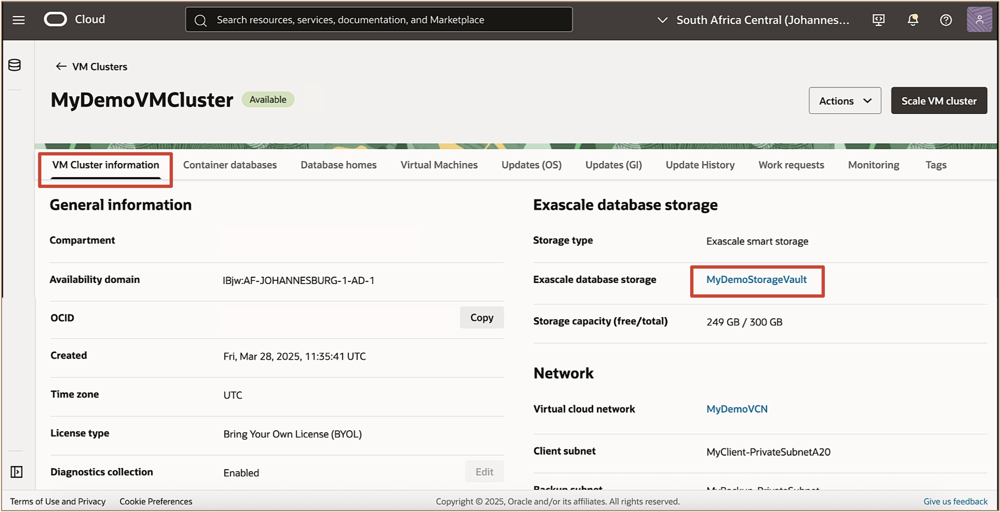
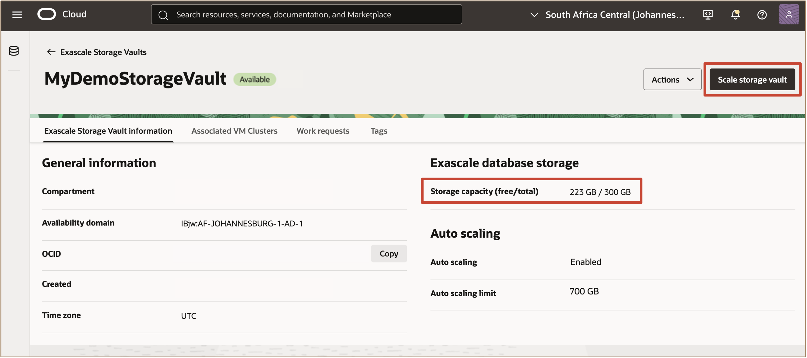
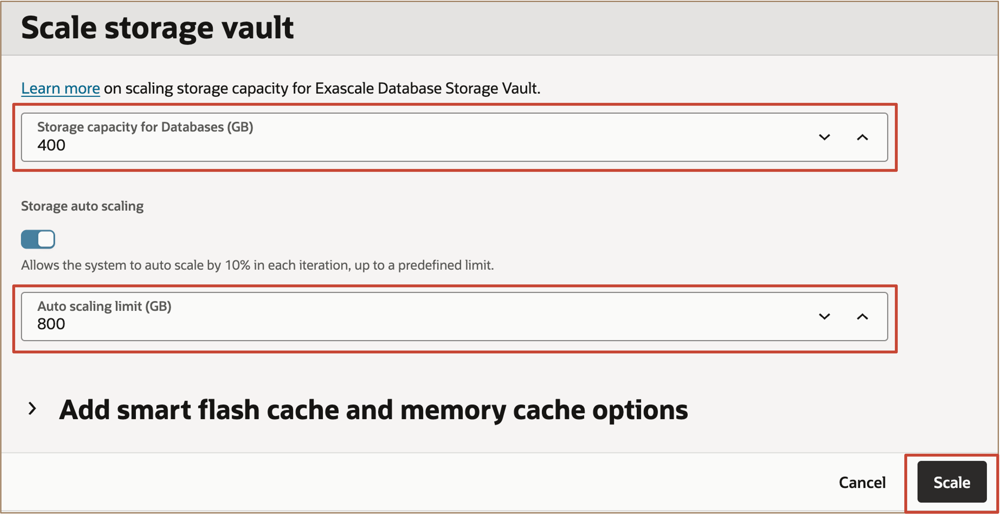
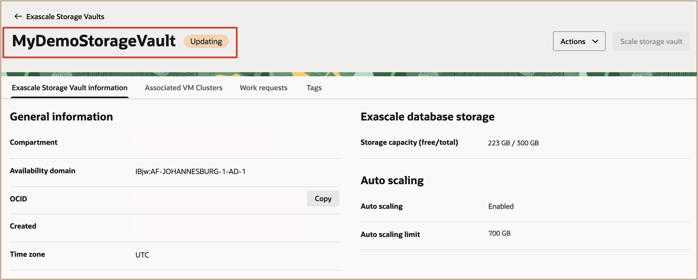
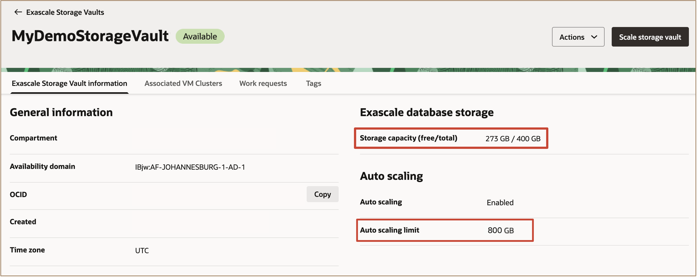

# Scale Exascale Storage Vault Resources

## FastLab Introduction

This lab walks you through the steps to Scale the Exascale Storage Vault Resources using the OCI Console. Users can now configure **Storage Auto Scaling** for Exascale Database Storage Vault on Oracle Exadata Database Service on Exascale Infrastructure. This feature enhances agility by allowing the Exascale Database Storage Vault to automatically expand as usage grows. Manual capacity increases are no longer necessary when the vault approaches its limits. Instead, storage scales dynamically, ensuring that mission-critical workloads continue to run smoothly, efficiently, and without interruption.

**Estimated Time:** ***10 minutes***

### Objectives

-   After completing this lab, you should be able to scale the Exascale Storage Vault Resources using the OCI Console.

### **Prerequisites**

This lab requires the completion of the following:

* Successful creation of a VM Cluster and Exascale Storage Vault on Exadata Database Service on Exascale Infrastructure.

## Task 1: Scale the Exascale Storage Vault Resources using the OCI Console

1. Navigate to your Exascale VM Cluster page. In the **VM Cluster information** tab, under the **Exascale database storage** section, click on the **Exascale database storage:** for example, ***MyDemoStorageVault***.
   
   
     
2. In the **Exascale Storage Vault details** page, click ***Scale Storage Vault***.

   

3. On the **Scale Storage Vault** page, enter a value for the desired storage capacity for databases. This number should be the value for the total storage that you want to have provisioned after the scaling operation completes.
   
   For this lab, enter the value of ***400*** for the ***Storage capacity for Databases (GB)***, and ***800*** for the ***Auto scaling limit (GB)*** as we will scale up the Exascale Database Storage Vault from **300 GB to 400 GB** and Auto scaling limit from **700 GB to 800 GB**.

   

   Click ***Scale***.

   The **Exascale Storage Vault details** page is now displayed. While the scale storage vault process is running, the lifecycle state of the Exascale storage vault shows ***UPDATING***.

   

   When the scale storage vault process completes, the state of the Exascale storage vault changes to ***AVAILABLE***.

   

   The **Exascale Storage Vault information** page displays information about the new allocated Exascale database storage.

***Congratulations!!!*** You may now **proceed to the next lab**.

## Signature Workshop

👉 Click here to [Start the Advanced Exascale Workshop](https://livelabs.oracle.com/ords/r/dbpm/livelabs/view-workshop?wid=4132)

This workshop contains labs that dive deeper into working with Oracle Exadata Database Service on Exascale Infrastructure.

## Learn More

* Click [here](https://docs.oracle.com/en-us/iaas/exadb-xs/doc/creating-exadb-xs-vault.html) to learn moreon how to Manage the Exascale Database Vaults.
* Click [here](https://docs.oracle.com/en-us/iaas/exadb-xs/doc/overview-exadb-xs-service.html) for access to the docuementation and Exadata Database Service on Exascale Infrastructure Overview.
* Click [here](https://blogs.oracle.com/exadata/advantages-of-exadata-exascale) to learn more about the advatages of Exadata Exascale.
* Click [here](https://docs.public.oneportal.content.oci.oraclecloud.com/en-us/iaas/exadata/doc/ecc-create-first-db.html) to learn more about Creating an Oracle Pluggable Database on Exadata Database Service on Exascale Infrastructure.
* Click [here](https://blogs.oracle.com/exadata/exascale-storage-fundamentals) to learn more about Exascale Storage Fundementals.

## Acknowledgements

* **Author** - Leo Alvarado, Tammy Bednar Product Management
  
* **Last Updated By** - Leo Alvarado, Product Management, Feb 2026.
