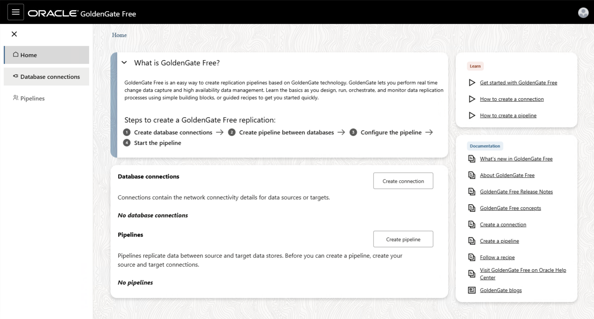

# Deploy GoldenGate Free and Oracle AI Database Free on OCI Compute

Welcome to this **LiveLabs FastLab** workshop.

LiveLabs FastLab workshops give you clear, step-by-step instructions to help you quickly gain hands-on experience with Oracle Database technologies. You will go from beginner to confident user in a short time.

Estimated Time: 25 minutes

## FastLab Introduction

Deploy Oracle GoldenGate Free and Oracle AI Database Free as containers on OCI Compute. GoldenGate enables real-time data replication and change data capture between databases. You'll set up a fully functional environment for data replication scenarios.

This FastLab prepares your environment for real-time data replication scenarios like transaction monitoring, compliance reporting, and live analytics.

### Prerequisites

- **OCI Compute** or **Windows** with:
    - Podman installed
- Minimum 16 GB RAM to run both containers

> **Important:** macOS with Apple Silicon is not supported. The GoldenGate Free container image is x86_64 only and does not run on ARM-based Macs.

> **Windows users:** See the [Appendix](#appendix-installing-podman-on-windows) for installation instructions, then skip to **Task 3**. Tasks 1 and 2 are for OCI Compute setup only. All commands in this lab use bash syntax. Run them in **WSL2** (Windows Subsystem for Linux), which is required for Podman on Windows. Open a WSL2 terminal by typing `wsl` in PowerShell or Command Prompt.

## Task 1: Create an OCI Compute Instance

GoldenGate deployments require a host environment where both the replication engine and source/target databases can communicate. In production, these components often run on separate servers for scalability. For this lab, you'll deploy everything on a single machine, giving you a complete, self-contained environment to learn GoldenGate's capabilities without complex networking.

> **Running on Windows?** If you're using Windows with Podman already installed via WSL2, skip to Task 3.

**For OCI Compute:** Create a Linux compute instance to host the GoldenGate Free and Oracle AI Database Free containers.

1. In the OCI Console, navigate to **Compute > Instances** and click **Create Instance**.

2. Configure the instance:

    | Setting | Value |
    |---------|-------|
    | Name | goldengate-free |
    | Compartment | Your compartment |
    | Image | Oracle Linux 9 |
    | Shape | VM.Standard.E5.Flex (1 OCPU, 16 GB RAM) |

    > Note: 16 GB RAM is recommended to run both database and GoldenGate containers.

3. Under **Networking**, select a public subnet.

4. Under **Add SSH keys**, upload your public SSH key or generate a new key pair. Download the private key if generated.

5. Click **Create** and wait for the instance to reach **Running** state.

6. Note the **Public IP Address** from the instance details page.

## Task 2: Connect and Install Podman

Containers provide a fast, repeatable way to deploy Oracle software without complex installation procedures. Podman is Oracle Linux's preferred container runtime—it's daemonless, rootless-capable, and fully compatible with Docker images. By using containers, you can have GoldenGate and Oracle Database running in minutes rather than hours.

Connect to your instance and install Podman.

1. SSH into your compute instance:

    ```bash
    <copy>
    ssh -i <your-private-key> opc@<public-ip-address>
    </copy>
    ```

2. Update the system packages:

    ```bash
    <copy>
    sudo dnf update -y
    </copy>
    ```

3. Install Podman:

    ```bash
    <copy>
    sudo dnf install -y podman
    </copy>
    ```

4. Verify Podman is installed:

    ```bash
    <copy>
    podman --version
    </copy>
    ```

    You should see output like `podman version 5.x.x`.

## Task 3: Deploy Oracle AI Database Free Container

Every GoldenGate deployment needs databases to replicate between. Oracle AI Database Free provides a fully-featured Oracle Database at no cost—perfect for development, testing, and learning. In this lab, you'll use a single database instance with separate schemas to simulate source and target environments, just as Seer Group Finance would separate their transactional and monitoring systems.

Pull and run the Oracle AI Database Free container.

1. Pull the Oracle AI Database Free image:

    ```bash
    <copy>
    sudo podman pull container-registry.oracle.com/database/free:latest
    </copy>
    ```

2. Run the Oracle AI Database Free container:

    ```bash
    <copy>
    sudo podman run -d --name oracle-db \
      -p 1521:1521 \
      -e ORACLE_PWD=Welcome1#GG23 \
      container-registry.oracle.com/database/free:latest
    </copy>
    ```

3. Wait for the database to be ready (this takes 2-5 minutes). Check the logs:

    ```bash
    <copy>
    sudo podman logs -f oracle-db
    </copy>
    ```

    Wait until you see `DATABASE IS READY TO USE!` then press `Ctrl+C` to exit the logs.

4. Get the container's IP address for GoldenGate to connect:

    ```bash
    <copy>
    sudo podman inspect oracle-db --format '{{.NetworkSettings.IPAddress}}'
    </copy>
    ```

    Note this IP address (e.g., `10.88.0.x`) - you'll need it for the GoldenGate connection.

    > Note: Both containers run on Podman's internal bridge network. GoldenGate connects to the database using this internal network IP, not the host's public IP. This allows container-to-container communication without exposing the database externally.

## Task 4: Deploy GoldenGate Free Container

GoldenGate Free is Oracle's entry-level replication solution, offering the same core change data capture technology used by enterprises worldwide—now available at no cost. The container includes a modern web-based console for configuration and monitoring, eliminating the need for command-line expertise. This is the same interface used in GoldenGate Cloud Service and enterprise deployments.

Pull and run the GoldenGate Free container.

1. Pull the GoldenGate Free image:

    ```bash
    <copy>
    sudo podman pull container-registry.oracle.com/goldengate/goldengate-free:latest
    </copy>
    ```

2. Run the GoldenGate Free container:

    ```bash
    <copy>
    sudo podman run -d --name goldengate-free \
      -p 80:80 \
      -p 443:443 \
      -e OGG_ADMIN=oggadmin \
      -e OGG_ADMIN_PWD=Welcome1#GG23 \
      -e OGG_DEPLOYMENT=Deployment \
      container-registry.oracle.com/goldengate/goldengate-free:latest
    </copy>
    ```

3. Verify the container is running:

    ```bash
    <copy>
    sudo podman ps
    </copy>
    ```

    You should see both `oracle-db` and `goldengate-free` containers in the list.

4. Wait approximately 2 minutes for GoldenGate services to fully start. Check the logs:

    ```bash
    <copy>
    sudo podman logs goldengate-free
    </copy>
    ```

    Look for the "The deployment is READY" message.

## Task 5: Configure Network Access

OCI Compute instances are secure by default—both the OS firewall and OCI Security Lists block inbound traffic until explicitly allowed. For GoldenGate's web console, you need to open ports 80 (HTTP redirect) and 443 (HTTPS). You'll also open port 1521 so you can optionally connect to the database from desktop tools like SQL Developer for testing and development.

Open ports 80 and 443 on both the compute instance firewall and OCI Security List.

1. On the compute instance, open the GoldenGate and database ports in the firewall:

    ```bash
    <copy>
    sudo firewall-cmd --permanent --add-port=80/tcp
    sudo firewall-cmd --permanent --add-port=443/tcp
    sudo firewall-cmd --permanent --add-port=1521/tcp
    sudo firewall-cmd --reload
    sudo firewall-cmd --list-ports
    </copy>
    ```

    Verify that `80/tcp`, `443/tcp`, and `1521/tcp` appear in the output.

    > Note: Port 1521 allows you to connect to the database using desktop tools like SQL Developer.

2. In the OCI Console, navigate to **Networking > Virtual Cloud Networks**.

3. Click on your VCN, then click on your **Public Subnet**.

4. Click on the **Security List** attached to the subnet.

5. Click **Add Ingress Rules** and add:

    | Setting | Value |
    |---------|-------|
    | Source CIDR | 0.0.0.0/0 (or your IP for security) |
    | Destination Port Range | 80,443,1521 |
    | Description | GoldenGate Console and Database |

6. Click **Add Ingress Rules**.

## Task 6: Access GoldenGate Console

The GoldenGate web console is your command center for managing replication. From here, you'll create database connections, define replication pipelines, monitor data flow, and troubleshoot issues. This final verification confirms your environment is ready for the Transaction Monitoring FastLab, where you'll configure actual replication between Seer Group Finance's schemas.

Verify you can access the GoldenGate web console.

1. Open a browser and navigate to:

    ```
    https://<your-compute-public-ip>
    ```

2. Accept the self-signed certificate warning.

3. Log in with:

    | Field | Value |
    |-------|-------|
    | Username | oggadmin |
    | Password | Welcome1#GG23 |

4. You should see the GoldenGate Service Manager console with the "Deployment" deployment listed.

    

You now have both Oracle AI Database Free and GoldenGate Free running on your compute instance. Proceed to the Transaction Monitoring FastLab to configure real-time replication.

## Summary

You have deployed:

| Component | Container Name | Port | Purpose |
|-----------|---------------|------|---------|
| Oracle AI Database Free | oracle-db | 1521 | Source and target database |
| GoldenGate Free | goldengate-free | 80, 443 | Replication engine |

## Appendix: Installing Podman on Windows

We recommend installing **Podman Desktop**, which provides a graphical interface and simplifies container management. While there are other ways to install Podman, Podman Desktop handles WSL2 integration automatically and makes troubleshooting easier.

**Step 1: Install Podman Desktop in Windows**

Using Winget in PowerShell:

```powershell
<copy>
winget install RedHat.Podman
</copy>
```

Or using [Chocolatey](https://chocolatey.org/install) in an elevated PowerShell:

```powershell
<copy>
choco install podman-desktop
</copy>
```

**Step 2: Initialize Podman machine**

```powershell
<copy>
podman machine init
podman machine start
</copy>
```

**Step 3: Open WSL2 and run lab commands**

Open WSL2 by typing `wsl` in PowerShell. All lab commands should be run in WSL2.

> **Note:** When using Podman in WSL2, you may need to use `podman` instead of `sudo podman` depending on your configuration. If a command fails with permission errors, try removing `sudo`.

## Appendix: Clean Up Your Environment

When you're finished with the lab, follow these steps to stop and remove the containers and free up resources.

**Step 1: Stop the containers**

```bash
<copy>
sudo podman stop goldengate-free oracle-db
</copy>
```

**Step 2: Remove the containers**

```bash
<copy>
sudo podman rm goldengate-free oracle-db
</copy>
```

**Step 3: (Optional) Remove the container images**

If you want to free up disk space, remove the downloaded images:

```bash
<copy>
sudo podman rmi container-registry.oracle.com/goldengate/goldengate-free:latest
sudo podman rmi container-registry.oracle.com/database/free:latest
</copy>
```

**Step 4: (OCI Compute only) Terminate the compute instance**

If you created an OCI Compute instance for this lab and no longer need it:

1. In the OCI Console, navigate to **Compute > Instances**.
2. Click on your **goldengate-free** instance.
3. Click **More Actions > Terminate**.
4. Check **Permanently delete the attached boot volume** if you don't need to preserve the data.
5. Click **Terminate Instance**.

## Signature Workshop

Ready to dive deeper? This workshop provides comprehensive GoldenGate training.

👉 [GoldenGate Microservices on Marketplace](https://livelabs.oracle.com/pls/apex/dbpm/r/livelabs/view-workshop?wid=585)

## Learn More

* [GoldenGate Free Documentation](https://docs.oracle.com/en/middleware/goldengate/free/)
* [Oracle AI Database Free Documentation](https://docs.oracle.com/en/database/oracle/oracle-database-free/)
* [GoldenGate Free Container Image](https://container-registry.oracle.com/ords/ocr/ba/goldengate/goldengate-free)
* [Oracle AI Database Free Container Image](https://container-registry.oracle.com/ords/ocr/ba/database/free)

## Acknowledgements
* **Author** - Oracle LiveLabs Team
* **Last Updated By/Date** - Oracle LiveLabs, January 2026
