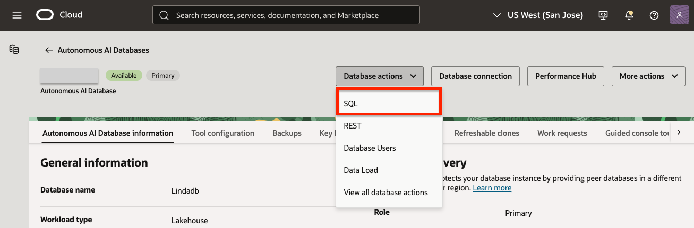
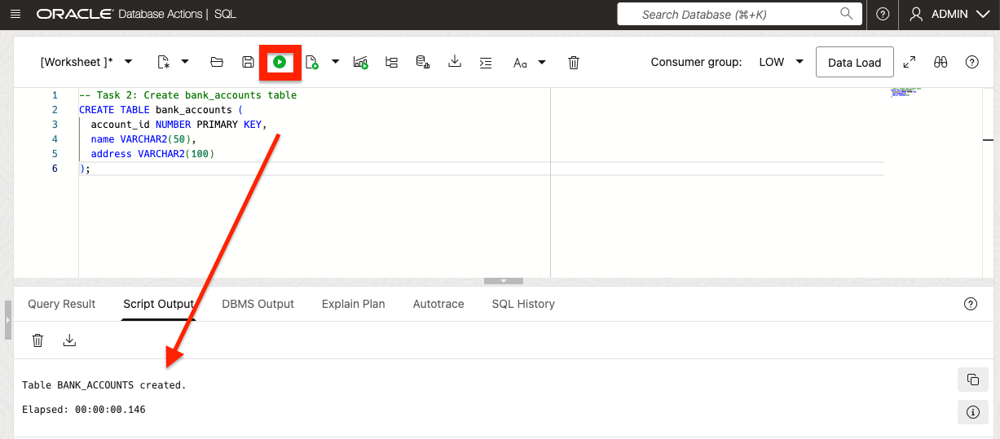
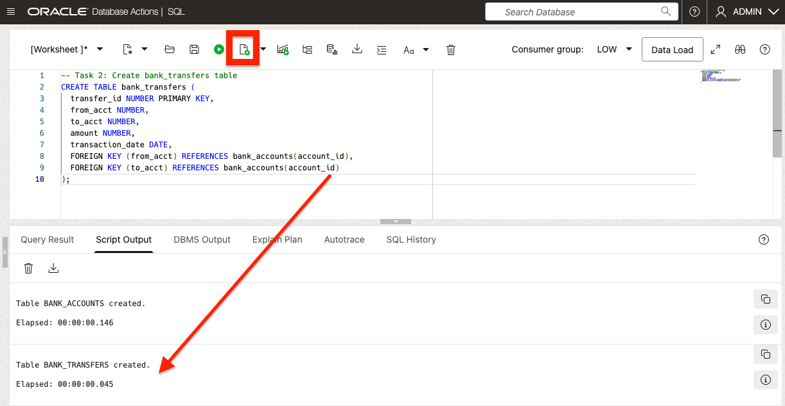
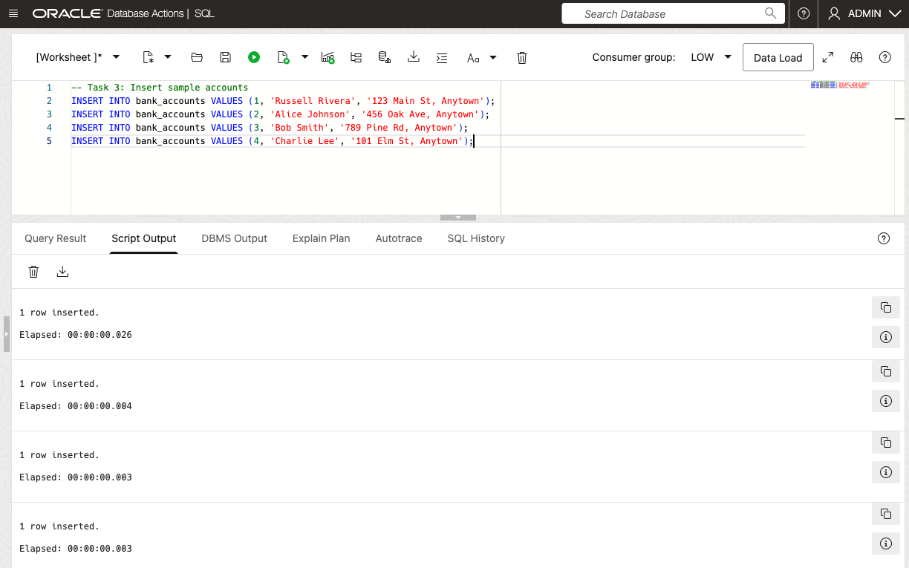
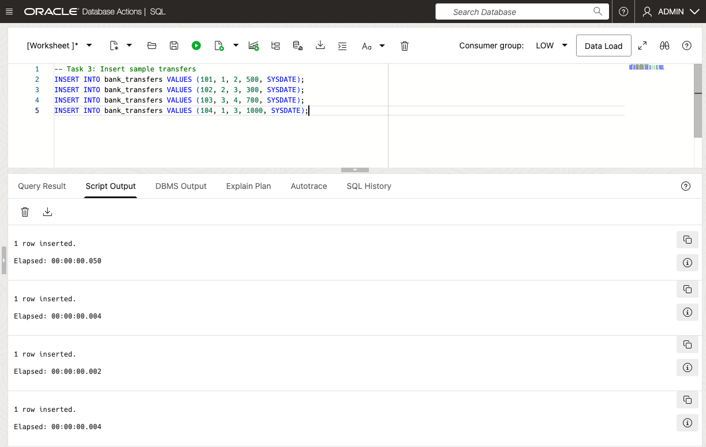
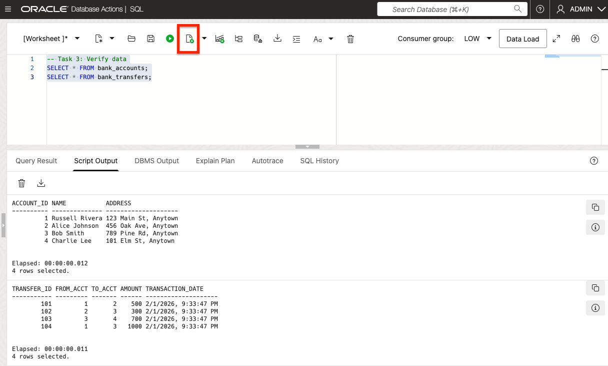
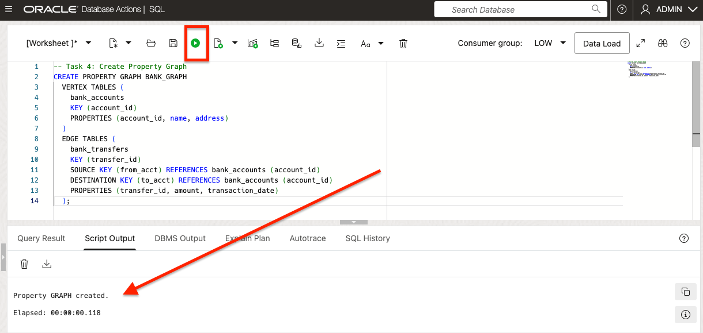
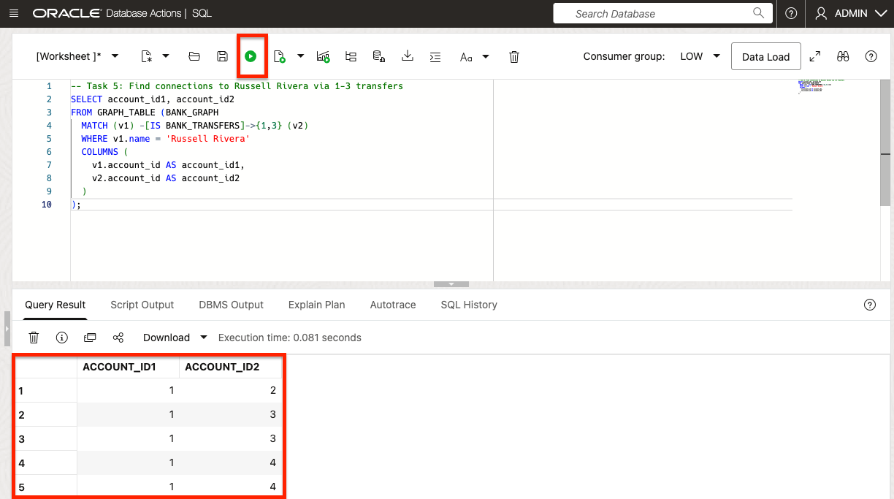
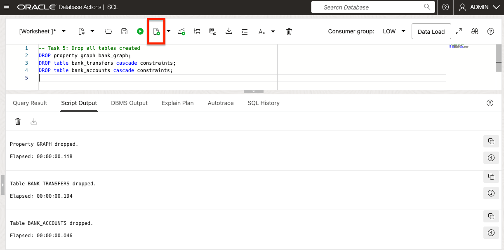

# Oracle AI Database Graph: Trace Money Flows to Detect Fraud

Welcome to this **LiveLabs FastLab** workshop.

LiveLabs FastLab workshops give you clear, step-by-step instructions to help you quickly gain hands-on experience with the Oracle AI Database. You will go from beginner to confident user in a short time.

Estimated Time: 15 minutes

## FastLab Introduction

Seer Group is a conglomerate spanning multiple vertical industries including finance, retail, manufacturing, and healthcare. In the finance division, detecting fraud requires tracing money flows across accounts to find suspicious patterns that traditional SQL queries miss.

This workshop focuses on working with property graphs in Oracle AI Database. You will create a graph from two tables containing bank account and transaction data. You will then run graph pattern queries in SQL to find circular payment chains and multi-hop paths—the kind of hidden connections that reveal fraud rings.

[JSON](videohub:1_tap06zvk)

### Prerequisites

- An Oracle Autonomous AI Database

  - Check our [LiveLabs FastLab - Create an Autonomous AI Database. Fast!](https://livelabs.oracle.com/pls/apex/dbpm/r/livelabs/view-workshop?wid=4276)

## Task 1: Launch SQL Worksheet

Seer Group's fraud analysts work directly with SQL to investigate suspicious activity. Database Actions provides a browser-based SQL environment where you can run queries against your Autonomous Database without installing any tools.

1. In the ADB Console, click **Database Actions** and select **SQL**.

    

## Task 2: Create Tables for Banking Data

Seer Group's finance division stores customer accounts and transaction history in relational tables. These two tables—accounts and transfers—form the foundation for fraud detection. The transfer table captures who sent money to whom, which becomes critical when tracing suspicious flows.

1. Create the `bank_accounts` table to store account details.

   ```sql
   <copy>
   -- Task 2: Create bank_accounts table
   CREATE TABLE bank_accounts (
     account_id NUMBER PRIMARY KEY,
     name VARCHAR2(50),
     address VARCHAR2(100)
   );
   </copy>
   ```

  

2. Create the `bank_transfers` table to store transfer relationships.

   ```sql
   <copy>
   -- Task 2: Create bank_transfers table
   CREATE TABLE bank_transfers (
     transfer_id NUMBER PRIMARY KEY,
     from_acct NUMBER,
     to_acct NUMBER,
     amount NUMBER,
     transaction_date DATE,
     FOREIGN KEY (from_acct) REFERENCES bank_accounts(account_id),
     FOREIGN KEY (to_acct) REFERENCES bank_accounts(account_id)
   );
   </copy>
   ```

   

## Task 3: Insert Sample Data

This sample data simulates a fraud investigation scenario. Russell Rivera is a person of interest, and the transfers create a chain of money movement: Russell → Alice → Bob → Charlie. Fraud analysts need to trace these indirect connections to understand how money flows through intermediaries.

1. Insert sample accounts.

   ```sql
   <copy>
   -- Task 3: Insert sample accounts
   INSERT INTO bank_accounts VALUES (1, 'Russell Rivera', '123 Main St, Anytown');
   INSERT INTO bank_accounts VALUES (2, 'Alice Johnson', '456 Oak Ave, Anytown');
   INSERT INTO bank_accounts VALUES (3, 'Bob Smith', '789 Pine Rd, Anytown');
   INSERT INTO bank_accounts VALUES (4, 'Charlie Lee', '101 Elm St, Anytown');
   </copy>
   ```

  

2. Insert sample transfers to create connections (e.g., Russell -> Alice -> Bob -> Charlie).

   ```sql
   <copy>
   -- Task 3: Insert sample transfers
   INSERT INTO bank_transfers VALUES (101, 1, 2, 500, SYSDATE);
   INSERT INTO bank_transfers VALUES (102, 2, 3, 300, SYSDATE);
   INSERT INTO bank_transfers VALUES (103, 3, 4, 700, SYSDATE);
   INSERT INTO bank_transfers VALUES (104, 1, 3, 1000, SYSDATE);
   </copy>
   ```

  

3. Verify the data.

   ```sql
   <copy>
   -- Task 3: Verify data
   SELECT * FROM bank_accounts;
   SELECT * FROM bank_transfers;
   </copy>
   ```



## Task 4: Create a Property Graph

Traditional SQL requires complex self-joins to trace multi-hop transfers—and performance degrades exponentially with each hop. A property graph solves this by modeling accounts as vertices (nodes) and transfers as edges (connections). Once created, you can traverse any number of hops with simple, readable queries.

1. Create the property graph `BANK_GRAPH` as a view on the relational tables.

   ```sql
   <copy>
   -- Task 4: Create Property Graph
   CREATE PROPERTY GRAPH BANK_GRAPH
     VERTEX TABLES (
       bank_accounts
       KEY (account_id)
       PROPERTIES (account_id, name, address)
     )
     EDGE TABLES (
       bank_transfers
       KEY (transfer_id)
       SOURCE KEY (from_acct) REFERENCES bank_accounts (account_id)
       DESTINATION KEY (to_acct) REFERENCES bank_accounts (account_id)
       PROPERTIES (transfer_id, amount, transaction_date)
     );
   </copy>
   ```

  

## Task 5: Query the Graph to Uncover Connections

Now for the payoff: finding hidden connections. Using `GRAPH_TABLE`, fraud analysts can ask questions like "Who received money from Russell Rivera within 3 transfers?" This type of query would require multiple self-joins in traditional SQL, but graph queries express it naturally and execute efficiently.

1. Simple query: Find direct transfers from any account.

   ```sql
   <copy>
   -- Task 5: Simple graph query - direct transfers
   SELECT *
   FROM GRAPH_TABLE (BANK_GRAPH
     MATCH (s) -[e IS BANK_TRANSFERS]-> (d)
     COLUMNS (
       s.name AS source_name,
       d.name AS dest_name,
       e.amount AS transfer_amount
     )
   );
   </copy>
   ```
  
  

2. Advanced query: Find accounts connected to Russell Rivera within 1-3 hops (as in the use case).

   ```sql
   <copy>
   -- Task 5: Find connections to Russell Rivera via 1-3 transfers
   SELECT account_id1, account_id2
   FROM GRAPH_TABLE (BANK_GRAPH
     MATCH (v1) -[IS BANK_TRANSFERS]->{1,3} (v2)
     WHERE v1.name = 'Russell Rivera'
     COLUMNS (
       v1.account_id AS account_id1,
       v2.account_id AS account_id2
     )
   );
   </copy>
   ```

  


   This reveals indirect connections, such as paths through Alice or directly to Bob, in milliseconds—impossible with traditional SQL joins for deeper traversals.

3. Clean-up tables and components created

 ```sql
  <copy>
  -- Task 5: Drop all tables created
  DROP property graph bank_graph;
  DROP table bank_transfers cascade constraints;
  DROP table bank_accounts cascade constraints;
  <copy>
  ```

  

## Summary

In this FastLab, you created a property graph from relational banking data and used SQL graph queries to trace money flows across multiple accounts. Here's what you accomplished:

- **Created relational tables** to store accounts and transfers—the same structure Seer Group's finance division uses
- **Built a property graph** that models accounts as vertices and transfers as edges, without copying data
- **Queried multi-hop paths** to find all accounts connected to a person of interest within 1-3 transfers

**Why this matters for fraud detection:**

| Traditional SQL | Property Graph |
|-----------------|----------------|
| Requires complex self-joins for each hop | Simple `MATCH` pattern for any depth |
| Performance degrades exponentially | Consistent performance at scale |
| Hard to read and maintain | Intuitive, relationship-focused syntax |

Seer Group's fraud analysts can now answer questions like "Who is connected to this suspicious account?" in milliseconds—even across millions of transactions.

**Impact on end user applications:**

Property graphs power features that end users interact with daily. For Seer Group's finance customers, this means real-time fraud alerts that catch suspicious patterns before transactions complete. Behind the scenes, graph queries run in milliseconds to check if a transaction connects to known fraud rings—something users experience as instant, seamless protection.

The same technology enables personalized recommendations in retail ("customers who bought X also bought Y"), optimized delivery routes in manufacturing, and care coordination in healthcare. End users see faster responses, smarter suggestions, and better outcomes—all powered by graph queries running against their relational data.

## Signature Workshop

Ready to dive deeper? These workshops move you from demo to hands-on practice.

👉 [Explore Operational Property Graphs in Oracle AI Database](https://livelabs.oracle.com/ords/r/dbpm/livelabs/view-workshop?wid=3978)

## Learn More

* [Oracle AI Database Graph Documentation](https://docs.oracle.com/en-us/iaas/autonomous-database-serverless/doc/graph-autonomous-database.html)
* [Property Graph Queries in SQL](https://docs.oracle.com/en/database/oracle/property-graph/23.2/spgdg/sql-property-graphs.html)
* [Try Oracle Autonomous AI Database Free](https://www.oracle.com/autonomous-database/free-trial/)

## Acknowledgements
* **Author** - Linda Foinding, Principal Product Manager, Database Product Management
* **Last Updated By/Date** - Linda Foinding, February 2026