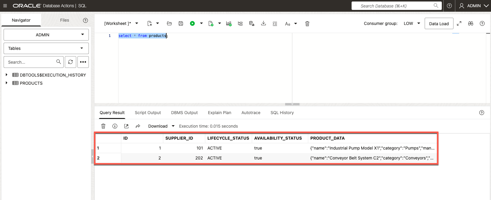
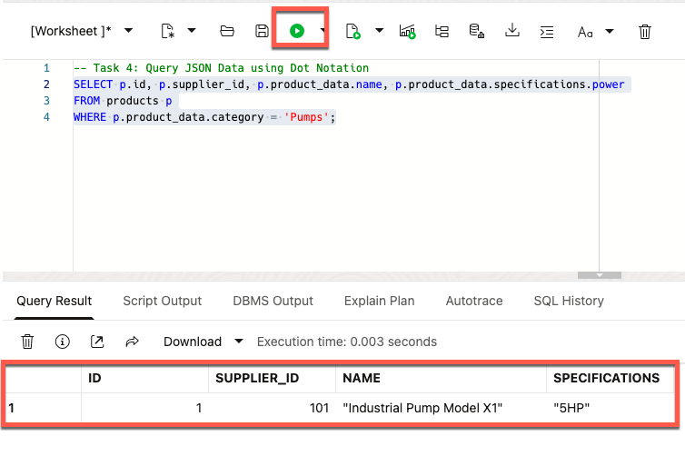
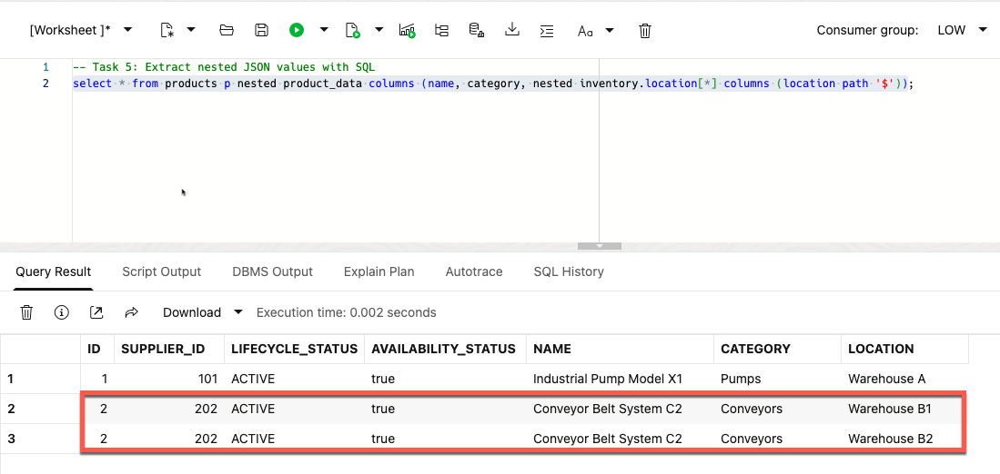
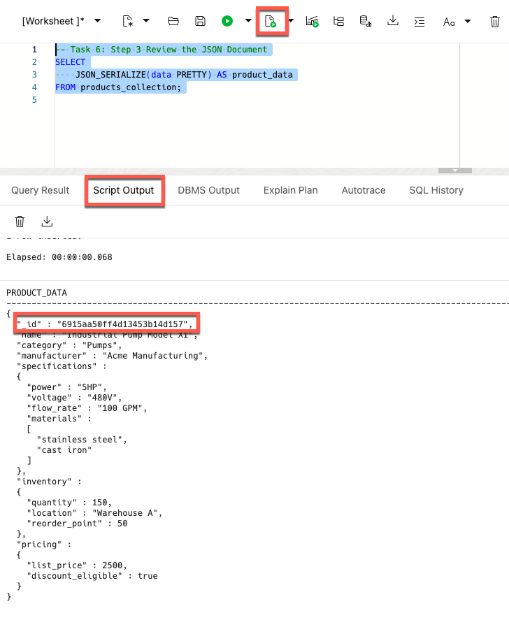
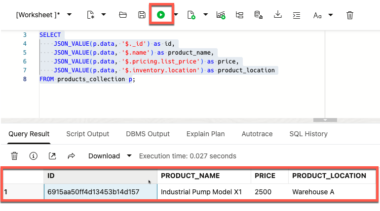

# How to use JSON Data Type, JSON Collections, and JSON Duality Views in Oracle AI Database

Welcome to this **LiveLabs FastLab** workshop.


LiveLabs FastLab workshops give you clear, step-by-step instructions to help you quickly gain hands-on experience with the Oracle AI Database. You will go from beginner to confident user in a short time.

Estimated Time: 15 minutes

## FastLab Introduction

Today’s apps thrive on multi-faceted data and agile development cycles.

**JSON documents** are lightweight, easy to read, and work with nearly every programming language. Its real power? Simplicity and flexibility. **JSON drives modern APIs, stores app configurations, and handles evolving data with ease**.

Now imagine merging that flexibility with the efficiency and versatility of relational databases. **The embedding of JSON documents and native data types in Oracle AI Database** makes that not just possible but simple.

In 15 minutes, you’ll learn to store, query, and update JSON alongside relational data in Oracle AI Database.

### Prerequisites

- An Oracle Autonomous AI Database

  - Check our [LiveLabs FastLab - Create an Autonomous AI Database. Fast!](https://livelabs.oracle.com/pls/apex/dbpm/r/livelabs/view-workshop?wid=4276)


[JSON](videohub:1_ic97k4pb)


## Task 1: Launch SQL Worksheet

You will use Database Actions as your SQL workspace. This task opens SQL Worksheet so you can run the rest of the lab.

1. Click the SQL option in Database Actions

    

## Task 2: Create a table to store relational and JSON documents side by side in native formats

Oracle AI Database stores JSON as native data, not as text. This task shows you how to treat JSON as a real datatype inside a relational table. A JSON column gives your table room to grow: you can add fields, change structure, or store new attributes without redesigning the schema. Assume all current and future table attributes are covered.

1. This example creates a simple product catalog table for a manufacturing company. The *product_data* column holds a JSON document so you can store product details without fixing the structure in advance.

    ```sql
    <copy>
    --Task 2: Create a table with a column of type JSON
    DROP TABLE IF EXISTS products ;
    CREATE TABLE products (
        id         NUMBER GENERATED BY DEFAULT AS IDENTITY PRIMARY KEY,
        supplier_id        NUMBER,
        lifecycle_status   VARCHAR2(10),
        availability_status BOOLEAN,
        product_data       JSON
    );
    </copy>
    ```

## Task 3: Insert JSON Documents into table

This task inserts JSON documents with different shapes into the *product\_data* column. Each document models a product with nested specifications. The variation shows why the JSON column exists: you can store rich product details without redesigning the schema. At the same time, you can still populate relational columns such as *supplier\_id* or *lifecycle\_status*, which hold consistent attributes every product should have.

1. Insert a document that represents a manufacturing product with nested specifications.  


    ```sql
    <copy>
    --Task 3: Insert a document that represents a manufacturing product with nested specifications. 
    INSERT INTO products (
    supplier_id,
    lifecycle_status,
    availability_status,
    product_data
    ) VALUES (
        101,
        'ACTIVE',
        TRUE,
        JSON('{
            "name": "Industrial Pump Model X1",
            "category": "Pumps",
            "manufacturer": "Acme Manufacturing",
            "specifications": {
                "power": "5HP",
                "voltage": "480V",
                "flow_rate": "100 GPM",
                "materials": ["stainless steel", "cast iron"]
            },
            "inventory": {
                "quantity": 150,
                "location": "Warehouse A",
                "reorder_point": 50
            },
            "pricing": {
                "list_price": 2500.00,
                "discount_eligible": true
            }
        }')
    );
    </copy>
    ```
    <!--  -->

2. Insert another document that represents manufacturing product with nested specifications.  

    >Note how the attributes in the specifications are different from the 1st document we loaded.  

    ```sql
    <copy>
    --Task 3: Insert a document that represents a manufacturing product with nested specifications. 
    INSERT INTO products (
        supplier_id,
        lifecycle_status,
        availability_status,
        product_data
    ) VALUES (
        202,
        'ACTIVE',
        TRUE,
        JSON('{
            "name": "Conveyor Belt System C2",
            "category": "Conveyors",
            "manufacturer": "TechConvey Inc",
            "specifications": {
                "length": "50ft",
                "width": "24in",
                "belt_type": "modular plastic",
                "speed": "200 ft/min"
            },
            "inventory": {
                "quantity": 25,
                "location": ["Warehouse B1", "Warehouse B2"],
                "reorder_point": 10
            },
            "pricing": {
                "list_price": 15000.00,
                "discount_eligible": false
            }
        }')
    );
    </copy>
    ```

    3. Verify that we have indeed two entries in our PRODUCTS table:

    ```sql
    <copy>
        select * from products;
    </copy>
    ```

     

## Task 4: Query JSON Data using Dot Notation

Dot notation lets you read JSON fields as if they were columns. In this task, you filter products by a JSON attribute (*category*) and pull a nested value (*specifications.power*) with simple SQL. You also return relational columns (*id* and *supplier\_id*) to show how easily you can query relational and JSON data in the same statement.


1. Use Dot Notation to find all of the Pumps in the products table

    ```sql
    <copy>
    -- Task 4: Query JSON Data using Dot Notation
    SELECT p.id, p.supplier_id, p.product_data.name, p.product_data.specifications.power
    FROM products p
    WHERE p.product_data.category = 'Pumps';
    </copy>
    ```

    


## Task 5: Extract nested JSON values with SQL

SQL/JSON functions let you pull values from nested structures, even when arrays or repeated fields are involved. This task shows how to traverse a JSON array inside your document and return each nested value as a row. You see how the database handles complex JSON shapes without rewriting the schema or reshaping your data first.

1. Extract the product name, list price, and location from the JSON Documents:

    ```sql
    <copy>
    -- Task 5: Extract nested JSON values with SQL
    select * from products p nested product_data columns (name, category, nested inventory.location[*] columns (location path '$'));
    </copy>
    ```

    >Note that the query returns two rows for id = 2 because this product is stored in two warehouses. Its JSON document contains an array of locations, and each array element becomes its own row in the result.

    

## Task 6: Work with JSON Collections

A JSON Collection stores documents without a fixed schema. Every document sits in a single JSON column, and the database assigns each one a unique _id (unless it is provided). Unlike a relational table with a JSON column, a JSON Collection behaves like a document store: you load documents as they come, and you query them with SQL or non-SQL APIs. This task shows how to create a collection, insert a document, and query it like you would in a document database.

> Note: A collection table (or collection view) is also accessible via non-SQL APIs. Notably the Oracle AI Database API for MongoDB and Oracle SODA and REST APIs all natively support collections, making Oracle AI Database a great document databases. [Read more here](https://www.oracle.com/database/mongodb-migration/).

1. Let's create our products table as a JSON Collection table.

    ````sql
    <copy>
    -- Task 6: Step 1 Work with JSON Collections
    CREATE JSON COLLECTION TABLE PRODUCTS_COLLECTION;
    </copy>
    ```


2. Now let's insert a JSON Document into the collection table that represents a manufacturing product with nested specifications.


    ````sql
    <copy>
    -- Task 6: Step 2 Work with JSON Collections
    INSERT INTO products_collection (DATA) VALUES (
        JSON('{
            "name": "Industrial Pump Model X1",
            "category": "Pumps",
            "manufacturer": "Acme Manufacturing",
            "specifications": {
                "power": "5HP",
                "voltage": "480V",
                "flow_rate": "100 GPM",
                "materials": ["stainless steel", "cast iron"]
            },
            "inventory": {
                "quantity": 150,
                "location": "Warehouse A",
                "reorder_point": 50
            },
            "pricing": {
                "list_price": 2500.00,
                "discount_eligible": true
            }
        }')
    );
    </copy>
    ```

3. Let us review the JSON document in the database. You will find the additional field _id in the document. This was assigned automatically by the database, which ultimately makes it document-store compliant.

    ````sql
    <copy>
    -- Task 6: Step 3 Review the JSON Document
    SELECT
        JSON_SERIALIZE(data PRETTY) AS product_data
    FROM products_collection;
    </copy>
    ```

    


4. Now let's query the JSON Collection table to extract the product name, list price, and inventory location from the JSON Documents. Note, that the query contains *_id*. This is the unique field assigned automatically by the database.

    ````sql
    <copy>
    -- Task 6: Step 4 Work with JSON Collections
    SELECT
        JSON_VALUE(p.data, '$._id') as id,
        JSON_VALUE(p.data, '$.name') as product_name,
        JSON_VALUE(p.data, '$.pricing.list_price') as price,
        JSON_VALUE(p.data, '$.inventory.location') as product_location
    FROM products_collection p;
    </copy>
    ```

    


Congratulations!!!  
You’ve now used JSON in two ways: inside a relational table and inside a native JSON Collection. The table gave you structure with room to grow; the collection gave you schema-free storage with a document-store feel.

Next, you’ll see a third model: treating relational data itself as JSON through a Duality View.

## Task 7: Expose Relational Data through JSON Relational Duality View

Relational tables store data with structure and rules; JSON gives you flexible documents. A JSON Relational Duality View joins both worlds. It lets you treat relational data as JSON without writing joins, views, or custom APIs. Applications can read or update a single JSON document, and the database handles the relational inserts, updates, and constraints for you.

In this task, you build two relational tables and then create a Duality View that presents them as a single JSON document model.

1. Create relational tables for **orders** and **order\_items**

    ````sql
    <copy>
    --Task 7, Step 1: Create a Duality View that allows you to work with relational data using JSON format.
    CREATE TABLE orders (
        order_id NUMBER PRIMARY KEY,
        customer_name VARCHAR2(50),
        status VARCHAR2(20)
    );
    </copy>
    ```

    ````sql
    <copy>
    --Task 7, Step 1: Create a Duality View that allows you to work with relational data using JSON format.
    CREATE Table order_items (
        order_id NUMBER,
        item_name VARCHAR2(100),
        qty NUMBER,
        price NUMBER,
        CONSTRAINT fk_order FOREIGN KEY (order_id) REFERENCES orders(order_id),
        CONSTRAINT t_pk primary key (order_id, item_name) 
    );
    </copy>
    ```

2. Insert Sample Data into Orders and Order_Items tables

    Insert 4 orders for use in our examples

    ````sql
    <copy>
    --Task 7, Step 2.1: Insert 4 orders for use in our examples
    INSERT INTO orders (order_id, customer_name, status)
    VALUES (101, 'Alpha Company', 'Open'),
            (102, 'Beta Company', 'Shipped'),
            (103, 'Charlie Company', 'Open'),
            (104, 'Delta Company', 'Shipped');
    </copy>
    ```

   Insert Order Items for each customers order

    ````sql
    <copy>
    --Task 7, Step 2.2: Insert Order Items for each customers order
    INSERT INTO order_items (order_id, item_name, qty, price)
    VALUES (101, 'Conveyor Belt', 1, 1299),
            (101, 'Industrial Pump', 1, 3790),
            (102, 'Bearing', 10, 7.25),
            (102, 'Conveyor Belt', 2, 1299),
            (103, 'Industrial Pump', 2, 3790),
            (103, 'Bearing', 20, 7.25),
            (104, 'Conveyor Belt', 4, 1299);
    </copy>
    ```

3. Create a JSON Duality View on top of the *orders* and *order\_items* tables. The view acts as a JSON window into both tables. We declare the *\_id* field explicitly, because Duality Views do not auto-generate document identifiers. JSON Collection tables can assign *\_id* automatically; Duality Views cannot. Every document you insert must include its own *\_id*.  
**This makes JSON Duality Views compatible with document-store APIs out of the box.**

    ````sql
    <copy>
    --Task 7, Step 3.1: Create a Duality View that allows you to work with relational data using JSON format.
    CREATE or REPLACE JSON RELATIONAL DUALITY VIEW orders_dv AS
    SELECT JSON {
        '_id'          : o.order_id,
        'customer'     : o.customer_name,
        'status'       : o.status,
        'items'         :
            [ SELECT JSON { 'Order_ID' : i.order_id,
                            'ItemName' : i.item_name,
                            'Qty'      : i.qty,
                            'Price'    : i.price}
            FROM order_items i WITH UPDATE INSERT DELETE
            WHERE i.order_id = o.order_id
            ]}
    FROM orders o WITH UPDATE INSERT DELETE;
    </copy>
    ```

    ***Alternatively***, you can also create the Duality View via GraphQL Syntax

    ````sql
    <copy>
    --Task 7, Step 3.2: Create a Duality View that allows you to work with relational data using JSON format.
    CREATE OR REPLACE JSON RELATIONAL DUALITY VIEW orders_dv
    AS orders @INSERT @UPDATE @DELETE
    {
        _id      : order_id,
        customer : customer_name,
        status   : status,
        items    : order_items @INSERT @UPDATE @DELETE
            [ {
                Order_ID : order_id,
                ItemName : item_name,
                Qty      : qty,
                Price    : price
                }
            ]
    };
    </copy>
    ```

## Task 8: Query the JSON Duality View

A Duality View lets you query relational data as JSON without writing joins, building custom JSON views, or creating an API layer. In this task, you read the full JSON document, pretty-print it for clarity, and filter it by JSON fields. You see how the database assembles nested relational data into a single JSON structure automatically.

1. Access all customer orders from JSON Duality View

    ````sql
    <copy>
    -- Task 8, Step 1: Query the JSON Duality View
    SELECT * FROM orders_dv;
    </copy>
    ```

    >Note that this query returns the JSON data formatted as a flat string


2. Now let us return the orders data in a more human readable format

    ````sql
    <copy>
    --Task 8, Step 2: Query the JSON Duality View
    SELECT json_serialize(data PRETTY) FROM orders_dv;
    </copy>
    ```

    >Note how the query uses the Oracle database function **json_serialize** to access the JSON data stored in the database and return it as text, and uses the **PRETTY** keyword to format the JSON data output with indentation for better readability;


3. Now lets filter the order data to return just the orders that have **Shipped**

    ````sql
    <copy>
    -- Task 8, Step 3: Find orders that have 'Shipped'
    SELECT json_serialize(data PRETTY) FROM orders_dv dv WHERE dv.data.status ='Shipped';
    </copy>
    ```

    >Note that based on our sample data, this returns the expected 2 rows that shipped


## Task 9: Update Data via Duality View

A Duality View lets you update relational data by editing a single JSON document. The database handles the relational changes for you. No joins, no multi-table updates, and no custom logic. In this task, you update a JSON field and watch the corresponding relational rows change automatically. This shows how JSON Duality Views keep JSON and relational data in sync without extra code.

1. Update the Status to **Shipped** for **Alpha Company** Order through Duality View

    ````sql
    <copy>
    -- Task 9, Step 1: Update Data via Duality View
    UPDATE orders_dv
    SET data = JSON_TRANSFORM(data, SET '$.status' = 'Shipped')
    WHERE JSON_VALUE(data, '$.customer') = 'Alpha Company';
    </copy>
    ```

    >Note that you could also use Dot Notation for the WHERE clause like this --> WHERE dv.data.customer = 'Alpha Company';

2. Validate Update via Duality View

    ````sql
    <copy>
    -- Task 9, Step 2: Validate Duality View
    SELECT count(*) FROM orders_dv dv WHERE dv.data.status ='Shipped';
    </copy>
    ```

    >Returns the expected Count of 3 orders shipped

3. Validate update via relational table

    ````sql
    <copy>
    -- Task 9, Step 3: Validate update via relational table
    Select Count(*) FROM orders WHERE status = 'Shipped';
    </copy>
    ```

    >Returns the expected Count of 3 orders shipped

## Task 10: Insert a JSON Document via Duality View and watch it split into underlying relational tables

A Duality View lets you insert a single JSON document and have the database populate all underlying relational tables for you. You don’t write split logic, triggers, or ETL code. The database handles the fan-out automatically. 

1. Insert a JSON Document via Duality View

    ````sql
    <copy>
    -- Task 10, Step 1: Insert a JSON Document via Duality View
    INSERT INTO orders_dv (data) 
    VALUES ('
     {"_id"     : 105,
     "customer" : "Echo Company",
     "status"   : "Open",
     "items"    : [
                    {"Order_ID" : 105, "ItemName": "Conveyor Belt", "Qty": 3, "Price": 1299},
                    {"Order_ID" : 105, "ItemName": "Bearing", "Qty": 30, "Price": 7.25}
                  ]
     }');
     </copy>
    ```

2. Validate that you see the data from **Duality View**

    ````sql
    <copy>
    -- Task 10, Step 2: Validate that you see the data from Duality View
    SELECT json_serialize(data PRETTY) FROM orders_dv dv WHERE dv.data."_id" = 105; 
    </copy>
    ```

3. Validate that you see the data from **relational tables**

    ````sql
    <copy>
    -- Task 10, Step 3: Validate that you see the data from relational table
    SELECT * FROM orders where order_id = 105;
    SELECT * FROM order_items where order_id = 105;
    </copy>
    ```

***Congratulations***, you have successfully completed the FastLab on working with JSON in Oracle AI Database!


## Signature Workshop

👉 Click here to [Start the Advanced JSON Workshop](https://apexapps.oracle.com/pls/apex/f?p=133:180:16090110673701::::wid:3635)

This workshop contains labs that dive deeper into how to work with JSON in Oracle AI Database.

## Learn More

* [JSON Developer’s Guide](https://docs.oracle.com/en/database/oracle/oracle-database/23/adjsn/)
* [JSON Relational Duality Documentation](https://docs.oracle.com/en/database/oracle/oracle-database/23/jsnvu/)
* [Oracle AI Database JSON Features](https://www.oracle.com/database/json/)
* [LiveLabs JSON Workshop](https://apexapps.oracle.com/pls/apex/f?p=133:180:16090110673701::::wid:3635)


## Acknowledgements
* **Author** - Eddie Ambler, Linda Foinding
* **Contributors** - Kevin Lazarz, Pat Sheppard
* **Last Updated By/Date** - Linda Foinding, November 2025
