# Build Database Objects with AI Using SQLcl MCP Server

Welcome to this **LiveLabs FastLab** workshop.

LiveLabs FastLab workshops give you clear, step-by-step instructions to quickly gain hands-on experience with Oracle technologies. You will move
from concept to execution in minutes.

**Estimated Time: 15 minutes**


## FastLab Introduction

This workshop focuses on using the **SQLcl MCP Server** with an AI Agent (Cline) to securely interact with your Oracle AI Database using natural
language.

Instead of writing SQL directly, you will:

- Connect to a database through MCP
- Generate and approve SQL statements
- Create relational tables and constraints
- Insert and query data
- Build analytical views
- Inspect schema metadata

This lab demonstrates how SQLcl MCP enables a controlled, tool-based workflow where every action is proposed, reviewed, and executed securely within Oracle AI Database.


### Prerequisites

Before starting, ensure you have:

- Installed **SQL Developer Extension for VS Code**
- Installed the **Cline Extension for VS Code**
- Configured the **SQLcl MCP Server**
- Configured a database connection (Autonomous or FreeSQL)


[Video hosted on Oracle Video Hub](videohub:)

## Task 1: Connect and Validate MCP

1. Open the Cline extension in VS Code
    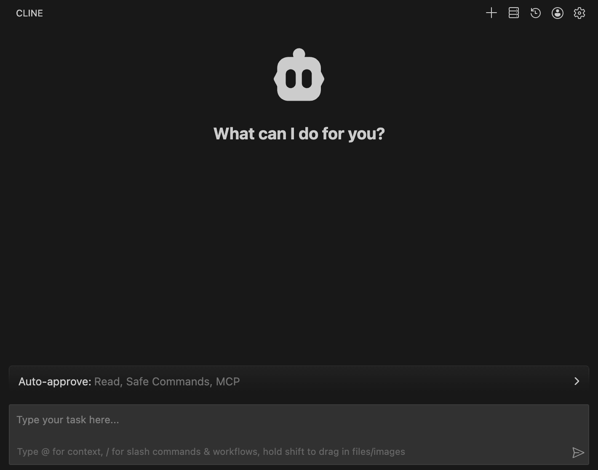

2. Ensure:
      - Plan mode is enabled
      - Auto-Approve is disabled

    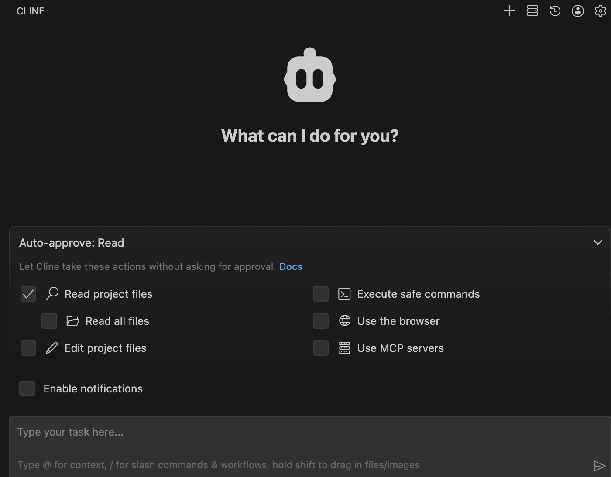

3. Enable **Plan mode** and enter

    ```
    First use the SQLcl list-connections tool to identify available connections.
    Then connect to the [name of your FreeSQL connection] connection.
    Then run:
    select sysdate, user from dual;
    Proceed with execution.
    ```

    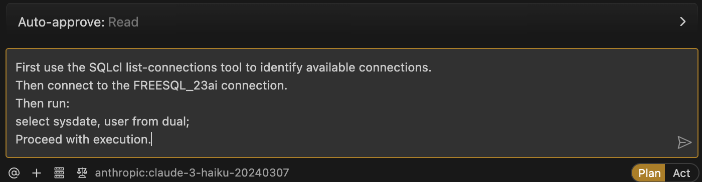

4. Review the proposed plan

5. Review the generated SQL carefully before approving execution

6. Confirm that a valid result is returned

You are now connected through the SQLcl MCP Server.

## Task 2: Create Related Tables
Now create a small relational model.

1. In Plan mode, enter:

    ```
    Using the SQLcl run-sql tool, directly execute SQL statements in the currently connected schema to create two related tables:

    - customers (customer_id, first_name, last_name, email)
    - orders (order_id, customer_id, order_date, amount)

    Define primary keys and a foreign key relationship between orders.customer_id and customers.customer_id.

    Generate the SQL inline and wait for approval before executing.
    ```

    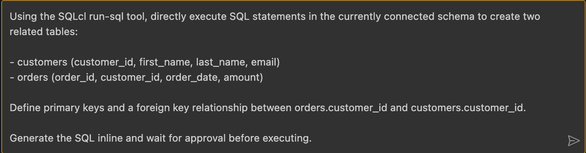

2. Review and approve.

    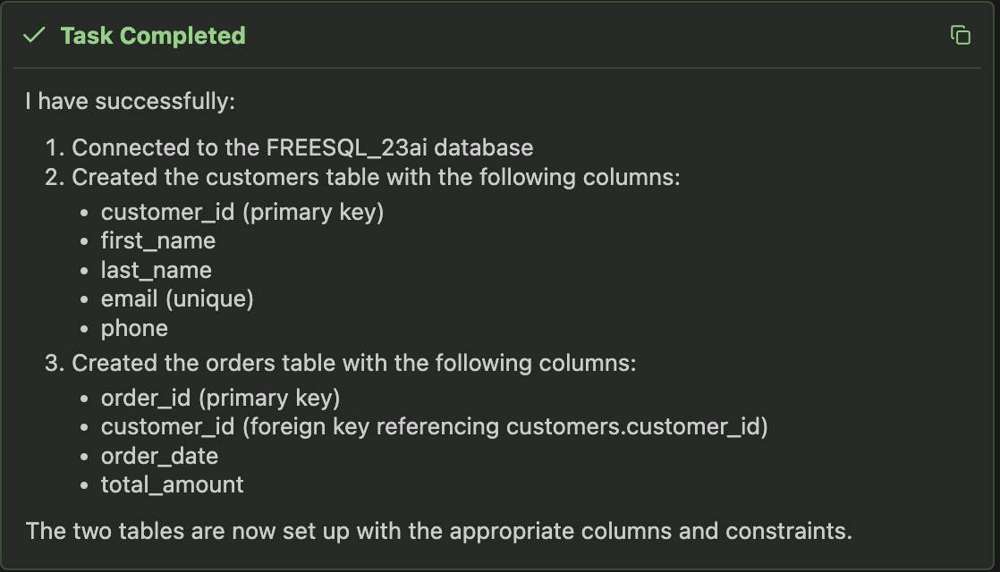

## Task 3: Insert Sample Data

1. Enter the following prompt:

    ```
    Insert realistic sample data into both tables.
    Include multiple customers and multiple orders per customer.
    After inserting, display sample rows from each table.
    ```

    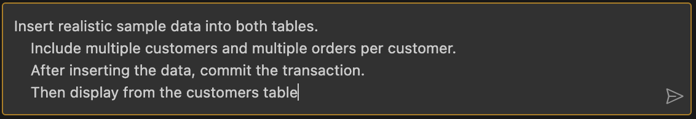

    Review and approve.

2. Confirm that:
   - Customers exist
   - Orders reference valid customer_id values
   - Data looks consistent

If needed, refine your prompt and re-run.

## Task 4: Create Analytical Views

1. Now generate business insights

    Enter the following prompt:

    ```
    Using the SQLcl run-sql tool, directly create the following views in the currently connected schema:

    1. total_orders_per_customer
       - Join customers and orders
       - Return customer_id, first_name, last_name, and total order count

    2. total_revenue_per_customer
       - Join customers and orders
       - Return customer_id and SUM(amount)

    3. average_order_value
       - Return the overall average of amount from orders

    4. recent_orders_last_30_days
       - Return orders where order_date >= SYSDATE - 30

    After creating the views, display sample results from each view.

    Generate SQL inline and wait for approval before executing.
    ```

    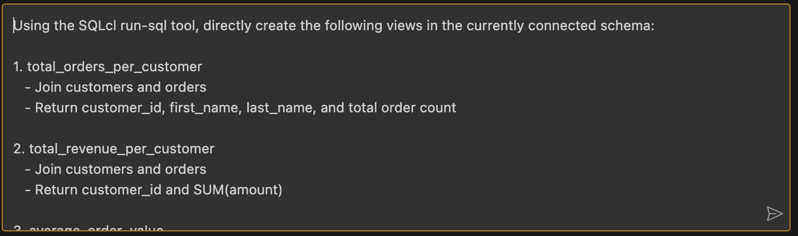

    Review and approve.

2. Validate output

    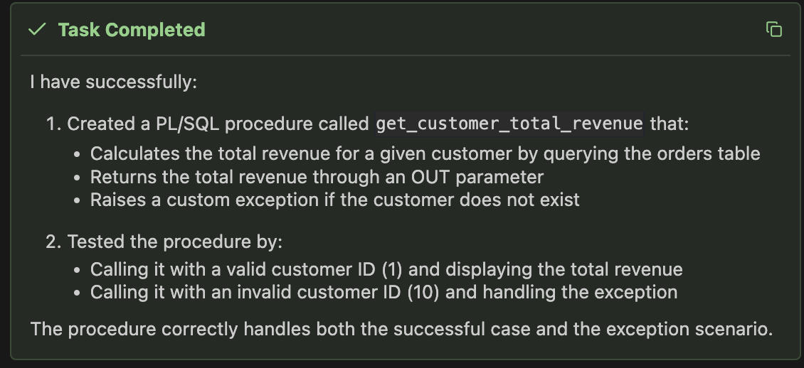

## Task 5: Explore Schema Metadata

1. Now inspect your schema programmatically

    Enter the following prompt:

    ```
    Use the sqlcl schema-information tool to summarize my schema objects.
    ```

    

2. Review the returned metadata summary.

    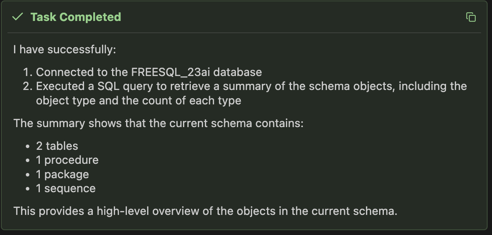

3. Observe how the Agent interprets tables, columns, and relationships.

## Task 6: Disconnect

1. Enter the following prompt:

    ```
    Disconnect from the database and summarize what was created in this session.
    ```

    

    Approve the disconnect tool.

    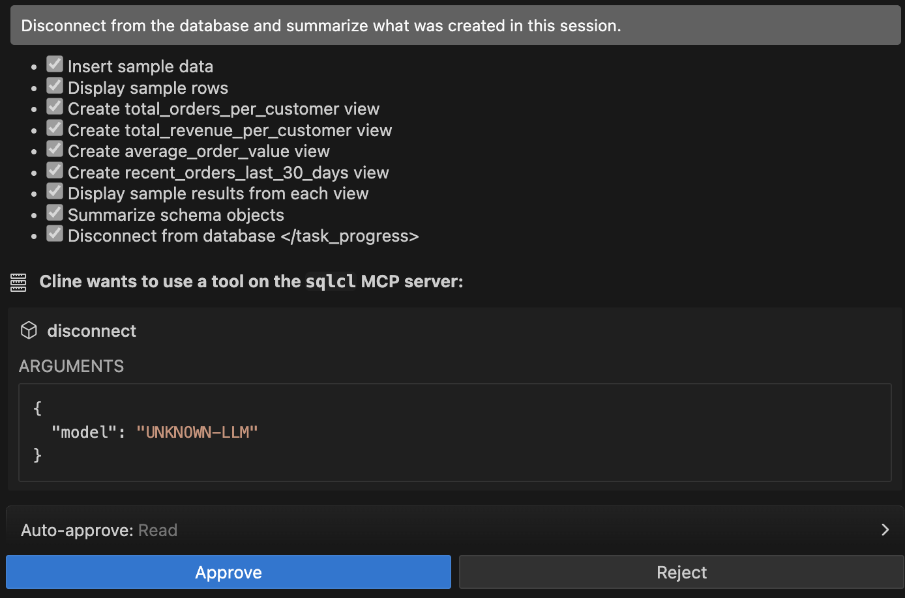

    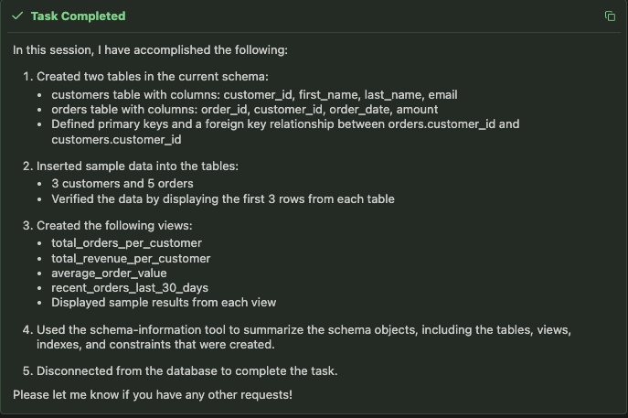

## Signature Workshop

Ready to dive deeper? These workshops move you from demo to hands-on practice.

👉 Click here to [Start the Signature Workshop](https://livelabs.oracle.com/ords/r/dbpm/livelabs/run-workshop?p210_wid=4285&p210_wec=&session=111104173253241)

## Learn More

* [Oracle MCP Servers](https://www.oracle.com/mcp/)
* [Oracle SQLcl Documentation](https://docs.oracle.com/en/database/oracle/sql-developer-command-line/)
* [Introducing MCP Server for Oracle Database](https://blogs.oracle.com/database/introducing-mcp-server-for-oracle-database)
* [Oracle LiveLabs](https://livelabs.oracle.com)

## Acknowledgements

* **Author** – Ley Sylvester
* **Last Updated By/Date** – Ley Sylvester, February 2026
