# Private Agent Factory FastLab

Welcome to this **LiveLabs FastLab** workshop.

LiveLabs FastLab workshops provide guided, hands-on practice so you can experience Oracle AI Database capabilities in minutes. In this session you will deploy and configure the Private Agent Factory and build your first intelligent agent using the visual Agent Builder.

Estimated Time: 15 minutes

## FastLab Introduction

Oracle AI Database Private Agent Factory lets you automate workflows with secure, air-gapped agents that run close to your enterprise data. You will reuse artifacts from the full LiveLab experience but complete the critical setup and first agent build within a single quick lab.

### Objectives

- Install and configure the Private Agent Factory from OCI Marketplace
- Connect the factory to Oracle AI Database 26ai and an LLM provider
- Build and publish your first agent using the visual Agent Builder

### Prerequisites

- OCI tenancy with permissions to launch Marketplace stacks and compute instances
- Oracle AI Database 26ai instance with wallet credentials
- VCN with public subnet allowing inbound access on ports 22, 8080, and 1521
- OCI Generative AI access or other supported LLM provider credentials
- Applied AI Datasets (Netflix dataset) imported into your database

---

## Task 1: Install and Configure the Private Agent Factory

### Task Overview
Deploy the Private Agent Factory stack from the OCI Marketplace, configure connectivity to your Oracle AI Database, and enable LLM access.

### Step 1: Launch Marketplace Stack

1. Navigate to the **Oracle AI Database – Private Agent Factory** Marketplace listing.
2. Click **Get App**, authenticate to your tenancy, review the overview, and choose **Launch Stack**.
3. Accept the Oracle Standard Terms and Restrictions, then click **Launch Stack**.

   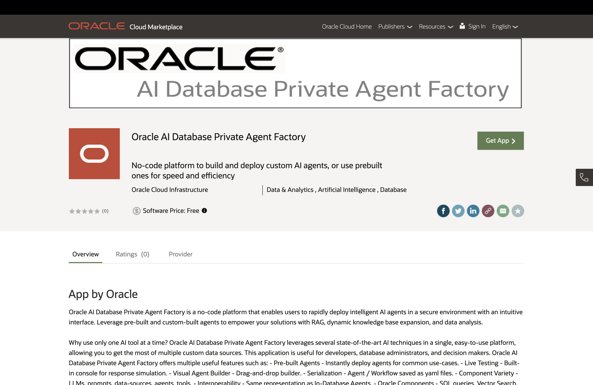

### Step 2: Configure Stack Variables

1. In **General Settings**, choose the region and compartment containing your VCN.
2. Under **Network Configuration**, select the VCN and public subnet created earlier.
3. Under **Compute Configuration**, provide a display name, select a shape such as `VM.Standard.E5.Flex`, and size OCPU/memory for your workload.

   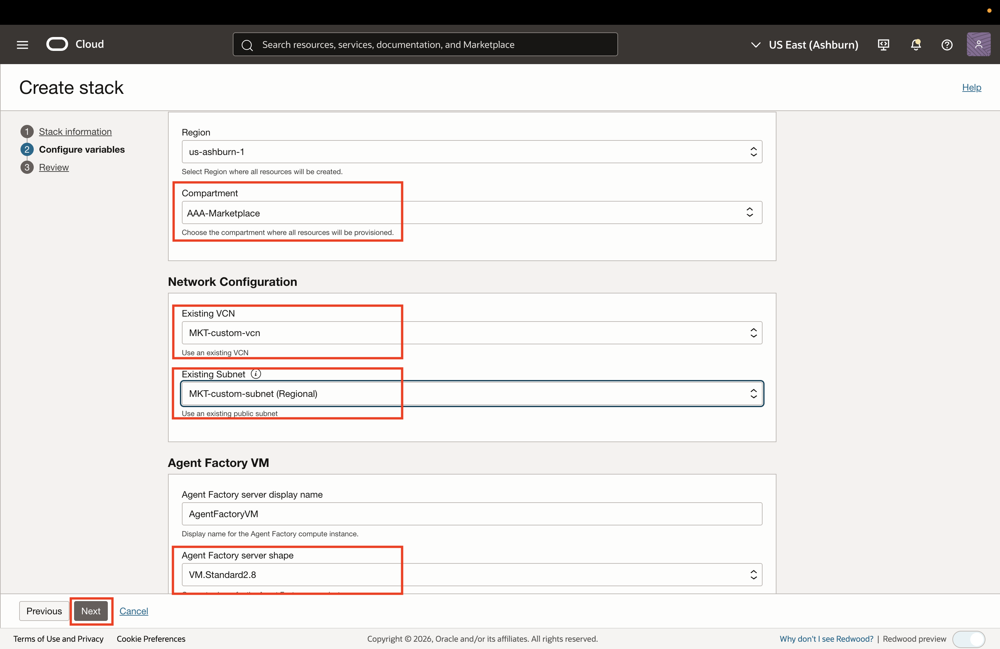

### Step 3: Create the Stack and Retrieve URL

1. Review configuration details and click **Create** to start the Resource Manager job.
2. When the job succeeds, open the **Logs** or **Outputs** tab and copy the application URL in the format:

   ```
   <copy>
   https://{instance_public_ip}:8080/studio/installation
   </copy>
   ```

   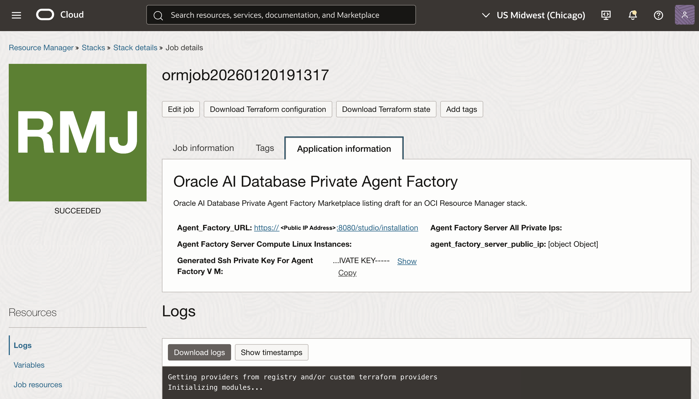

### Step 4: First-Time Sign-in

1. Open the application URL in your browser.
2. Set the administrator username and password when prompted.

   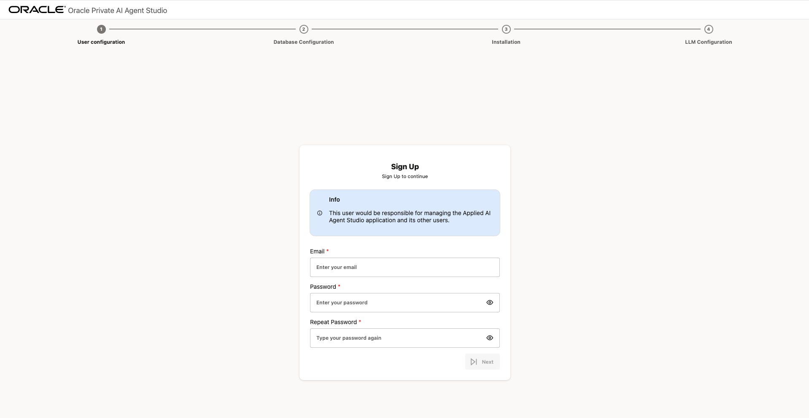

### Step 5: Configure Database Connection

1. Upload the Autonomous Database wallet files.
2. Provide the wallet username and password, then click **Test Connection**.

   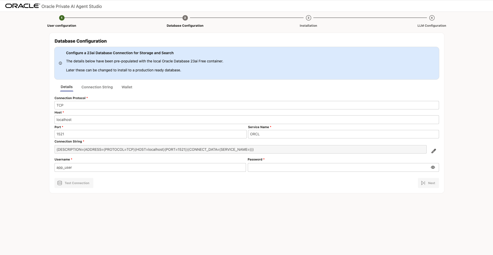

### Step 6: Install Agent Factory into the Database

1. Click **Install** to load the required packages into Oracle AI Database.
2. After the install completes, click **Next** to continue.

   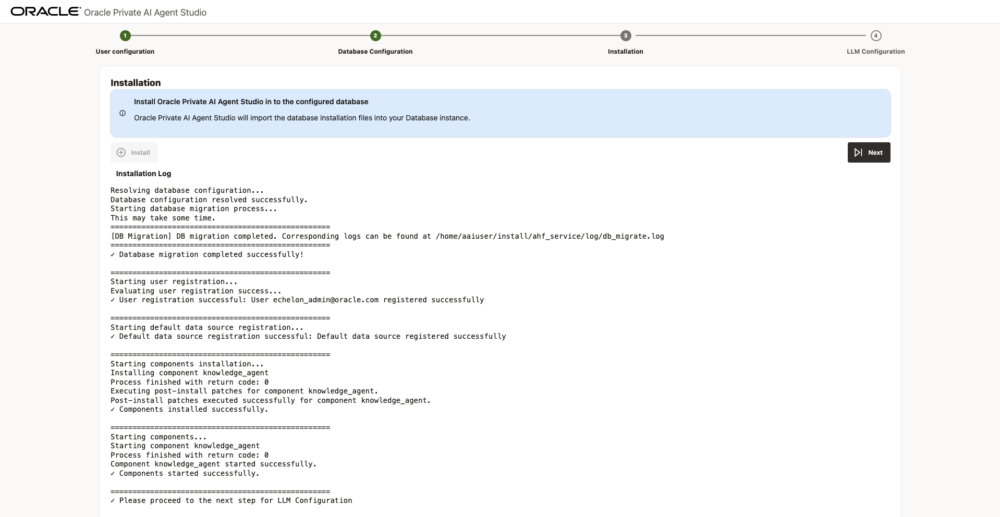

### Step 7: Configure LLM Provider Access

1. Supply credentials for OCI Generative AI or your chosen provider.
2. Confirm access to enable agent reasoning, embeddings, and evaluation tooling.

   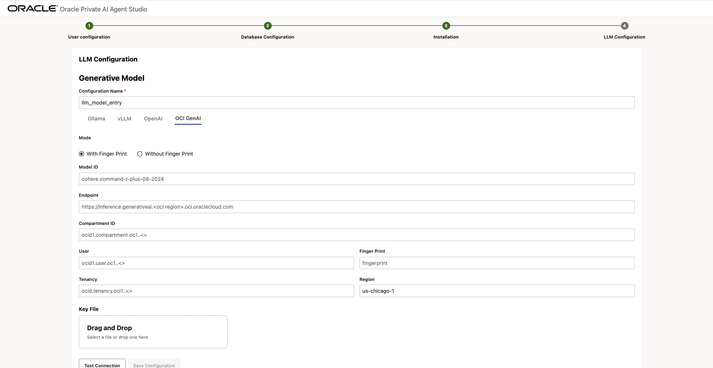

### Step 8: Finish Setup

1. Complete the wizard and sign in with your new administrator credentials.
2. Confirm you can access the Agent Factory home page.

---

## Task 2: Build Your First Agent

### Task Overview
Use the visual Agent Builder to assemble, test, and publish an agent that queries the Netflix dataset included with Applied AI Datasets.

### Step 1: Open Agent Builder

1. From the left navigation, choose **Agent Builder**.
2. Click **New Flow** if an existing flow is open.

   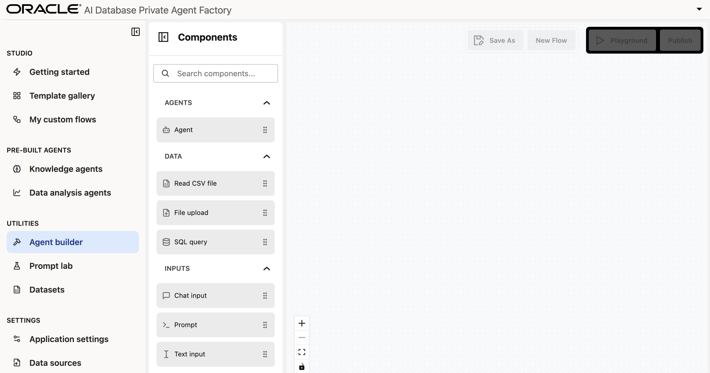

### Step 2: Assemble Core Components

1. Add **Chat input**, **Agent**, and **Chat output** components to the canvas.
2. Connect `Chat input` to the Agent `Prompt` field.
3. Connect the Agent `Message` output to the `Chat output` component.

   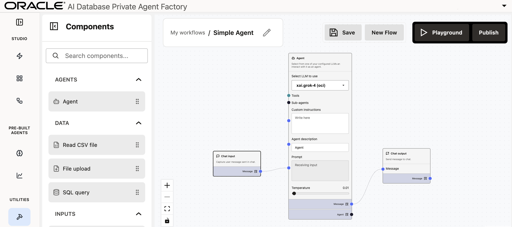

### Step 3: Test the Simple Agent

1. Rename the flow to **Simple Agent** using the pencil icon.
2. Click **Save**, then **Playground**.
3. Ask a sample question and confirm a response appears.

   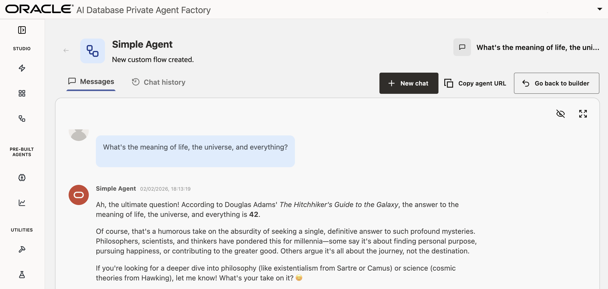

### Step 4: Add Data via SQL Query

1. Return to Builder with **Go back to Builder**.
2. Delete the line between `Chat input` and `Agent`.
3. Drag a **SQL query** node onto the canvas.
4. Select **Applied AI Datasets** as the database and enable **Include columns**.
5. Enter the query:

   ```
   <copy>
   SELECT * FROM ADMIN.AAI_DATASETS_NETFLIX_TITLES_DATASET
   </copy>
   ```

### Step 5: Create a Prompt Template

1. Drag a **Prompt** component to the canvas.
2. Add the following prompt and click **Save Prompt**:

   ```
   <copy>
   Using the data provided, answer the user's query.

   ----------
   data:
   {{data}}

   ----------
   query:
   {{query}}
   </copy>
   ```

### Step 6: Wire Components

1. Connect `Chat input` to the Prompt `query` input.
2. Connect the SQL query `Message` output to the Prompt `data` input.
3. Connect the Prompt `Prompt message` output to the Agent `Prompt` input.

   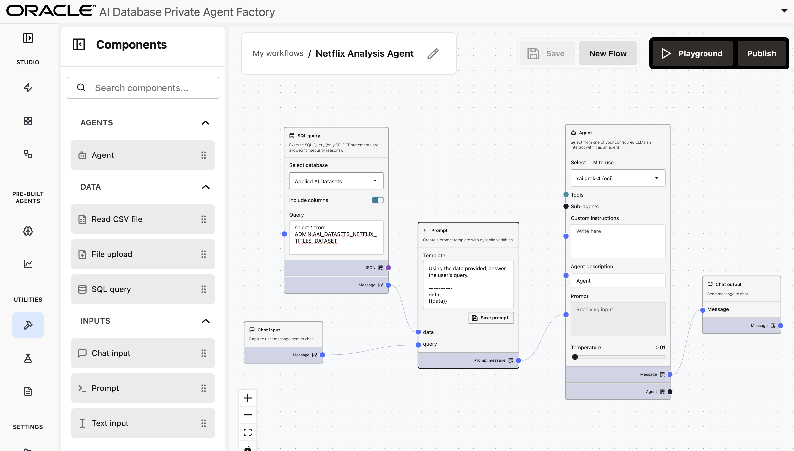

### Step 7: Publish and Validate

1. Click **Save**, then **Publish**, and confirm the dialog.
2. Open **Playground** and ask a question about the Netflix data.

   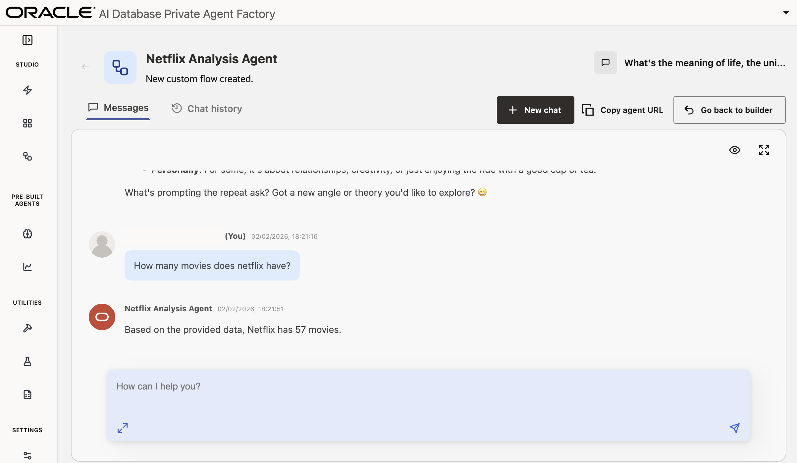

---

## Congratulations

You have installed Oracle AI Database Private Agent Factory, configured it for your tenancy, and published your first agent. Continue exploring prebuilt templates or customize additional flows to expand your agent capabilities.

## Learn More

- Oracle AI Database Private Agent Factory documentation
- Oracle AI Database product page
- Oracle Applied AI Datasets library

## Acknowledgements

- **Authors** - Linda Foinding, Principal Product Manager, Database Product Management
- **Contributors** – Emilio Perez, Allen Hosler, Kumar Varun
- **Last Updated By/Date** – February 2026
