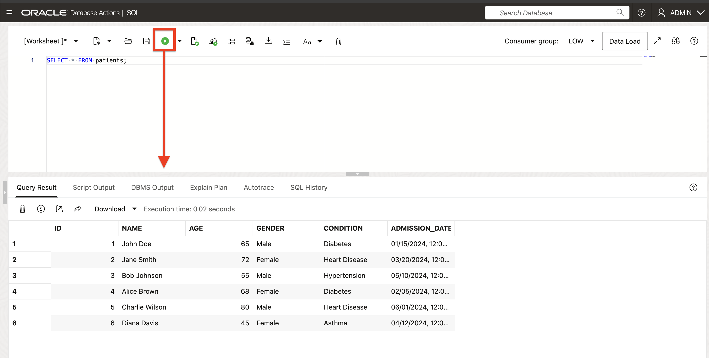

# Select AI in Oracle Autonomous AI Database

Welcome to this **LiveLabs FastLab** workshop.

LiveLabs FastLab workshops give you clear, step-by-step instructions to help you quickly gain hands-on experience with Oracle Autonomous AI Database. You move from beginner to confident user in a short time.

Estimated Time: 15 minutes

## FastLab Introduction

With Select Al in Oracle Autonomous Al Database, you can interact with your database using natural language, whether to query your data by natural language - not by SQL syntax - or text documents to help your Al model produce more relevant responses on your own documents. Other select Al features include direct chat with your LLM, synthetic data generation, text translation and summarization, and Al agents. In this session, you'll focus on what we call "natural language to SOL generation" or NL2SQL.

In many teams, data is locked behind the SQL skills of a few specialists, which slows down everyday questions and decisions.

Select Al uses generative Al to turn natural language questions into SQL based on your specific database tables and views. You can view the generated SQL, have Select Al run that SOL against your database and returns the results, explain the SQL query step-by-step, or have narrated (textual) response of the query results.

In this FastLab, you will use a small sample dataset to ask questions in plain English, see the SQL that Select Al generates, and run it yourself. It's worth noting that depending on the capabilities of your large language model (LLM), you can also ask questions in languages other than English. Give it a try!

### Objectives: 

- Create a small sample **patients** dataset
- Use **Select AI chat** or **`SELECT AI` in SQL Worksheet** to ask natural language questions
- See and run the SQL that Select AI generates


### Prerequisites

You will need the following before you start:

1. An **Oracle Autonomous AI Database**
    - If you do not have one yet, see:  
      [LiveLabs FastLab - Create an Autonomous Database. Fast!](https://livelabs.oracle.com/pls/apex/dbpm/r/livelabs/view-workshop?wid=4276)

2. **Select AI already configured** for your lab user:
    - If you do not have one yet, see Labs 2 and 3:  
      [Chat with Your Data in Autonomous AI Database Using Select AI](https://livelabs.oracle.com/ords/r/dbpm/livelabs/view-workshop?clear=RR,180&wid=3831&session=937205042399)
    - Your user should have `EXECUTE` on `DBMS_CLOUD_AI`
    - An **AI profile** that:
        - Uses an LLM provider available in your environment (for example, OCI Generative AI or OpenAI)
        - Includes your schema in its `OBJECT_LIST` so Select AI can see the `PATIENTS` table

3. To confirm that at least one profile exists, you can later run:

      ```sql
      <copy>
      SELECT profile_name, status 
      FROM   user_cloud_ai_profiles;
      </copy>
      ```


## Task 1. Click the SQL option in Database Actions

  

## Task 2: Create a Sample Healthcare Dataset

1. In SQL Worksheet, run the following SQL to create the table and insert data:

   ```sql
   <copy>
   -- Create PATIENTS table
   CREATE TABLE patients (
       id             NUMBER GENERATED BY DEFAULT AS IDENTITY PRIMARY KEY,
       name           VARCHAR2(100),
       age            NUMBER,
       gender         VARCHAR2(10),
       condition      VARCHAR2(100),
       admission_date DATE
   );

   COMMENT ON TABLE patients IS 'Sample patient records for Select AI FastLab';
   COMMENT ON COLUMN patients.condition IS 'Primary medical condition or diagnosis';

   -- Insert sample data
   INSERT INTO patients (name, age, gender, condition, admission_date) VALUES 
   ('John Doe',     65, 'Male',   'Diabetes',     DATE '2024-01-15');
   INSERT INTO patients (name, age, gender, condition, admission_date) VALUES 
   ('Jane Smith',   72, 'Female', 'Heart Disease', DATE '2024-03-20');
   INSERT INTO patients (name, age, gender, condition, admission_date) VALUES 
   ('Bob Johnson',  55, 'Male',   'Hypertension', DATE '2024-05-10');
   INSERT INTO patients (name, age, gender, condition, admission_date) VALUES 
   ('Alice Brown',  68, 'Female', 'Diabetes',     DATE '2024-02-05');
   INSERT INTO patients (name, age, gender, condition, admission_date) VALUES 
   ('Charlie Wilson', 80, 'Male', 'Heart Disease', DATE '2024-06-01');
   INSERT INTO patients (name, age, gender, condition, admission_date) VALUES 
   ('Diana Davis',  45, 'Female', 'Asthma',       DATE '2024-04-12');

   COMMIT;
   </copy>
   ```

2. Verify the data:

   ```sql
   <copy>
   SELECT * FROM patients;
   </copy>
   ```

You should see six rows of sample patient data.

  

## Task 3: Access Select AI (Chat and SQL)

1. From the Autonomous AI Database details page, click **Database Actions** if you are not already there.

2. On the launchpad, choose one of these options (both work for this lab):

   * **Option A – `SELECT AI` chat UI**

     * Open the `SELECT AI` entry in Database Actions under **Machine Learning**.
     * Sign in with your database user if prompted.

   * **Option B – `SELECT AI` in SQL Worksheet**

     * Stay in **SQL Worksheet**.
     * You will type natural language inside `SELECT AI` statements such as:

       ```sql
       <copy>
       SELECT AI runsql  'List all patients over 60 years old with diabetes';
       SELECT AI showsql 'List all patients over 60 years old with diabetes';
       </copy>
       ```

3. Pick one approach to use as you go through the examples:

   * Use **chat** if you want a conversational experience.
   * Use **SQL Worksheet** if you want to see results directly in SQL and reuse the generated SQL.

Behind the scenes, Select AI uses your **AI profile** to know which tables and columns it can query (in this lab, the `PATIENTS` table).

## Task 4: Ask Healthcare Questions with Select AI

Now you use natural language questions to solve realistic healthcare business cases. Select AI will generate the SQL for you based on the `PATIENTS` table.

> Your SQL may not match the examples below exactly. It should be logically equivalent and return the same kind of result.

For each case:

* If you use **chat**, type the question into the Select AI prompt and run it.
* If you use **SQL Worksheet**, run:

  ```sql
  <copy>
  SELECT AI runsql 'your question here';
  </copy>
  ```

  and optionally:

  ```sql
  <copy>
  SELECT AI showsql 'your question here';
  </copy>
  ```

  to see the SQL.

### Case 1: Elderly patients with diabetes

**Business question**

Identify elderly patients with diabetes for follow-up care.

**Ask Select AI**

> `List all patients over 60 years old with diabetes.`

**Example SQL generated by Select AI**

```sql
<copy>
SELECT *
FROM   patients
WHERE  age > 60
AND    condition = 'Diabetes';
</copy>
```

**Result**

You should see **John Doe** and **Alice Brown**. These patients match the criteria “over 60 with diabetes” and could be targeted for follow-up programs.

### Case 2: Heart disease admissions in 2024

**Business question**

Understand how many patients with heart disease were admitted during 2024.

**Ask Select AI**

> `How many patients were admitted with heart disease in 2024?`

**Example SQL generated by Select AI**

```sql
<copy>
SELECT COUNT(*) AS heart_disease_admissions_2024
FROM   patients
WHERE  condition = 'Heart Disease'
AND    admission_date BETWEEN DATE '2024-01-01' AND DATE '2024-12-31';
</copy>
```

**Result**

You should see a count of **2** (Jane Smith and Charlie Wilson). This simple metric can feed capacity and resource planning for cardiology services.

### Case 3: Gender and condition distribution

**Business question**

See how many patients you have by condition and gender.

**Ask Select AI**

> `Show the number of male and female patients for each condition.`

**Example SQL generated by Select AI**

```sql
<copy>
SELECT condition,
       gender,
       COUNT(*) AS patient_count
FROM   patients
GROUP  BY condition, gender
ORDER  BY condition, gender;
</copy>
```

**Result**

You see a small matrix of conditions versus gender counts. This type of breakdown helps with demographic analysis (for example, understanding whether certain conditions skew by gender).

### Case 4: Recent admissions in 2024

**Business question**

Review the most recent admissions to see who arrived later in the year.

**Ask Select AI**

> `List patients admitted after April 1, 2024, sorted by admission date.`

**Example SQL generated by Select AI**

```sql
<copy>
SELECT *
FROM   patients
WHERE  admission_date > DATE '2024-04-01'
ORDER  BY admission_date;
</copy>
```

**Result**

You should see patients admitted after 1 April 2024, ordered from earliest to latest admission date. This helps you quickly scan recent cases.

## Task 5: Optional – Tweak and Run the SQL Yourself

1. In the Select AI chat result, copy the generated SQL for one of the questions.

2. Switch to **SQL Worksheet**, paste the SQL, and modify it. For example, start from the Case 1 query and tighten the age filter:

   ```sql
   <copy>
   SELECT *
   FROM   patients
   WHERE  age >= 65
   AND    condition = 'Diabetes'
   ORDER  BY admission_date;
   </copy>
   ```

3. Run the modified SQL and review the results.

This workflow is how analysts can move from “one-off questions” to “saved queries and dashboards.”

## Task 6: Ask Your Own Questions

You learn Select AI best by asking your own questions. In this task, you practice using natural language to explore the `PATIENTS` table without any prompts.

Ask Select AI at least **three** of your own questions.

Here are some ideas:

* `What is the average age of patients with diabetes?`
* `Show the number of patients by condition.`
* `How many female patients were admitted in February 2024?`
* `List all patients ordered from oldest to youngest.`
* `Show the number of patients admitted each month in 2024.`

Tips:

* Use plain English; you do **not** need exact column names.
* Refine your question if needed:
  For example, add “only show patients over 50” or “group the results by condition.”
* In SQL Worksheet, try both:

  ```sql
  <copy>
  SELECT AI runsql  'your question here';
  SELECT AI showsql 'your question here';
  </copy>
  ```

  to see both the answer and the SQL.

## Next Steps

You have now seen how Select AI turns natural language into SQL on a simple healthcare dataset. To build on this FastLab, consider:

* **Use Select AI on your own schema**
  Point an AI profile at a real application schema and try similar questions.

* **Combine Select AI with applications**
  Call `SELECT AI` from APEX, ORDS, or a microservice to let business users ask questions through a web UI.

* **Explore other AI capabilities in Oracle Autonomous AI Database**

  * **AI Vector Search** for semantic search on documents and embeddings
  * **Select AI `explainsql` and `narrate` actions** to help users understand complex SQL

If you are following a LiveLabs path, your next recommended workshop is the **Select AI Signature Workshop**, where you build a richer end-to-end scenario.


Congratulations!
You have successfully completed the Select AI FastLab. 

You can now ask natural language questions against a real Oracle database, see the SQL that Select AI generates, and start turning ad hoc questions into reusable SQL for your own projects.

## Signature Workshop

Ready to dive deeper? These workshops move you from demo to hands-on practice.

👉 Click here to start our signature workshop: [Select AI Signature Workshop](https://livelabs.oracle.com/pls/apex/f?p=133:180:4579534958655::::wid:selectai-sig)

## Learn More

* [Introducing Natural Language to SQL Generation on Autonomous Database](https://blogs.oracle.com/machinelearning/introducing-natural-language-to-sql-generation-on-autonomous-database)
* [How to Use Oracle Select AI: A Step-by-Step Guide](https://blogs.oracle.com/datawarehousing/how-to-use-oracle-select-ai-a-stepbystep-guide-generative-ai)


## Acknowledgements
* **Author** - Linda Foinding
* **Contributors** - 
* **Last Updated By/Date** - Linda Foinding, November 2025
