# Select AI in Oracle Autonomous AI Database

Welcome to this **LiveLabs FastLab** workshop.

LiveLabs FastLab workshops give you clear, step-by-step instructions to help you quickly gain hands-on experience with Oracle Autonomous AI Database. You move from beginner to confident user in a short time.

Estimated Time: 15 minutes

### Video Walkthrough

[Walkthrough video](videohub:1_zbwxixkw:medium)

## FastLab Introduction

**Select AI** in Oracle Autonomous AI Database lets you **interact with your data using natural language;** whether asking questions without SQL syntax or supplying text documents to improve your model’s responses. Select AI also supports chatting directly with your LLM, generating synthetic data, translating and summarizing text, and building AI agents. In this session, we focus on **natural language to SQL (NL2SQL)**.

Many teams still rely on a few SQL experts, slowing your ability to get responses to everyday questions and delaying decisions. Select AI helps to remove this bottleneck by turning natural language questions into SQL based on your actual tables and views. You can review the generated SQL, run it, get step-by-step explanations, or receive a textual summary of the results.

In this FastLab, you’ll use a small dataset to ask questions in plain English, see the SQL Select AI produces, and run it. Depending on your LLM provider, you can also ask questions in other languages. Give it a try!

### Objectives: 

* Use Select AI to query data using natural language 
* Use the Select AI demo application to chat with your data in your own language
* See and understand the SQL that Select AI generates

### Prerequisites

Ensure the following before starting:

- An Oracle Autonomous AI Database

    - Check our [LiveLabs FastLab - Create an Autonomous AI Database. Fast!](https://livelabs.oracle.com/pls/apex/dbpm/r/livelabs/view-workshop?wid=4276)

**Select AI already configured** for your lab user; (see Labs 1–2 in the following workshop):
[Chat with Your Data in Autonomous AI Database Using Select AI](https://livelabs.oracle.com/ords/r/dbpm/livelabs/view-workshop?clear=RR,180&wid=3831&session=937205042399)


## Task 1. How to ask natural language questions
You can ask questions using Oracle's Select AI feature. **AI** is a special keyword in the SELECT statement that tells the Autonomous AI Database that the subsequent text will be an optional action and a natural language prompt.

Here are the actions:

    1. runsql - [default, if not action is specified] ask a question and get a structured result
    2. narrate - ask a question and get a conversational result
    3. showsql - SQL used to produce the result
    4. explainsql - an explanation of the SQL used to produce the result

  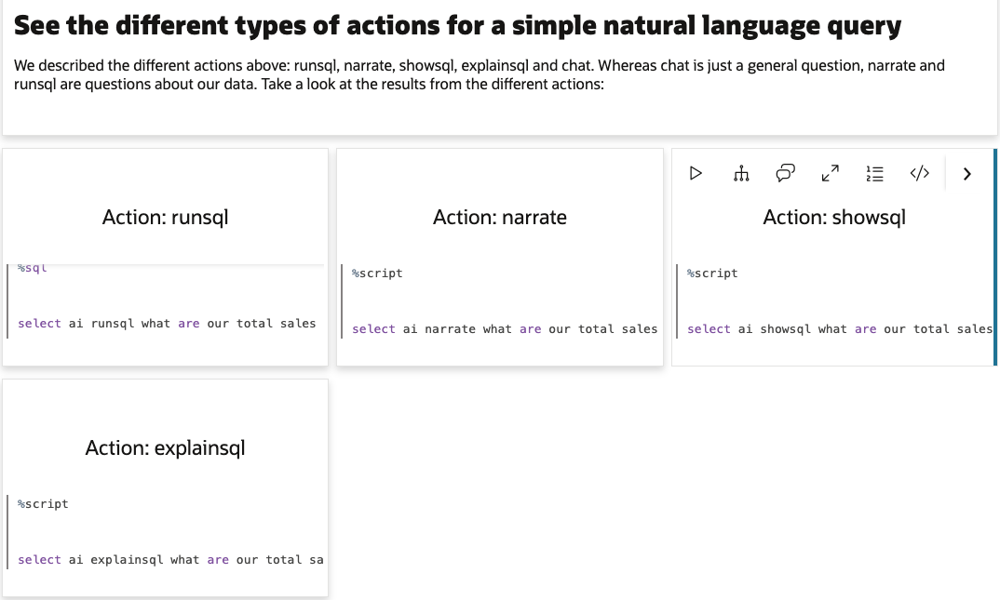

## Task 2: Oracle MovieStream Business Scenario
This fastlabs's business scenario is based on Oracle MovieStream - a fictitious movie streaming service that is similar to services to which you may subscribe. Using this data, you'll be able to ask questions about movies, customers who watch movies, and the movies they decide to watch.

Here are the tables included as part of the AI profile:

    movies
    streams
    customer_extension
    customer_contact
    customer_segment
    pizza_shop
    genre
    actors

Behind the scenes, Select AI uses your **AI profile** to know which tables and columns it can query.

## Task 3: Access Select AI (Chat or OML)

Pick one approach to use as you go through the examples below.

  >Note, you will need to complete the prerequisites stated above to perform the following tasks. Use this workshop to get started: [Chat with Your Data in Autonomous AI Database Using Select AI](https://livelabs.oracle.com/ords/r/dbpm/livelabs/view-workshop?clear=RR,180&wid=3831&session=937205042399)

1. **Option A – `ASK ORACLE` APEX chatbot app** 
     * Sign in with your database user credentials from the prerequisites and select the AI profile.
     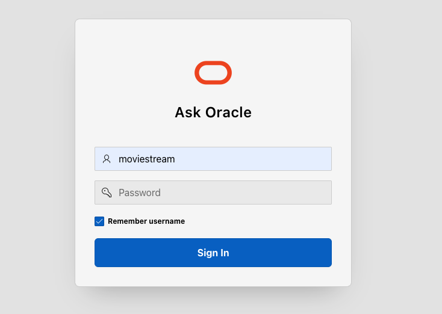
     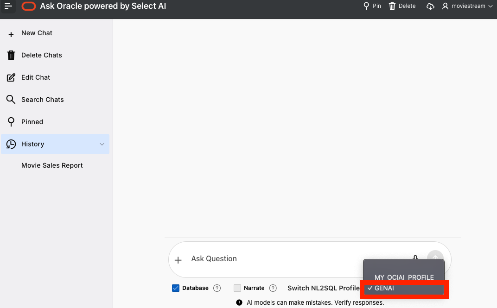

2. **Option B – `OML Notebooks` from Oracle Machine Learning**
      * Sign in with your database user credentials from the prerequisites and select the appropriate notebook.
      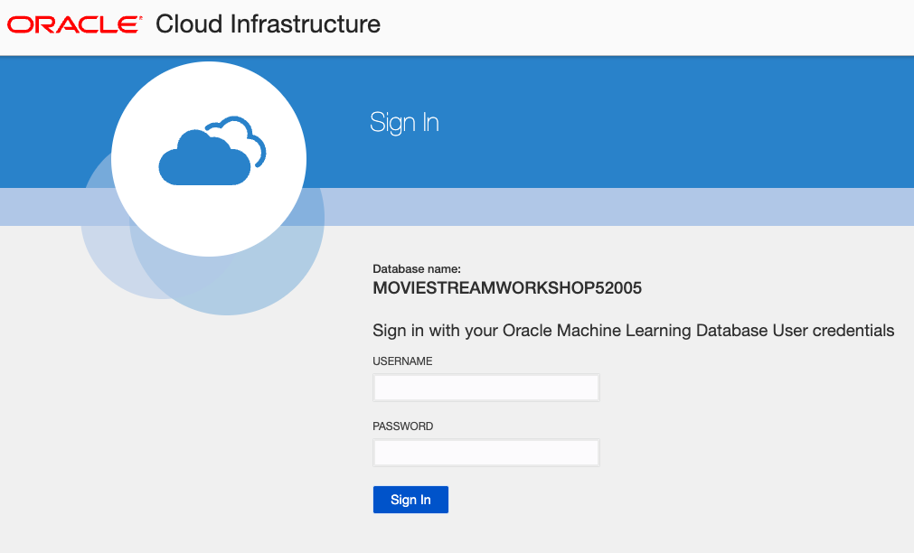
      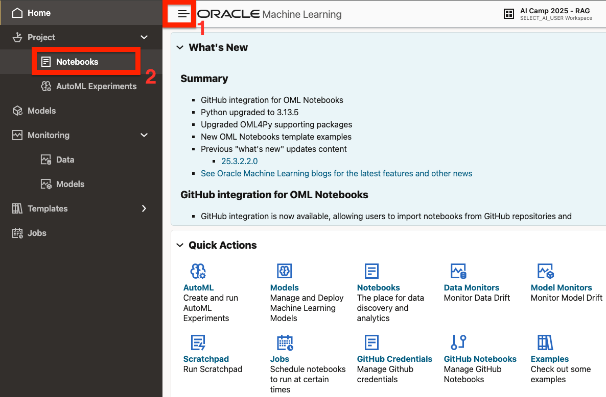
      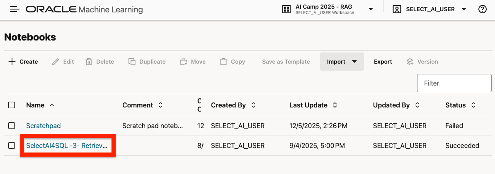
      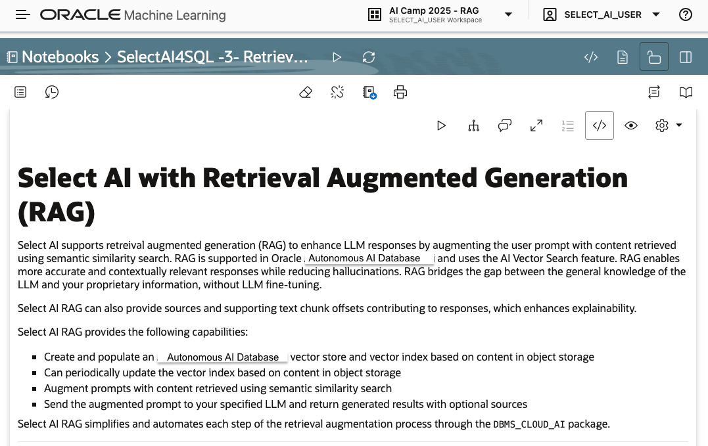
      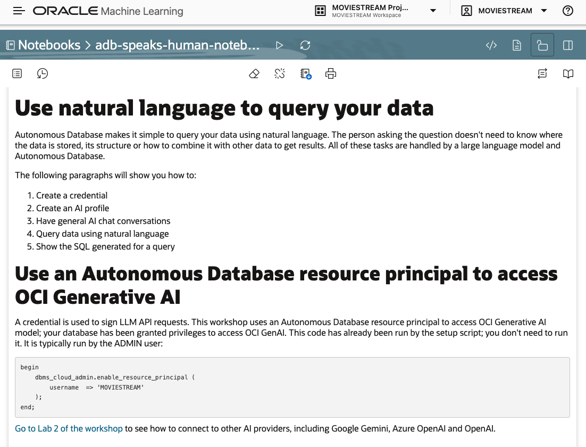

3. In the Ask Oracle chatbot, you can use various options for interacting with your LLM.

   * Ensure the database checkbox is checked for all queries that relate to the moviestream dataset 
   * Use **narrate** if you want a a textual summary of your SQL result set.
   * Use **explain** if you want to see the generated SQL.


## Task 4: Select the AI profile & Ask Questions with `Ask Oracle powered by Select AI`

In the following examples, we will ask questions about movies based on Oracle MovieStream - a fictitious movie streaming service.

For each case:

* If you use the **Ask Oracle APEX app**, type the question into the text box labeled “Ask Question”, then click the up-arrow run it.
* If you use **OML** notebooks, run:

    ```sql
    <copy>
    SELECT AI runsql 'your question here';
    </copy>
    ```

   to see the SQL:

    ```sql
    <copy>
    SELECT AI showsql 'your question here';
    </copy>
    ```

    to see a narrated summary of the query result:

     ```sql
    <copy>
    SELECT AI narrate 'your question here';
    </copy>
    ```

### Case 1: Total sales by movie

To understand what is happening behind the scenes, you can select `Explain` or `showsql` to view the SQL generated by Select AI, along with a detailed explanation of how the query was constructed.

**Ask Oracle - Select AI**

> `What are our total sales by movie with best movies first?`

  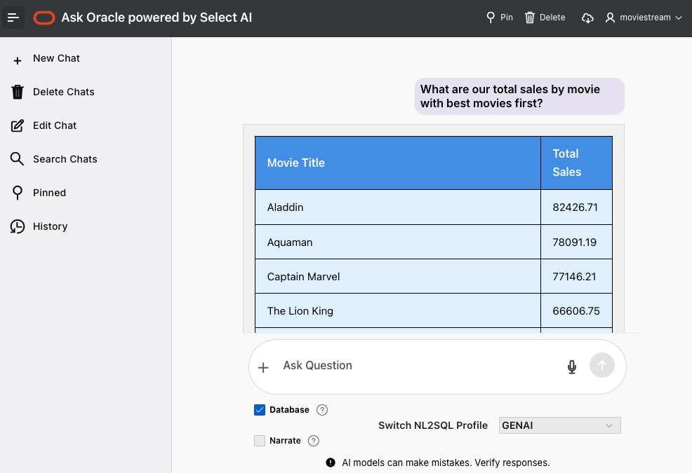

**Example SQL generated by Select AI**
 
 >Note: Your SQL may not match the examples below exactly. It should be logically equivalent and return a similar result.

```sql
    <copy>
    SELECT 
      m."TITLE" AS "Movie Title", 
      SUM(s."SALES") AS "Total Sales"
    FROM 
      "MOVIESTREAM"."STREAMS" s
      JOIN "MOVIESTREAM"."MOVIES" m ON s."MOVIE_ID" = m."MOVIE_ID"
    GROUP BY 
      m."TITLE"
    ORDER BY 
      "Total Sales" DESC
      <copy>
    ```

Select the `Explain` or `show SQL` buttons to view the generated SQL

  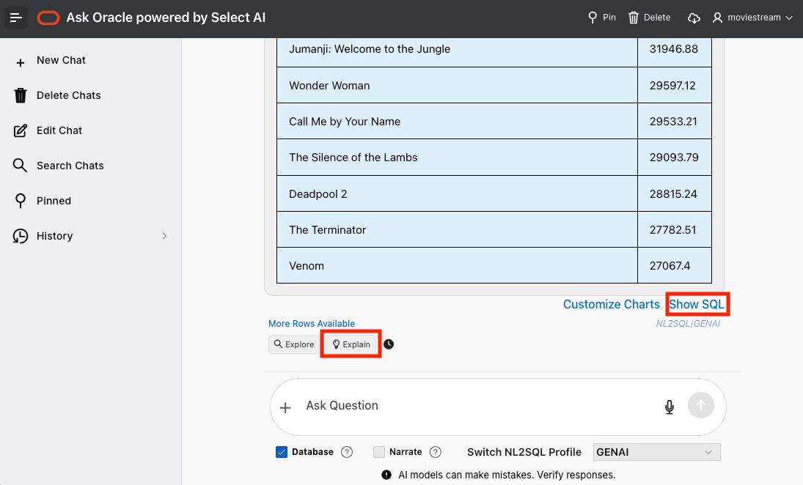
  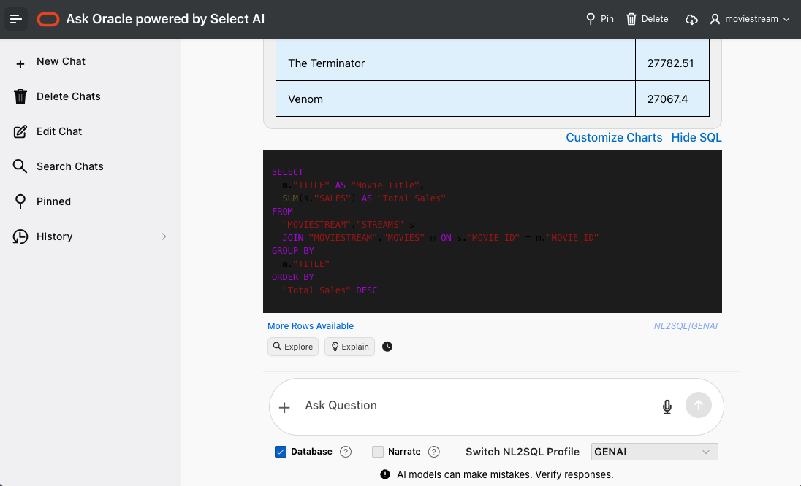


**Oracle SQL Query Explanation**

The Oracle SQL query retrieves the total sales for each movie from the "STREAMS" and "MOVIES" tables in the "MOVIESTREAM" schema. 
 
Some things to notice when you check out the generated SQL under the `Explain` option:

* Identifies specific tables to join
* Aggregation and sorting 
* Determines columns to query - even when the columns aren't mentioned in the query
  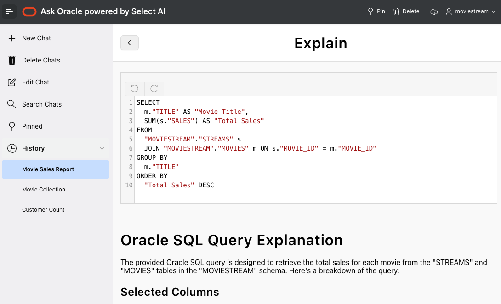
  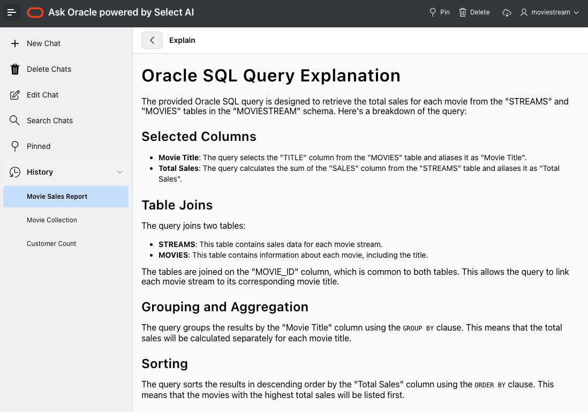

### Case 2: Best selling movies using the `narrate` option

You may enable the **Narrate** option by selecting the `narrate` checkbox and asking a new prompt.Select AI will convert the SQL results into plain-text narration, making it easy to understand insights without reading tables or queries. It’s a simple way to turn complex data into clear, human-readable summaries.

**Ask Oracle - Select AI**

> `What are our top 5 selling movies?`

  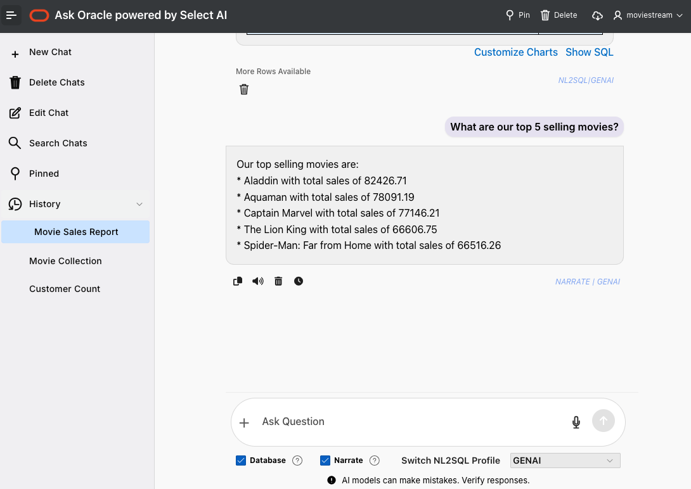

### Case 3: A specific movie saga

This SQL query retrieves the total sales for movies with titles containing the phrase "Spider-Man". The query joins two tables, "STREAMS" and "MOVIES", based on the "MOVIE_ID" column, and then filters the results to include only movies with titles matching the specified criteria.

**Ask Oracle - Select AI**

> `List all spider-man movies in order of sales`

  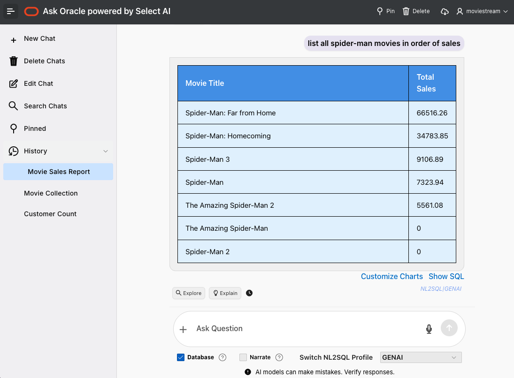

**Example SQL generated by Select AI**

  ```sql
      <copy>
    SELECT 
      m."TITLE" AS "Movie Title", 
      SUM(s."SALES") AS "Total Sales"
    FROM 
      "MOVIESTREAM"."STREAMS" s
      JOIN "MOVIESTREAM"."MOVIES" m ON s."MOVIE_ID" = m."MOVIE_ID"
    WHERE 
      UPPER(m."TITLE") LIKE UPPER('%Spider-Man%')
    GROUP BY 
      m."TITLE"
    ORDER BY 
      "Total Sales" DESC
      <copy>
      ```

### Case 4: Dynamic data visualization

This SQL query retrieves the total sales for movies with titles containing the phrase "Spider-Man". The query joins two tables, "STREAMS" and "MOVIES", based on the "MOVIE_ID" column, and then filters the results to include only movies with titles matching the specified criteria.

**Ask Oracle - Select AI**

> `Plot a pie chart for the above results using movie title and total sales`

  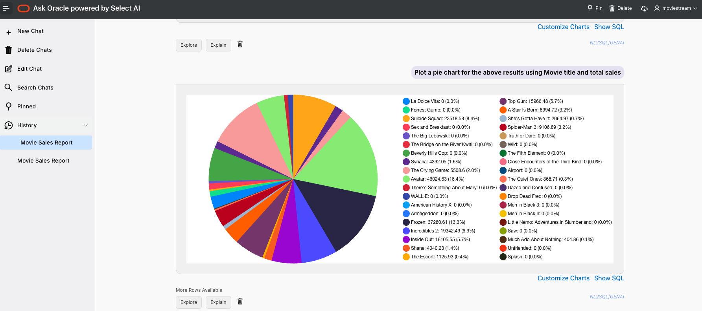

### Case 5: Chat directly with the LLM and prompt in another language

By unchecking the Database checkbox, your prompt is routed directly to the LLM instead of the database, allowing you to ask general questions, generate text, or explore ideas conversationally.

**Ask Oracle - Select AI**

> French: `Quels sont les films les plus vendus?`
> English `what are the top selling movies?`

  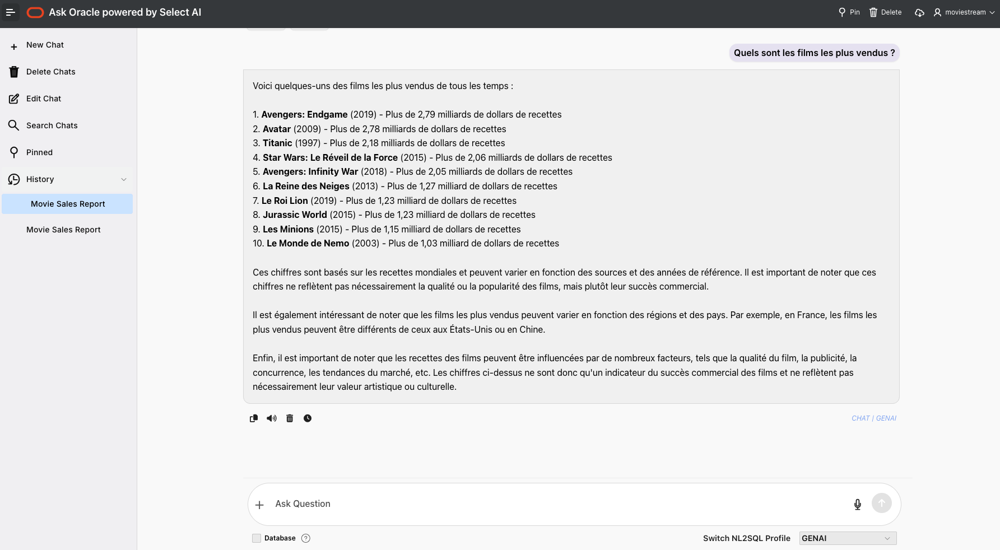

## Task 5: Ask your own questions

Explore using Select AI further by asking your own questions. In this task, you practice using natural language to explore the MOVIESTREAM tables without any prompts.

Ask Select AI at least ***three*** of your own questions.

Here are some ideas to get you started:

* `select ai runsql what are sales by customer segment`
* `select ai chat what are considered the best movies produced in the past 20 years`

**Congratulations!**
You have successfully completed the Oracle AI Database Select AI FastLab. 

You can now ask natural language questions against a real Oracle database, see the SQL that Select AI generates, and start turning ad hoc questions into reusable SQL for your own projects.

## Test Your Knowledge

Test your knowledge of the SelectAI FastLab:
```quiz
    Q: What is the primary purpose of Select AI in the Oracle Autonomous AI Database?
    * To interact with data using natural language
    - To manually write complex SQL code 
    - To manage physical database hardware
    - To replace the database administrator
    > Select AI allows users to interact with data using natural language instead of traditional SQL syntax.
   
    Q: Which specific technology does Select AI use to turn plain English into database queries?
    - Synthetic Data Generation
    * Natural Language to SQL (NL2SQL)
    - Manual Data Entry
    - Image Recognition
    > The core technology focused on in the sources is Natural Language to SQL (NL2SQL), which translates plain text into database queries

    Q: Which action allows you to see the generated SQL and understand how a query was constructed? 
    - Summarize
    - Narrate
    * Explain (or showsql)
    - Delete
    > Users can use explain or showsql to see the generated SQL and receive a detailed breakdown of how the query was constructed
    ```


## Next Steps

You have now seen how Select AI turns natural language into SQL on a simple movie dataset. To build on this FastLab, consider:

* **Use Select AI on your own schema**
  Point an AI profile at a real application schema and try similar questions.

* **Prompting in other languages**
  Try prompting in other languages such as Spanish, French, German and more.


## Signature Workshop

Ready to dive deeper? These workshops move you from demo to hands-on practice.

👉 Click here to start our signature workshop: [Develop AI RAG Apps with Autonomous AI Database Select AI](https://livelabs.oracle.com/ords/r/dbpm/livelabs/view-workshop?wid=4114)
## Learn More

* [Try the new ASK Oracle chatbot powered by Select AI](https://blogs.oracle.com/machinelearning/try-the-new-ask-oracle-chatbot-powered-by-select-ai)
* [Introducing Natural Language to SQL Generation on Autonomous Database](https://blogs.oracle.com/machinelearning/introducing-natural-language-to-sql-generation-on-autonomous-database)
* [Announcing Select AI for Python 1.2 ](https://blogs.oracle.com/machinelearning/announcing-select-ai-for-python-1-2)
* [How to Use Oracle Select AI: A Step-by-Step Guide](https://blogs.oracle.com/datawarehousing/how-to-use-oracle-select-ai-a-stepbystep-guide-generative-ai)
* [Announcing Oracle Autonomous Database Select AI Feedback for enhanced SQL query generation](https://blogs.oracle.com/machinelearning/announcing-oracle-autonomous-database-select-ai-feedback-for-enhanced-sql-query-generation)
* [Announcing Oracle Autonomous Database Select AI for text translation and summarization](https://blogs.oracle.com/machinelearning/announcing-oracle-adb-select-ai-for-text-translation-and-summarization)
* [Build Your Agentic Solution using Oracle Autonomous AI Database Select AI Agent – an Autonomous Agent Framework](https://blogs.oracle.com/machinelearning/build-your-agentic-solution-using-oracle-adb-select-ai-agent)
* [https://blogs.oracle.com/machinelearning/supercharge-sql-unleashing-ai-queries-with-oracle-adb-select-ai](https://blogs.oracle.com/machinelearning/supercharge-sql-unleashing-ai-queries-with-oracle-adb-select-ai)


## Acknowledgements
* **Author** - Linda Foinding, Principal Product Manager, Database Product Management
* **Contributors - Mark Hornick, Sherry LaMonica
* **Last Updated By/Date** - Linda Foinding, January 2026
