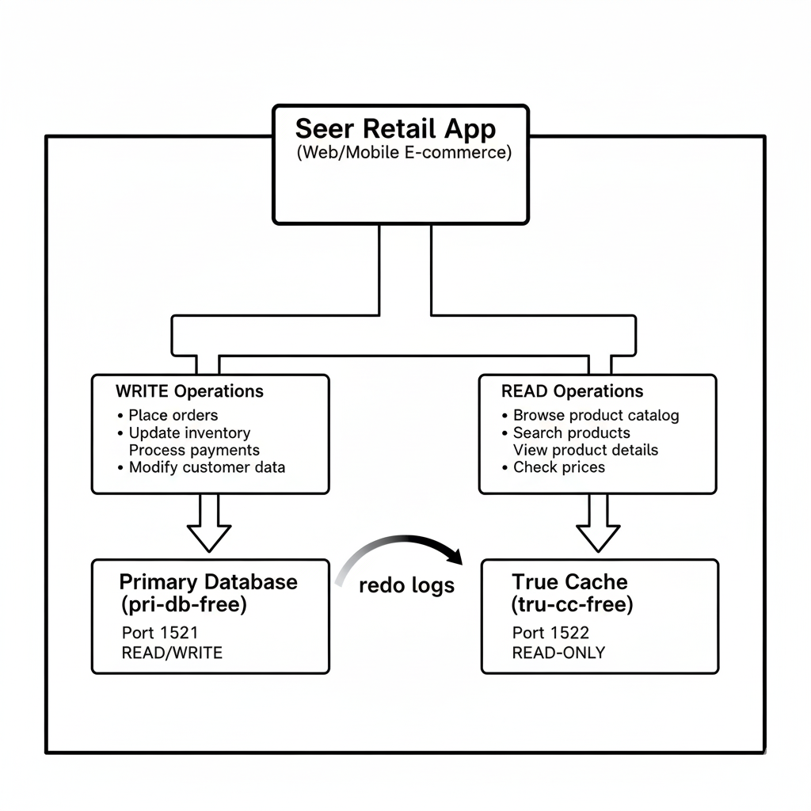

# Accelerate Read-Heavy Workloads with Oracle True Cache

Welcome to this **LiveLabs FastLab** workshop.

LiveLabs FastLab workshops give you clear, step-by-step instructions to help you quickly gain hands-on experience with Oracle Database technologies. You will go from beginner to confident user in a short time.

Estimated Time: 25 minutes

## FastLab Introduction

Seer Retail's e-commerce platform handles millions of product catalog queries daily. During peak sales events, read traffic overwhelms the primary database, slowing down order processing. Oracle True Cache solves this by creating an in-memory, read-only cache that automatically stays consistent with the primary database.

True Cache is a diskless Active Data Guard replica that offloads read queries while keeping the primary free for transactions.

### Prerequisites

- **OCI Compute**, **macOS**, or **Windows** with:
    - Podman installed
    - jq installed
    - openssl installed
- Minimum 12 GB RAM to run both containers

> **macOS and Windows users:** See the [Appendix](#appendix-installing-prerequisites-on-macos-and-windows) for installation instructions.

> **Windows users:** All commands in this lab use bash syntax. Run them in **WSL2** (Windows Subsystem for Linux), which is required for Podman on Windows. Open a WSL2 terminal by typing `wsl` in PowerShell or Command Prompt.

## Task 1: Set Up Your OCI Environment

In a production environment, Seer Retail would deploy True Cache on dedicated servers close to their application tier to minimize network latency. For this lab, you'll run both the primary database and True Cache containers on a single machine—simulating the architecture where read-heavy e-commerce traffic is offloaded from the transactional database.

> **Running locally?** If you're using macOS or Windows with Podman, jq, and openssl already installed, skip to Task 2.

**For OCI Compute:** Create a Linux compute instance to host both containers.

1. In the OCI Console, navigate to **Compute > Instances** and click **Create Instance**.

2. Configure the instance:

    | Setting | Value |
    |---------|-------|
    | Name | true-cache-demo |
    | Compartment | Your compartment |
    | Image | Oracle Linux 9 |
    | Shape | VM.Standard.E5.Flex (1 OCPU, 12 GB RAM) |

3. Under **Networking**, select a public subnet.

4. Under **Add SSH keys**, upload your public SSH key or generate a new key pair. Download the private key if generated.

5. Click **Create** and wait for the instance to reach **Running** state.

6. Note the **Public IP Address** from the instance details page.

7. SSH into your compute instance:

    ```bash
    <copy>
    ssh -i <your-private-key> opc@<public-ip-address>
    </copy>
    ```

8. Update system packages and install required tools:

    ```bash
    <copy>
    sudo dnf update -y
    sudo dnf install -y podman jq openssl
    </copy>
    ```

## Task 2: Configure Podman Network

True Cache requires network connectivity to the primary database to receive redo logs and stay synchronized. In containerized deployments, both containers must share a network so True Cache can continuously apply changes from the primary. You'll also configure encrypted secrets for database passwords—a security best practice that Seer Retail's compliance team requires for all database deployments.

1. Set up environment variables for the True Cache deployment:

    ```bash
    <copy>
    # Define environment variables
    export TC_NETWORK="truecache-net"
    export DB_DATA_VOL="primary-db-data"
    export TC_DATA_DIR="${HOME}/truecache-data"
    export TAG="latest"
    export DB_PWD="Welcome1#TC23"
    </copy>
    ```

2. Create the Podman network and storage volumes:

    ```bash
    <copy>
    # Create network for container-to-container communication
    sudo podman network create "${TC_NETWORK}"

    # Create volume for primary database (persistent storage)
    sudo podman volume create "${DB_DATA_VOL}"

    # Create directory for True Cache
    mkdir -vp "${TC_DATA_DIR}"

    # Set ownership for Oracle user (Linux only - skip on Mac)
    # sudo chown -R 54321:54321 "${TC_DATA_DIR}"
    </copy>
    ```

    > **Note:** On **Linux** and **Windows (WSL2)**, uncomment and run `sudo chown -R 54321:54321 "${TC_DATA_DIR}"` to set Oracle user ownership. On **macOS**, skip this command—Podman's VM handles permissions automatically.

3. Extract IP addresses from the network for container configuration:

    ```bash
    <copy>
    # Get IP addresses for containers
    export DB_IP=$(sudo podman network inspect "${TC_NETWORK}" | jq -r '.[].subnets[0].subnet' | awk -F. 'BEGIN{OFS="."} { $4=100; print $1,$2,$3,$4 }')
    export TC_IP=$(sudo podman network inspect "${TC_NETWORK}" | jq -r '.[].subnets[0].subnet' | awk -F. 'BEGIN{OFS="."} { $4=200; print $1,$2,$3,$4 }')

    echo "Primary Database IP: ${DB_IP}"
    echo "True Cache IP: ${TC_IP}"
    </copy>
    ```

4. Create encrypted secrets for database password (required by Oracle containers):

    ```bash
    <copy>
    # Generate RSA key pair for password encryption
    openssl genrsa -out key.pem 2048
    openssl rsa -in key.pem -out key.pub -pubout

    # Encrypt the password
    echo -n "${DB_PWD}" > pwdfile.txt
    openssl pkeyutl -in ./pwdfile.txt -out ./pwdfile.enc -pubin -inkey ./key.pub -encrypt

    # Create podman secrets
    sudo podman secret create oracle_pwd ./pwdfile.enc
    sudo podman secret create oracle_pwd_privkey ./key.pem

    # Clean up temporary files
    rm -f pwdfile.txt key.pem key.pub pwdfile.enc
    </copy>
    ```

## Task 3: Deploy Primary Database Container

The primary database is the source of truth for Seer Retail's product catalog. It handles transactional workloads—processing orders, updating inventory, and managing pricing changes. However, during flash sales and holiday peaks, millions of customers browse products simultaneously. These read queries compete with critical order processing, causing slowdowns. By enabling archive logging, you prepare this database to stream changes to True Cache, which will handle the read traffic.

Deploy the Oracle Database Free container that will serve as the primary database for Seer Retail's product catalog.

1. Pull the Oracle Database Free image:

    ```bash
    <copy>
    sudo podman pull container-registry.oracle.com/database/free:latest
    </copy>
    ```

2. Start the primary database container with archive logging enabled:

    ```bash
    <copy>
    sudo podman run --rm -d --name pri-db-free \
      --hostname pri-db-free \
      --net="${TC_NETWORK}" \
      --ip "${DB_IP}" \
      -p 1521:1521 \
      --secret=oracle_pwd \
      --secret=oracle_pwd_privkey \
      --add-host="tru-cc-free:${TC_IP}" \
      -e ENABLE_ARCHIVELOG=true \
      -e ENABLE_FORCE_LOGGING=true \
      -v "${DB_DATA_VOL}":/opt/oracle/oradata \
      container-registry.oracle.com/database/free:"${TAG}"
    </copy>
    ```

3. Monitor the database startup (takes 3-5 minutes):

    ```bash
    <copy>
    sudo podman logs -f pri-db-free
    </copy>
    ```

    Wait until you see `DATABASE IS READY TO USE!` then press `Ctrl+C` to exit the logs.

4. Connect to the database and create Seer Retail's product catalog schema:

    ```bash
    <copy>
    sudo podman exec -it pri-db-free sqlplus sys/${DB_PWD}@FREEPDB1 as sysdba
    </copy>
    ```

5. Run the following script to create the product catalog:

    ```sql
    <copy>
    -- ============================================
    -- Seer Retail Product Catalog Setup
    -- ============================================

    -- Create the retail schema
    BEGIN EXECUTE IMMEDIATE 'DROP USER seer_retail CASCADE'; EXCEPTION WHEN OTHERS THEN NULL; END;
    /

    CREATE USER seer_retail IDENTIFIED BY "Welcome1#TC23"
        DEFAULT TABLESPACE users QUOTA UNLIMITED ON users;

    GRANT CREATE SESSION, CREATE TABLE, CREATE SEQUENCE TO seer_retail;

    -- Create product catalog table
    CREATE TABLE seer_retail.products (
        product_id    NUMBER GENERATED ALWAYS AS IDENTITY PRIMARY KEY,
        sku           VARCHAR2(20) NOT NULL,
        name          VARCHAR2(200) NOT NULL,
        category      VARCHAR2(50),
        price         NUMBER(10,2),
        inventory     NUMBER,
        description   VARCHAR2(1000),
        created_ts    TIMESTAMP DEFAULT SYSTIMESTAMP
    );

    -- Insert sample products
    INSERT INTO seer_retail.products (sku, name, category, price, inventory, description)
    VALUES ('SR-ELEC-001', 'Ultra HD Smart TV 65"', 'Electronics', 899.99, 150, 'Crystal clear 4K display with smart streaming');

    INSERT INTO seer_retail.products (sku, name, category, price, inventory, description)
    VALUES ('SR-ELEC-002', 'Wireless Noise-Canceling Headphones', 'Electronics', 349.99, 500, 'Premium audio with 30-hour battery life');

    INSERT INTO seer_retail.products (sku, name, category, price, inventory, description)
    VALUES ('SR-HOME-001', 'Smart Thermostat Pro', 'Home & Garden', 249.99, 300, 'AI-powered climate control with energy savings');

    INSERT INTO seer_retail.products (sku, name, category, price, inventory, description)
    VALUES ('SR-HOME-002', 'Robot Vacuum Elite', 'Home & Garden', 599.99, 200, 'Self-emptying with room mapping technology');

    INSERT INTO seer_retail.products (sku, name, category, price, inventory, description)
    VALUES ('SR-FASH-001', 'Performance Running Shoes', 'Fashion', 159.99, 1000, 'Lightweight design with responsive cushioning');

    COMMIT;

    -- Create application service for True Cache
    BEGIN
        DBMS_SERVICE.CREATE_SERVICE('SEER_CATALOG', 'SEER_CATALOG');
        DBMS_SERVICE.START_SERVICE('SEER_CATALOG');
    END;
    /

    -- Verify the data
    SELECT product_id, sku, name, category, price FROM seer_retail.products;
    </copy>
    ```

6. Exit SQL*Plus:

    ```sql
    <copy>
    EXIT;
    </copy>
    ```

## Task 4: Deploy True Cache Container

This is where the magic happens. True Cache is a diskless, in-memory replica that automatically receives and applies changes from the primary database. Unlike traditional caching solutions that require application changes and manual invalidation logic, True Cache maintains consistency automatically—when a product price changes on the primary, True Cache reflects it within seconds. Seer Retail's web application can route all product browsing queries to True Cache while order submissions go to the primary.

Deploy the True Cache container that will handle read queries for Seer Retail's product catalog.

1. Start the True Cache container:

    ```bash
    <copy>
    sudo podman run --rm -d --name tru-cc-free \
      --hostname tru-cc-free \
      --net="${TC_NETWORK}" \
      --ip "${TC_IP}" \
      -p 1522:1521 \
      --secret=oracle_pwd \
      --secret=oracle_pwd_privkey \
      --add-host="pri-db-free:${DB_IP}" \
      -e TRUE_CACHE=true \
      -e PRIMARY_DB_CONN_STR=${DB_IP}:1521/FREE \
      -e PDB_TC_SVCS="FREEPDB1:SEER_CATALOG:SEER_CATALOG_TC" \
      -v ${TC_DATA_DIR}:/opt/oracle/oradata:Z \
      container-registry.oracle.com/database/free:"${TAG}"
    </copy>
    ```

    > **Note:** The `PDB_TC_SVCS` variable maps the primary service (SEER\_CATALOG) to a True Cache service (SEER\_CATALOG\_TC). Port 1522 is used to avoid conflict with the primary.

2. Monitor the True Cache startup (takes 3-5 minutes):

    ```bash
    <copy>
    sudo podman logs -f tru-cc-free
    </copy>
    ```

    Wait until you see messages indicating True Cache is ready, then press `Ctrl+C`.

3. Verify both containers are running:

    ```bash
    <copy>
    sudo podman ps --format "table {{.Names}}\t{{.Status}}\t{{.Ports}}"
    </copy>
    ```

    You should see both `pri-db-free` and `tru-cc-free` containers running.

## Task 5: Verify True Cache and Test Read Performance

Before going live, Seer Retail's operations team needs to verify that True Cache is healthy and synchronized. You'll confirm the database role shows "TRUE CACHE" and check that the synchronization status is healthy. Then you'll simulate a real-world scenario: a merchandiser updates the product catalog on the primary (adding a new Bluetooth speaker), and you'll verify it appears in True Cache within seconds—proving that customers browsing via True Cache always see current inventory.

Verify the True Cache configuration and demonstrate read acceleration.

1. Connect to True Cache and verify its role:

    ```bash
    <copy>
    sudo podman exec -it tru-cc-free sqlplus sys/${DB_PWD}@FREEPDB1 as sysdba
    </copy>
    ```

2. Check the database role - it should show TRUE CACHE:

    ```sql
    <copy>
    -- Verify True Cache configuration
    SELECT name, open_mode, database_role, controlfile_type
    FROM v$database;
    </copy>
    ```

    Expected output:
    ```
    NAME      OPEN_MODE              DATABASE_ROLE    CONTROLFILE_TYPE
    --------- ---------------------- ---------------- -----------------
    FREE      READ ONLY WITH APPLY   TRUE CACHE       TRUE CACHE
    ```

3. Check True Cache synchronization status:

    ```sql
    <copy>
    -- Check True Cache connection to primary
    SELECT true_cache_name, primary_name, status
    FROM v$true_cache;
    </copy>
    ```

    The status should show `HEALTHY`.

4. Query the product catalog through True Cache:

    ```sql
    <copy>
    -- Query products through True Cache (read-only, in-memory)
    SET LINESIZE 120
    COLUMN name FORMAT A35
    COLUMN category FORMAT A15

    SELECT product_id, sku, name, category, price
    FROM seer_retail.products
    ORDER BY category, name;
    </copy>
    ```

5. Exit True Cache SQL*Plus:

    ```sql
    <copy>
    EXIT;
    </copy>
    ```

6. Now add a new product on the primary and see it replicate to True Cache:

    ```bash
    <copy>
    # Insert on primary database
    sudo podman exec -it pri-db-free sqlplus seer_retail/${DB_PWD}@FREEPDB1 <<EOF
    INSERT INTO products (sku, name, category, price, inventory, description)
    VALUES ('SR-ELEC-003', 'Portable Bluetooth Speaker', 'Electronics', 129.99, 750, 'Waterproof with 20-hour battery');
    COMMIT;
    SELECT product_id, sku, name FROM products WHERE sku = 'SR-ELEC-003';
    EXIT;
    EOF
    </copy>
    ```

7. Immediately query True Cache to see the replicated data:

    ```bash
    <copy>
    # Query from True Cache - data replicates automatically
    sudo podman exec -it tru-cc-free sqlplus seer_retail/${DB_PWD}@FREEPDB1 <<EOF
    SELECT product_id, sku, name, price FROM products WHERE sku = 'SR-ELEC-003';
    EXIT;
    EOF
    </copy>
    ```

    The new product should appear in True Cache within seconds, demonstrating automatic data synchronization.

You've successfully deployed Oracle True Cache for Seer Retail's product catalog. True Cache now accelerates read-heavy catalog queries while the primary database remains free for order processing and inventory updates.

## Summary

You have deployed:

| Component | Container Name | Port | Purpose |
|-----------|---------------|------|---------|
| Primary Database | pri-db-free | 1521 | Transactional workloads (orders, inventory) |
| True Cache | tru-cc-free | 1522 | Read-heavy queries (product catalog, search) |

**Key Benefits for Seer Retail:**
- Product catalog queries offloaded to True Cache
- Primary database capacity reserved for transactions
- Automatic data consistency between primary and cache
- Sub-second replication of product updates

### Application Architecture



**Connection Strings:**

| Workload | Connection | Example |
|----------|------------|---------|
| Transactions (writes) | Primary Database | `jdbc:oracle:thin:@<host>:1521/FREEPDB1` |
| Catalog browsing (reads) | True Cache | `jdbc:oracle:thin:@<host>:1522/FREEPDB1` |

**Application Integration Options:**

1. **Separate connection pools** - Configure your application with two database connection pools: one for writes (primary) and one for reads (True Cache)

2. **JDBC True Cache driver** - Oracle's JDBC Thin driver can automatically route read-only transactions to True Cache while sending writes to the primary

3. **Service-based routing** - Use Oracle services (SEER\_CATALOG for primary, SEER\_CATALOG\_TC for True Cache) with listener load balancing

## Appendix: Installing Prerequisites on macOS and Windows

### macOS (using Homebrew)

If you don't have Homebrew installed, install it first from [brew.sh](https://brew.sh).

```bash
<copy>
brew install podman jq openssl
</copy>
```

After installing Podman, initialize and start the Podman machine:

```bash
<copy>
podman machine init
podman machine start
</copy>
```

### Windows (WSL2)

We recommend installing **Podman Desktop**, which provides a graphical interface and simplifies container management. While there are other ways to install Podman, Podman Desktop handles WSL2 integration automatically and makes troubleshooting easier.

**Step 1: Install Podman Desktop in Windows**

Using Winget in PowerShell:

```powershell
<copy>
winget install RedHat.Podman
</copy>
```

Or using [Chocolatey](https://chocolatey.org/install) in an elevated PowerShell:

```powershell
<copy>
choco install podman-desktop
</copy>
```

**Step 2: Initialize Podman machine**

```powershell
<copy>
podman machine init
podman machine start
</copy>
```

**Step 3: Install jq and openssl in WSL2**

Open WSL2 by typing `wsl` in PowerShell, then install the required tools.

For **Ubuntu/Debian**:

```bash
<copy>
sudo apt update && sudo apt install -y jq openssl
</copy>
```

For **Fedora**:

```bash
<copy>
sudo dnf install -y jq openssl
</copy>
```

All lab commands should be run in WSL2.

## Appendix: Clean Up Your Environment

When you're finished with the lab, follow these steps to stop and remove the containers and free up resources.

**Step 1: Stop the containers**

```bash
<copy>
sudo podman stop tru-cc-free pri-db-free
</copy>
```

**Step 2: Remove the containers**

The containers were started with `--rm`, so they are automatically removed when stopped. If they still exist, remove them manually:

```bash
<copy>
sudo podman rm tru-cc-free pri-db-free
</copy>
```

**Step 3: Remove the network, volume, and secrets**

```bash
<copy>
sudo podman network rm truecache-net
sudo podman volume rm primary-db-data
sudo podman secret rm oracle_pwd oracle_pwd_privkey
rm -rf "${HOME}/truecache-data"
</copy>
```

**Step 4: (Optional) Remove the container image**

If you want to free up disk space, remove the downloaded image:

```bash
<copy>
sudo podman rmi container-registry.oracle.com/database/free:latest
</copy>
```

**Step 5: (OCI Compute only) Terminate the compute instance**

If you created an OCI Compute instance for this lab and no longer need it:

1. In the OCI Console, navigate to **Compute > Instances**.
2. Click on your **true-cache-demo** instance.
3. Click **More Actions > Terminate**.
4. Check **Permanently delete the attached boot volume** if you don't need to preserve the data.
5. Click **Terminate Instance**.

## Signature Workshop

Ready to dive deeper? This workshop provides comprehensive True Cache training.

👉 [Improve application performance with True Cache](https://livelabs.oracle.com/ords/r/dbpm/livelabs/view-workshop?clear=RR,180&wid=3933)

## Learn More

* [Oracle True Cache Documentation](https://docs.oracle.com/en/database/oracle/oracle-database/23/odbtc/)
* [Oracle True Cache Product Page](https://www.oracle.com/database/truecache/)
* [Introducing Oracle True Cache Blog](https://blogs.oracle.com/database/post/introducing-oracle-true-cache)
* [Oracle Database Free Container Image](https://container-registry.oracle.com/ords/ocr/ba/database/free)

## Acknowledgements
* **Author** - Oracle LiveLabs Team
* **Last Updated By/Date** - Oracle LiveLabs, January 2026
