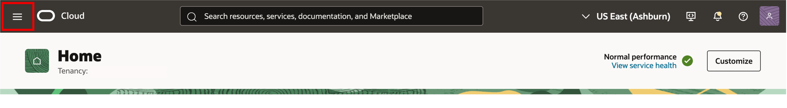
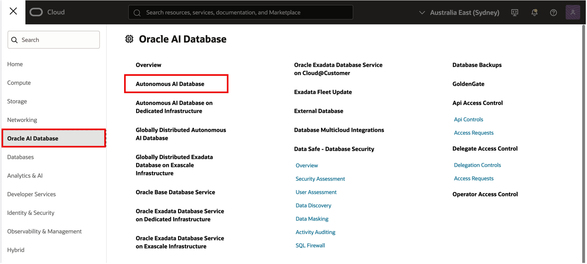
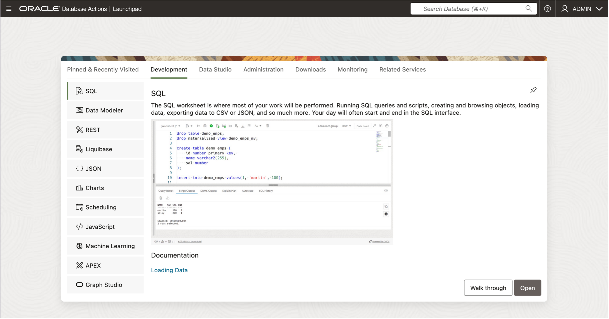

# FastStart LiveLabs Workshops 

## Introduction  

Welcome to this **FastStart** workshop.  

**FastStart workshops** are designed to provide you with clear, step-by-step instructions that help you to quickly gain hands-on experience using the **Oracle AI Database**.  
This workshop type equips you with the information you need, to **move from zero to hero in a short amount of time**.

While the concepts in these workshops apply equally to Oracle AI Database on-premises and in the cloud, the labs demonstrate how to get started using an **Autonomous AI Database**.

## **About Oracle AI Database**
Oracle AI Database is the next long-term support release of Oracle Database.  
It includes over 300 new features with a focus on artificial intelligence (AI) and developer productivity.  

<u>**Key highlights include:**</u>

* **AI Vector Search:** Enable you to leverage a new generation of AI models to generate and store vectors of documents, images, or sound; index them;  
and be able to perform fast similarity searches while leveraging the existing analytical capabilities of Oracle AI Database.
* **Machine Learning integrations:** Enables users to use the extensive set of built-in algorithms, to quickly create AI-enabled applications.
* **AI-driven optimizations:** Oracle AI Database also uses AI to optimize many of the key database functions to make more accurate estimates on timings and resource costings.  

<u>**New developer-focused features now make it simpler to build next-generation applications:**</u>

* Simplified JSON and relational development with JSON Relationla Duality Views, allows you to use both interchangeably.
* Expanded microservices and messaging capabilities further improve upon Oracle Database's extensive support for this key design methodology.
* Addition of RAFT protocol support for sharding and distributed deployments makes it easy to meet regulatory or performance requirements.  

<u>**SQL and PL/SQL enhancements:**</u>

* New data types and language features for OLTP and analytics.
* SQL Firewall for fine-grained SQL execution, to enble you to control exactly what SQL is executed against your database.  

<u>**Performance and management advances:**</u>

* Many of the key dba management tasks have been refined to reduce their complexity and improving their performance
* New functionality to simplify dba tasks have been added, such as tools to reclaim free space and reduce DBA overhead
* Oracle AI Database also adds performance boosts at both the infrastructure level (e.g., True Cache) and SQL level, ensuring some statements will execute many times faster.

Click [here](https://docs.oracle.com/en/database/oracle/oracle-database/23/nfcoa/feature_highlights.html) for documentation introducing ***Oracle AI Database New Features***.  
 

## **About Autonomous AI Database**
Oracle's ***Autonomous AI Database*** is a cloud database that uses machine learning to automate critical operations, including tuning, security, backups, and updates.  
Unlike a conventional database, it handles these tasks without human intervention.

You do not need to plan storage layouts, schedule backups, or tune queries. Oracle automates all of it, so you can focus on your data and applications.

<u>When you create an Autonomous Database, you can deploy it to one of three kinds of Exadata infrastructure:</u>

* **Dedicated Exadata Cloud Infrastructure (Dedicated)** – Your own isolated Exadata cloud environment.
* **Serverless Exadata Cloud Infrastructure (Shared/Serverless)** – A multi-tenant service where Oracle manages everything.
* **Exadata Cloud@Customer** – Exadata infrastructure deployed inside your data center, managed by Oracle.

Oracle’s Autonomous Database is the perfect fast-start service for fast data loading, sophisticated data reporting, and running advanced analytics.  
Oracle manages everything for you, so that you can accelerate application development without worrying about database administration.

Click [here](https://docs.oracle.com/en/cloud/paas/autonomous-database/index.html) for documentation introducing ***Oracle Autonomous AI Database***.  

## **Launch Free Workshop Lab Environment**

<u>**Choose an option for launching your Free Autonomous AI Database lab environment:**</u>.  

A) ***Launch an Oracle Cloud Always Free Autonomous AI Database lab environment***

[Use Autonomous Database 15 Minute Quick Start](https://livelabs.oracle.com/pls/apex/f?p=133:180:4579534958655::::wid:928)
    
    * Requires an Oracle Cloud account with permission to create an Autonomous Database in your tenancy/region
    

B) ***Launch a Local Oracle Autonomous AI Database Container lab environment***  

[Use the Autonomous Database Free Container Image](https://docs.oracle.com/en-us/iaas/autonomous-database-serverless/doc/autonomous-database-container-free.html)
    
    * Requires a compatible container runtime (e.g., Docker/Podman) and sufficient local CPU/RAM/disk to run the database container
    

## **Open Database Actions Launchpad**
 

**Estimated Time:** ***2 minutes***

1. Open Navigation Menu
       * Open the **Navigation Menu** by clicking the hamburger icon in the top-left corner.

       

2. Navigate to Autonomous AI Database Landing Page
       * Click on **Oracle AI Database**, then select **Autonomous AI Database**.

       

3. **Choose Compartment** where your database resides and **select your database from list** of Autonomous AI Databases displayed

       

4. On database details page select **Database Actions** button and click on **View all database actions**

       

       >**This opens the Database Actions Launchpad**, ***where you can access the built-in web-based tools, including SQL Worksheet.***

       

***Congratulations!*** Your lab environment is now ready for use.  
***Please proceed to lab 1***.
 
 

## Acknowledgements

- **Author** - Eddie Ambler, Sr. Principal Product Manager
- **Contributor** - Eugenio Galiano
- **Last Updated By/Date** - Eddie Ambler, October 2025
