# Get started - Launch Your Always Free Autonomous AI Database Lab Environment

## Introduction

Welcome to this **LiveLabs FastStart** lab.

In this lab, we will show you how to launch an **Always Free Autonomous AI Database** instance and how to open the built-in **Database Actions** tools,  
so that you can gain hands on experience with Oracle Cloud and the latest Oracle AI Database features outlined in the LiveLabs FastStart Labs.  
This lab will provide you with a set of step by step instructions, that will enable you to launch your lab environment in the cloud utilizing an Autonomous AI Database Free instance on the Oracle Cloud Free Tier.

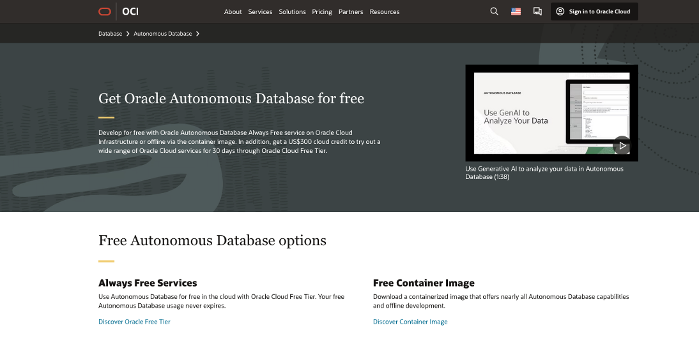
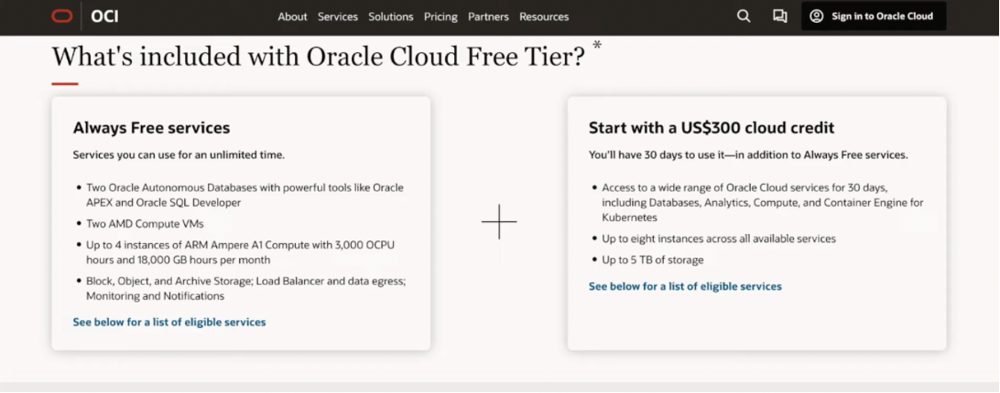

>***Note:*** The FastStart Labs will utilize the Always Free services when you leverage Autonomous AI Database in the Oracle Cloud Free Tier.

**Estimated Time:** ***As little as 2 minutes - Task level timing estimates provided***, **as task 1 & 2 are one time tasks.**

### **Objectives**

- Create an Oracle Cloud Always Free Tier Account
- Create an Always Free Oracle Autonomous AI Database Instance
- Connect to Always Free Oracle Autonomous AI Database Instance & Open Database Actions Launchpad

>Skip to task 2 to **Create an Always Free Oracle Autonomous AI Database Instance**, if you already have an **Oracle Cloud Free Tier** account.  
>Skip to task 3 to **Connect to Always Free Oracle Autonomous AI Database Instance & Open Database Action Launchpad**, if you already have an Oracle Autonomous Database Instance

## ***Task 1: Create Oracle Cloud Always Free Tier Account***

**Estimated Time:** ***15 minutes***

1. **Set up an Oracle Cloud Free Trial account**

       * Visit [Oracle's Free Tier page](https://www.oracle.com/cloud/free/) and click on **Start for Free** to begin the signup process.

       

2. **Enter Account Creation Information**

       * Select your Country/Territory
       * Enter your First Name & Last Name
       * Enter a valid Email Adress
       * Check the box and Complete the "I am human" CAPTCHA verification

       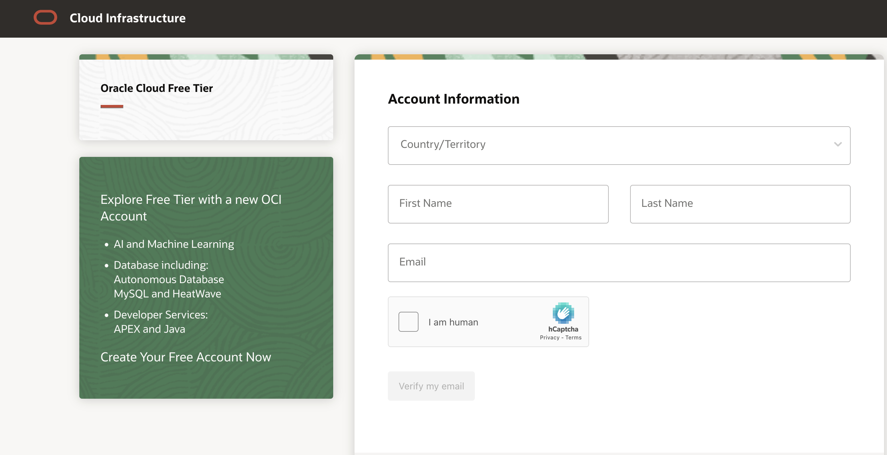

3. **Verify Your Email**

       * Click on **Verify Email** button to proceed

       * Open your email and find the verification email from Oracle

       * Click the Verify email button in the email

       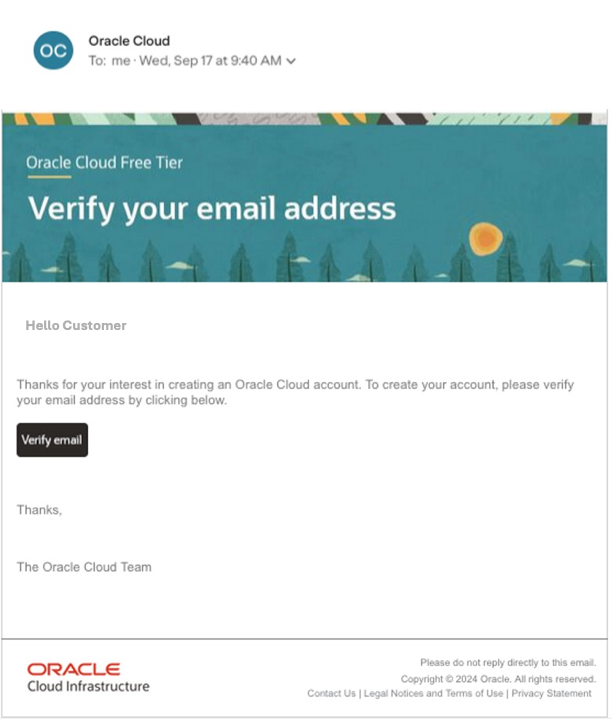

4. **Complete Entering Account Information**

       * Enter a Password for your cloud account
       * Select Customer Type
       * Enter a Cloud Account Name - also known as a Tenancy Name

       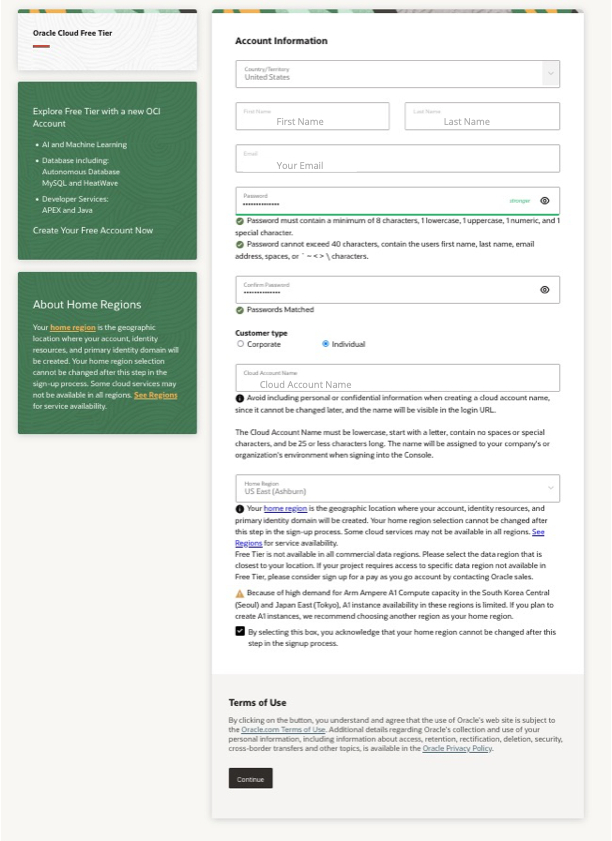

       * Select your Home Region

       

       * Check the box to confirm you understand that the Home Region choice cannot be changed after signup

       * Read and accept the Terms of Use, then click Continue button to proceed.

5. **Enter Address & Phone Information**

       * **Enter address**

       >***Ensure the address is accurate***, as it will be **verified with your payment details.**

       * **Enter phone number**

        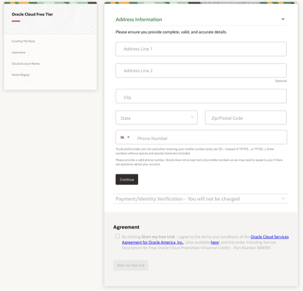

       >***You may receive a verification code via SMS*** to confirm your phone number

       * click on continue to proceed

6. **Add Payment Method for Verification**

       * Click on **Add Payment Verification Method**

        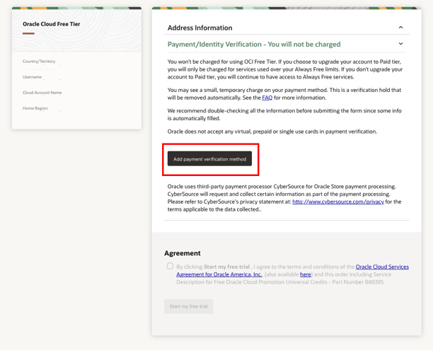

       * On Popup window, Click on Credit Card button

        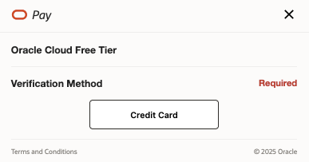

       * **Enter your credit card billing information.**

        

       >***Note:*** A temporary hold will be placed on your card, typically for $1, which is then removed.

       * **Now select your payment card type and enter card payment details.**

        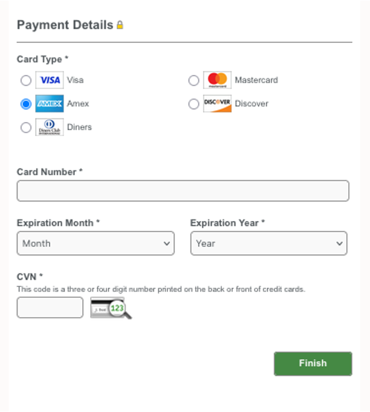

       * Click on **Finish button** to proceed.

        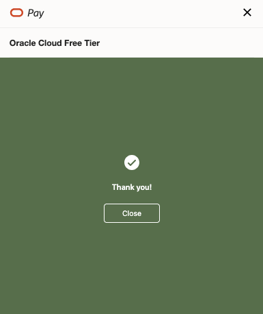

7. **Accept Terms & Conditions to Start Your Free Trial**

       * Check the box to **accept terms and conditions**

       * Click on **Start my free trial** button

        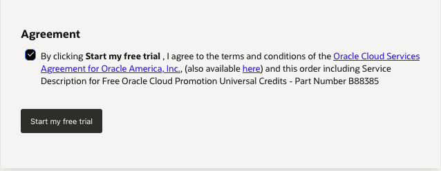

8. **Access Your Free Oracle Cloud Trial Account**

       * Once Oracle has completed provisioning your account, **you will receive a "Welcome" or "Get Started" email.**
       * Use your ***Cloud Account Name*** to **Login to the OCI console:** at  https://cloud.oracle.com.
       * Click the **Next** button and then enter your **User ID** (your email), and **Password** and Click **Sign In** Button.

        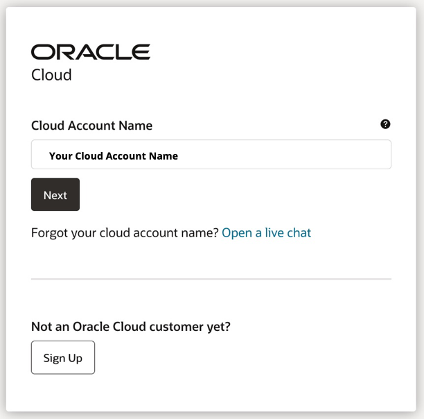

***Congratulations!***

You now have your own **Oracle Cloud Free Tier Account** that you can use to gain hands on experience with Oracle Cloud and Oracle Database 23ai.
 
 

## ***Task 2: Create an Always Free Oracle Autonomous AI Database Instance***

**Estimated Time:** ***15 minutes***

1. Open Navigation Menu

       * Open the **Navigation Menu** by clicking the hamburger icon in the top-left corner.

       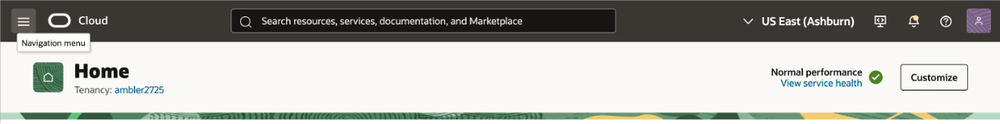

2. Navigate to Autonomous Database Landing Page
       * Click on **Oracle Database**, then select **Autonomous Database**.

       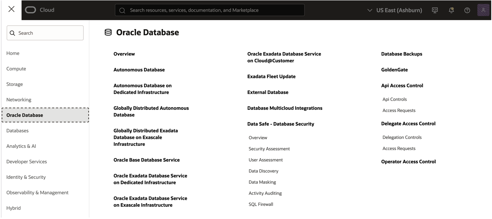

3. Choose Your Compartment and Start Autonomous Database Creation

       * Select the **Compartment** where you want to create your database.
       * Click the **Create Autonomous Database** button.

       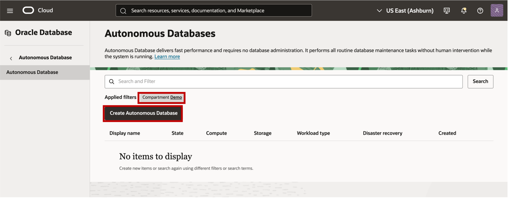

4. Provide Details to Create Database

       * Display Name: Enter a user-friendly name to identify your database.
       * Database Name: Create a unique name for your database within your tenancy.
       * Workload Type: Select "Transaction Processing" or "Data Warehouse" based on your needs.

       >***Note:*** For this lab example we entered ***ADBFree*** for the **Display Name** and **Database Name**   
       >We also selected ***Data Warehouse*** for the **Workload Type**

       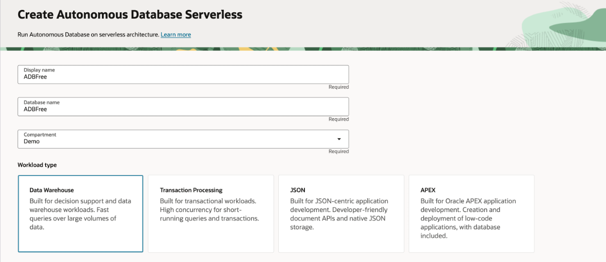

5. Choose Autonomous Database **Instance type** to be ***Always Free*** and ***23ai** for Database Version

       * Under **Database configuration**, ensure that the **Always Free** toggle slider is on.
       * In the **Database version** section, **choose 23ai** from the drop-down menu.

       >***Note:*** Free Tier databases automatically use **Shared Infrastructure** (serverless).
       >***Note:*** ADB free instances can be upgraded to a paid version. Requires you to first upgrade the Free Tier account to a paid OCI account.

       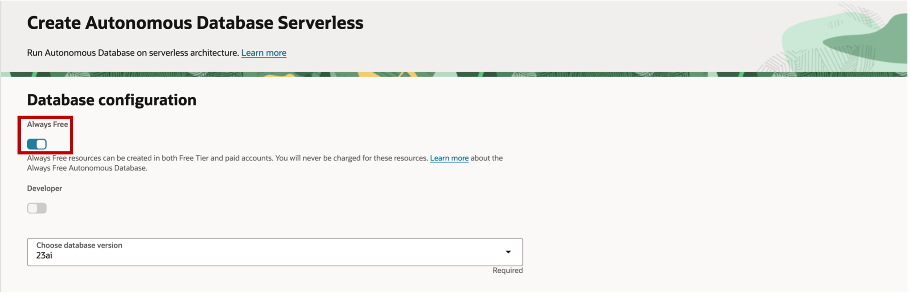

6. Set Administrator Credentials

       * Create a strong password for the default ***ADMIN*** user
       >***Important:*** Remember this password, as you will need it to access your database.

       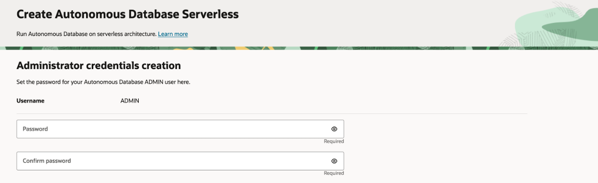

7. Choose Network Access Type

       <u>Description of Network Access Choices:</u>
       * **Secure access from everywhere:** The simplest option for testing, allow users with database credentials to  connect from any IP address.
       * **Secure access from allowed IPs and VCNs only:** (suggested) Restrict access to specific IP addresses and Virtual Cloud Networks.

       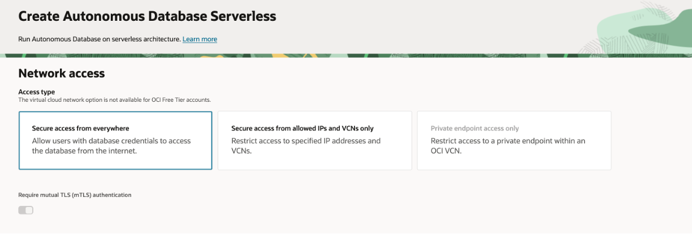

8. Review Configuration Page and Launch Create ADB flow

       * Review all your configuration settings one last time.
       * Click **Create** button to begin provisioning Autonomous Database.

       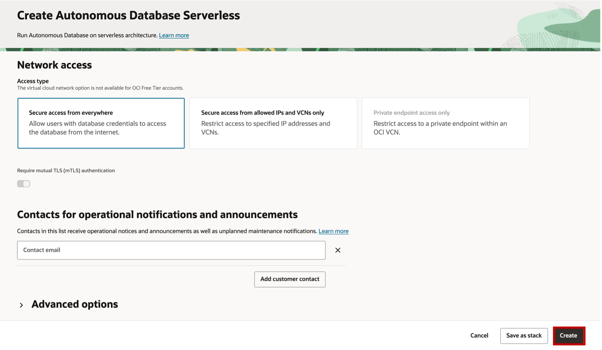

       >The Autonomous Database service will begin creating your instance.  
       >This process can take 2 to 5 minutes.
        

       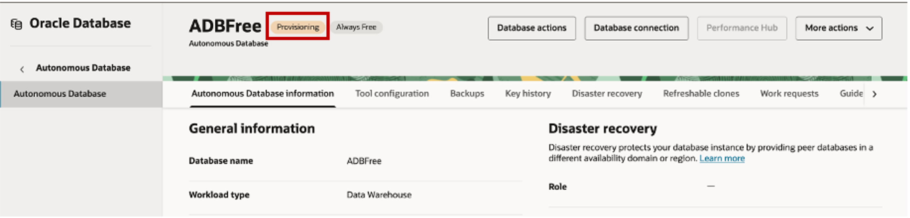

       >The status will change from Provisioning to Available when complete.

       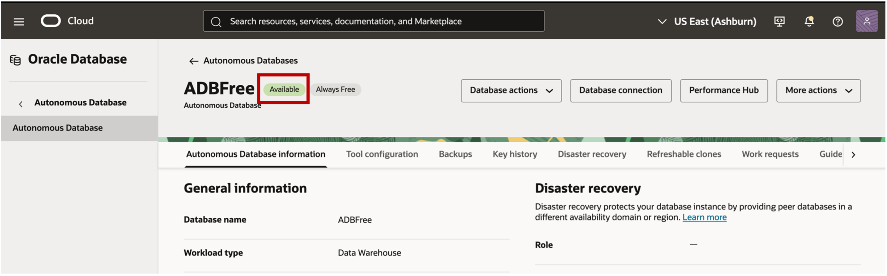

***Congratulations!*** Your Autonomous Database Free Instance is now ready for use.
 
 

## ***Task 3: Connect to Always Free Oracle Autonomous AI Database & Open Database Action Launchpad***
 

**Estimated Time:** ***15 minutes***

>Skip to **Step 4** ***if you are continuing from Task 2*** 

1. Open Navigation Menu
       * Open the **Navigation Menu** by clicking the hamburger icon in the top-left corner.

       

2. Navigate to Autonomous Database Landing Page
       * Click on **Oracle Database**, then select **Autonomous Database**.

       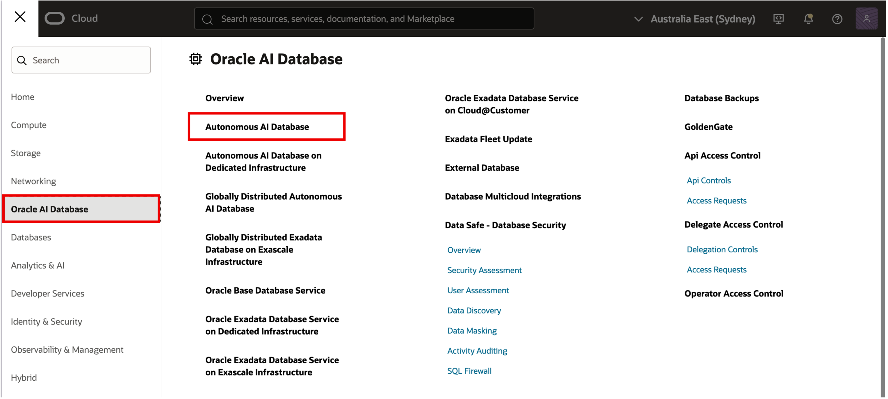

3. **Choose Compartment** where your database resides and **select your database from list** of Autonomous Databases displayed

       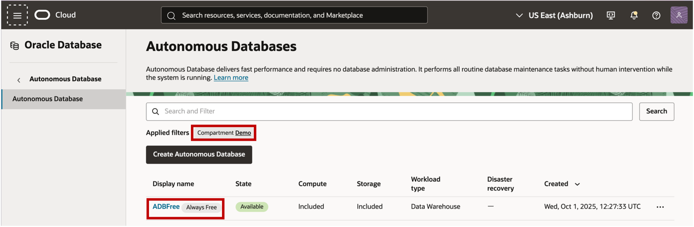

4. On database details page select **Database Actions** button and click on **View all database actions**

       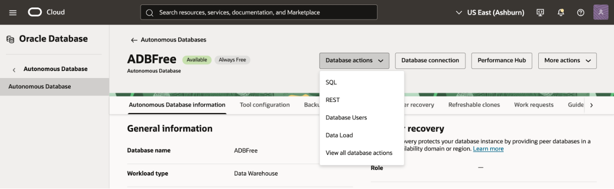

       >**This opens the Database Actions Launchpad**, ***where you can access the built-in web-based tools, including SQL Worksheet.***

       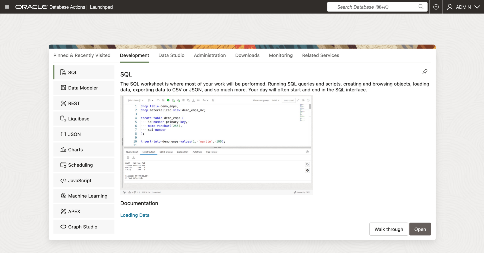

***Congratulations!*** Your lab environment is now ready for use.  
***Please proceed to lab 1***.
 
 

***Please proceed to lab 1***, once your lab environment is ready for use.
 
 

## Acknowledgements
- **Created By/Date** - Eddie Ambler
- **Last Updated By/Date** - Eddie Ambler, September 2025

