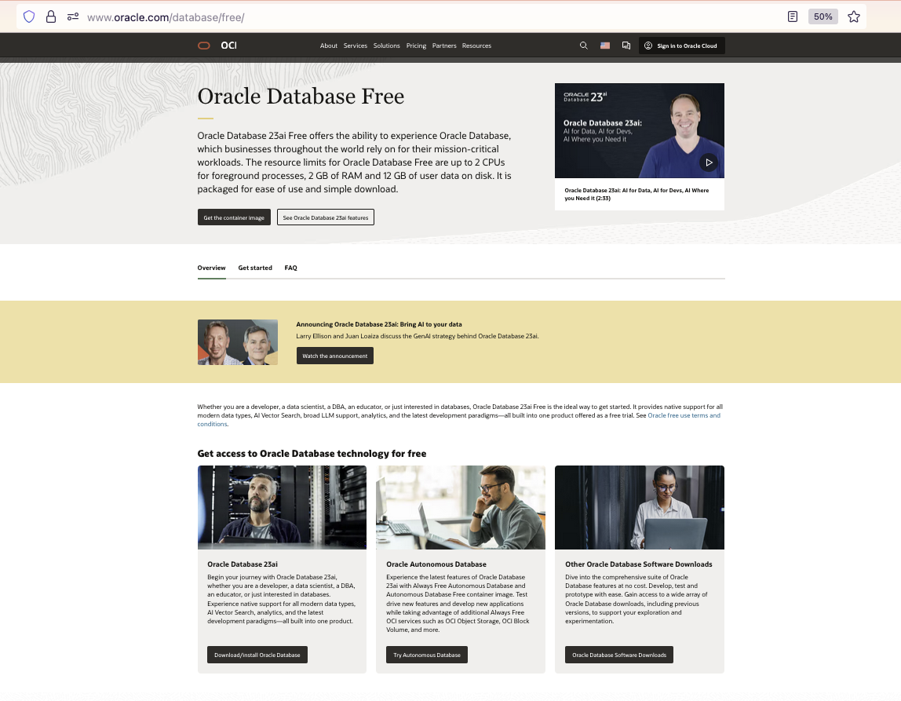
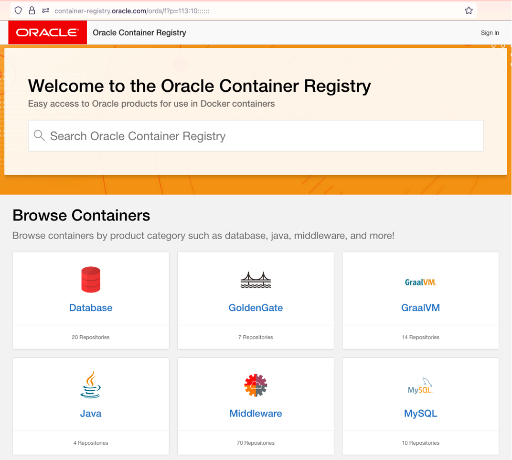

# Get started - Launch Your Autonomous Database Free Lab Environment

## Introduction

Welcome to this **LiveLabs FastStart** lab.

In this lab, we will show you how to launch an **Autonomous AI Database Free Container** instance and how to open the built-in **Database Actions** tools,  
so that you can gain hands on experience with Oracle Cloud and the latest Oracle AI Database features outlined in the LiveLabs FastStart Labs.  
This lab will provide you with a set of step by step instructions, that will enable you to launch your local lab environment that uses the Autonomous AI Database Free Container Image.

**Estimated Time:** ***As little as 2 minutes***, **as task 1, 2, & 3 are one time tasks.**

### **Objectives**

- Install Podman for use with installing Autonomous AI Database Container Image
- Download Autonomous AI Database Container Image from Oracle Container Registry
- Install Autonomous AI Database Container Image
- Connect to Autonomous AI Database Instance on Container & Open Database Actions Launchpad

<u>***Prerequisites:***</u> You will need an [Oracle SSO Account.]( https://profile.oracle.com/myprofile/account/create-account.jspx)
 

### ***Task 1: Login to Oracle Container Registry To Get "adb-free" Container Image***

>***Note:*** To pull the adb-free container image from the Oracle Container Registry to your local machine:  
>you must first login to the **Oracle Container Registry** at https://container-registry.oracle.com/ with your **Oracle SSO Account.**

* From a web browser, **navigate to the** [Oracle Container Registry](https://container-registry.oracle.com/)
* In the upper right corner, click on Sign In and provide your Oracle SSO account credentials. If you don't have one, you will need to [create an Oracle SSO Account first.]( https://profile.oracle.com/myprofile/account/create-account.jspx)

* Once logged into the registry, you’ll find many different containers listed by product category. **Choose the** ***Database*** **Repository**. 

***Please proceed to lab 1***, once your lab environment is ready for use.
 
 

## Acknowledgements
- **Created By/Date** - Eddie Ambler
- **Last Updated By/Date** - Eddie Ambler, September 2025

