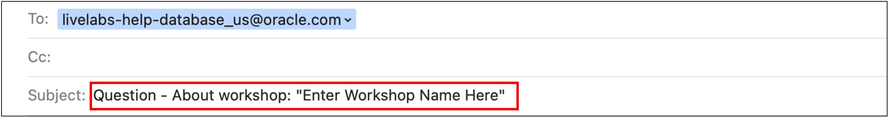
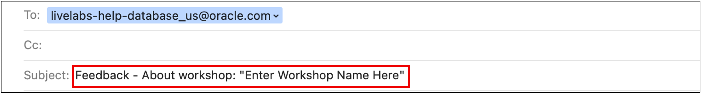

# Need Help - Want to Submit Feedback?

Click the **question mark icon** in the upper right corner to contact the LiveLabs team directly via email.

## Submit Email to report issues
Please follow the steps below to contact us and get a quick resolution to your issue.  
>Note that clicking on the question mark icon in the upper right corner will construct an email in your default mail application that is auto-populated to address our LiveLabs support inbox.

1. Please enter ***Question - About workshop*** and the workshop name into the subject line.  
    

2. In the email body, include the **Lab Number**, **Task Number**, and **Step Number** where you've encounter the issue.  

3. In the email body, also include the description of your **issue** and any pertinent information.

4. Attach a **Screenshot** and **any troubleshooting steps** you've tried, so that we can recreate the issue and provide a timely and accurate solution.

## Submit Email to submit feedback
Please follow the steps below to contact us and submit your feedback.  
Your feedabck is valuable and appreciated, as we continually evaluate feedback to improve our workshops.  
>Note that clicking on the question mark icon in the upper right corner will construct an email in your default mail application that is auto-populated to address our LiveLabs support inbox.

1. Please enter ***Feedback - About workshop*** and the workshop name into the subject line.  

    

2. In the email body, include the **Lab Number**, **Task Number**, and **Step Number** associated to the feedback you are providing.

3. In the email body, provide your feedback for the workshop.

## Acknowledgements
* **Author** - LiveLabs Team, Eddie Ambler
* **Contributors** - LiveLabs Team, Eddie Ambler
* **Last Updated By/Date** - Eddie Ambler - Database Product Management, October 2025