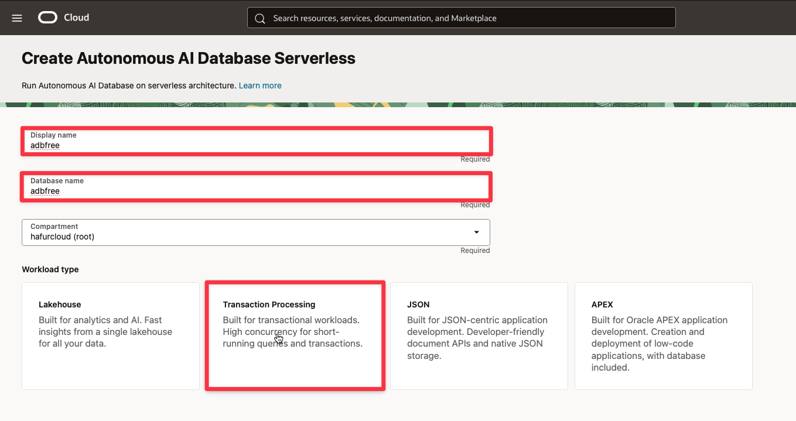
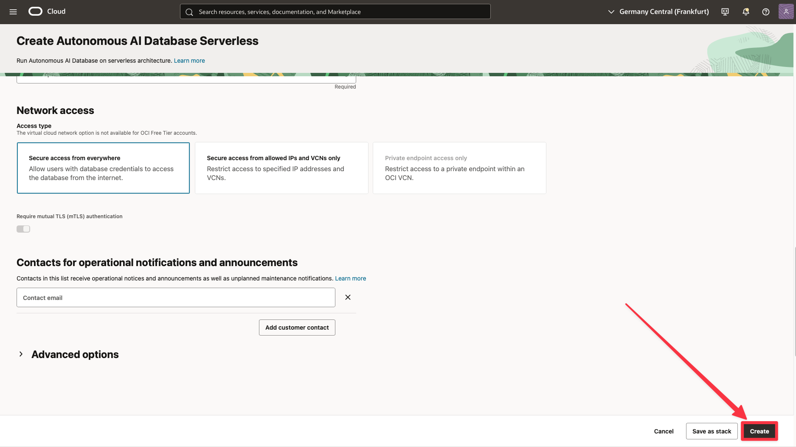
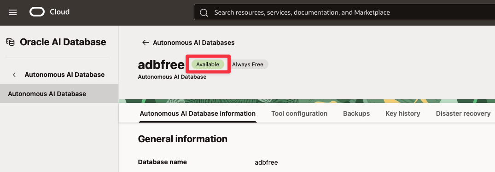

# LiveLabs FastStart - Create an Autonomous AI Database

## Introduction

This LiveLabs FastStart shows you the fastest way to create a new Autonomous AI Database instance using default settings. To explore more configuration options, see this LiveLabs workshop:[Use Autonomous Database 15 Minute Quick Start](https://livelabs.oracle.com/pls/apex/f?p=133:180:4579534958655::::wid:928)

### Prerequisites

- Oracle OCI Cloud Account - get one here: [https://www.oracle.com/cloud/free/](https://www.oracle.com/cloud/free/)

## Video Walkthrough

[Create ADB](videohub:1_vvp8wj7a)

## Task 1: Login to OCI and go to the Oracle Autonomous AI Database overview screen.

1. After logging in to OCI, you should see the OCI landing page

    

2. Click the hamburger menu in the top left and select **Oracle AI Database** and **Autonomous AI Database**.

    

## Task 2: Create a new Autonomous AI Database instance.

1. Click **Create Autonomous AI Database**

    

2. Change the **Display name** and **Database name** and select an appropriate **Workload type**.

    

3. Enable **Always Free** and select **26ai** as the database version.

    

4. Provide your administrator password

    

5. Scroll down and click **Create**

    

6. Your new ADB instance will be ready in just a few minutes

    

## Signature Workshop

Ready to dive deeper? These workshops move you from demo to hands-on practice.

👉 Click here to start our signature workshop: [Use Autonomous Database 15 Minute Quick Start](https://livelabs.oracle.com/pls/apex/f?p=133:180:4579534958655::::wid:928)

## Learn More

* [Autonomous AI Database](https://docs.oracle.com/en/database/autonomous-database-cloud-services.html)

## Acknowledgements
* **Author** -Kevin Lazarz, Database Product Management
* **Last Updated By/Date** - Kevin Lazarz, November 2025
