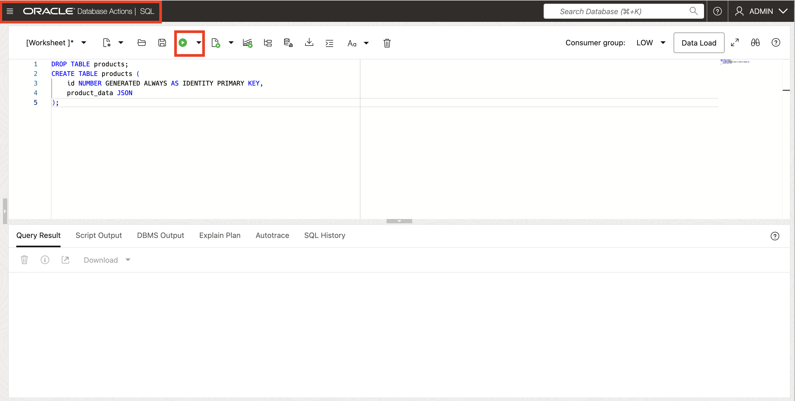
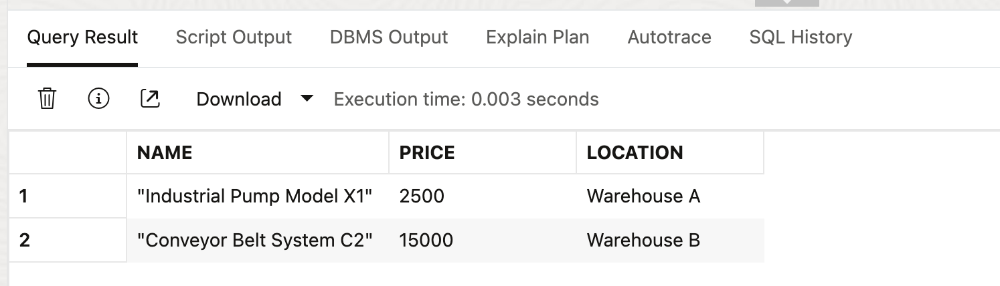
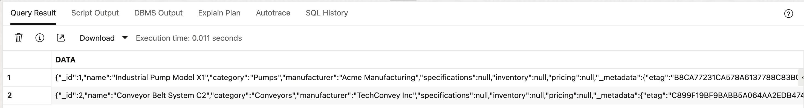

# LiveLabs FastStart - JSON Relational Duality

## Introduction

*Model fast, scale smart: JSON your way in 23ai.*

JSON (JavaScript Object Notation) is the standard format for modern data exchange. It’s lightweight, human-readable, and supported across major programming languages. Its popularity comes from its simplicity and flexibility—ideal for APIs, configurations, and semi-structured data.

Application development today depends on handling dynamic, hierarchical data. Traditional relational databases, bound by fixed schemas, struggle with these patterns. Oracle Database 23ai treats JSON as a first-class data type, so you can store documents natively, index them, and query them with full SQL alongside relational columns. 

From that foundation, you have two higher-level options depending on how your application evolves. 

**JSON collection tables are document-first**: a table that holds JSON documents (one per row) with a unique _id, optional concurrency control (e.g., ETAG), and the ability to add virtual (expression) columns for constraints, partitioning, and performance. They shine when your schema changes frequently, teams iterate quickly, or you need a lightweight store for user profiles, content, logs, or configuration—with immediate access via SQL and document APIs. 

**JSON-relational Duality Views** are for when you want the best of both worlds: you model data relationally (keys, constraints, joins), and the same rows appear as updatable JSON documents. This is ideal for systems of record that demand transactions and rich SQL but also need document ergonomics for microservices or mobile apps. 

**In practice:** 
- pick JSON columns in existing tables to enrich entities with flexible attributes,
- choose a collection table when the data is document-centric and fast-moving,
- use a duality view when you must preserve relational integrity and analytics while offering a clean JSON interface. 

The result is a unified platform where each workload—exploratory, operational, or analytical—gets the right JSON shape without data duplication or sync headaches.


## Example: Working with JSON as data type, JSON Duality Views, and JSON Collection Tables

### Step 1: Create a table with JSON columns

1. Log in to your ADB instance and open SQL worksheet

    

2. Create a table to store JSON documents. This example creates a product catalog table for a manufacturing company.
    
    ```sql
    <copy>
    DROP TABLE products;
    CREATE TABLE products (
        id NUMBER GENERATED ALWAYS AS IDENTITY PRIMARY KEY,
        product_data JSON
    );
    <copy>
    ```

    

### Step 2: Insert JSON Documents

1. Insert JSON data representing manufacturing products with nested specifications.
    
    ```sql
    <copy>
    INSERT INTO products (product_data) VALUES (
        JSON('{
            "name": "Industrial Pump Model X1",
            "category": "Pumps",
            "manufacturer": "Acme Manufacturing",
            "specifications": {
                "power": "5HP",
                "voltage": "480V",
                "flow_rate": "100 GPM",
                "materials": ["stainless steel", "cast iron"]
            },
            "inventory": {
                "quantity": 150,
                "location": "Warehouse A",
                "reorder_point": 50
            },
            "pricing": {
                "list_price": 2500.00,
                "discount_eligible": true
            }
        }')
    );
    <copy>
    ```

2. Insert JSON data for manufacturing products
    
    ```sql
    <copy>
    INSERT INTO products (product_data) VALUES (
        JSON('{
            "name": "Conveyor Belt System C2",
            "category": "Conveyors",
            "manufacturer": "TechConvey Inc",
            "specifications": {
                "length": "50ft",
                "width": "24in",
                "belt_type": "modular plastic",
                "speed": "200 ft/min"
            },
            "inventory": {
                "quantity": 25,
                "location": "Warehouse B",
                "reorder_point": 10
            },
            "pricing": {
                "list_price": 15000.00,
                "discount_eligible": false
            }
        }')
    );
    <copy>
    ```
    

### Step 3: Query JSON Data

1. Use SQL/JSON functions to query the JSON documents.
    ```sql
    <copy>
    -- Find all pumps
    SELECT p.product_data.name, p.product_data.specifications.power
    FROM products p
    WHERE p.product_data.category = 'Pumps';
    <copy>
    ```
    

2. Find any low inventory products
    ```sql
    <copy>
    -- Find products with low inventory
    SELECT p.product_data.name, p.product_data.inventory.quantity
    FROM products p
    WHERE p.product_data.inventory.quantity < p.product_data.inventory.reorder_point;
    <copy>
    ```
    

3. Extract nested values 
    ```sql
    <copy>
    -- Extract nested values
    SELECT p.product_data.name,
        JSON_VALUE(p.product_data, '$.pricing.list_price') as price,
        JSON_VALUE(p.product_data, '$.inventory.location') as location
    FROM products p;
    <copy>
    ```
    

### Step 4: Create a Duality View

A duality view gives you the best of both worlds: rows you can join and constrain, and the very same data as updatable JSON documents. Create one over your products table to get a document API without duplicating data.

1. Create a duality view that provides relational access to the JSON data.

    ```sql
    <copy>
    CREATE OR REPLACE JSON DUALITY VIEW products_dv AS
    SELECT JSON {
        '_id' : p.id,
        'name' : JSON_VALUE(p.product_data, '$.name'),
        'category' : JSON_VALUE(p.product_data, '$.category'),
        'manufacturer' : JSON_VALUE(p.product_data, '$.manufacturer'),
        'specifications' : JSON_VALUE(p.product_data, '$.specifications'),
        'inventory' : JSON_VALUE(p.product_data, '$.inventory'),
        'pricing' : JSON_VALUE(p.product_data, '$.pricing')
    }
    FROM products p;
    <copy>
    ```
2. Congratulations, your JSON Duality View was created successfully!

    

### Step 5: Query the Duality View

1. Access the same data through the duality view as a JSON collection.

    ```sql
    <copy>
    -- Select all products as JSON
    SELECT * FROM products_dv;
    <copy>
    ```
    

    ```sql
    <copy>
    -- Find products by category using JSON path
    SELECT * FROM products_dv
    WHERE JSON_VALUE(data, '$.category') = 'Pumps';
    <copy>
    ```
    
    
2. Update the `products` inventory using duality view.
    ```sql
    <copy>
    -- Update inventory through the duality view
    UPDATE products_dv
    SET data = JSON_TRANSFORM(data, SET '$.inventory.quantity' = 140)
    WHERE JSON_VALUE(data, '$.name') = 'Industrial Pump Model X1';
    <copy>
    ```
     
    ```sql
    <copy>
    -- Verify that the tables are updated
    SELECT * FROM products_dv;
    <copy>
    ```
    

### Step 6: Work with JSON Collections

Need lightweight document storage without leaving the database? Create a JSON collection and start inserting documents you can query, index, and secure with familiar SQL. Think of a JSON collection as a table optimized for documents—no rigid columns, just an _id and a JSON payload. You get the agility of a doc store with Oracle’s reliability and control.

1. Create a JSON collection for manufacturing products. Oracle automatically generates an _id and data column for every JSON collection you create. The _id uniquely identifies each document, and the data column holds the JSON information.

    ```sql
    <copy>
    CREATE TABLE MANUFACTURING_COLLECTION;
    <copy>
    ```
    

2. Insert JSON documents into the collection.

    ```sql
    <copy>
    INSERT INTO MANUFACTURING_COLLECTION (DATA)
    VALUES (JSON('{
    "name": "Robotic Arm Assembly Line",
    "category": "Automation",
    "manufacturer": "RoboTech Solutions",
    "specifications": {
        "reach": "2.5m",
        "payload": "50kg",
        "speed": "1.2 m/s"
    },
    "inventory": {
        "quantity": 8,
        "location": "Warehouse C",
        "reorder_point": 5
    },
    "pricing": {
        "list_price": 75000.00,
        "discount_eligible": true
    }
    }'));
    COMMIT;
    <copy>
    ```
    

3. Query collection using SQL/JSON on the underlying table.

    ```sql
    <copy>
    SELECT JSON_VALUE(DATA, '$.name') AS product_name,
        JSON_VALUE(DATA, '$.manufacturer') AS manufacturer,
        JSON_VALUE(DATA, '$.specifications.reach') AS reach,
        JSON_VALUE(DATA, '$.pricing.list_price') AS price
    FROM MANUFACTURING_COLLECTION
    WHERE JSON_VALUE(DATA, '$.name') = 'Robotic Arm Assembly Line';
    <copy>
    ```
    


## Signature Workshop

* Work with JSON datatype
* Work with JSON Collections
* Work with JSON Duality Views
* Work with Oracle Database API for MongoDB


👉 Click here to [Start the JSON LiveLabs Signature Workshop](https://apexapps.oracle.com/pls/apex/f?p=133:180:16090110673701::::wid:3635)

## Learn More

* [Oracle AI Database JSON Relational Duality Feature Overview]( https://www.oracle.com/database/json-relational-duality/ )
* [JSON Relational Duality Developer's Guide - Oracle Documentation]( https://docs.oracle.com/en/database/oracle/oracle-database/23/jsnvu/overview-json-relational-duality-views.html )
* [JSON Developer’s Guide - Oracle Documentation]( https://docs.oracle.com/en/database/oracle/oracle-database/23/adjsn/)
* [Oracle Database API for MongoDB - Blogs]( https://docs.oracle.com/en/database/oracle/mongodb-api/blogs.html )

## Acknowledgements
* **Author** - Linda Foinding, Database Product Management
* **Contributors** - Patrick Shepherd
* **Last Updated By/Date** - Linda Foinding, October 2025
