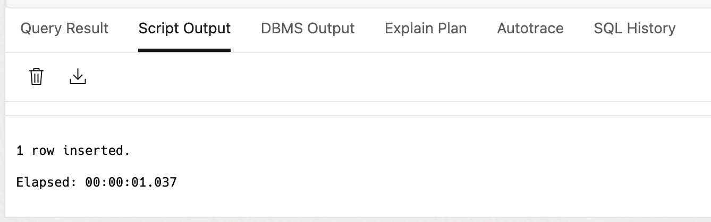

# LiveLabs FastStart - AI Vector Search

Welcome to this **LiveLabs FastStart** workshop.

LiveLabs FastStart workshops give you clear, step-by-step instructions to help you quickly gain hands-on experience with the Oracle AI Database. You will go from beginner to confident user in a short time.

## Introduction

*Search by meaning, not just words*

AI vector search finds results by concept and not only exact matches. It transforms your data into vectors (a mathematical representations of meaning) so you can retrieve what’s contextually relevant across documents, images, audio, and more.

If you own product search, support, or internal knowledge, here’s why it matters: teams manage piles of unstructured data. Traditional search struggles with nuance; vector search bridges that gap. It returns semantically similar items even when the query and the source use different words.

**Common business challenges**

- E-commerce: “Breathable running shoes” matches “mesh trainers,” even without the phrase.
- Support: “Credit card failed” surfaces the fix filed under “billing—locked account.”
- Internal search: “Supplier onboarding Tasks” finds the policy section that explains the process.
- Multilingual: “Portable charger” matches “batterie externe” and “power bank.”

**Key benefits**

- Improved relevance: Find documents, products, or answers by meaning, not just words.
- Multimodal: Search across text, images, audio, and other data types.
- Efficiency: Run fast similarity search at scale with algorithms such as HNSW.
- Integration: Connect to databases and data lakes via connectors, adapters, or ETL.
- AI foundation: Power applications such as retrieval-augmented generation (RAG), recommendations, and anomaly detection.

Consider this: Retailers can enhance product discovery by finding similar items or understanding customer preferences through vector search on product descriptions and reviews. This LiveLabs FastStart will show you how!

### Prerequisites

>Note: The following instructions will work only on an Oracle AI Database hosted in OCI, Azure, GoogleCloud, or AWS.

- An Oracle AI Database environment with a trained `all-MiniLM-L12-v2 model` in ONNX (Open Neural Network Exchange) format.

- Check our [LiveLabs FastStart - Load a pre-built ONNX embedding generation model](https://livelabs.oracle.com/pls/apex/dbpm/r/livelabs/view-workshop?wid=4277) to see how to load an ONNX model into ADB and to get a quick primer on ONNX.

### Video Walkthrough

[Create ADB](videohub:1_5vxvrznb)

## Task 1: Login to SQL | Database Actions

1. In the ADB Console, click Database Actions and select SQL

    


## Task 2: Check Model Existence and Perform Example Search

1. Check if the ONNX model called `ALL_MINILM_L12_V2` exists.
    
    ```sql
    <copy>
    DECLARE
        model_count INT;
    BEGIN
        -- Check if the ALL_MINILM_L12_V2 exists
        SELECT count(*) INTO model_count
        FROM all_mining_models
        WHERE model_name = 'ALL_MINILM_L12_V2';

        -- If the model exists, output a message
        IF (model_count > 0) THEN
            DBMS_OUTPUT.PUT_LINE('ALL_MINILM_L12_V2 exists, proceed to the next Task for using it.');
        ELSE
            DBMS_OUTPUT.PUT_LINE('ALL_MINILM_L12_V2 does not exist, please load the model.');
        END IF;
    END;
    /
    <copy>
    ```
2. ALL\_MINILM\_L12_V2 exists, proceed to the next Task for using it

    

## Task 3: Create a Table with a Vector Column


1. Create a table to store vectors. The VECTOR datatype is new in Oracle AI Database.
    ```sql
    <copy>
    -- Create table for product embeddings
    CREATE TABLE product_vectors (
        product_id NUMBER,
        name VARCHAR2(200),
        category VARCHAR2(100),
        embedding VECTOR
    );
    <copy>
    ```        
2. Validate the results

    

## Task 4: Generate Embeddings

1. Use the built-in embedding function to convert text into vectors. Now that the model is loaded, you can generate embeddings.
    ```sql
    <copy>
    -- Insert product data with embeddings
    INSERT INTO product_vectors (product_id, name, category, embedding)
    VALUES (
        1,
        'Wireless Bluetooth Headphones',
        'Electronics',
        dbms_vector_chain.utl_to_embedding(
            'Wireless Bluetooth Headphones with noise cancellation',
            JSON('{"provider":"database","model":"ALL_MINILM_L12_V2","dimensions":384}')
        )
    );
    <copy>
    ```
    

2. Insert 10 additional rows into the product_vector table
    ```sql
    <copy>
    INSERT INTO product_vectors (product_id, name, category, embedding)
    VALUES (
        2,
        'Smartphone Case',
        'Accessories',
        dbms_vector_chain.utl_to_embedding(
            'Protective smartphone case with screen protector',
            JSON('{"provider":"database","model":"ALL_MINILM_L12_V2","dimensions":384}')
        )
    );

    INSERT INTO product_vectors (product_id, name, category, embedding)
    VALUES (
        3,
        'Running Shoes',
        'Footwear',
        dbms_vector_chain.utl_to_embedding(
            'Comfortable running shoes with cushioning',
            JSON('{"provider":"database","model":"ALL_MINILM_L12_V2","dimensions":384}')
        )
    );

    INSERT INTO product_vectors (product_id, name, category, embedding)
    VALUES (
        4,
        'Coffee Maker',
        'Appliances',
        dbms_vector_chain.utl_to_embedding(
            'Automatic coffee maker with programmable timer',
            JSON('{"provider":"database","model":"ALL_MINILM_L12_V2","dimensions":384}')
        )
    );

    INSERT INTO product_vectors (product_id, name, category, embedding)
    VALUES (
        5,
        'LED Desk Lamp',
        'Lighting',
        dbms_vector_chain.utl_to_embedding(
            'Adjustable LED desk lamp with USB charging port',
            JSON('{"provider":"database","model":"ALL_MINILM_L12_V2","dimensions":384}')
        )
    );

    INSERT INTO product_vectors (product_id, name, category, embedding)
    VALUES (
        6,
        'Yoga Mat',
        'Sports',
        dbms_vector_chain.utl_to_embedding(
            'Non-slip yoga mat with carrying strap',
            JSON('{"provider":"database","model":"ALL_MINILM_L12_V2","dimensions":384}')
        )
    );

    INSERT INTO product_vectors (product_id, name, category, embedding)
    VALUES (
        7,
        'Wireless Mouse',
        'Electronics',
        dbms_vector_chain.utl_to_embedding(
            'Ergonomic wireless mouse with long battery life',
            JSON('{"provider":"database","model":"ALL_MINILM_L12_V2","dimensions":384}')
        )
    );

    INSERT INTO product_vectors (product_id, name, category, embedding)
    VALUES (
        8,
        'Backpack',
        'Bags',
        dbms_vector_chain.utl_to_embedding(
            'Waterproof backpack with multiple compartments',
            JSON('{"provider":"database","model":"ALL_MINILM_L12_V2","dimensions":384}')
        )
    );

    INSERT INTO product_vectors (product_id, name, category, embedding)
    VALUES (
        9,
        'Blender',
        'Appliances',
        dbms_vector_chain.utl_to_embedding(
            'High-speed blender for smoothies and soups',
            JSON('{"provider":"database","model":"ALL_MINILM_L12_V2","dimensions":384}')
        )
    );

    INSERT INTO product_vectors (product_id, name, category, embedding)
    VALUES (
        10,
        'Sunglasses',
        'Accessories',
        dbms_vector_chain.utl_to_embedding(
            'Polarized sunglasses with UV protection',
            JSON('{"provider":"database","model":"ALL_MINILM_L12_V2","dimensions":384}')
        )
    );

    INSERT INTO product_vectors (product_id, name, category, embedding)
    VALUES (
        11,
        'Notebook',
        'Stationery',
        dbms_vector_chain.utl_to_embedding(
            'Lined notebook with hardcover and elastic closure',
            JSON('{"provider":"database","model":"ALL_MINILM_L12_V2","dimensions":384}')
        )
    );
    <copy>
    ```
    

## Task 5: Perform a similarity search

1. Execute the vector search query using VECTOR_DISTANCE for product recommendations based on the embeddings
    ```sql
    <copy>
        SELECT product_id, name, category,
        VECTOR_DISTANCE(
            embedding,
            dbms_vector_chain.utl_to_embedding(
                'Portable music headphones with good sound quality',
                JSON('{"provider":"database","model":"ALL_MINILM_L12_V2","dimensions":384}')
            ),
            COSINE
        ) AS VECTOR_DISTANCE
        FROM product_vectors
        ORDER BY VECTOR_DISTANCE;
    <copy>
    ```
2. The table lists products sorted by vector distance. A lower number means the product is more similar to the query. In this example, Wireless Bluetooth Headphones are the closest match. The next result, Running Shoes, suggests a semantic connection: if you are looking for portable headphones, you might also be interested in running shoes. After all, when does portable audio make more sense than when you are out for a run?

    


## Signature Workshop

Ready to go deeper? These workshops let you move from demo to hands-on practice.

What you'll do:

- Add the new vector datatype.

- Verify ONNX embedding models.

- Create embeddings for text and images.

- Run exact and approximate similarity searches with indexes.

- Combine similarity search with relational queries.

- Apply everything in a pre-built APEX app.

👉 Click here to [Start the Signature Workshop](https://livelabs.oracle.com/pls/apex/r/dbpm/livelabs/view-workshop?wid=4166&clear=RR,180&session=13771097537930)


## Learn More

* [AI Vector Search Docs](https://docs.oracle.com/en/database/oracle/oracle-database/23/vecse/)
* [AI Vector Search Product Page](https://www.oracle.com/database/ai-vector-search/)
* [LiveLabs Workshop](https://livelabs.oracle.com/pls/apex/f?p=133:180:114898719666832::::wid:4166)


## Acknowledgements
* **Author** - Linda Foinding, Database Product Management
* **Contributors** - Patrick Shepherd
* **Last Updated By/Date** - Linda Foinding, October 2025
