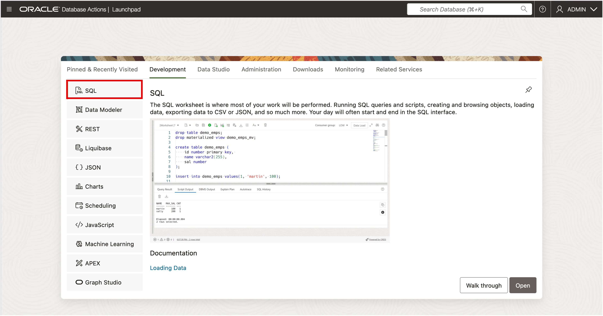

# How to Create, Modify, and Manage data structures with DDL in Oracle AI Database

Duration: 15 minutes

## Introduction

Every Oracle Database starts with structure. Data Definition Language (DDL) gives you the power to create, reshape, and manage your data environment.  
With just four commands — CREATE, ALTER, DROP, and RENAME — you can handle everything from building tables to evolving your schema design.  

<u>In this FastStart Lab, you will learn how to:</u>  
* Create a Table  
* Modify a Table - Add Column  
* Modify a Column - Change Size.  
* Rename a Table  
* Drop a Table  

---

## Task 1: Launch SQL Worksheet



---

## Task 2: Create a Table

Tables are the foundation of a relational database. A `CREATE TABLE` statement defines the table name, columns, data types, and optional constraints.

```
<copy>
CREATE TABLE employees (
   ID    NUMBER(3),
   NAME  VARCHAR2(60)
);
</copy>
```

✅ You just created a table named **Employees** with two columns: `ID` and `NAME`.

---

## Task 3: Modify a Table - Add Column

Use the `ALTER TABLE` statement to add a new column to an existing table. You can add, modify, or drop columns as your business needs evolve.

```
<copy>
ALTER TABLE employees 
ADD (department VARCHAR2(30));
</copy>
```

✅ This adds a new column named **Department** to the Employees table.

---

## Task 4: Modify a Column - Change Size

Use the `ALTER TABLE` statement to change the size of an existing Varchar2 column in a table. 

```
<copy>
ALTER TABLE employees 
MODIFY (department VARCHAR2(50));
</copy>
```

✅ This changes the column width of the **Department** column from 30 to 50 in the Employees table.

---

## Task 5: Rename a Table

If you want to give an existing table a new name, use the **RENAME TO** statement.

```
<copy>
ALTER TABLE employees RENAME TO staff;
</copy>
```

✅ The table **Employees** is now renamed to **Staff**.

>You can also use the simplified syntax alternative of: **RENAME employees TO staff;**.  
<br>
>Note that when a table is renamed, any objects that depend on it (such as views, synonyms, stored procedures, functions, and foreign key constraints) will become invalid.  
These invalid objects will need to be identified and updated to reflect the new table name.  

---


## Task 6: Drop a Table

If a table is no longer needed, use the `DROP TABLE` statement to remove it completely from the database.

```
<copy>
DROP TABLE Staff;
</copy>
```

⚠️ Be careful with `DROP` — once removed, the table and its data are gone.


## Signature Workshop

👉 Click here to [Start the Oracle Database New Features LiveLabs Signature Workshop](https://livelabs.oracle.com/pls/apex/f?p=133:180:115199363143474::::wid:3950)


## Learn More

* Explore more about [Data Definition Language (DDL)](https://docs.oracle.com/en/database/oracle/oracle-database/23/sqlrf/SQL-Statements.html#GUID-89DAE8D0-672E-4E3C-9F08-BE9AEE9E2A2A)  
* Try the [Oracle LiveLabs: Introduction to Oracle SQL Workshop](https://livelabs.oracle.com/pls/apex/dbpm/r/livelabs/view-workshop?wid=943)  
* Read the [SQL Language Reference](https://docs.oracle.com/en/database/oracle/oracle-database/23/sqlrf/index.html)  

---

## Acknowledgements
* **Authors** – Oracle Databasics Team, Eddie Ambler  
* **Last Updated By/Date** – Eddie Ambler, October 2025
