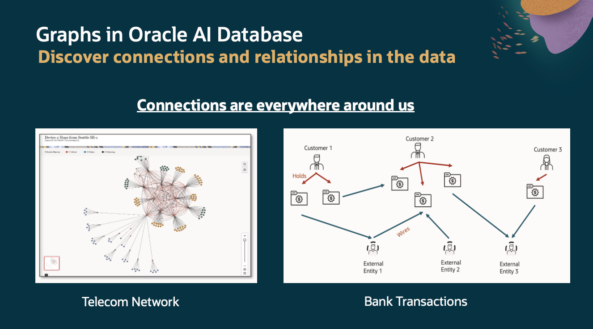
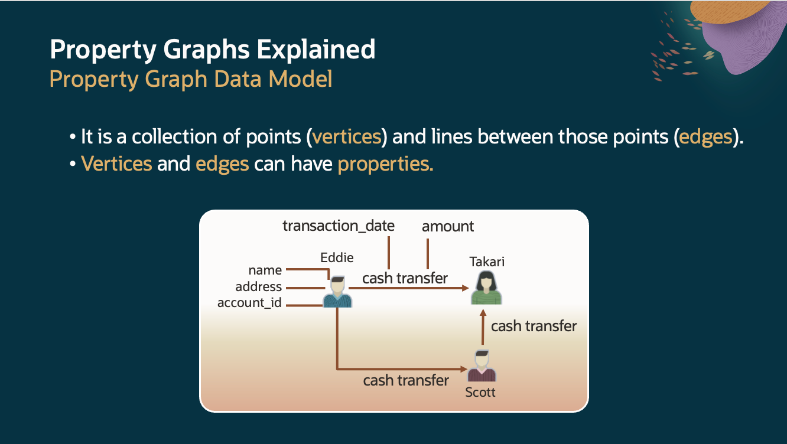

# How to use Property Graphs in Oracle AI Database

Duration: 15 minutes

## Introduction

Data Connections are everywhere around us.



In today’s data driven world most organizational data is interconnected, often in ways that are not immediately obvious.
The use of graphs makes it easy to identify these connections and relationships.  

Oracle enables the use of Graphs via SQL, making it accessible to a large community of users and a large set of tools, so any application can easily benefit.  
The Property Graph Views are a feature of the Oracle AI Database that allows developers to easily create Graph views on top of data that is stored in relational tables without first needing to move the data to another platform.  
Even though the data for property graphs is stored in relational tables, the applications developers can interact with and display the data in Graph format when required to meet their use case needs.  
Not needing to move the data means the developers can focus on developing the application instead of conducting data management & data synchronization tasks.  

You can use property graphs to easily find complex data patterns like fraud rings, influencer networks, or supply chain bottlenecks.  


<u>In this FastStart Lab, you will learn how to:</u>  

* Create Tables  
* Insert Data into Tables.  
* Create a Property Graph Table  
* Find Data Patterns by Running a Property Graph Query  

---

## Task 1: Launch SQL Worksheet


---

## Task 2: Create Tables that we will use later for building Property Graphs
The commands below will create 2 tables **(Accounts & Transfers)** to simulate banking transfers between customers.  

This SQL creates the ***bank_accounts*** table.

```sql
<copy>
CREATE TABLE bank_accounts (
  account_id NUMBER PRIMARY KEY,
  name       VARCHAR2(50),
  address    VARCHAR2(100)
);
</copy>
```

This SQL creates the ***bank_transfers*** table.

```sql
<copy>
CREATE TABLE bank_transfers (
  transfer_id NUMBER PRIMARY KEY,
  from_acct  NUMBER,
  to_acct    NUMBER,
  amount     NUMBER,
  transaction_date  DATE,
  FOREIGN KEY (from_acct) REFERENCES bank_accounts(account_id),
  FOREIGN KEY (to_acct)   REFERENCES bank_accounts(account_id)
);
</copy>
```

---

## Task 3: Insert Sample Data

Let's run the SQL below to create a few sample bank accounts.

```sql
<copy>
INSERT INTO bank_accounts VALUES (1, 'Eddie', 'Address for Eddie');
INSERT INTO bank_accounts VALUES (2, 'Takari', 'Addrerss for Takari');
INSERT INTO bank_accounts VALUES (3, 'Scott', 'Address for Scott');
</copy>
```

Let's run the SQL below to create a few money transfers between the bank accounts.

```sql
<copy>
INSERT INTO bank_transfers VALUES (101,1,2,500,SYSDATE);
INSERT INTO bank_transfers VALUES (102,2,3,300,SYSDATE);
INSERT INTO bank_transfers VALUES (103,1,3,700,SYSDATE);
INSERT INTO bank_transfers VALUES (104,3,1,1000,SYSDATE);
</copy>
```

## Task 4: Create a Property Graph Table named ***bank_graph***

Before we begin this task, let's take a moment to review ***what a Property Graph is.***

**A Property Graph Model** – is a collection of points (***vertices***) and lines between those points (***edges***).

When you model your data as a graph – The diagram below illustrates how the entities, such as account owners, become vertices and the connection or activity between them such as a cash transfers become edges.  
As you can see in our example, Vertices and Edges can have properties.

In our diagram below, we have **name, address, and account ID** ***attributes*** for the **Account Owner** named Eddie, which is one of our ***vertecies***.  
On the diagram, you can also see his **cash transfer activities** (***edges***) to Takari and Scott.  
Note that the ***edges*** also have ***attributes*** identifying the transaction date and amount of the cash transfer.



<u>Now that we know what a Property Graph is, let's run the SQL below to create one for our data in the accounts and transfers tables.</u>

```sql
<copy>
CREATE PROPERTY GRAPH bank_graph
  VERTEX TABLES (bank_accounts KEY (account_id))
  EDGE TABLES (bank_transfers
    SOURCE KEY (from_acct) REFERENCES bank_accounts(account_id)
    DESTINATION KEY (to_acct) REFERENCES bank_accounts(account_id));
</copy>
```


## Task 5: Run a Query – To Find Connections & Relationships in Data

Run the SQL below to find the money transfer paths

```sql
<copy>
SELECT *
FROM GRAPH_TABLE
(bank_graph
  MATCH (s)-[e]->(d)
  COLUMNS (
    VERTEX_ID(s) as s.name, 
    VERTEX_ID(d) as d.name, 
    EDGE_ID(e) as e.amount) 
);
</copy>
```

✅ Now you can easily see who transferred money to whom — graph style.

---


## Signature Workshop

👉 Click here to [Start the Oracle Database New Features LiveLabs Signature Workshop](https://livelabs.oracle.com/pls/apex/f?p=133:180:115199363143474::::wid:3950)


## Learn More

* Explore more about [SQL Data Manipulation Language](https://docs.oracle.com/en/database/oracle/oracle-database/23/sqlrf/SQL-Statements.html#GUID-8E42DBB3-BCA3-4E14-9B36-469CF6F4639F)  
* Try a guided lab in [Oracle LiveLabs](https://livelabs.oracle.com/)  
* Watch the [Oracle Databasics Video](#) to see these commands in action  

---

## Acknowledgements
* **Author** - LiveLabs Team, Eddie Ambler
* **Contributors** - LiveLabs Team, Eddie Ambler
* **Last Updated By/Date** - Eddie Ambler - October 2025
