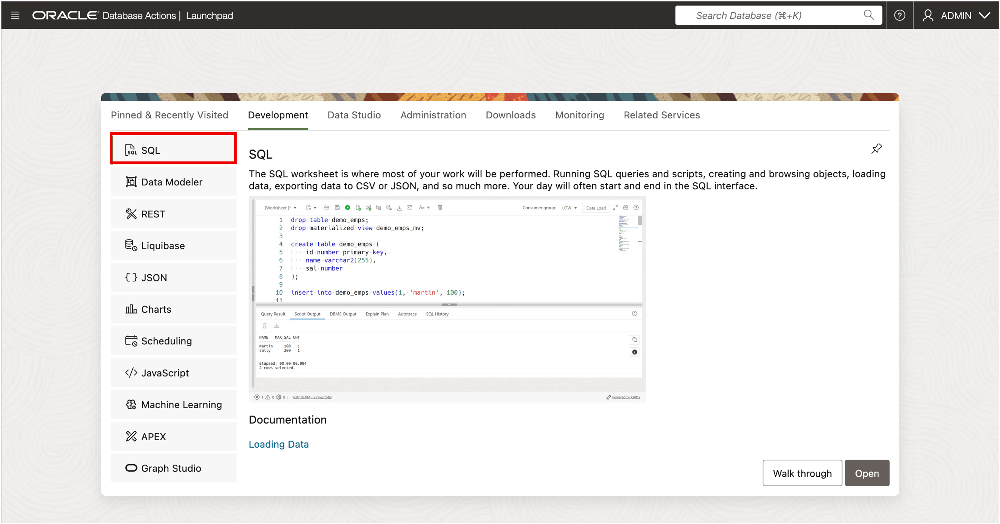

# How to use JSON Relational Duality Views in Oracle AI Database

Duration: 10 minutes

## Introduction

JSON Relational Duality Views are a groundbreaking feature in Oracle AI Database that bridge the gap between relational and JSON data models.  
They allow you to create views that present relational data as JSON documents while maintaining automatic synchronization between the two representations.  

In this FastStart Lab, we will introduce you to JSON Relational Duality Views, show you how to create them, and demonstrate their powerful consistency guarantees.  
You'll create relational tables, populate them with data, create a duality view, and see how updates through the JSON Duality Views are automatically reflected in the underlying relational tables.

---

## Task 1: Launch SQL Worksheet




---

## Task2: Create a Schema (User)

First, let's create a user (schema) called `DUALITY_SPRINT` for this demonstration.

```
<copy>
CREATE USER duality_sprint IDENTIFIED BY duality_sprint
    DEFAULT TABLESPACE users
    TEMPORARY TABLESPACE temp
    QUOTA UNLIMITED ON users;

GRANT connect, resource TO duality_sprint;
</copy>
```

Switch into this schema:

```
<copy>
ALTER SESSION SET CURRENT_SCHEMA = duality_sprint;
</copy>
```

---

## Task 3: Create Relational Tables

Let's create the `DEPARTMENTS` and `EMPLOYEES` tables that will form the basis of our duality view.

```
<copy>
CREATE TABLE departments (
    deptno    NUMBER PRIMARY KEY,
    dname     VARCHAR2(50) NOT NULL,
    location  VARCHAR2(50)
);

CREATE TABLE employees (
    empno     NUMBER PRIMARY KEY,
    ename     VARCHAR2(50) NOT NULL,
    job       VARCHAR2(50),
    sal       NUMBER(7,2),
    deptno    NUMBER REFERENCES departments(deptno)
);
</copy>
```

---

## Task 4: Insert Sample Data

Populate the tables with some sample data.

```
<copy>
INSERT INTO departments VALUES (10, 'ACCOUNTING', 'NEW YORK');
INSERT INTO departments VALUES (20, 'RESEARCH', 'DALLAS');
INSERT INTO departments VALUES (30, 'SALES', 'CHICAGO');

INSERT INTO employees VALUES (7369, 'SMITH', 'CLERK', 800, 20);
INSERT INTO employees VALUES (7499, 'ALLEN', 'SALESMAN', 1600, 30);
INSERT INTO employees VALUES (7521, 'WARD', 'SALESMAN', 1250, 30);
INSERT INTO employees VALUES (7566, 'JONES', 'MANAGER', 2975, 20);
</copy>
```

---

## Task 5: Create a JSON Relational Duality View

Now, create a duality view that presents the department and employee data as JSON documents. The view automatically maintains consistency between the JSON representation and the underlying relational tables.

```
<copy>
CREATE OR REPLACE JSON RELATIONAL DUALITY VIEW dept_emp_dv AS
SELECT JSON {
  '_id' : d.deptno,
  'department' : d.dname,
  'location' : d.location,
  'employees' : [ SELECT JSON {
    'id' : e.empno,
    'name' : e.ename,
    'job' : e.job,
    'salary' : e.sal
  } FROM employees e WHERE e.deptno = d.deptno ]
}
FROM departments d;
</copy>
```

---

## Task 6: Query the JSON Duality View

Query the duality view to see the JSON representation of your relational data.

```
<copy>
SELECT * FROM dept_emp_dv;
</copy>
```

You'll see JSON documents that represent each department with its nested employee information.

---

## Task 7: Update Data through JSON Duality View

One of the powerful features of duality views is that you can perform DML operations directly on the JSON data, and the changes are automatically reflected in the underlying relational tables.

Try updating the salary for employee 7369 through the JSON Duality View:

```
<copy>
UPDATE dept_emp_dv dv
SET DATA = JSON_TRANSFORM(dv.DATA, SET '$.employees[?(@.id == 7369)].salary' = 900)
WHERE JSON_VALUE(dv.DATA, '$._id') = 20;
</copy>
```

## Task 8: Validate Data Update is visible in underlying table

```
<copy>
SELECT * FROM employees WHERE empno = 7369;
</copy>
```

The salary has been updated to 900, demonstrating the automatic synchronization between JSON and relational representations.

---

## Task 9: Insert Data through JSON Duality View
  
Let's add a new employee named ADAMS to a new department named OPERATIONS through the JSON Duality View:  

```
<copy>
INSERT INTO dept_emp_dv VALUES (
  JSON {
    '_id' : 40,
    'department' : 'OPERATIONS',
    'location' : 'BOSTON',
    'employees' : [ JSON {
      'id' : 7900,
      'name' : 'ADAMS',
      'job' : 'CLERK',
      'salary' : 1100
    } ]
  }
);
</copy>
```

## Task 10: Validate Data Loaded via the JSON Duality View is visible in underlying tables

Let's validate that the new department and employee were added to the corresponding relational tables:

```
<copy>
SELECT * FROM departments WHERE deptno = 40;
SELECT * FROM employees WHERE deptno = 40;
</copy>
```

---


## Try our Signature Workshop

👉 Click here to [Start the JSON LiveLabs Signature Workshop](https://apexapps.oracle.com/pls/apex/f?p=133:180:16090110673701::::wid:3635)

* Work with JSON datatype
* Work with JSON Collections
* Work with JSON Duality Views
* Work with Oracle Database API for MongoDB

## Learn More

* [Oracle AI Database JSON Relational Duality Feature Overview]( https://www.oracle.com/database/json-relational-duality/ )
* [JSON Relational Duality Developer's Guide - Oracle Documentation]( https://docs.oracle.com/en/database/oracle/oracle-database/23/jsnvu/overview-json-relational-duality-views.html )
* [JSON Developer’s Guide - Oracle Documentation]( https://docs.oracle.com/en/database/oracle/oracle-database/23/adjsn/)
* [Oracle Database API for MongoDB - Blogs]( https://docs.oracle.com/en/database/oracle/mongodb-api/blogs.html )

## Acknowledgements
* **Author** - LiveLabs Team, Eddie Ambler, Linda Foinding
* **Contributors** - LiveLabs Team, Pat Shepherd
* **Last Updated By/Date** - Eddie Ambler - October 2025