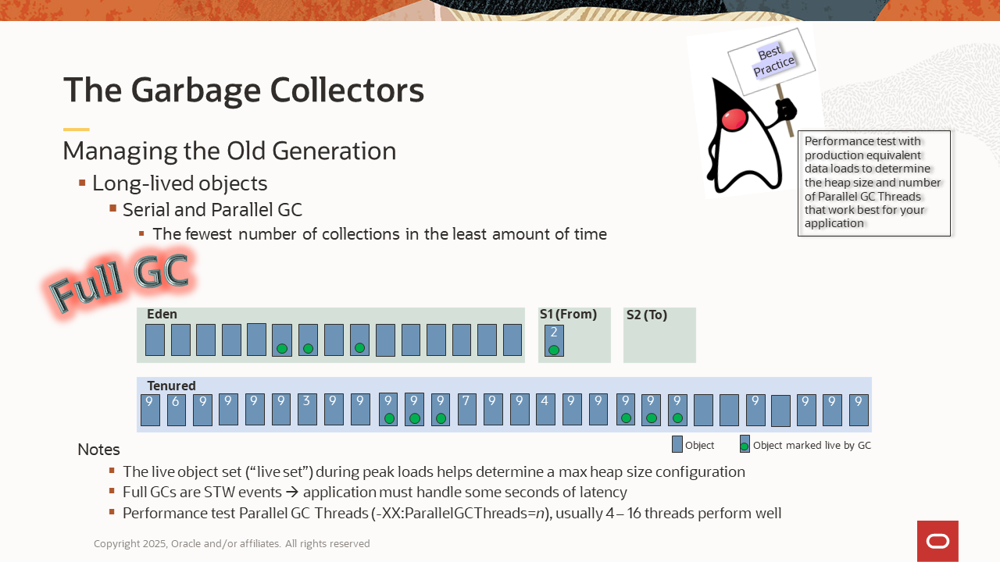
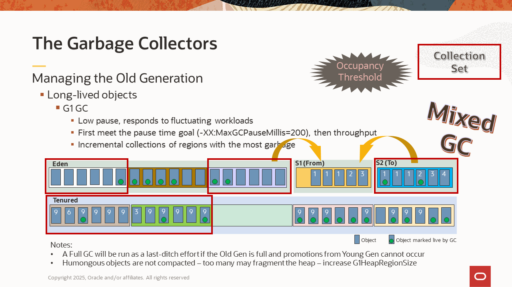
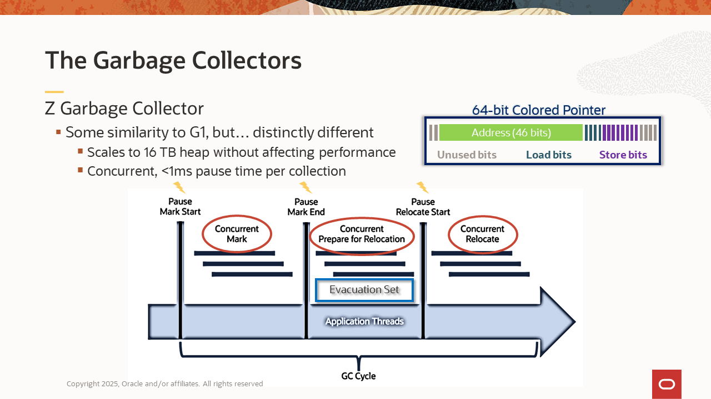
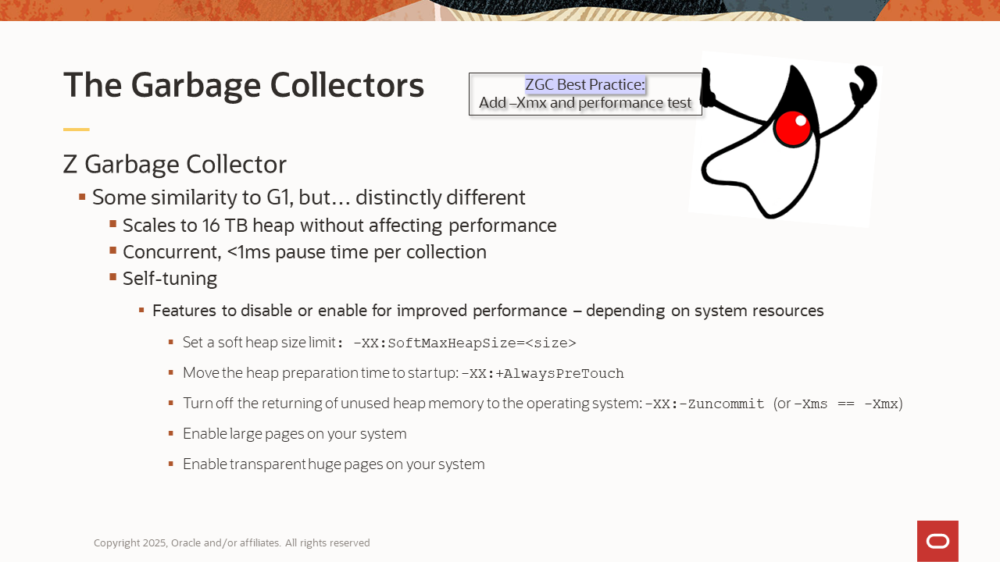
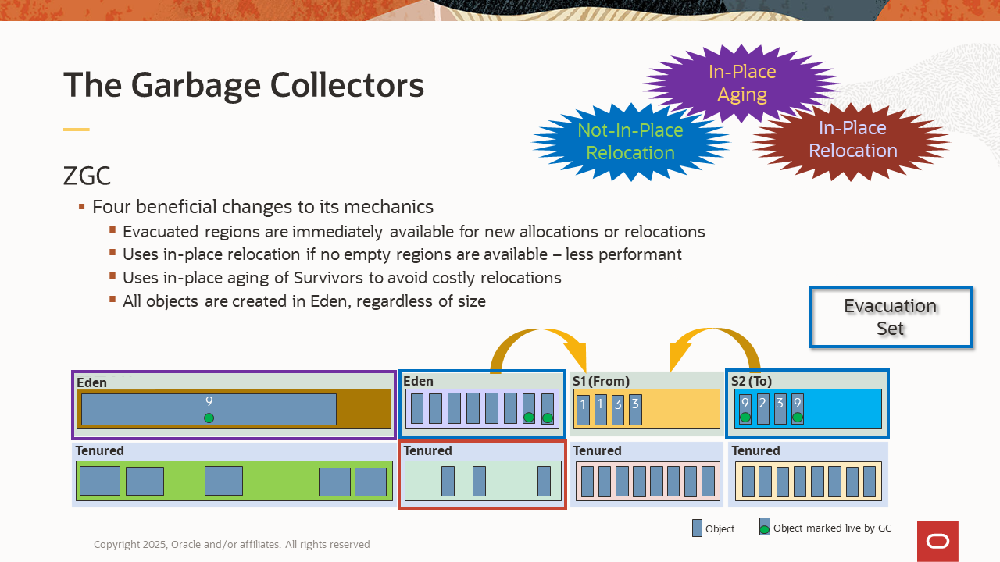
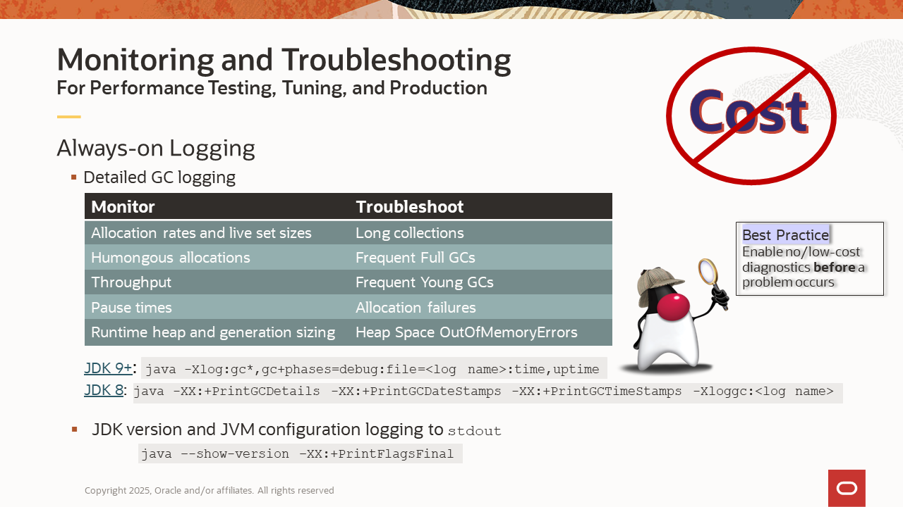
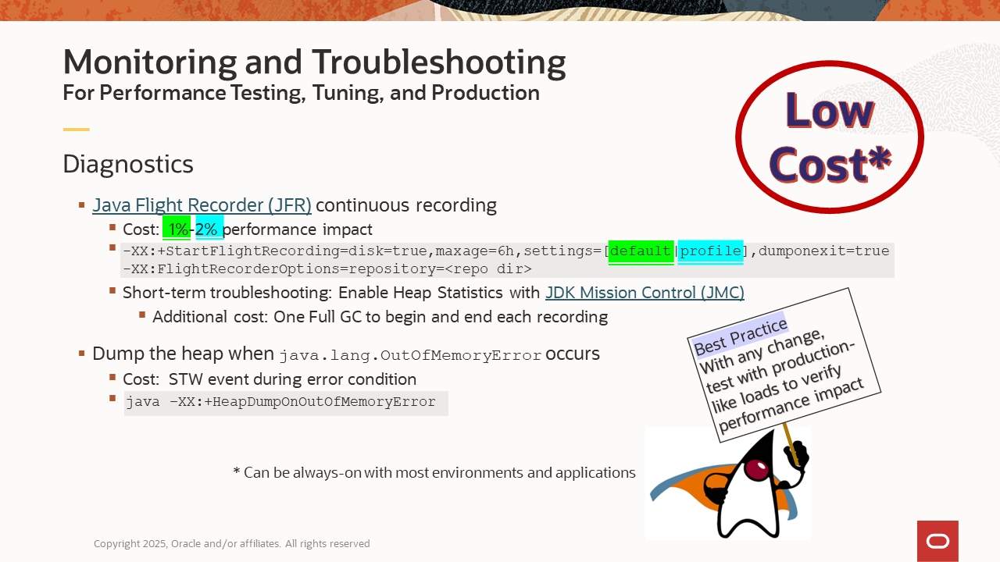

# Choosing a Garbage Collector
Duration: 45 minutes

This is a beginner level introduction to Java memory management.

[Choosing a Garbage Collector](videohub:1_ut7i2uzu)

## Table of Contents
1. Introducing the Java Heap  
2. Java Heap Space  
3. The Garbage Collectors  
3.1 Choosing a Garbage Collector  
3.2 Heap Layouts  
3.3 Primary Responsibilities  
3.4 Managing the Young Generation  
3.5 Managing the Old Generation  
3.6 The Z Garbage Collector (ZGC) – Something Different  
4. Monitoring and Troubleshooting  
4.1 Always-on Logging  
4.2 Diagnostics  
5. Summary  
6. Further Learning  

## 1. Introducing the Java Heap


The Java heap is a memory pool within the virtual memory space of a Java process. It contains the Java objects, their fields, references, class names, and so on. When Java program code creates a new object, the memory for that object is allocated in the Java heap at runtime.  

The Java heap is just one of several memory consumers in a Java process. For example, the Metaspace is another memory pool, and it contains the loaded Java classes and their metadata. In fact, objects in the Java heap contain references to their class data in the Metaspace.  

The Java heap and the virtual memory consumers depicted in green are managed by the Java Virtual Machine (JVM). This means JVM utilities can monitor their memory usage and other behaviors. The native consumers depicted in gray are managed by the operating system and require system utilities for monitoring them.  

It’s a common misconception that the system memory usage of a Java process will be about equivalent to the Java heap size.  While this may be true for some applications, it's not always the case. It’s important to consider the other memory consumers, along with how your application uses memory. For example, an application that implements a native cache versus one that implements an on-heap cache. The total system memory needed by a Java  application may be considerably more than what is used for object allocations alone.  

## 2. The Java Heap Space


The Java heap space is a contiguous virtual memory space. Early during startup, the JVM reserves the virtual memory for the total size of the heap, which is determined by the maximum heap size setting. With the out-of-the-box configuration, ergonomics sets the minimum and maximum heap sizes.  

> **Ergonomics**: Default values chosen by the operating system and its available resources.  

This means the sizing is based on the resources available in the operating environment, which could be a physical machine, a virtual machine, or a container. In most of today’s environments, ergonomics results in a default maximum heap size of 25% of the total physical memory.  

However, this default does not always work well. For example, the default size may be too large if you need a lot of memory for other processes in the environment or if there’s extensive use of native memory by the application. Conversely, it may be too small if the peak data loads of the application are larger. Also, when running multiple JVM instances in a single environment, they will quickly use all the system memory.  

Best Practice: Set the heap size manually, based on the memory needs of the application and balanced with the memory limitations in the environment.  

Use the `–Xms` and `–Xmx` command line flags. The `-Xms` flag sets the minimum and initial size, while the `-Xmx` flag sets the maximum. For example, if you want to set a minimum of 4 GB and a maximum of 16 GB, then enter a command line of the following:
```
java -Xms4g -Xmx16g [other options] <main class>
```
The heap is divided into two generations: a Young Generation and an Old Generation. The Young Generation consists of an Eden space and two optional Survivor spaces.  

The main purpose of the generations is to separate short-lived objects from long-lived objects, which makes it more efficient to manage them.  

By default, the initial sizes of the Young and Old Generations are determined by an Old to Young ratio. The virtual memory reserved for the heap at startup will be divided between the generations according to that ratio. With most JVMs, the default ratio is 2:1. This means the Old Generation will be twice the size of the Young Generation. This works well for a broad range of applications, but it can be tuned if needed. (This paragraph does not apply when using ZGC.)  

During startup, after reserving the virtual memory, the JVM will then commit the memory for the initial heap size. Committing memory is a request to the operating system to back the virtual memory with physical memory, because it will be used soon.  

If the initial heap size is smaller than the maximum heap size, then there will be uncommitted virtual memory in both generations. During runtime, when more reserved memory needs to be committed, it will be committed for both generations (except when using ZGC). However, if the minimum and maximum heap sizes are the same, then the entire heap will be committed at startup.  

The heap is managed by its garbage collector. The supported Oracle JDKs have four collectors to choose from: Serial GC, Parallel GC, Garbage First (G1 GC), and ZGC (pronounced “zee” or “zed.”)  

The next several sections cover details of the garbage collectors and their collection processes.  


## 3. The Garbage Collectors

### 3.1 Choosing a Garbage Collector


Each garbage collector has a unique focus to help achieve the application's performance goals.

- **Serial GC**
    - Single-threaded copy collector, best for small data loads under ~ 100mb
    - Default GC for single-CPU environments
    - `-XX:+UseSerialGC`
    - [Serial GC Tuning Guide for JDK 8](https://docs.oracle.com/javase/8/docs/technotes/guides/vm/gctuning/introduction.html#sthref3)
- **Parallel GC**
    - Multithreaded copy collector for maximum throughput with consistent loads - some pause time
    - JDK 8 default GC for multi-CPU environments with 2+ GB memory
    - `-XX:+UseParallelGC`
    - [Parallel GC Tuning Guide for JDK 21](https://docs.oracle.com/en/java/javase/21/gctuning/parallel-collector1.html)
- **G1 GC**
    - Low Pause Collector – prioritizes low latency first, then throughput, varying loads
    - JDK 11+ default GC for multi-CPU  and 2+ GB memory
    - `-XX:+UseG1GC`
    - [G1 GC Tuning Guide for JDK 21](https://docs.oracle.com/en/java/javase/21/gctuning/garbage-first-g1-garbage-collector1.html)
- **ZGC**
    - Very large heaps, highly scalable, ultra-low latency, self tuning - requires more memory and CPUs
    - ZGC supported as non-generational in JDK 15 through JDK 23, removed in JDK 24
    - Generational ZGC supported beginning with JDK 21 (add flag `-XX:+Zgenerational`)
    - Generational ZGC became the default ZGC in JDK 23 (no flag needed)
    - [ZGC Tuning Guide for JDK 25](https://docs.oracle.com/en/java/javase/25/gctuning/z-garbage-collector.html)

A question often asked is, “Which collector should I use?” Choosing a collector first depends on the primary performance goal of the application; whether that goal is a very small footprint for the smallest data sets (Serial GC), high throughput for back-office data processing (Parallel GC), low pause times for customer-facing web applications (G1 GC), or high scalability and ultra-low latency for applications that have very large, fluctuating data sets or those that have a high sensitivity to latency (ZGC).  

Choosing a collector may also depend on the resources available in the operating environment. For example, ZGC requires enough processors to run the application threads and ZGC threads simultaneously.  

> **Best Practice:** First test the collector that best serves your primary performance goal and then tune if some adjustments need to be made.  

Note that the JDK’s default collector can change, depending on the JDK version and the environment. It’s a best practice to specify the desired collector on the command line to ensure the intended collector is used in different environments or after a JDK version upgrade.  

ZGC was initially supported as a non-generational collector in JDK 15. However, in JDK 21, a generational version of it became supported. Generational ZGC uses much less memory and has a significant performance gain over its predecessor. This makes Generational ZGC suitable for a wider range of applications. Throughout this LiveLab, ZGC refers to Generational ZGC, which became the default ZGC in JDK 23 and the only ZGC in JDK 24.  

### 3.2 Heap Layouts


To help meet their performance goals, the various garbage collectors lay out their heaps differently when the JVM is launched.  

**Serial GC and Parallel GC:**  
The heap is divided into two contiguous generation spaces in which each generation is also a contiguous memory space. In this scenario, the entire Young Generation is collected during a Young GC, and the entire heap is collected during a Full GC.

**G1 and ZGC:**  
The heap is divided into regions that are logically generational. The regions allow for collecting the Young and Old generations in increments, which helps reduce pause times. The Young and Old regions are not contiguous. Regions are dynamically assigned as Young or Old during the runtime, and the number of Young or Old regions can change, as the Young Generation grows or shrinks to respond to application workloads.  

There are some differences in how G1 and ZGC regionalize their heaps.  

G1 configures one constant region size at startup, dividing the initial heap size into 2048 regions (ideally). If the heap grows during runtime, regions of the that same constant size will be added when more heap memory is allocated. Also, any object that is too large to fit in a region will be given a Humongous region just for that object. G1 simply combines two or more regions to make Humongous regions as needed.  

ZGC, on the other hand, is more dynamic. While it also has small regions of a constant size and large regions for Humongous objects, ZGC adds dynamically sized medium regions to the mix. It dynamically adjusts the size of new medium region allocations to accommodate highly fluctuating workloads. ZGC also adds and removes regions more easily to scale to those workloads.  

### 3.3 Primary Responsibilities


A garbage collector has three primary responsibilities:  
- Allocate new objects in the heap  
- Keep track of objects - locations, whether referenced/reachable ("live")  
- Perform garbage colelctions - reclaim the memory used by unreferenced/unreachable (“dead”) objects  

We say that objects are “live” when they are referenced or reachable, which means they can be reached by application threads to be accessed and operated on. Objects that are unreferenced or unreachable are referred to as “dead” or “garbage.” Threads can no longer access them, so they are eligible for garbage collection.  

As part of a garbage collection, the collectors will generally perform the following tasks:  
1. Find all the references to the objects in the heap and mark all the live objects  
    - This step ensures they don’t reclaim the memory for an object that’s still being used.  
2. Copy/relocate some of the live objects to different parts of the heap  
    - This step helps prevent fragmentation and makes room for more allocations.  
3. Update any references to the objects that were relocated  
    - This step ensures the application threads, the registers and any other objects holding references to the objects that were moved will point to the new addresses for those objects.  

The collectors need to pause the application threads during some or all of this process. It’s important to understand that the amount of time the application threads are paused is related to the set of live objects being marked and moved. Pause time is *not* related to the amount of memory being freed. Pause time can be affected by a lack of resources in the environment. Low system memory can cause swapping to occur, which could result in large pauses or hang-like behavior during a collection. Competition with other process for resources in the environment affects GC performance. CPU contention and I/O bottlenecks are common causes of longer collections. And, if you’re logging GC activity over a network, any network latency during a collection can increase pause times. It’s a best practice to monitor your system resources and ensure a healthy environment for the JVM.  

Also, GC performance can be affected by a lack of resources in the environment. Low system memory can cause swapping to occur, which could result in large pauses or even hang-like behavior during a collection. Competition with other process for resources in the environment affects GC performance.  CPU contention and I/O bottlenecks are common causes of longer collections. Also, if GC logging occurs over a network, then any network latency during a collection can increase pause times.  

### 3.4 Managing the Young Generation


As mentioned, it’s more efficient for garbage collectors to manage short-lived and long-lived objects separately.  The Young Generation is where most Java objects are allocated, and since most objects are short-lived, they will also die in there. The algorithms used to collect the Young Generation are generically referred to as Young GC.

The general process of Young Generation allocation and collection is as follows:
1. When an application creates new Java objects, they are created in the Eden space of the Young Generation.  
2. When Eden becomes full, a Young GC will:  
    a. Mark the live objects  
	b. Copy the live objects from Eden to a Survivor space  
    c. Age the survivors - Young GC keeps an aging counter for each of the survivors and increments it each time that object survives a collection  
    d. Make Eden eligible for allocations again This is where updating of the references to the survivors occurs and when objects essentially die.  
3. The next time Eden fills up, a Young GC copies the live objects from both Eden and the occupied Survivor space into the empty Survivor space.  
4. A Young GC will continue copying survivors from one Survivor space to the other until an object reaches the maximum number of copies.  This is called  the Tenuring Threshold, which is a configurable threshold, with a maximum of 15.  
5. During a Young GC, tenured objects are promoted to the Old Generation instead of being copied to the empty Survivor space.  

Three noteworthy exceptions to this process:  

First, the heap can be configured without Survivor spaces, in which case all live objects are promoted to the Old Generation at every Young GC.  

>**Note:** Survivor spaces are more performant for most workloads. This is based on the premise that most objects are short-lived. They can be collected from the Young Generation more often and more efficiently, because it contains a higher percentage of dead objects per collection. The Survivor spaces give objects some extra time to die in the Young Generation. This will prevent a lot of short-lived objects from filling the Old Generation, which would cause expensive collections to occur more often.  

However, there are some rare workloads for which the above premise is not true, and for these workloads, the option of turning off the Survivor spaces is available.  

The second exception is that G1 and ZGC may choose to collect only some of the Young regions at any given collection, targeting those with the most garbage for collection.  

The last exception is that large objects may not be created in Eden. They will instead be created in the Old Generation. For G1 GC, this means Humongous regions in the Old Generation. Likewise, if an object is too large to fit in a Survivor space, it is promoted to the Old Generation. If the Survivor spaces are too small to hold all the live objects found in the Young Generation, the collectors will promote the overflow to the Old Generation. (This paragraph does not apply to ZGC.)  

ZGC is the only collector that collects the Young Generation concurrently with application threads. For all other collectors, Young GCs are Stop-The-World (STW) events, meaning, they will stop the application threads while a Young Collection is running.  


### 3.5 Managing the Old Generation
The Old Generation receives most of its objects from Young GC promotions. The algorithms that manage the Old Generation align with each collector’s primary performance goal, so the following sections discuss Old Generation management per collector.

#### 3.5.1 Serial GC and Parallel GC Old Generation Management:  


With the Serial collector being single-threaded and the Parallel collector being focused on attaining the most throughput possible, they both need to clear the most memory with the fewest number of collections in the least amount of time. Therefore, they use a Full GC algorithm to collect both generations when the Old Generation fills up.

Full GC process:
  1. A Full GC will run when the Old Generation is full, such that no further promotions or allocations can occur
  2. Full GC begins by marking the live objects in both generations
  3. The live objects from both generations are then compacted into the Old Generation
  4. Both generations are prepared for more allocations and promotions (this includes updating the references for the objects that were moved).  

After a Full GC, the Young Generation (including the Survivor space) is empty. What remains is mostly long-lived objects in the Old Generation. This is called the “live object set” or “live set” for short. The live set can grow and shrink, depending on the data loads at any given time. Understanding the size of the live set and object allocation rates during peak loads can help determine a maximum heap size configuration.  For example, if the application has a low allocation rate, then a max heap size that is only 10-20% larger than the live set may be all that is needed. However, if the allocation rate is high, the application may need a heap that is 2 or 3 times the size of the peak live set, or more.  

Also, the live set and allocation rates can change over the lifecycle of the application, usually coinciding with changes to the data loads or with certain changes to the application or operating environment. Therefore, it’s recommended to monitor for this and adjust the heap size if the peak live set changes significantly.

> **Notes:**
>  - Full GCs are STW events.  Therefore, the application must be able to handle some latency, usually 1-3 seconds of application pause time.  There are some tuning options that can reduce some latency, but if the application is latency sensitive, one of the low latency collectors (G1 GC or Z GC) may be a better fit.  
> - Depending on the JDK version and operating environment, Parallel GC will use all or most of the available processors so that the heap can be collected and control returned to the application threads as quickly as possible.  However, for large systems with lots of available processors, the overhead of so many Parallel GC Threads may actually decrease GC performance. Best Practice: Test applications with production-equivalent data loads to determine the number of Parallel GC Threads (`-XX:ParallelGCThreads=n`) that yields the best throughput.  
> - There are lots of other tuning options available for Parallel GC to improve throughput, latency, or even memory footprint. See the HotSpot Tuning Guide.  

#### 3.5.2 G1 GC Old Generation Management


G1 is a low pause collector that quickly responds to fluctuation workloads. For both its Young and Old collections, it focuses first on meeting a maximum pause time goal, and then it provides as much throughput as possible. The `-XX:MaxGCPauseMillis=n` flag can be used to raise or lower the pause time goal from its default of 200ms. There’s always a trade-off between pause time and throughput. Increasing the pause time goal will increase throughput and decreasing it will likewise decrease throughput.  

G1 accomplishes low pause times by collecting the heap in regional increments, targeting the regions that have the most garbage first.  

G1 process for collecting the Old Generation:  
  1. The Old Generation will receive promotions from Young GCs  
  2. When the heap reaches a capacity threshold called the "Initiating Heap Occupancy Percentage" (IHOP), at the next Young Generation collection, a concurrent marking cycle will begin an Old Generation collection. To keep latency low, it does most marking tasks concurrently with the application. This means allocations and Young GCs are still occurring while the Old Generation regions are being prepared for collection.  
  3. By the end of the marking phase, G1 has reclaimed the Humongous regions holding any dead Humongous objects, identified the regular sized regions with the most garbage, and calculated which ones should be collected. This is called a "Collection Set."  
  4. When the Young Generation is full again, G1 will perform a "Mixed GC", collecting both the Young and Old regions of the Collection Set.  
  5. Mixed GC may also do some compaction, emptying some regions by moving their live objects to empty regions.  

> **Notes:**  
> - If the Old Generation becomes full and promotions from the Young generation can’t occur, G1 will run a Full GC as a last-ditch effort to clear some space.  This situation usually means the heap is sized or configured incorrectly or there is an object leak or other application issue that should be investigated.  
> - Humongous objects are not part of the Collection Set. These are objects that are larger than half a region and are given their own Humongous region. G1 cleans up the dead Humongous objects only by reclaiming their regions during the marking phase. It doesn’t copy or compact them. If there are a lot of Humongous objects, some fragmentation of the heap might occur. In this situation, try increasing the G1HeapRegionSize (`-XX:G1HeapRegionSize=n`) to decrease the number of Humongous objects. This may also improve performance, because Humongous allocations are expensive.  
> - For configuration and tuning options, see the G1 GC section of the HotSpot Tuning Guide.  However, be aware that G1 is an optimized collector, and it’s very easy to overtune it. We recommend first testing without any customization and then tune only as needed to meet the performance goals.  


### 3.6 The Z Garbage Collector (ZGC)


ZGC and G1 both have regionalized heaps, so the mechanics of their collections are similar. They both collect the generations incrementally, targeting regions with the most garbage.  

However, ZGC is a very different collector. I’ll highlight three significant differences.  

ZGC is highly scalable.  It can scale the heap from a few hundred MB to 16 TB without affecting performance.  

It also runs concurrently with the application, with pause times measured in microseconds. And by the way, it has three levels of concurrency too: A young collection and an old collection may run concurrently with each other and with the application.  

ZGC uses only 64-bit "Colored Pointers." Colored Pointers take advantage of the fact that, because of address space limitations, most modern hardware can’t address all 64 bits of a 64-bit pointer. This leaves some unused bits, so ZGC uses some of them to store object state information.  This information is an object’s lifecycle and storage states, such as its liveness, its age, if it’s in the process of being moved, already been moved, and so on.  The states are defined in terms of colors, which gives the pointers their name. Notice in the diagram that the color bits are the load and store bits.  

With other collectors, the object states are maintained in data structures, which require memory overhead and pause time to read and update.  Colored pointers allow ZGC to do these tasks atomically, with a few machine instructions, which is orders of magnitude faster and has no memory overhead, because it's using bits of the pointer that are just wasted anyway.  

As a result of this design, ZGC has three concurrent collection phases.  

#### 3.6.1 ZGC Collection Phases

**1. Concurrent Mark Phase:**  
During the marking, ZGC finds the live objects and marks them by updating their color bits. However, because all the state information is in the pointer, ZGC also has all the other state information for each object, so it knows each object's precise state.  This allows ZGC to essentially “clear” the dead objects right after the marking phase, rather than at the end of the collection (as is done with the other collectors).  As described in the Relocation phase below, clearing the dead objects earlier in the collection cycle means the regions can be immediately available for reuse as soon as a region is evacuated.  

**2. Concurrent Prepare for Relocation Phase:**  
To prepare for relocation, ZGC calculates the density of live objects in each region and targets the lowest density regions for what’s called an "Evacuation Set," which is similar to G1’s Collection Set. (Other tasks like reference processing and class unloading are performed here as well.)

**3. Concurrent Relocation Phase:**  
The relocation phase is when ZGC evacuates the low-density regions by compacting their live objects into empty regions. In this way, it frees up regions and incrementally compacts the heap at every collection, freeing and compacting in one step.  The relocation phase is often called the "Compaction and Relocation" phase.  

It’s at this point when other collectors complete a collection by updating all the references with the new addresses, which requires pausing the application threads.  However, ZGC instead lazily updates the references while the application is running.  When application threads attempt to access objects that have been moved, ZGC will transparently provide the new location. Thus, ZGC is able to avoid pause time for reference updating, and the collection is completed after all the regions have been evacuated.

(Additional details of interest: Lazy reference updating is accomplished through the use of load and store barriers.  Load and store barriers are injected as optimized bytecode into class files where object loads will occur. These barriers intercept application thread accesses to an object and transparently update the reference if needed.)

#### 3.6.2 Mirosecond Pause Times
ZGC has just 3 synchronization points when it pauses the application threads:  

1. To signal the start of the Mark phase  
2. To signal the end of the Mark phase.  This is when unreachable objects essentially die. 
3. To signal the start of the Relocation phase. 

The total time for these pauses is less than 1ms. Also, these are just synchronization pauses. There's no work being done on the heap during these pauses, which means they’re not tied to the heap size or the size of the live set. The benefit is that all collections 
have less than a 1ms pause, regardless of workloads or scale.  

#### 3.6.3 ZGC is Self-Tuning

One of the design goals for generational ZGC was to move away from statically tuning the collector with command line options. To perform better with highly fluctuating workloads, those tuning configurations need to fluctuate with them, so ZGC tunes itself dynamically.  

This means users no longer need to tune things like region sizes, garbage collection threads, and generation sizes. (In fact, ZGC doesn't even have a concept of a preset generation size or size ratio between the generations. It dynamically assigns any region as Young or Old as needed.) There's also no pause time to manage or pause-time-to-throughput balancing to do as there is with other collectors. ZGC makes all the internal adjustments to these parameters dynamically, based on application workloads.

> **ZGC Best Practice:** Simply set the max heap size and conduct performance tests.  

There are a few features you could enable or disable to boost performance: 

1. SoftMaxHeapSize - This is a new option that can be used if you expect most (but not all) workloads of the application to be under a certain size, then ZGC will try to stay under the soft max size. If ZGC needs to temporarily use more memory for the heap, it will allocate more, up to the hard limit that is set by the -Xmx flag. When workloads decrease again, ZGC will lower the heap size back down to the soft max limit or lower.  

2. AlwaysPreTouch - This command line option is still available to boost performance of your long-running applications.  (This option prepares the entire heap for allocations at startup. Therefore, it boosts performance during the runtime once the application is fully started. It’s an effective option for long-running applications where a quick startup time is not needed.)  

3. Turn off the Uncommit Memory feature. By default, if memory is unused for 5 minutes, ZGC returns it to the operating system by uncommitting it. This uses some processor time to return and reallocate that memory, so if there is plenty of memory on the system, you could save those CPU cycles by disabling this feature.  
    **Notes:**  
    - The ZUncommit feature will not shrink the heap below the minimum heap size.  
    - If the minimum heap size is equal to the maximum heap size, then ZUncommit is implicitly disabled.  
    - The delay of 5 minutes is a tunable setting.  

4. Enable large pages on the system. (Instructions are in the ZGC section of the HotSpot Tuning Guide.)  

5. Enable transparent huge pages on the system. (Instructions are in the ZGC section of the HotSpot Tuning Guide.)  

#### 3.6.4 ZGC - New Mechanics for Young and Old Collections


1. Immediate Resuse of Freed Regions.  
The regions become available for reuse immediately after the region is evacuated.  Unlike other collectors, ZGC does not need to wait until the end of the entire collection to reuse the memory that is cleared. (This is one of those benefits of having all the object state information in the colored pointer so that the dead objects can essentially be cleared right after the marking phase.) This is compelling when you consider that ZGC collections are run concurrently. As each region is evacuated, it can immediately be reused by GC threads for more relocations or by application threads for new object allocations.

2. In-Place Relocations.  
The techniques ZGC uses for freeing and compacting regions in one step are called “Not-In-Place Relocation” and “In-Place Relocation.”  

    Not-in-Place Relocation is not new. It’s the same technique G1 uses for freeing regions by copying their live objects to empty regions.  

    In-Place Relocation is a technique to compact the objects in one low-density region and then relocate the objects of other low-density regions to it. This technique is used when there are no empty regions available for Not-in-Place Relocation. It essentially means that empty regions are no longer required to clear regions. (These relocations are single-threaded, so they are less performant and only used when necessary, in low memory situations.)

3. In-Place Aging (Young Generation only).  
ZGC can age survivors in place. This means objects no longer need to be copied just to age them. This is significant for a couple reasons:  

    - Densely populated regions can be aged in place to avoid the expense of copying them.
    - Humongous objects no longer need to be allocated in the Old Generation, since the whole point of doing so was to avoid the expense of copying them.  

4. All objects are allocated in Eden.
Humongous objects are created in Eden and (at least initially) managed in the Young Generation as short-lived objects.  


> **Demonstration of These New Techniques**  
> *(See the video above for the demonstration, beginning at 30:00.)*
>
> #### First Young Collection example:
>
> Marking phase:  
>   At the end of the marking, the locations and precise states of all the live objects are known, so right after the marking (during the Mark End Pause), all unreferenced objects are essentially dead, so we can ignore the dead objects. 
>   
> Prepare for Relocation phase:  
   ZGC calculates the density of each region and creates an Evacuation Set of one small low-density Eden region and one small low-density Survivor (S2) region. There is also a high density medium-sized Eden region and a small empty Survivor (S1) region.   
>
> Relocation phase:  
   Not-In-Place Relocation of the Evacuation Set. The live objects in each small low-density Eden region of the Collection Set are simply relocated to the empty Survivor (S1) region.
>
> In-Place Aging.  
>  The densely populated medium-sized Eden region is aged in place, without copying its objects. This is done by simply changing the region from an Eden region to a Survivor (S1) region and incrementing the aging counter of each live object by 1. 
>
>
> #### Second Young Collection example:
>
> Marking Phase and Prepare for Relocation phases are the same as above, except:  
>
>  The high density medium-sized Eden region is now a large Survivor region with one live Humongous object that is aged to 9.
  The small Survivor (S2) region contains only live objects that are aged to 9.
>
> Relocation phase:  
   Not-In-Place Relocation of the low-density Eden region of the Collection Set. The objects are simply relocated to the empty Survivor (S1) region.
>
> Immediate resuse of evacuated region:  
>      The application immediately begins allocating objects to the evacuated small Eden region. 
>
>   
> Tenuring:  
> Young collections with ZGC also use the Tenuring threshold, and as you would expect for ZGC, it self-tunes the threshold dynamically.  Let’s again say the tenuring threshold is 9, so both the small and large S2 regions have objects that need to be promoted to the Old Generation.  
>
>  In-Place Aging (Promotion).  ZGC promotes the tenured Humongous object by promoting its large region in place. The large S2 region is simply changed to a Tenured (Old) region.  
>  
>  In-Place Relocation.  Now ZGC needs to evacuate the small S2 region, but memory is tight, and there are no empty regions, so ZGC switches to In-Place Relocation. It chooses a low-density Old region, compacts its objects, and then relocates the S2 objects to it. The small S2 region is then reclaimed for additional allocations or relocations.  
>
> This is just one example of an in-place relocation.  It's a powerful technique that can be used during a Young or Old collection. It eliminates the need for keeping a percentage of the heap in reserve, which allows more of the heap to be used for object allocations, and it avoids heap space OutOfMemoryErrors.


## 4. Monitoring and Troubleshooting

### 4.1 Logging


Before we wrap up this lab, let’s take a quick look at some recommendations for monitoring and troubleshooting.  

First, it’s highly recommended to enable detailed GC logging.  

Detailed GC logs can be used to monitor many aspects of GC and heap activity and trends. They can also be used to troubleshoot a variety of problems that may arise.  

- JDK 9+:  `java -Xlog:gc*,gc+phases=debug:file=<PATH/LOGFILENAME>:time,uptime`
- JDK 8:  `java -XX:+PrintGCDetails -XX:+PrintGCDateStamps -XX:+PrintGCTimeStamps -Xloggc:<PATH/LOGFILENAME>`
- JDK version and JVM configuration logging to `stdout`: `java –-show-version –XX:+PrintFlagsFinal`


Notice that the set of command line flags used to enable detailed GC logging depends on the JDK version. Log file rotation and limitations for the log file size and number of log files in the rotation can be configured. Click on the JDK 8 or JDK9+ links for the options to set that up.

- [JDK 8](https://www.oracle.com/java/technologies/javase/vmoptions-jsp.html) (Note: This page indicates that it is for JDK 7 only, but the information on log rotation options applies to JDK 8 as well.)
- [JDK 9+](https://docs.oracle.com/en/java/javase/21/docs/specs/man/java.html#enable-logging-with-the-jvm-unified-logging-framework)

We also recommend logging the Java version and the initial JVM configuration at startup.  These can also be very useful when troubleshooting issues. They print to `stdout`, so we recommend redirecting `stdout` to a log for retention.  

What’s great about these logging options is they have zero cost, which means they have no discernible performance impact in most environments and with most applications. This is why we recommend them for always-on logging.  

In fact, It’s a best practice to enable no- and low-cost diagnostics *before* a problem occurs. Root causing and resolving most issues requires data to be collected while a problem is occurring. So enabling these no- and low-cost diagnostics as always-on options, can help you avoid having to reproduce a problem just to gather that data.  


### 4.2 Diagnostics

We recommend these low-cost diagnostics as always-on options for most environments and applications.  

#### 4.2.1 Java Flight Recorder Continuous Recording 

The Java Flight Recorder is a powerful tool that comes with the JDK.  Running a continuous recording can be invaluable for monitoring and troubleshooting, especially for difficult-to-diagnose performance issues.  

`-XX:+StartFlightRecording=disk=true,maxage=6h,settings=[default|profile],dumponexit=true`  
`-XX:FlightRecorderOptions=repository=<repo dir>`

The command line provided here is just one example.  There are several configuration options for flight recordings. See the [Java Flight Recorder documentation](https://docs.oracle.com/en/java/java-components/jdk-mission-control/9/user-guide/using-jdk-flight-recorder.html#GUID-D38849B6-61C7-4ED6-A395-EA4BC32A9FD6) for more information.  

The flight recorder uses low level diagnostics to record a multitude of JDK events that occur during runtime. It comes with two out-of-the-box configurations for recording JDK events:
- a default configuration  
- a profile configuration  

A continuous recording with a default configuration will have up to a 1% performance impact, while a profile configuration will have up to a 2% impact.  

There are also plugins and customizations that could be implemented to record application events. The cost of recording application events depends on the level of events chosen to record and how often those events occur. Performance testing with peak workloads is needed to determine their cost.  

In addition to the always-on continuous recording, other diagnostic recordings can be run as short-term or time-fixed recordings. For example, if a GC or heap related issue arises, it can be further investigated by enabling heap statistics with a short-term recording.  Heap Statistics will record much more information about the state of the heap.  This will cost an additional performance impact of two Full GCs, one at the beginning and one at the end of each recording. This additional cost is why Heap Statistics is not enabled by default. Of course, if your application can handle a few seconds of pause time for these additional Full GCs, you could enable heap statistics for your continuous recording.  

#### 4.2.2 Heap Dumps

Last but not least, it's recommended to collect a heap dump in case of an OutOfMemoryError:
```
java –XX:+HeapDumpOnOutOfMemoryError
```
A heap dump is a snapshot of the heap memory at a moment in time.  If the GC log is not sufficient to determine the cause of an OOME, a heap dump can be analyzed to determine what’s using all the memory and even trace back to the calling thread stacks to debug and understand why.  

Heap dumps are STW events, and the length of time the application threads will be paused depends on the size of the heap, the state of the JVM, and the state of the underlying operating system. An OOME is an Error, so it's possible for the JVM or OS to be in a compromised state. For example, if there's CPU contention with other processes, or if part of the JVM has been swapped out to a file, then a heap dump may take much longer to complete than expected. If that's the case, then it's likely that performance of the application is also suffering under the same poorly performing environment.  

These diagnostics are recommended as always-on options, because of their low cost for most applications.  However, there are some cases in which an application may exceed these expected impacts. It’s always a best practice to test with production-like loads to verify the performance impact of any change before implementing it in a production application.

## 5. Summary
**This workshop covered:**  
- What the Java heap is, what it contains, and its role in a Java process
- The Java heap space characteristics and its generational properties for managingshort-lived and long-lived objects separately. 
- The four available garbage collectors in the supported Oracle JDKs, their performancegoals and primary tasks
- How to choose a collector for an application
- How the garbage collectors lay out their heaps and manage the young and old generations
- The design characteristics of Generational ZGC and its new techniques for objectmanagement.
- Four recommended no- and low-cost options for monitoring and troubleshooting.

**Best practices:**
Specify the heap size according to the memory needs of the application and balanced with the memory limitations in the environment. (Performance testing with production-equivalent workloads is necessary to determine the peak data loads and allocation rates for determining a maximum heap size configuration.)  
Command line example:
```
java –Xms8g –Xmx16g [other options] <MAIN_CLASS>
```

Choose a garbage collector that is designed to meet your primary performance goal and tune if needed.

Specify the desired garbage collector on the command line (so the desired collector will be used if the environment or JDK version changes).  For example:
```
java –XX:+UseG1GC [other options] <MAIN_CLASS>
```

Monitor system resources to ensure a healthy environment for the JVM.

Parallel GC Best Practice: Performance test with production-equivalent systems and data loads to determine the heap size and Parallel GC Threads that will work best with the application.   

ZGC Best Practice: Set the maximum heap size (-Xmx) and performance test. (ZGC is designed to tune itself dynamically, so heap and GC configuration options are not needed or not available.)  

Enable no- and low-cost logging and diagnostics *before* a problem occurs (so that reproducing an issue is not needed just to gather that data).  

With any change, test with production-like loads before introducing the change into a production application.  

## 6. References and Further Learning
- [HotSpot Virtual Machine Garbage Collection Tuning Guide (JDK 25)](https://docs.oracle.com/en/java/javase/25/gctuning/index.html)
- [Introducing Generational ZGC](https://inside.java/2023/11/28/gen-zgc-explainer/)
- [Java Flight Recorder (JFR)](https://docs.oracle.com/javase/8/docs/technotes/guides/troubleshoot/tooldescr004.html#BABJCJDB)
- [Java Virtual Machine Guide (JDK 25)](https://docs.oracle.com/en/java/javase/25/vm/java-virtual-machine-technology-overview.html)
- [Java Virtual Machine Troubleshooting - Oracle Learning Library (former MOOC)](https://livelabs.oracle.com/pls/apex/f?p=44785:50:110354389627777:::50:P50_COURSE_ID,P50_EVENT_ID:185,5777)
- [JDK Mission Control (JMC)](https://www.oracle.com/java/technologies/jdk-mission-control.html)
- [JDK 25 Troubleshooting Guide](https://docs.oracle.com/en/java/javase/21/troubleshoot/general-java-troubleshooting.html)
- [Monitoring and Management for the Java Platform](https://docs.oracle.com/en/java/javase/21/management/overview-java-se-monitoring-and-management.html)
- [Troubleshooting Memory Issues in Java Applications](https://www.slideshare.net/PoonamBajaj5/troubleshooting-native-memory-leaks-in-java-applications)


## Acknowledgements
**Video and Text** - Sandra Payne, Technical Support Engineer, Java Platform Group  
**Workshop** -  Jason Begy, Principal User Assistance Developer, Java Platform Group  
**Last Updated By/Date** - Jason Begy,  September 2025