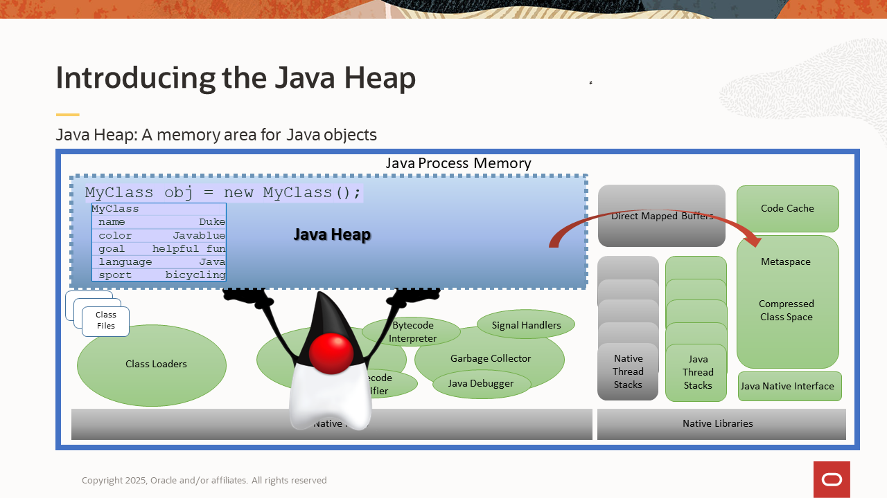
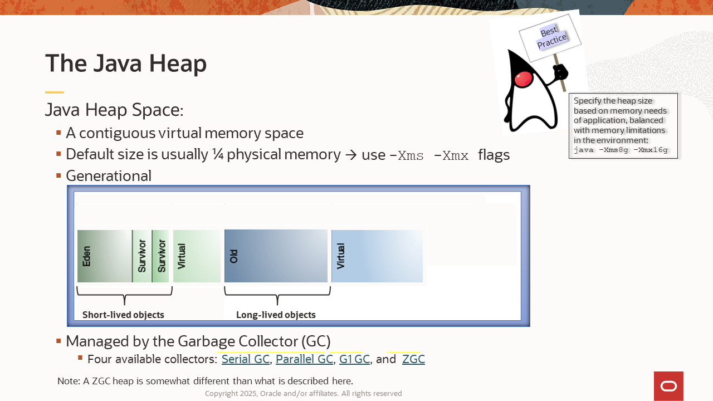
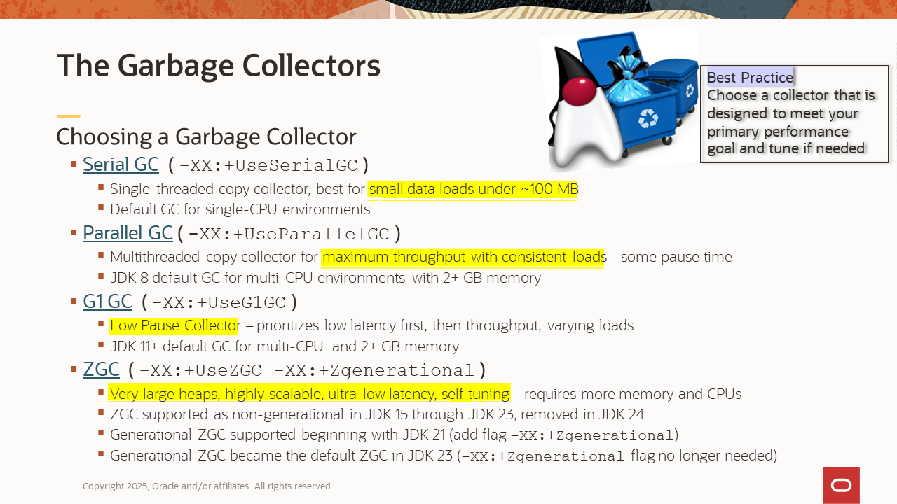
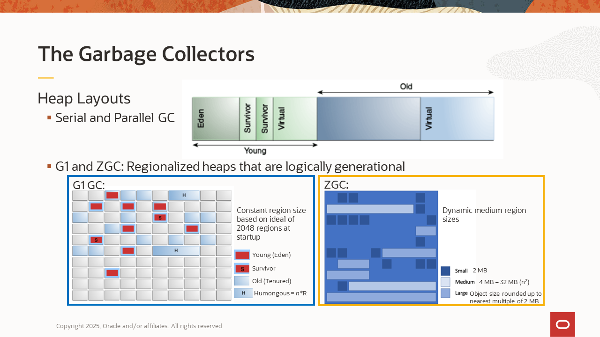
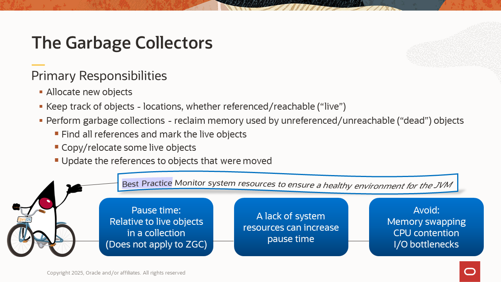
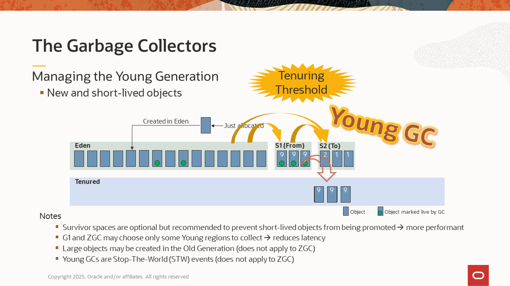

# Choosing a Garbage Collector
Duration: 45 minutes

This is a beginner level introduction to Java memory management.

[Choosing a Garbage Collector](videohub:1_ut7i2uzu)


## Safe Harbor Statement
??

## Table of Contents
1. Introducing the Java Heap
2. Java Heap Space
3. The Garbage Collectors  
3.1 Choosing a Garbage Collector  
3.2 Heap Layouts  
3.3 Primary Responsibilities  
3.4 Managing the Young Generation  
3.5 Managing the Old Generation  
3.6 The Z Garbage Collector (ZGC) – Something Different
4. Monitoring and Troubleshooting  
4.1 Always-on Logging  
4.2 Diagnostics  
5. Summary
6. Further Learning

## 1. Introducing the Java Heap


The Java heap is a memory pool within the virtual memory space of a Java process. It contains the Java objects, their fields, references, class names, and so on.  When Java program code creates a new object, the memory for that object is allocated in the Java heap at runtime.  

The Java heap is just one of several memory consumers in a Java process. For example, the Metaspace is another memory pool, and it contains the loaded Java classes and their metadata. In fact, objects in the Java heap contain references to their class data in the Metaspace.  

The Java heap and the virtual memory consumers depicted in green are managed by the Java Virtual Machine (JVM). This means JVM utilities can monitor their memory usage and other behaviors. The native consumers depicted in gray are managed by the operating system and require system utilities for monitoring them.  

It’s a common misconception that the system memory usage of a Java process will be about equivalent to the Java heap size.  While this may be true for some applications, it's not always the case. It’s important to consider the other memory consumers, along with how your application uses memory. For example, an application that implements a native cache versus one that implements an on-heap cache. The total system memory needed by a Java  application may be considerably more than what is used for object allocations alone.  

## 2. The Java Heap Space


The Java heap space is a contiguous virtual memory space. Early during startup, the JVM reserves the virtual memory for the total size of the heap, which is determined by the maximum heap size setting. With the out-of-the-box configuration, ergonomics sets the minimum and maximum heap sizes.  

> **Ergonomics**: Default values chosen by the operating system and its available resources.  

This means the sizing is based on the resources available in the operating environment, which could be a physical machine, a virtual machine, or a container. In most of today’s environments, ergonomics results in a default maximum heap size of 25% of the total physical memory.  

However, this default does not always work well. For example, the default size may be too large if you need a lot of memory for other processes in the environment or if there’s extensive use of native memory by the application. Conversely, it may be too small if the peak data loads of the application are larger. Also, when running multiple JVM instances in a single environment, they will quickly use all the system memory.  

Best Practice: Set the heap size manually, based on the memory needs of the application and balanced with the memory limitations in the environment.  

Use the `–Xms` and `–Xmx` command line flags. The `-Xms` flag sets the minimum and initial size, while the `-Xmx` flag sets the maximum. For example, if you want to set a minimum of 4 GB and a maximum of 16 GB, then enter a command line of the following:
```
java -Xms4g -Xmx16g [other options] <main class>
```
The heap is divided into two generations: a Young Generation and an Old Generation. The Young Generation consists of an Eden space and two optional Survivor spaces.  

The main purpose of the generations is to separate short-lived objects from long-lived objects, which makes it more efficient to manage them.  

By default, the initial sizes of the Young and Old Generations are determined by an Old to Young ratio. The virtual memory reserved for the heap at startup will be divided between the generations according to that ratio. With most JVMs, the default ratio is 2:1. This means the Old Generation will be twice the size of the Young Generation. This works well for a broad range of applications, but it can be tuned if needed. (This paragraph does not apply when using ZGC.)  

During startup, after reserving the virtual memory, the JVM will then commit the memory for the initial heap size. Committing memory is a request to the operating system to back the virtual memory with physical memory, because it will be used soon.  

If the initial heap size is smaller than the maximum heap size, then there will be uncommitted virtual memory in both generations. During runtime, when more reserved memory needs to be committed, it will be committed for both generations (except when using ZGC). However, if the minimum and maximum heap sizes are the same, then the entire heap will be committed at startup.  

The heap is managed by its garbage collector. The supported Oracle JDKs have four collectors to choose from: Serial GC, Parallel GC, Garbage First (G1 GC), and ZGC (pronounced “zee” or “zed.”)  

The next several sections cover details of the garbage collectors and their collection processes.  


## 3. The Garbage Collectors

### 3.1 Choosing a Garbage Collector


Each garbage collector has a unique focus to help achieve the application's performance goals.

- **Serial GC**
    - Single-threaded copy collector, best for small data loads under ~ 100mb
    - Default GC for single-CPU environments
    - `-XX:+UseSerialGC`
    - [Serial GC Tuning Guide for JDK 8](https://docs.oracle.com/javase/8/docs/technotes/guides/vm/gctuning/introduction.html#sthref3)
- **Parallel GC**
    - Multithreaded copy collector for maximum throughput with consistent loads - some pause time
    - JDK 8 default GC for multi-CPU environments with 2+ GB memory
    - `-XX:+UseParallelGC`
    - [Parallel GC Tuning Guide for JDK 21](https://docs.oracle.com/en/java/javase/21/gctuning/parallel-collector1.html)
- **G1 GC**
    - Low Pause Collector – prioritizes low latency first, then throughput, varying loads
    - JDK 11+ default GC for multi-CPU  and 2+ GB memory
    - `-XX:+UseG1GC`
    - [G1 GC Tuning Guide for JDK 21](https://docs.oracle.com/en/java/javase/21/gctuning/garbage-first-g1-garbage-collector1.html)
- **ZGC**
    - Very large heaps, highly scalable, ultra-low latency, self tuning - requires more memory and CPUs
    - ZGC supported as non-generational in JDK 15 through JDK 23, removed in JDK 24
    - Generational ZGC supported beginning with JDK 21 (add flag `-XX:+Zgenerational`)
    - Generational ZGC became the default ZGC in JDK 23 (no flag needed)
    - [ZGC Tuning Guide for JDK 21](https://docs.oracle.com/en/java/javase/21/gctuning/z-garbage-collector.html)

A question often asked is, “Which collector should I use?” Choosing a collector first depends on the primary performance goal of the application; whether that goal is a very small footprint for the smallest data sets (Serial GC), high throughput for back-office data processing (Parallel GC), low pause times for customer-facing web applications (G1 GC), or high scalability and ultra-low latency for applications that have very large, fluctuating data sets or those that have a high sensitivity to latency (ZGC).  

Choosing a collector may also depend on the resources available in the operating environment. For example, ZGC requires enough processors to run the application threads and ZGC threads simultaneously.  

> **Best Practice:** First test the collector that best serves your primary performance goal and then tune if some adjustments need to be made.  

Note that the JDK’s default collector can change, depending on the JDK version and the environment. It’s a best practice to specify the desired collector on the command line to ensure the intended collector is used in different environments or after a JDK version upgrade.  

ZGC was initially supported as a non-generational collector in JDK 15. However, in JDK 21, a generational version of it became supported. Generational ZGC uses much less memory and has a significant performance gain over its predecessor. This makes Generational ZGC suitable for a wider range of applications. Throughout this LiveLab, ZGC refers to Generational ZGC, which became the default ZGC in JDK 23 and the only ZGC in JDK 24.  

### 3.2 Heap Layouts


To help meet their performance goals, the various garbage collectors lay out their heaps differently when the JVM is launched.  

**Serial GC and Parallel GC:**  
The heap is divided into two contiguous generation spaces in which each generation is also a contiguous memory space. In this scenario, the entire Young Generation is collected during a Young GC, and the entire heap is collected during a Full GC.

**G1 and ZGC:**
The heap is divided into regions that are logically generational. The regions allow for collecting the Young and Old generations in increments, which helps reduce pause times. The Young and Old regions are not contiguous. Regions are dynamically assigned as Young or Old during the runtime, and the number of Young or Old regions can change, as the Young Generation grows or shrinks to respond to application workloads.  

There are some differences in how G1 and ZGC regionalize their heaps. 

G1 configures one constant region size at startup, dividing the initial heap size into 2048 regions (ideally). If the heap grows during runtime, regions of the that same constant size will be added when more heap memory is allocated. Also, any object that is too large to fit in a region will be given a Humongous region just for that object. G1 simply combines two or more regions to make Humongous regions as needed.  

ZGC, on the other hand, is more dynamic. While it also has small regions of a constant size and large regions for Humongous objects, ZGC adds dynamically sized medium regions to the mix. It dynamically adjusts the size of new medium region allocations to accommodate highly fluctuating workloads. ZGC also adds and removes regions more easily to scale to those workloads.  

### 3.3 Primary Responsibilities


A garbage collector has three primary responsibilities: 
- Allocate new objects in the heap
- Keep track of objects - locations, whether referenced/reachable ("live")
- Perform garbage colelctions - reclaim the memory used by unreferenced/unreachable (“dead”) objects

We say that objects are “live” when they are referenced or reachable, which means they can be reached by application threads to be accessed and operated on. Objects that are unreferenced or unreachable are referred to as “dead” or “garbage.” Threads can no longer access them, so they are eligible for garbage collection.  

As part of a garbage collection, the collectors will generally perform the following tasks:  
1. Find all the references to the objects in the heap and mark all the live objects  
    - This step ensures they don’t reclaim the memory for an object that’s still being used.  
2. Copy/relocate some of the live objects to different parts of the heap  
    - This step helps prevent fragmentation and makes room for more allocations.  
3. Update any references to the objects that were relocated  
    - This step ensures the application threads, the registers and any other objects holding references to the objects that were moved will point to the new addresses for those objects.  

The collectors need to pause the application threads during some or all of this process. It’s important to understand that the amount of time the application threads are paused is related to the set of live objects being marked and moved. Pause time is *not* related to the amount of memory being freed. Pause time can be affected by a lack of resources in the environment. Low system memory can cause swapping to occur, which could result in large pauses or hang-like behavior during a collection. Competition with other process for resources in the environment affects GC performance. CPU contention and I/O bottlenecks are common causes of longer collections. And, if you’re logging GC activity over a network, any network latency during a collection can increase pause times. It’s a best practice to monitor your system resources and ensure a healthy environment for the JVM.  

Also, GC performance can be affected by a lack of resources in the environment. Low system memory can cause swapping to occur, which could result in large pauses or even hang-like behavior during a collection. Competition with other process for resources in the environment affects GC performance.  CPU contention and I/O bottlenecks are common causes of longer collections. Also, if GC logging occurs over a network, then any network latency during a collection can increase pause times.  

### 3.4 Managing the Young Generation



### 3.5 Managing the Old Generation

### 3.6 The Z Garbage Collector (ZGC)

## 4. Monitoring and Troubleshooting

### 4.1 Always-on Logging

### 4.2 Diagnostics

## 5. Summary

## 6. References and Further Learning

## Acknowledgements
**Video and Text** - Sandra Payne, Technical Support Engineer, Java Platform Group  
**Workshop** -  Jason Begy, Principal User Assistance Developer, Java Platform Group  
**Last Updated By/Date** - Jason Begy,  September 2025