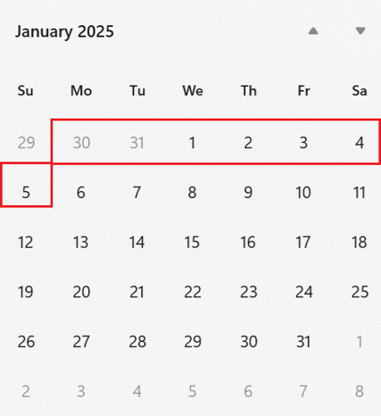

# The Significance of 'YYYY' and 'yyyy' in Java Date Formatting
Duration: 5 minutes

This is a quick tutorial on the significance of 'YYYY' (uppercase Y) and 'yyyy' (lowercase y) in Java date formatting.

## jcmd Tutorial

[jcmd Tutorial](videohub:1_)

### 1 Introduction
Java SE 7 introducted 'YYYY' as a new date pattern for identifying the week-based year.

ISO-8601 defines a week as:

In a week-based year, each week belongs to only a single year. Week 1 of a year is the first week that starts on the first day-of-week and has at least the minimum number of days. The first and last weeks of a year may contain days from the previous calendar year or next calendar year respectively.

For example, the first week of 2025 is the week from 30th December 2024 to 5th January 2025.

### 8 Learn More
- [jcmd JDK 21 Documentation](https://docs.oracle.com/en/java/javase/21/docs/specs/man/jcmd.html)
- [jcmd JDK 17 Documentation](https://docs.oracle.com/en/java/javase/17/docs/specs/man/jcmd.html)
- [jcmd JDK 11 Documentation](https://docs.oracle.com/en/java/javase/11/tools/jcmd.html)
- [jcmd JDK 8 Documentation](https://docs.oracle.com/javase/8/docs/technotes/guides/troubleshoot/tooldescr006.html)
- Java SE Subscribers can also refer to [Diagnosing a Running Java Virtual Machine (JVM) Using jcmd Command (Doc ID 3015396.1)](https://support.oracle.com/epmos/faces/DocumentDisplay?_afrLoop=292114230920574&id=3015396.1) on My Oracle Support.

## Acknowledgements
**Video** - Anjana Sajeev, Technical Support Engineer, Java Platform Group  
**Workshop** -  Jason Begy, Principal User Assistance Developer, Java Platform Group  
**Last Updated By/Date** - Jason Begy,  May 2025

