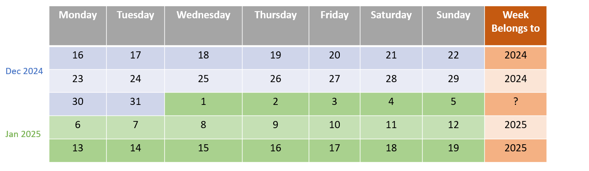
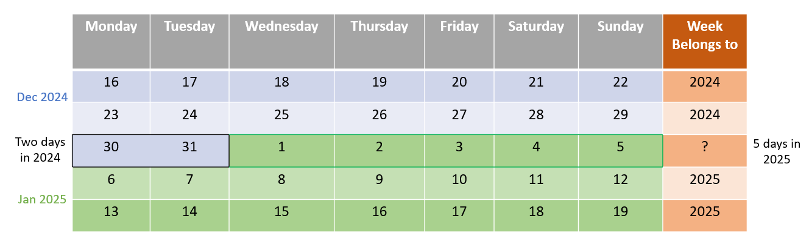
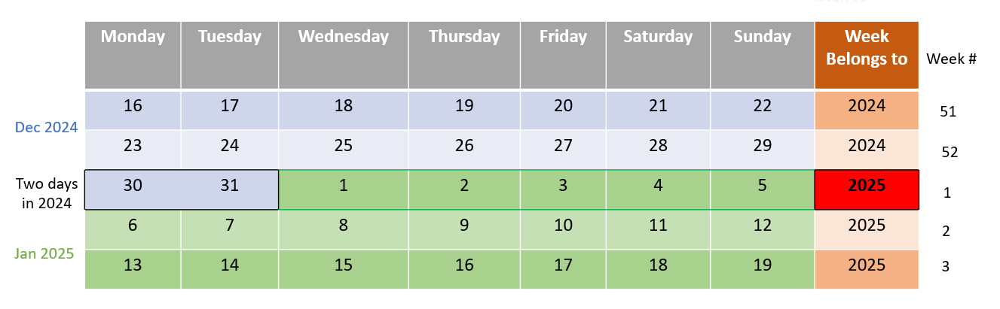

# The Significance of 'YYYY' and 'yyyy' in Java Date Formatting
Duration: 5 minutes

This is a quick tutorial on the significance of 'YYYY' (uppercase Y) and 'yyyy' (lowercase y) in Java date formatting.

[The Significance of 'YYYY' and 'yyyy' in Java Date Formatting](videohub:1_gwyao78b)


## Introduction

Java SE 7 introduced "YYYY" as a pattern for the year of a date when using the ISO week date system defined by ISO-8601.

When using the ISO standard:
- All weeks start on a Monday
- The Week must belong to a single year

For most dates this is intuitive since all days in it are from the same year, but since years don't always start on a Monday or end in a Sunday,  the first and last days of a year might be considered as part of the previous or following year. Each week "belongs" to the calendar year where most of the days occur.

For example, here is a calendar with the end of 2024 and start of 2025 (with weeks starting on Monday). The last column tells us which year the week belongs to:  



Now take a look at the week starting on 30th December, 2024. This week has 2 days from 2024 and 5 days from 2025. Which year does this week belong to?  



The week from 30th December to 5th January 5 is the first week of 2025, as per the ISO standard. 




## Why is there a difference between 'YYYY' and 'yyyy'?

'YYYY' (uppercase) represents the year that "owns" the week on a week-based date format and 'yyyy' (lowercase) represents the calendar year of the date.  

In an average year there are 52.1775 weeks, which means it is 52 weeks and 1 extra day for a non-leap year and 52 weeks and 2 extra days for a leap year.  

If 1st January is on a Monday, Tuesday, Wednesday or Thursday, it is in week 01 and if 1st January falls on a Friday, Saturday or Sunday, it is in week 52 or 53 of the previous year. 

In most cases, 'YYYY' and 'yyyy' produce the same output, but there can be up to 3 days at the end and up to 3 days at the beginning of any year when they do not coincide.


## Code Sample

Here is a code sample to help you better understand this difference. In this Java program we use the SimpleDateFormat to parse the input date and formats it to print the uppercase 'Y' and lowercase 'y' year output respectively. 

```
import java.text.SimpleDateFormat;
import java.util.Date;
public class DateFormatTest {
  public static void main(String[] args) {
  try {
    String[] dates = {"2024-12-01", "2024-12-31", "2025-01-01"};
    for (String date: dates) {
      SimpleDateFormat dt = new SimpleDateFormat("yyyy-MM-dd");
      Date d = dt.parse(date);
      SimpleDateFormat dtYYYY = new SimpleDateFormat("YYYY");
      SimpleDateFormat dtyyyy = new SimpleDateFormat("yyyy");    
      System.out.println("For date " + date + " the YYYY year is " + dtYYYY.format(d) + " while for yyyy it's " +dtyyyy.format(d));
    }
   } catch (Exception e) {
   System.out.println("Failed with exception: " + e);
  }
 }
}
```

### Output
```
For date 2024-12-01 the YYYY year is 2024 while for yyyy it's 2024
For date 2024-12-31 the YYYY year is 2025 while for yyyy it's 2024
For date 2025-01-01 the YYYY year is 2025 while for yyyy it's 2025
```
This is the output for the code sample. 

The first and the last output is as expected because the years match.  

The second output prints 2025 as the 'YYYY' year and 2024 as its 'yyyy' year. This is because the last two day of 2024 belong to the first week of 2025.  

To avoid such confusion and errors, most applications should use 'yyyy'. 


## Conclusion

The 'YYYY' date format is useful in situations where ISO week-based year is needed rather than the standard calendar year. Some common use cases are:
- Financial and Business Reporting: Multinational corporations often align their fiscal reporting with ISO weeks for consistency across regions.
- Scheduling Systems: This is related to airlines, logistics companies, and other industries which operate on a weekly basis.
- Payroll Systems: Most companies calculate their payroll weekly or biweekly.
- Project Management and Development: Software development sprints are often planned in ISO weeks. 

The 'yyyy' format is more suitable for standard date formatting and is used for calendar events or tasks tied to the Gregorian year. 


## References
- [Class WeekFields](https://docs.oracle.com/javase/8/docs/api/java/time/temporal/WeekFields.html)
- [Class DateTimeFormatter](https://docs.oracle.com/javase/8/docs/api/java/time/format/DateTimeFormatter.html)
- [Java SE] YYYY vs yyyy in Java Date Formatting ([Doc ID 3066357.1](https://support.oracle.com/epmos/faces/DocumentDisplay?id=3066357.1))


## Acknowledgements
**Video** - Anjana Sajeev, Technical Support Engineer, Java Platform Group  
**Additional Content** - Aurelio Garcia-Ribeyro, Sr. Director of Product Management, Java Platform Group  
**Workshop** -  Jason Begy, Principal User Assistance Developer, Java Platform Group  
**Last Updated By/Date** - Jason Begy,  June 2025


