# jcmd Tutorial
Duration: 6 minutes


## jcmd Tutorial

[jcmd Tutorial](videohub:1_uadm1tjk:large)

### 1 Introduction

The `jcmd` tool was introduced in Oracle Java 7. Among the many features that are available with this tool, it can be used to acquire heap and thread dumps, to view VM characteristics such as system properties and command-line flags, and also to get garbage collection (GC)-related statistics. Due to these features, the `jcmd` tool is often called a "Swiss knife" for investigating and resolving issues with your JVM application.

To use `jcmd`, you need to first identify the process ID (PID), or the application name, on which you want to use the tool. This can be done by simply running `jcmd` in your command prompt:

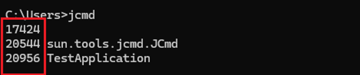

As highlighted in the image, the process ID is the number you see along with your running application.


### 2 jcmd Options

To view the list of options available with `jcmd`, use:

```
jcmd [PID] help
```

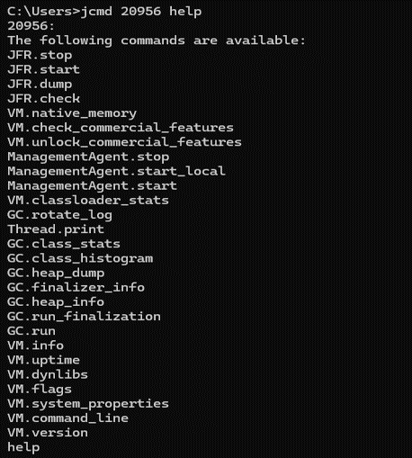

This tutorial will cover some of these commonly used commands in detail.


### 3 Additional Help

If you want to know more about a specific command, such as it’s purpose, impact, and options that can be passed, use:

```
jcmd [PID/MAIN_CLASS] help [COMMAND]
```

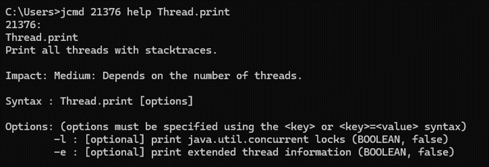

For example, in this image, you can see all the details you need to know for `Thread.print`, such as the description (it prints all threads with stack traces), the impact, and the syntax used. It also shows available options, such as `–l` to print details regarding the concurrent locks, and `–e` to print extended thread information.


### 4 Virtual Machine Commands

To view information about the JVM environment and status, use:

```
jcmd [PID/MAIN_CLASS] VM.info
```

As you can see below, the command prints detailed information about the JVM.

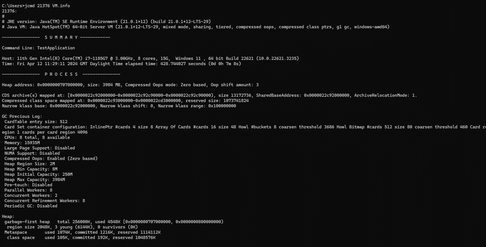

`VM.info` is available from JDK 8u361 onwards.

To print all the flags and their current values, use:

```
jcmd [PID/MAIN_CLASS] VM.flags
```

Even if you have not provided any flags, some of the default values will be printed. For example, you can see in the below image the default values set for the initial and maximum heap sizes.


To print JVM version information, use:

```
jcmd [PID/MAIN_CLASS] VM.version
```

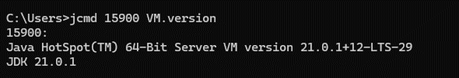

To print all the system properties that are set for a VM, use:

```
jcmd [PID/MAIN_CLASS] VM.system_properties
```

For example, in the image below you can find properties like the Java library path, Java VM and vendor information, the operating system details, and so on.


### 5 Garbage Collection Commands

Analyzing a heap dump is one of the best ways to troubleshoot memory-leak problems and optimize memory usage in Java applications. To collect a heap dump, use:

```
jcmd [PID/MAIN_CLASS] GC.heap_dump [FILENAME]
```

This creates a heap dump file at the same location as the application jar if no directory or path is specified.

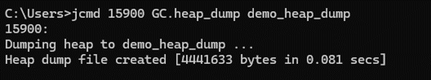

If you specify an invalid directory, you will see errors such as "No such file or directory" or "Permission denied", as shown below:

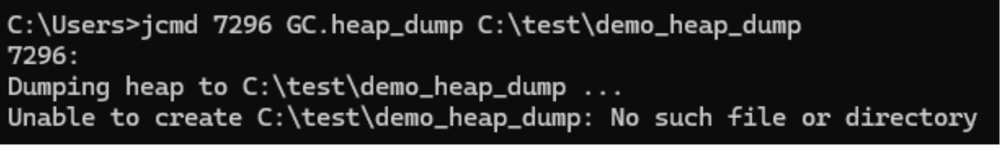

Tools that can be used to analyze the heap dump file includes `jhat`, which is distributed with the JDK package, and JVisualVM, which is now available as a standalone tool in GitHub. Some other IDE tools like Eclipse Memory Analyzer (MAT) can also be used to analyze these files.

### 6 Threads

To print all running threads with stack traces, use `Thread.print`. To view ownable synchronizers in the heap and locks, use the `-l` option. To print extended thread information use the `-e` option. For example,

```
jcmd [PID/MAIN_CLASS] Thread.print -l -e
```

produces the following output:

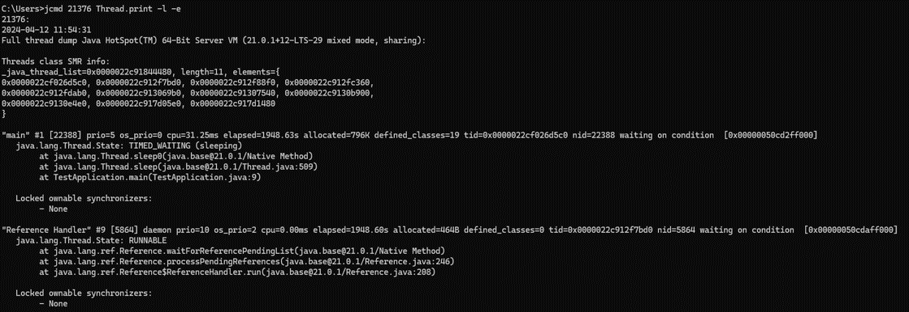


### 7 Java Flight Recorder (JFR)

Java Flight Recorder (JFR) is a tool for collecting diagnostic and profiling data about a running Java application. It gathers detailed low-level information about how the JVM and Java applications are behaving.

To initiate a flight recording, use the command `JFR.start`. For example, to start a 2-minute recording on a Java process and save it to a file named `myrecording.jfr`, pass the following command:

```
jcmd [PID/MAIN_CLASS] JFR.start name=MyRecording settings=profile delay=20s duration=2m filename=C:\tmp\myrecording.jfr
```

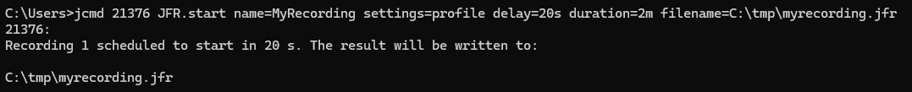

The `settings` option passed with this command is the name of the file that identifies which events to record. These files can be found in the jfr directory of the JDK as shown below:

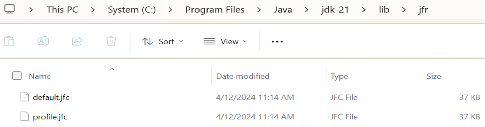

With `default.jfc`, JFR collects a predefined set of information with low overhead. It can be used with recordings that run continuously. With `profile.jfc`, JFR provides more data but with more overhead and a greater impact on performance.

You can also create a custom jfc file and include the path for that file in the settings option.

To print information about a running flight recording, use:

```
jcmd [PID/MAIN_CLASS] JFR.check
```

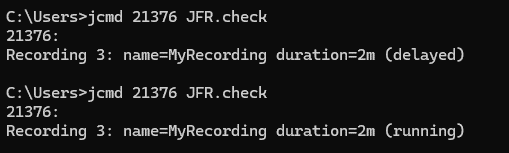

To write data to a file while a flight recording is running, use:

```
jcmd [PID/MAIN_CLASS] JFR.dump name=MyRecording filename=C:\tmp\myrecording.jfr
```

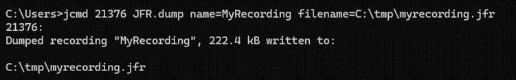

### 8 Learn More
- [jcmd JDK 21 Documentation](https://docs.oracle.com/en/java/javase/21/docs/specs/man/jcmd.html)
- [jcmd JDK 17 Documentation](https://docs.oracle.com/en/java/javase/17/docs/specs/man/jcmd.html)
- [jcmd JDK 11 Documentation](https://docs.oracle.com/en/java/javase/11/tools/jcmd.html)
- [jcmd JDK 8 Documentation](https://docs.oracle.com/javase/8/docs/technotes/guides/troubleshoot/tooldescr006.html)
- Java SE Subscribers can also refer to [Diagnosing a Running Java Virtual Machine (JVM) Using jcmd Command (Doc ID 3015396.1)](https://support.oracle.com/epmos/faces/DocumentDisplay?_afrLoop=292114230920574&id=3015396.1) on My Oracle Support.


## Acknowledgements
**Video** - Anjana Sajeev, Technical Support Engineer, Java Platform Group  
**Workshop** -  Jason Begy, Principal User Assistance Developer, Java Platform Group  
**Last Updated By/Date** - Jason Begy,  May 2024


