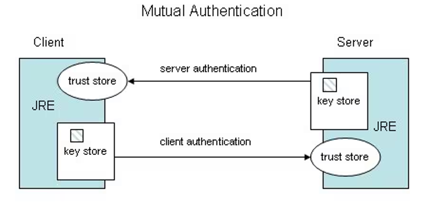

# keytool Tutorial
Duration: 5 minutes


## keytool Tutorial

[keytool Tutorial](videohub:1_5dpusf5t)

### 1 Java Keytool
This is a quick tutorial on using the `keytool` command. This is a key and certificate management utility that enables users to administer their own public/private key pairs and associated certificates for self-authentication or data integrity.

### 2 What are Keystores and Truststores?
A keystore stores private key entries, certificates with public keys, or even secret keys.

In other words, a keystore contains certificates that identify us, and a truststore holds certificates that are used to identify others.

Java has a truststore called `cacerts` which resides in the `[JAVA_HOME]/lib/security` directory. The default format for it was JKS until JDK 8. From JDK 9 onwards, the default keystore format is PKCS#12, which is a more standardized and language-neutral way of storing encrypted private keys and certificates.

The security property `keystore.type` in the `java.security` file controls the format for the keystore.

To learn more about the `java.security` file, see [Understand the java.security File](https://apexapps.oracle.com/pls/apex/r/dbpm/livelabs/run-workshop?p210_wid=3905) on LiveLabs.

### 3 How are Keystores and Truststores Used?
If a client talks to a Java-based server over HTTPS, the server will look up the associated key from its keystore, and present the public key and certificate to the client. The client looks-up these things in its truststore.

Similarly, if the client also needs to authenticate itself, it presents its public key and certificate to the server. This is called mutual authentication.



### 4 What is Keytool?
The `keytool` command is used to manage keys and certificates. It allows users to administer their own public/private key pairs and associated certificates for use in self-authentication. Users can also use `keytool` to set secret keys and passphrases for symmetric encryption and decryption (DES).

It can also be used to create or add data to a keystore, import and export content within a keystore, generate a CSR/certificate request, display data, and much more.

### 5 List Certificates
One of the basic functions of `keytool` is to list certificates.

The `-list` command prints the contents of the keystore identified by `-alias`. If no alias is specified, as in the example below, then the contents of the entire keystore is printed.

The following command will list the certificates in a keystore. The `-keystore [KEYSTORE_NAME]` option is the name of the keystore whose certificates you want to list, and `[KEYSTORE_PASSWORD]` is the password for that keystore.
```
keytool -v -list -keystore [KEYSTORE_NAME] -storepass [KEYSTORE_PASSWORD]
```
The `-v` option enables verbose output, which causes the certificate to be printed in a human-readable format with additional information such as the certificate's owner, issuer, serial number, and any extensions.

### 6 Import Certificates
You can also use `keytool` to import certificates.

The `-importcert` command reads the certificate or certificate chain from the file `[CERT_FILE]` and stores it in the keystore entry identified by `[ALIAS_NAME]`:
```
keytool -v -importcert -alias [ALIAS_NAME] -file [CERT_FILE] -keystore [KEYSTORE_NAME] -storepass [KEYSTORE_PASSWORD]
```
If the specified keystore doesn't exist, it will be automatically generated. In this case, you can se the format through the `-storetype` argument, as follows:
```
keytool -v -importcert -alias [ALIAS_NAME] -file [CERT_FILE] -keystore [KEYSTORE_NAME] -storepass [KEYSTORE_PASSWORD] -storetype [KEYSTORE_TYPE]
```

### 7 Export Certificates
The `-exportcert` command is used to read certificates associated with an alias from the keystore, and store them in the `[CERT_FILE]` file. If no file is specified, the certificate is ouput to stdout.
```
keytool -v -exportcert -alias [ALIAS_NAME] -file [CERT_FILE] -keystore [KEYSTORE_NAME] -storepass [KEYSTORE_PASSWORD]
```
If `[ALIAS_NAME]` refers to a trusted certificate, then that certificate is the output.

Otherwise, `[ALIAS_NAME]` refers to a key entry with an associated certificate chain. In this case, the first certificate in the chain is returned. This certificate authenticates the public key of the entity addressed by `[ALIAS_NAME]`.

### 8 Delete Certificates
The `-delete` command is used to delete entries identified as `[ALIAS_NAME]` from the keystore. The user is prompted for the alias if no alias is provided.
```
keytool -v -delete -alias [ALIAS_NAME] -keystore [KEYSTORE_NAME] -storepass [KEYSTORE_PASSWORD]
```


### 9 Help
The `-help` command can be used to list basic commands and options.

For more information about a specific command, enter the following, where `[COMMAND_NAME]` is the name of the `keytool` command:
```
keytool -[COMMAND_NAME] -help
```

### 10 Learn More
- [keytool JDK 21 Documentation](https://docs.oracle.com/en/java/javase/21/docs/specs/man/keytool.html)
- [keytool JDK 17 Documentation](https://docs.oracle.com/en/java/javase/17/docs/specs/man/keytool.html)
- [keytool JDK 11 Documentation](https://docs.oracle.com/en/java/javase/11/tools/keytool.html)
- [keytool JDK 8 Linux, Solaris, OS X Documentation](https://docs.oracle.com/javase/8/docs/technotes/tools/windows/keytool.html)
- [keytool JDK 8 Windows Documentation](https://docs.oracle.com/javase/8/docs/technotes/tools/windows/keytool.html)


## Acknowledgements
**Video** - Anjana Sajeev, Technical Support Engineer, Java Platform Group  
**Workshop** -  Jason Begy, Principal User Assistance Developer, Java Platform Group  
**Last Updated By/Date** - Jason Begy,  June 2024


