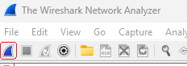
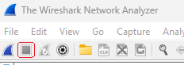
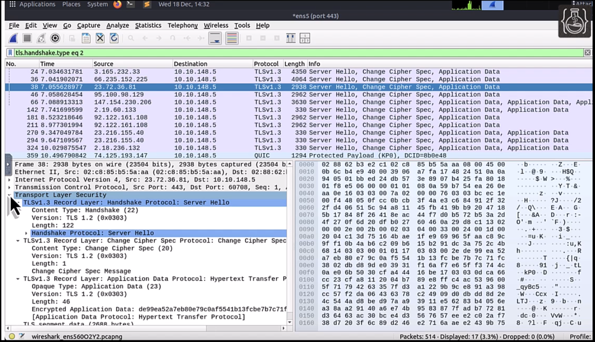
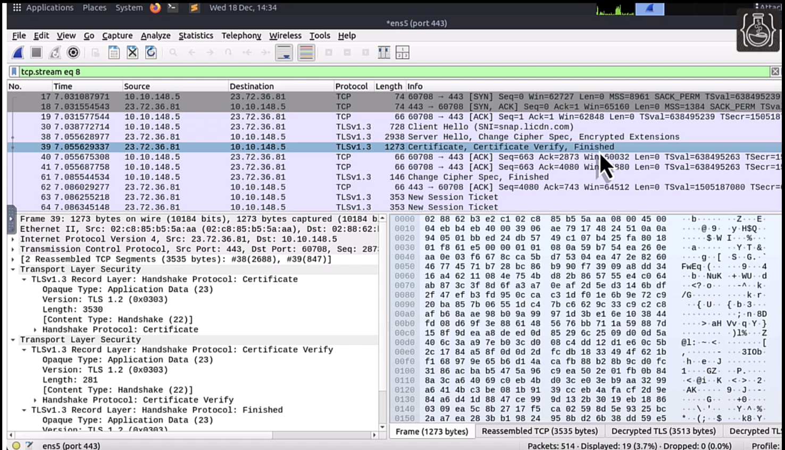

# Network Traffic Analysis With Wireshark on Linux
Duration: 9 minutes

[video title](videohub:1_f4rft40n)

## Wireshark Overview
Wireshark is an open-source network traffic analyzer that provides in-depth insights into network behavior and performance. It captures network traffic from various sources, including the internet, Bluetooth, and wireless connections, and stores the data for offline analysis. Wireshark is valuable for analyzing network traffic and identifying issues. It helps in diagnosing problems, detecting performance bottlenecks, and uncovering security vulnerabilities.

Key uses include:
- Troubleshooting, to identify and analyze network issues such as latency or packet loss
- Security Analysis, to detect potential security issues by marking suspicious traffic
- Protocol Development, to assist developers in debugging and testing network protocols

Wireshark is compatible with multiple operating systems. While this tutorial focuses on Linux, the core functionalities and usage are consistent across other platforms as well.

## Packets
Wireshark captures packets from network connections. A packet is a unit of data transmitted over a network. Each packet includes headers that provide essential information, such as the type of packet, source and destination IP addresses, and the communication protocol used.

In network traffic analysis, Wireshark traces each packet through layers 2 to 7 of the Open Systems Interconnection (OSI) model, which is a conceptual framework used to understand and describe how different network protocols interact.

## How to Capture and Analyze HTTPS Traffic
Launch Wireshark from a terminal using:
```
wireshark &
```
When Wireshark opens, the first step is to select a network interface through which you want to capture traffic. This interface represents the network connection (such as Ethernet, Wi-Fi, etc.) from which the data packets will be captured.

To determine which network interface corresponds to your active network connection, follow these steps:

1. Open the terminal on your Linux system.
2. Type the command `ifconfig` and press Enter.

Look for the network interface that has the IP address matching your current connection. Once you've identified the correct interface, select it in Wireshark to begin capturing network traffic.

The next step is to capture packets. There are three ways to do this:
- Click the **Start capturing packets** button in the tool bar
    
- Under the **Capture** menu, select **Start**
- Under the **Capture** menu, select **Options**. The Capture Options window opens.

Use the third option.

In the Capture Options window, the **Capture filter for selected interfaces:** text field can be used to limit which traffic is captured. To capture HTTPS traffic, enter "port 443" in the field and click the **Start** button.

In your web browser, navigate to a website of your choice that connects via HTTPS, such as [Oracle.com](https://www.oracle.com/), and then return to Wireshark to see the traffic being captured. Stop recording by clicking the **Stop capturing packets** button in the toolbar.


You can now analyze captured packets.

## How to Decrypt Packets
The display filter can be used to filter by packet type. Enter the desired filter in the field. Here are some useful filters for decrypting packets:

| Packet Type           | Filter                    |
|-----------------------|---------------------------|
| TLS                   | tls                       |
| TLS Handshake         | tls.handshake             |
| TLS Client Hello      | tls.handshake.type eq 1   |
| TlS Server Hello      | tls.handshake.type eq 2   |
{: title="TLS Packet Filters"}

Enter "tls.handshake.type eq 2" in the display filter field to see Server Hello packets. Note that in the Info field there are entries for "Server Hello," "Change Cipher Spec," and "Application Data."

To find out if the application data is in an encrypted formant, select the packet entry, and then expand the **Transport Layer Security** tree in the bottom left.


In the tree, expand **TLSv1.3 Record Layer: Application Data Protocol: Hypertext Transfer Protocol**. The **Encrypted Application Data** entry means that the packet was encrypted.

Another way to find out if a packet was encrypted is to first select the packet, and then under the **Analyze** menu, expand **Follow** to select **TCP Stream**. You can also select **TLS Stream** from this menu, and if there is no data visible then it was encrypted.

To decrypt this packet we can use a TLS key.

To do so, first export the SSLKEYLOGFILE environment variable by entering the following in the terminal:
```
export SSLKEYLOGFILE=~/ssl-key.log
```
In Wireshark, under the **Edit** menu select **Preferences**. In the Preferences window, expand **Protocols**. Scroll down and select **TLS**. Specify a (Pre)-Master-Secret log filename by clicking **Browse**. Navigate to your home directory and select the `ssl-key.log` file.

The entries in the Info column for encrypted packets will now be decrypted.


## Acknowledgements
**Video** - Raghu Kale, Principal Technical Support Engineer, Java Platform Group  
**Workshop** -  Jason Begy, Principal User Assistance Developer, Java Platform Group  
**Last Updated By/Date** - Jason Begy, March 2025