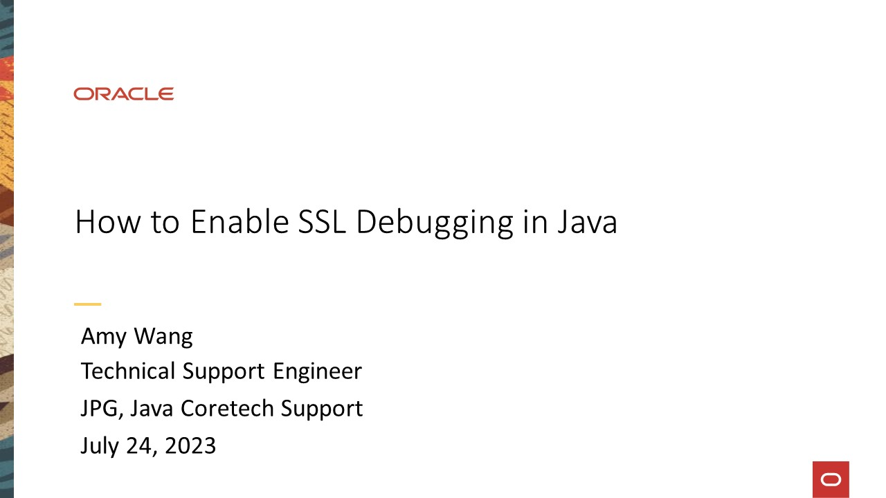
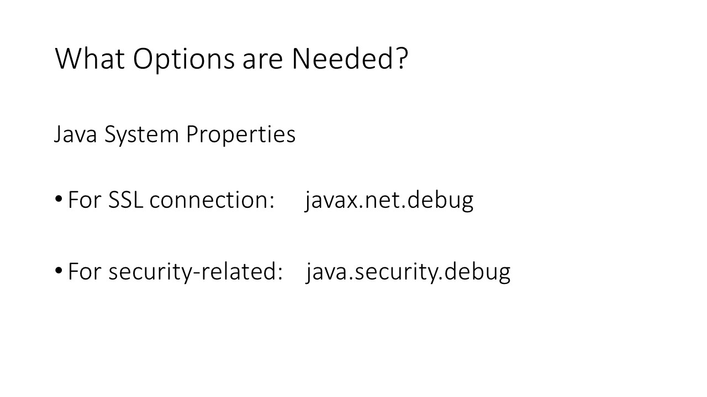
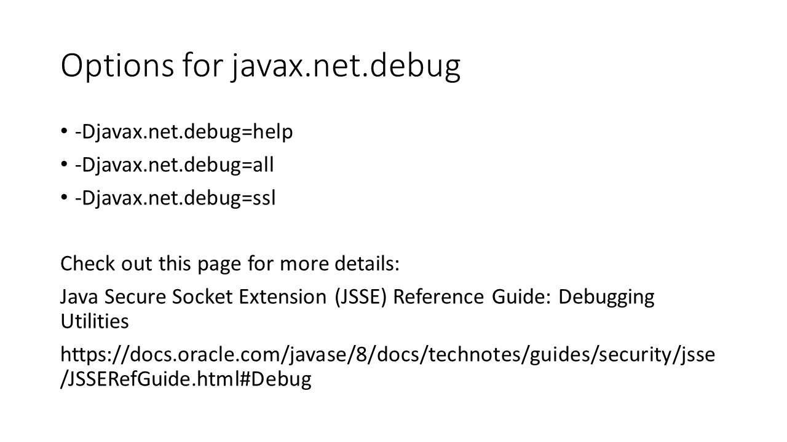
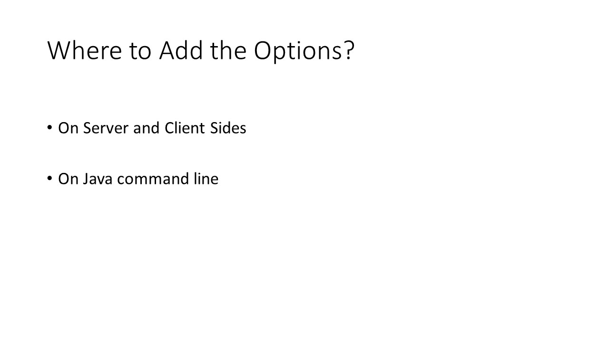
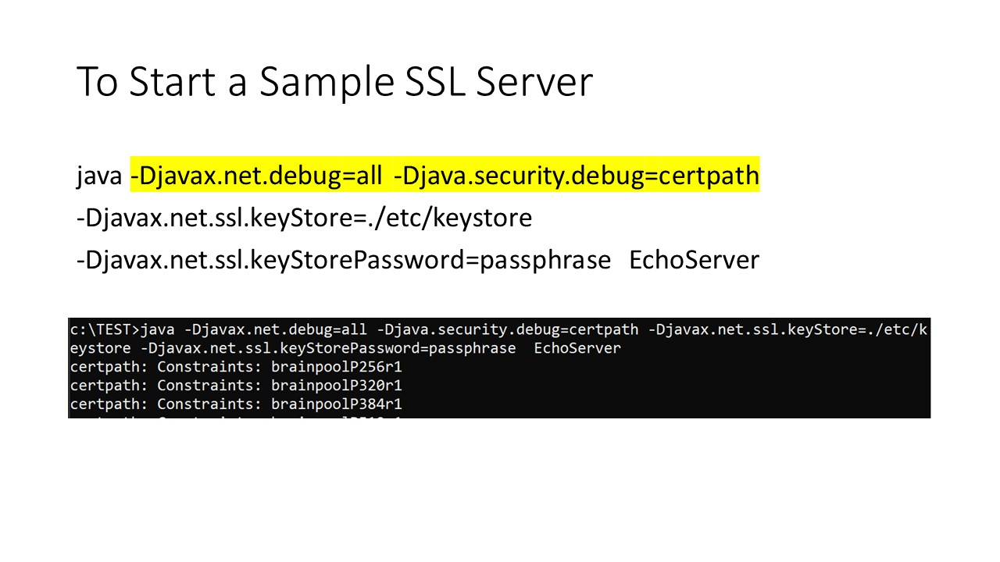
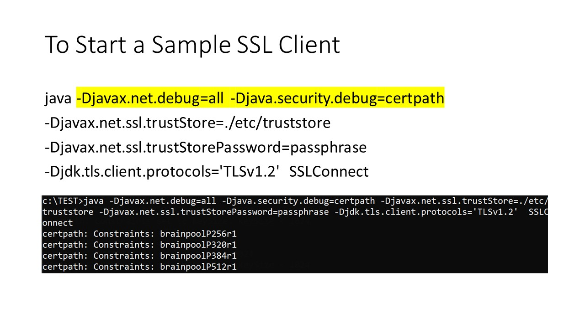

# Enable SSL debugging in Java
Duration: 5 minutes

[How to Enable SSL Debugging](videohub:1_5vweehhb)

1. Introduction
    

    This is a quick tutorial on how to enable SSL debugging in Java.

2. What Options are Needed?
    

    What Java options are needed to enable SSL debugging?

    There are two Java system properties: `javax.net.debug` and `java.security.debug`.

    For SSL connections, `javax.net.debug` is used. It is a JSSE dynamic debug utility.

    For security-related issues, `java.security.debug` is used.

3. Options for javax.net.debug
    

    Here are some commonly-used options.

    `-Djavax.net.debug=help` is for viewing all available options provided by the JSSE dynamic debugging utility.

    `-Djavax.net.debug=all` turns on JSSE debugging including SSL debugging.

    `-Djavax.net.debug=ssl` is to print only the SSL-related information.

    If you don't know which option to choose, use the `all` option.

    For more details, check out the [Java Secure Socket Extension (JSSE) Reference Guide: Debugging Utilities](https://docs.oracle.com/javase/8/docs/technotes/guides/security/jsse/JSSERefGuide.html#Debug) section.

4. Options for java.security.debug
    

    Now let's see the `java.security.debug` property and the most commonly-used options. This is helpful when troubleshooting security-related issues. It covers certificates and their paths, keystore debugging, X.509 certificate debugging, PKCS#11 and #12 debugging, Java GSS login module, JAAS configuration, and more.

    The `java.security.debug=help` option will show all the available options.

    The `all` option will show all debug information in security-related areas applicable to your Java application.

    The following three options show the certificate path, security provider, or the two combined.

    If you don't know which to use, `all` is the best option.

    Check out the [Java Troubleshooting Security Guide](https://docs.oracle.com/javase/8/docs/technotes/guides/security/troubleshooting-security.html) for more details about this property.

5. Where to Add the Options?
    

    Now we will see where to add these options and properties.

    SSL connections happen on both the client and server ends. It is better to enable the options on both ends.

    For an SSL server or client Java application, the debug options are added to the command line.

6. Start a Sample SSL Server
    

    Here is an example of starting up an SSL server.

    The `-Djavax.net.debug=all` and `-Djava.security.debug=certpath` options are used in this case.

    When Java runs, it will print the related debugging information to the standard output. The output can be redirected to a file.

7. Start a Sample SSL Client
    

    This is an example of an SSL client to make a connection to the SSL server.

    The `-Djavax.net.debug=all` and `-Djava.security.debug=certpath` options are used.

    The debug output will go to standard output and can be redirected to a file.

8. References
    

    These are the references for this tutorial.

    The [Java Secure Socket Extension (JSSE) Reference Guide: Debugging Utilities section](https://docs.oracle.com/javase/8/docs/technotes/guides/security/jsse/JSSERefGuide.html#Debug) provides details on the `javax.net.debug` property.

    The [Troubleshooting Security](https://docs.oracle.com/javase/8/docs/technotes/guides/security/troubleshooting-security.html) guide provides details on the `java.security.debug` property.

    The [Debugging SSL/TLS connections](https://docs.oracle.com/javase/8/docs/technotes/guides/security/jsse/ReadDebug.html) section of the JDK 8 documentation shows an example analysis of SSL debug output.

    Take a look for more details!

9. For More Information
    

    Subscribers can always go to [My Oracle Support](https://support.oracle.com/portal/) for more information.

10. Thank You
    

    This is the end of the tutorial. Thank you for watching!

## Acknowledgements
**Video** - Amy Wang, Technical Support Engineer, Java Platform Group  
**Workshop** -  Jason Begy, Principal User Assistance Developer, Java Platform Group  
**Last Updated By/Date** - Jason Begy,  August 2023

