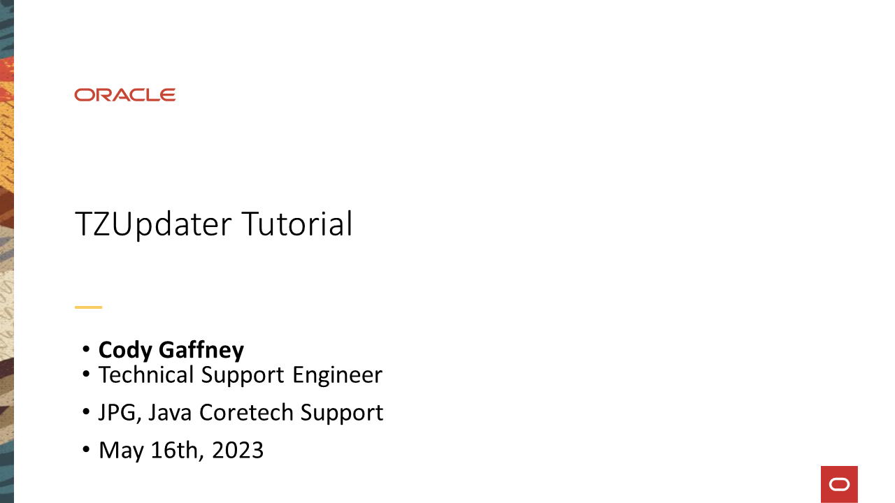
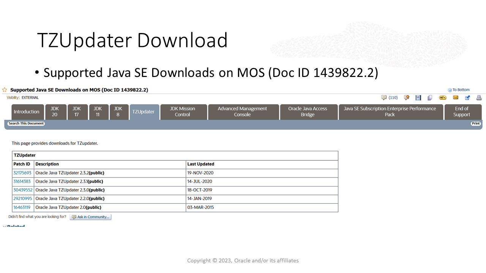
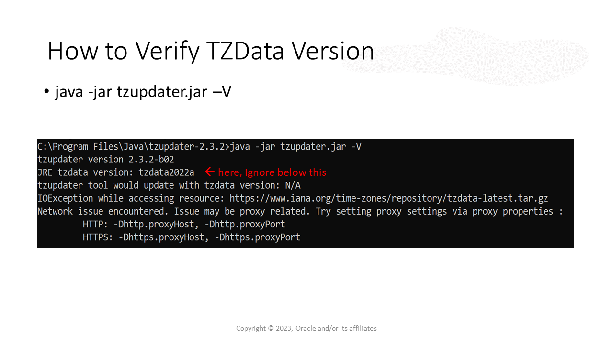
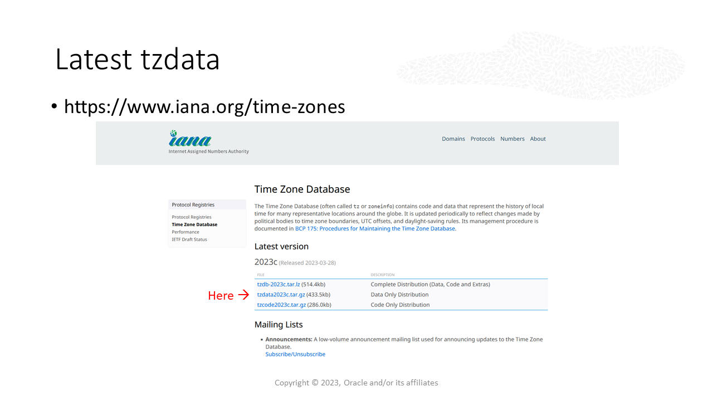
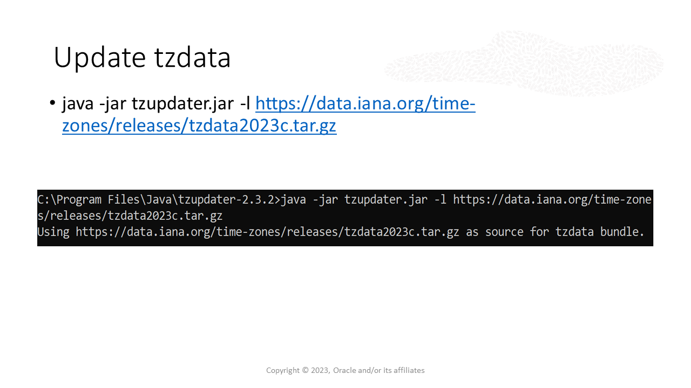
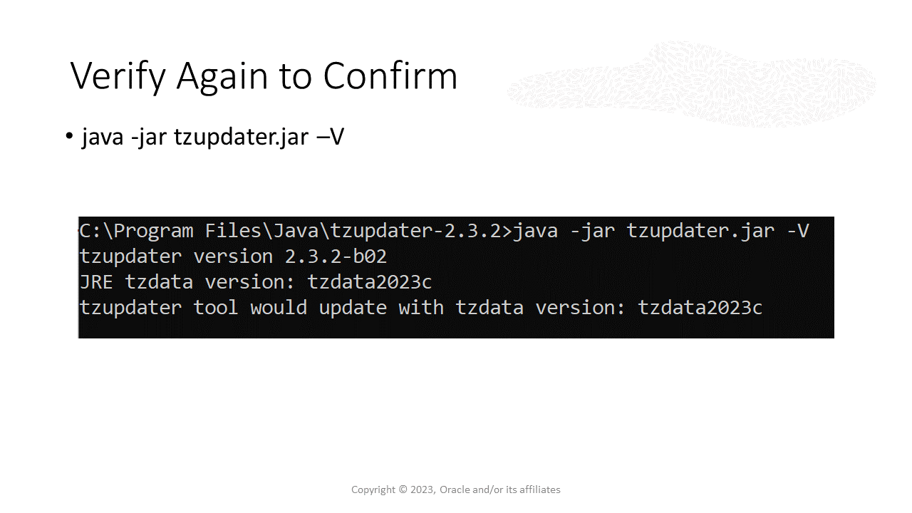
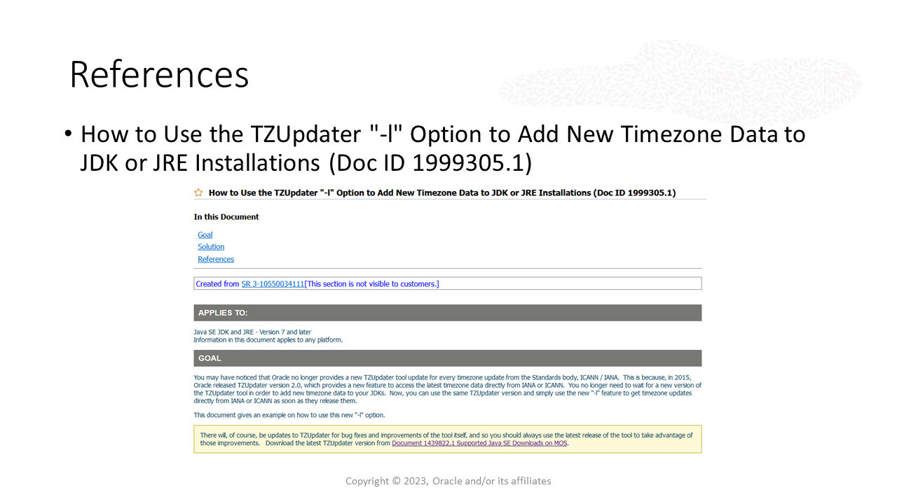

# Update the timezone data in Java
Duration: 2 minutes

This sprint provides step-by-step instructions on how to update the timezone data in your Java installations. Java uses [timezone data provided by the IANA](https://www.iana.org/time-zones). The IANA's update schedule and Java's update schedule are out of sync, so downloading the latest version of Java does not ensure that you have the latest IANA timezone data.

**NOTE:** Currently, the `-XshowSettings:all` option does not display the tzdata version. This will be fixed in an upcoming release. See [JDK-8305950](https://bugs.openjdk.org/browse/JDK-8305950) for details.

[TZUpdater Tutorial](videohub:1_oshhvfcf)

1. Introduction
    

    This is a quick tutorial on how to use TZUpdater to update the tzdata in Java.

    Oracle updates the TZ Data database irregularly.

    Whenever a new tzdata is released from the Standards body IANA, the database is usually made available in between Java releases, so Java will rarely have the most recent updates.

    TZUpdater has an option `-L` which allows the user to go to the IANA website and update using the most recent version of the TZ Database.

    So the user can instantly be on the current TZ Database without having to update their Java version.

2. TZUPdater Download

    Customers can download the latest TZUpdater tool from [Document 1439822.2 Supported Java SE and Java Component Downloads](https://support.oracle.com/epmos/faces/DocumentDisplay?_afrLoop=294109915825213&id=1439822.2) on My Oracle Support.

    **NOTE:** All users can [download TZUpdater here](https://www.oracle.com/java/technologies/downloads/tools/#TZUpdater).

3. How to Verify TZ Data Version
    

    From the directory of where you have the tzupdater jar file, you can check the tzdata version by running this command:  
    `java -jar tzupdater/jar -V`  
    You only need to note the line with JRE tzdata version.
    You can ignore the rest.

4. Latest tzdata
    
    You can find the latest tzdata on the IANA website.
    Right click the link with tzdata and copy the link.

5. Update tzadata
    
    Use this command and paste the latest tzdata link you copied.
    This will install tzdata directly from the IANA website.
    If you get an error, check you have the right permissions and try again.

6. Verify Again to Confirm
    
    Run the verify command again to see if the change has taken effect.

7. References
    
    Java SE Subscribers can learn more by viewing [Document 1999305.1 on My Oracle Support](https://mosemp.us.oracle.com/epmos/faces/DocumentDisplay?_afrLoop=294479586613931&id=1999305.1).  
  
## Learn More  
- [TZUpdater Documentation.](https://www.oracle.com/java/technologies/javase/tzupdater-readme.html)

## Acknowledgements
**Video** - Cody Gaffney, Technical Support Engineer, Java Platform Group  
**Workshop** -  Jason Begy, Principal User Assistance Developer, Java Platform Group  
**Last Updated By/Date** - Jason Begy,  July 2023

